# Entwicklung verteilter Anwendungen

## Allgemein

### Internet

|          | Beschreibung                                                                                                                                                 |
| -------- | ------------------------------------------------------------------------------------------------------------------------------------------------------------ |
| Internet | Netzwerk, das weltweit viele Netzwerke miteinander verbindet und die Nutzung von Internetdiensten und den Austausch von Daten ermöglicht.                    |
| Intranet | geschlossenes Netz (meist ein Firmennetzwerk), auf das öffentlich nicht zugegriffen werden kann.<br>Das Netzwerk kann ich über mehrere Standorte erstrecken. |

### Spring Framework

Frameworks wie Spring bieten vorgefertigte Lösungsansätze für gängige Probleme.
Außerdem bieten sie effiziente, wiederverwendbare Komponenten, die Entwicklung beschleunigen können.

Spring ist modular aufgebaut, wodurch die Anwendungen flexibel entwickelt werden können. Mittels Abstraktion wird die Verwendung der Java API in Spring vereinfacht. Zudem bietet Spring eine gute Unterstützung von automatisierten Tests.

| Spring-Module             | Bestandteile                                   | Beschreibung                                                                                                                                                                                                                                                                                                                                                                                                                                                                                                                                                                                                                                                                   |
| ------------------------- | ---------------------------------------------- | ------------------------------------------------------------------------------------------------------------------------------------------------------------------------------------------------------------------------------------------------------------------------------------------------------------------------------------------------------------------------------------------------------------------------------------------------------------------------------------------------------------------------------------------------------------------------------------------------------------------------------------------------------------------------------ |
| Core                      | Spring Core, Beans, Context, SpEL              | Core Container arbeitet mit Spring-eigenen Beans, die über Kontexte verwaltet und mittels ==Annotationen== sowie SpEL (Spring Expression Language) verwendet werden.<br>Funktionalitäten sind im Core realisiert.                                                                                                                                                                                                                                                                                                                                                                                                                                                                  |
| Data Access / Integration | JDBC, JPA (Jakarta Persistence API), Hibernate | Für Zugriff auf Daten aus Datenbanksystem liegen vielfältige Integrationstechnologien vor.<br>Datenbankzurgiffe mittels JDBC (Java Database Connectivity) sowie Verwendung von ORM Frameworks (Object-Relational Mapping) werden geeignete Transaktionsmanager unterstützt.<br>JPA steht primär für Jakarta Persistence API (früher Java Persistence API), einen Standard zur objektrelationalen Abbildung (ORM) in Java, der das Speichern von Java-Objekten in relationalen Datenbanken vereinfacht. Es ermöglicht die Abbildung von Klassen auf Tabellen mittels Annotationen und automatisiert SQL-Operationen über den EntityManager, ohne dass viel JDBC-Code nötig ist. |
| Web (MVC / Remoting)      | WebMVC, Thymeleaf, JSP, Websocket, Portlet     | Die Schnittstelle zum Benutzer / Fremdsystem kann durch Servlet Container oder Websocket-Implementierung realisiert werden.<br>Spring integriert auch HTML Frameworks, wie Java Server Pages.                                                                                                                                                                                                                                                                                                                                                                                                                                                                                  |
| AOP / Instrumentation     | Spring AOP, AspectJ                            | Spring biete gut & einfach einsetzbare Überwachung der Performance und Fehler sowie Loggings.                                                                                                                                                                                                                                                                                                                                                                                                                                                                                                                                                                                  |

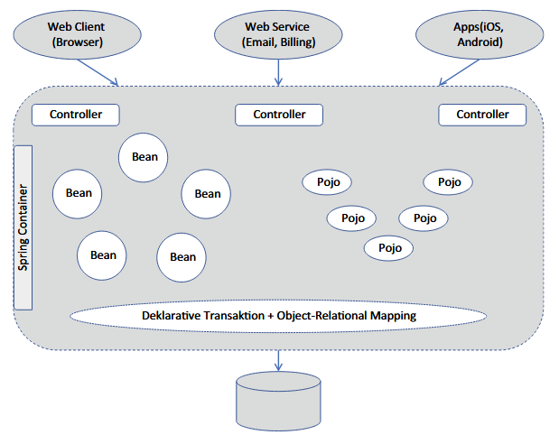

Der Spring Container ist das Kernstück, das unsere Anwendung startet und für den korrekten Ablauf sorgen wird. 
Häufig wird im Nicht-Spring-Sprachraum von einem Anwendungsserver gesprochen.

##### Was unterscheidet Spring von Java?

|        | Beschreibung                                                                                                                                                               | Aufgaben                                                                                                                                                                                                                                                          |
| ------ | -------------------------------------------------------------------------------------------------------------------------------------------------------------------------- | ----------------------------------------------------------------------------------------------------------------------------------------------------------------------------------------------------------------------------------------------------------------- |
| Java   | - eine Programmiersprache<br>- plus Laufzeitumgebung (JVM)<br>- plus Standardbibliothek (Java SE)<br>- Java allein gibt nur Werkzeuge, keine feste Anwendungsstruktur vor. | - Syntax (Klassen, Interfaces, Vererbung, etc.)<br>- Speicherverwaltung (Garbage Collector)<br>- Threads, Exceptions<br>- Grundlegende APIs (Collections, IO, Networking)                                                                                         |
| Spring | - Framework, das auf Java aufbaut<br>- nutzt Java, ersetzt es aber nicht<br>- Spring nimmt dir viel Infrastruktur-Code ab.                                                 | - Gibt **Architektur & Struktur** vor<br>- Verwaltet Objekte (Beans)<br>- Kümmert sich um **Abhängigkeiten** (Dependency Injection)<br>- Erleichtert:<br>	- Webanwendungen (Spring MVC)<br>	- REST-APIs<br>	- Datenbankzugriff<br>	- Security<br>	- Transaktionen |

##### Spring Projekt erstellen

Um ein Spring Projekt zu initialisieren, wird typischer Weise das Tool `Spring Initializr` verwendet.

**1. Schritt:** Version des Spring Boot Frameworks wählen.
**2. Schritt:** Gruppen- und Artefakt-IDs definieren.
**3. Schritt:** Projektabhängigkeiten hinzufügen.
**4. Schritt:** Projekt generieren und downloaden.

Weiterhin wird das Build-Werkzeug Gradle (sogenannte Tool Chain) eingesetzt, mit dem alle Entwicklungsschritte (wie Kompilieren und Linken) durchgeführt und alle notwendigen Software-Artefakte (ausführbarer Programmcode, Test Code) erstellt werden.

##### Projekt Grundstruktur

Im Haupt-Package wird im Wesentlichen nach Use Cases eingeteilt. Die Anwendungsfall betreffenden Klassen sind in gleichnamigen Ordnern untergebracht.

| Ordner                    | Bedeutung                                                                                                                                                                                                                                              |
| ------------------------- | ------------------------------------------------------------------------------------------------------------------------------------------------------------------------------------------------------------------------------------------------------ |
| `src/main/java`           | Java-Klassen für die Anwendung                                                                                                                                                                                                                         |
| `src/main/resources`      | Ressourcen (Konfigurationsdateien oder Skripte) der Anwendung und Web-Ressourcen der Website<br>`templates` = HTML Ressourcen.<br>`fragments` = ausgelagerte Header-, Body- und Footer-Elemente.<br>`static/css` = Stylesheet                                                                                                                                                           |
| `src/test/java`           | Java-Testklassen                                                                                                                                                                                                                                       |
| `src/test/resources`      | Test-Ressourcen                                                                                                                                                                                                                                        |
| `src/test/resources`      | Test-Ressourcen                                                                                                                                                                                                                                        |

| Aufteilung / Refactoring  | Bedeutung                                                                                                                                                                                                                                              |
| ------------------------- | ------------------------------------------------------------------------------------------------------------------------------------------------------------------------------------------------------------------------------------------------------ |
| `domain` (→ Entity)       | Enthält Entity-Klassen und Repository Interfaces.<br>Entities sind Klassen, die (Model-) Daten repräsentieren.                                                                                                                                         |
| `service` (→ Service)     | Dienen zur Realisierung der Geschäftslogik.<br>Dies beinhaltet Klassen, die Funktionen und Abläufe realisieren, und damit Mittler zwischen `domain` und `boundary` darstellen.                                                                         |
| `boundary` (→ Controller) | Diese Klassen sind als **Schnittstelle nach Außen** gedacht.<br>Dies kann eine Schnittstelle für Benutzeranwendungen oder andere Server-Anwendungen sein<br> Nur diese Klassen erlauben einen Einstieg in die Anwendung, die dienen quasi als Gateway. |
| `config`                  | Enthält Konfigurationsklassen, in denen unter anderem Dateninitialisierungen, Sicherheitseinstellungen oder das Verhalten von Transaktionen festgelegt werden können.                                                                                  |

| Vorteile Refactoring                                             |
| ---------------------------------------------------------------- |
| + Code gezielt dorthin verschieben, wo er **fachlich hingehört** |
| + Macht diese Abhängigkeiten **sichtbar und locker gekoppelt**.  |
| + Klarere Zuständigkeiten im Team                                |
| + Weniger Merge-Konflikte                                        |
| + Einfachere Code-Reviews („Warum ist das nicht in der Domain?“) |
| + Einfacheres Hinzufügen neuer Features                          |
| + Architektur bleibt stabil, auch wenn das System wächst         |
| + Code Smells werden offensichtlich                              |
| + Schnellere, stabilere Tests                                    |

##### Spring MVC im Projekt implementieren

- Dependency Management hinzufügen, um automatisch alle benötigten Spring MVC Bibliotheken zu importieren.
- Dispatcher Servlet durch Spring Boot Anwendung konfigurieren.
- Controller Klassen erstellen und mit `@Controller` annotieren.

##### Tool Chain: Gradle

- Führt Entwicklungsschritte (wie Kompilieren und Linken) durch
- Erstellt alle notwendigen Software-Artefakte (ausführbarer Programmcode, Test Code)
- Die gesamte Werkzeugkette muss mit derselben Java-Version versehen werden, sonst können Fehler auftreten, die zu weiteren Anpassungen führen. 
- Aufgabe: Alles zusammensuchen und herunterladen, um den Build-Prozess erfolgreich durchführen zu können.

- `build.gradle`:
	- `plugins`
		- `id 'java'`: Sorgt für Projekt Grundstruktur
		- `id 'org.springframework.boot'`: Erstellung & Ausführung Standalone Anwendung
		<br>
> [!NOTE] **Standalone Anwendung**
> Eine eigenständige Anwendung, die alle Bestandteile (Webserver, Datenbankserver) enthält.
		<br>
		- `id 'io.spring.dependency-management'`: Bestimmung, Laden und Hinzufügen von benötigten Bibliotheken zur Ausführung der Anwendung
	- `sourceCompatibility`: Java-Version → Java JDK als Laufzeitumgebung einsetzen
	- `mavenCentral`: Benötigte Abhängigkeiten zur Ausführung des Skripts sind im Maven Repository gesucht
	<br>
> [!NOTE] **Zentrale Maven Repository**
> Ein öffentliches Repository, in dem viele Frameworks und Projekte ihre Bibliotheken zur Verfügung stellen.
	<br>
	- `dependencies`: 
		- Festlegung, welche JAR-Bibliotheken samt weitergehender Abhängigkeiten integriert werden
		- Enthält Beschreibungen für zu generierendes Projekt
		- Starter-Bibliotheken (Bausteine/Komponenten) definieren Abhängigkeiten zu anderen Bibliotheken
- `application.properties` (*source/main/resources*):  Konfigurationseinstellungen

### Unternehmensanwendungen

##### Aufbau

| Modell                                            | Beschreibung                                                                                                                                                                                                                                                                                                                                                                                                                                                                                                                                                                                                                                                  | Skizze                                    |
| ------------------------------------------------- | ------------------------------------------------------------------------------------------------------------------------------------------------------------------------------------------------------------------------------------------------------------------------------------------------------------------------------------------------------------------------------------------------------------------------------------------------------------------------------------------------------------------------------------------------------------------------------------------------------------------------------------------------------------- | ----------------------------------------- |
| Client/Server-Architektur (2-Schicht-Architektur) | - Client (Nutzer) stellt Request (Anfrage) nach Service (Dienst) an Server (Diensterbringer)<br>- Server beantwortet Request mit Response (Antwort), indem er Ergebnis des Service an Client zurücksendet.                                                                                                                                                                                                                                                                                                                                                                                                                                                    | 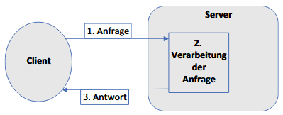 |
| 3-Schicht-Architektur                             | - Jede Schicht kann auf anderen physischen Rechner bzw. Adressräumen (JVM) laufen.<br>- Diese Entkopplung bringt den Vorteil, dass jede Schicht kann separat entwickelt werden.<br>- Zugriffe sollten nur innerhalb einer Schicht oder die nächstfolgende Schicht erlaubt werden.<br>- Je zentraler die Geschäftslogik liegt, desto wartbarer, testbarer und wiederverwendbarer ist das System.<br><br>1. Präsentationsschicht (Frontend): Läuft auf eigenen Gerät, z.B. Smartphone.<br>2. Geschäftslogiklogikschicht (Middleware): Inhaltliche Abläufe.<br>3. Datenbankschicht (Backend): Eigenständiger Datenbankserver, auf den 2. Schicht zugreifen kann. | 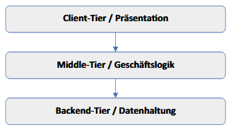     |

**Sonstige Modelle:** Microservice-Architektur (1 Microservice nach Client/Server-Architektur aufgebaut)

##### Haben 3-Schicht-Architekturen nur Vorteile gegenüber 2-Schicht- oder anderen Architekturen?

**Vorteile:**
- Trennung von Verantwortlichkeiten (Separation of Concerns)
- Skalierbarkeit
- Bessere Testbarkeit
- Wiederverwendbarkeit

**Nachteile:**
- Bei kleinen oder einfachen Systemen kann die 3-Schicht-Architektur überdimensioniert sein.
- Mehr Ressourcenverbrauch
- Komplexere Infrastruktur
- Performanceverlust

##### Kann ein Client auch ein Server sein?

- **Client:** Fordert Dienste oder Daten von einem Server an.
- **Server:** Stellt Dienste oder Daten bereit und verarbeitet Anfragen von Clients.
- Es gibt kein technisches Hindernis, dass ein Gerät oder Programm beides gleichzeitig ist. 
- Beispiele:
	- In der 3-Schicht-Architektur kann eine Komponente der Business-Schicht gleichzeitig Client (für Datenschicht) und Server (für Präsentationsschicht) sein.
	- P2P-Netzwerk = Netzwerk, in dem **alle Teilnehmer gleichberechtigt** sind. Jeder Teilnehmer kann Daten anfordern (Client) und Daten bereitstellen (Server). Im Gegensatz zu klassischen Client-Server-Systemen gibt es **keinen zentralen Server**, der alles steuert.

##### Fachliche Anforderungen

- Datensicherheit
- Nutzung mit unterschiedlichen Geräten an verschiedenen Orten
- Gleichzeitiger Zugriff vieler Nutzer ohne merkbare Performance-Einbußen. Abläufe unabhängig voneinander.
- Anzeige stets aktueller Informationen
- Abdeckung verschiedener Paymentanbieter (Amazon, PayPal)
- Anwendung jederzeit verfügbar 
- Hochverfügbarkeit = Fähigkeit, trotz Ausfalls einer Komponenten den Betrieb zu gewährleisten.
	- Minimierung Ausfallzeiten, indem Systeme durch Redundanz abgesichert werden. 
	- Erkennt Komponentenausfälle automatisch, leitet Dienste um (Failover) und sorgt für Datenreplikation. 
	- Typische Lösungen umfassen Cluster-Software, Virtualisierungs-HA (z.B. Proxmox) oder Datenbank-Spiegelung

##### Herausforderungen und adäquate Techniken

Eine Herausforderung in verteilten Systemen ist die **Gewährleistung von Sicherheit**. 
Hierfür können Techniken wie **SSL-Verschlüsselung** und **Authentifizierungsmechaniken** verwendet werden.

##### Eigenschaften qualitativ hochwertiger Software

- Wartbarkeit & Benutzerfreundlichkeit

### Softwarekomponenten

Eine **Softwarekomponente** ist eine Kompositionseinheit mit **vertraglich festgelegten Schnittstellen/Methoden (Komponentenschnittstelle)** und expliziten Kontextabhängigkeiten.
Diese einzelnen, funktionalen Module bilden zusammen ein komplexes technisches System.
Eine Softwarekomponente kann unabhängig von anderen Komponenten verteilt und zur Komposition durch Dritte eingesetzt werden.

| Fachliche Komponente    | Beispiel                                   |
| ----------------------- | ------------------------------------------ |
| Client-Komponenten      | - zur UI-Darstellung                       |
| Prozess-Komponenten     | - zur Realisierung von Workflows           |
| Ablauf-Komponenten      | - zur Bezahlung von Rechnungen             |
| Aggregation-Komponenten | - bei der Auswertung von Big-Data-Analysen |

| Technische Komponente  | Beschreibung                                                                                                                                                                                                                                                                                                                                                                             |
| ---------------------- | ---------------------------------------------------------------------------------------------------------------------------------------------------------------------------------------------------------------------------------------------------------------------------------------------------------------------------------------------------------------------------------------- |
| Persistenzdienst       | - ermöglicht **automatisierten und effizienten Umgang mit persistenten Daten**.<br>- **speichert (persistiert) Lebenszyklus von Objektzuständen über die Anwendung hinaus**.<br>- oft als Brücke zwischen der Anwendung und einer relationalen Datenbank.<br>- übernimmt Datenbankoperationen, wie CRUD, um Fokus auf Objekte zu legen, statt manuell SQL zu schreiben.<br>- Beispiel: JPA |
| Transaktionsdienst     | - zum Managen von Daten<br>- unterstützt die konsistente Änderung von persistenten Objekten<br>- **Ablauf:** Start > Ausführung > Commit oder Rollback                                                                                                                                                                                                                                   |
| Sicherheitskomponenten | - zur Realisierung von Authentifizierung oder rollenbasiertem Zugriffsschutz                                                                                                                                                                                                                                                                                                             |

Ein **Komponentenmodell** legt einen Rahmen für die Entwicklung und Ausführung von Komponenten fest, der **strukturelle Anforderungen hinsichtlich Verknüpfungs- bzw. Kompositionsmöglichkeiten sowie verhaltensorientierte Anforderungen hinsichtlich Kollaborationsmöglichkeiten** an die Komponenten stellt. 
Darüber hinaus wird durch ein Komponentenmodell eine **Infrastruktur** angeboten, die **häufig benötigte Mechanismen** wie Verteilung, Persistenz, Nachrichtenaustausch, Sicherheit und Versionierung **implementieren** kann.

##### Welche technologischen Anforderungen müssen gelöst werden?

| Anforderung                                                                 | Fragestellung                                                                                                                                                                                                                                                                                                                                                     |
| --------------------------------------------------------------------------- | ----------------------------------------------------------------------------------------------------------------------------------------------------------------------------------------------------------------------------------------------------------------------------------------------------------------------------------------------------------------- |
| Komponenten müssen instanziiert und verwaltet werden.                       | Wer macht das? Wie läuft das ab? Wann werden sie erzeugt? Wer löscht sie wieder?                                                                                                                                                                                                                                                                                  |
| Komponenten müssen miteinander kommunizieren können.                        | Da Komponenten aber auch verteilt vorliegen können, sind neben lokalen Methodenaufrufen (Komponente A instanziiert Komponente B und ruf Methoden auf B auf)<br>auch andere Kommunikationsmöglichkeiten sicherzustellen z.B. Netzwerk-Kommunikationen.<br>Wie kann dies im Einzelnen realisiert werden?                                                            |
| Viele Client-Anwendungen dürfen gleichzeitig auf eine Komponente zugreifen. | Wenn elf Kunden ein und denselben Artikel bestellen, aber nur zehn Artikel vorliegen, muss von der Online-Plattform sichergestellt sein, dass Kunden nur zur Verfügung stehende Artikel bestellen können.<br>Wie werden solche ständig anfallenden Situationen realisiert?                                                                                        |
| Ein sicheres Umfeld muss bereitgestellt werden.                             | Der Übertragungskanal muss geeignet geschützt sein, zum Beispiel durch SSL-Verschlüsselung oder durch Authentifizierungsmechanismen mittels Loginnamen und Passwort.<br>Je nach Sicherheitsbedürfnis können auch hier komplexere Techniken und Verfahren eingesetzt werden.<br>Wie kann das realisiert werden?                                                    |
| Die gesamte Anwendung muss verfügbar sein.                                  | Die gesamte Anwendung soll hochverfügbar sein.<br>Fehlerbehandlungsroutinen sind unerlässlich und interne Fehlermeldungen dürfen nicht nach außen gegeben werden.<br>Wie kann die Robustheit der Software umgesetzt und gegebenenfalls verbessert werden?                                                                                                         |
| Abläufe und Aktionen müssen als Ganzes gesichert ablaufen. (Transaktionen)  | Abläufe wie Workflows oder Veränderungen von verschiedenen Objekten können nur als Ganzes durchgeführt werden oder gar nicht, z.B. bei Banküberweisungen.<br>Diese Transaktionssicherheit ist sehr komplex und kann nicht in jedem Projekt neu entwickelt werden.<br>Welche Möglichkeiten bietet der Transaktionsmechanismus an und wie kann er verwendet werden? |

### Eigenschaften synchroner & asynchroner Kommunikation

|           | Beschreibung                                                                                                                                                                                                                                                                            | Einsatzgebiet                                       | Skizze    | 
| --------- | --------------------------------------------------------------------------------------------------------------------------------------------------------------------------------------------------------------------------------------------------------------------------------------- | --------------------------------------------------- | --- |
| synchron  | - Sender wartet auf eine Antwort** und kann nicht weiterarbeiten, was zu Blockaden führen kann.<br>- Einfacher zu verstehen und zu implementieren, außer Threads oder Listener werden verwendet.<br>- Kann zu Ineffizienzen führen, wenn Aufrufer auf langwierige Prozesse warten muss. | Client/Server Architekturen, Audio-/Video-Messaging |  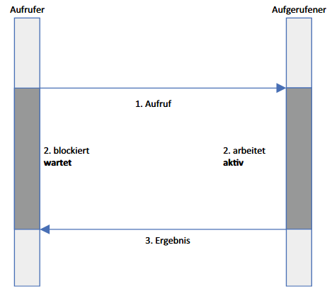   |
| asynchron | - Sender wartet auf keine Antwort und kann weiterarbeiten.<br>- Kommunikationspartner agieren unabhängig.<br>- Verarbeitung / Antwort erfolgt später z.B. durch Callback, Queue oder Polling (wiederholtes Anfragen).                                                                                            | Mail-Systeme, Newsletter, Chat-App                  |  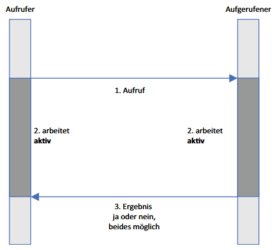   |

##### Was passiert, wenn ein Aufruf nicht beantwortet wird? Wann weiß ich, dass die Antwort nicht mehr kommen wird?

**Synchrone Kommunikation:**
- Timeout wird ausgelöst (nach einer festgelegten Zeit).    
- Der Aufrufer bekommt eine Fehlermeldung (z. B. „Request Timeout“).
- Ohne Timeout würde der Client unendlich warten → Deadlock/Blockierung.

**Asynchrone Kommunikation:**
- Wenn der Server nie antwortet, hängt die Nachricht in der Queue oder wird irgendwann als fehlerhaft markiert / abgewiesen.
- Ob keine Antwort mehr kommt, hängt vom Fehlerhandling ab:
	- Timeout in der Queue
	- Maximalanzahl an Retry-Versuchen
	- Dead-Letter-Queue (spezielle Warteschlange für fehlgeschlagene Nachrichten, z. B. nach mehreren Versuchen oder fehlerhaften Daten)

### Transparenz

Transparenz bedeutet zunächst, dass man durch irgendetwas hindurchsehen kann oder dass **etwas (eine Eigenschaft) verborgen** wird.

| Begriff                     | Beschreibung                                                                                                                                                                                                                                                                             | Beispiel                                                                                          |
| --------------------------- | ---------------------------------------------------------------------------------------------------------------------------------------------------------------------------------------------------------------------------------------------------------------------------------------- | ------------------------------------------------------------------------------------------------- |
| Zugriffstransparenz         | Die Aufrufart (lokal oder entfernt) wird verborgen.<br>Der Aufruf von Komponenten auf andere Komponenten oder Ressourcen erfolgt unabhängig von ihrer Lokalität.                                                                                                                         | Frameworks, die diese Transparenz gewährleisten: Spring oder RPC (Remote Procedure Call)          |
| Ortstransparenz             | Der physische Standort (Ortsinformationen) der Ressource bleibt dem Nutzer verborgen.<br>Der Zugriff erfolgt über Namen.                                                                                                                                                                 | Nutzer einer Webanwendung muss URL kennen, aber wo die Anwendung physisch liegt bleibt verborgen. |
| Nebenläufigkeitstransparenz | Mehrere Prozesse (Nutzer) greifen konkurrierend auf eine Ressource zu, aber jeder Prozess hat die Ressource exklusiv.<br>Zur Realisierung ist notwendig, dass die konkurrierenden Aufrufe sich nicht beeinflussen.<br>Gegebenenfalls muss eine Synchronisierung der Abläufe stattfinden. | Mehrere Überweisungen auf ein Bankkonto sollten fehlerfrei durchgeführt werden.                   |
| Fehlertransparenz           | Typische Fehler gegenüber dem Nutzer werden verborgen. <br>Der Nutzer kann weiterarbeiten.                                                                                                                                                                                               | Übertragungsfehler, Ausfall einer Komponente                                                      |
| Replikationstransparenz     | Replikas von Komponenten werden verborgen.<br>Mit Replikas kann der Datendurchsatz oder die Ausfallsicherheit verbessert werden.                                                                                                                                                         | Software oder Hardware                                                                            |

### Beans
##### Merkmale

- Im Gegensatz zu POJOs (Plain Old Java Object) können Beans nur innerhalb des Spring Frameworks existieren.
- Beans sind (Java-) Objekt, die vom Spring Container verwaltet werden, inklusive ihrer Instanziierung, Überwachung, Wartung und Löschung (= ==Lebenszyklus==).
- Die Beans werden durch Meta-Informationen im Programm ausgewiesen (per Annotation oder XML-Deklaration).
- Sie durchlaufen einen Lebenszyklus, angefangen von der Instanziierung bis zu ihrem Ende.

##### Lebenszyklus

- Objekt durchläuft verschiedene Produktionsschritte in einem Transformationsprozess
- Der Ablauf wird **Hooking** genannt und die Methoden nennen sich **Hook-Methoden**
- Hook-Methoden überschreiben Default-Methodenimplementierungen, wodurch an ausgewiesenen Programmstellen eine überschriebene Methode / spezifischer Ablaufcode ausgeführt wird.
- Zwei Anwendungsszenarien:
	- Bei Initialisierung werden die Bean Variablen mit Ausgangswerten vorbelegt
	- Aufräumarbeiten vor dem endgültigen Löschen einer Bean

###### Kurzfassung

| Schritt                 | Beschreibung                                                                                                                                                                                                                      |
| ----------------------- | --------------------------------------------------------------------------------------------------------------------------------------------------------------------------------------------------------------------------------- |
| 1. Instanziierung       | Der Lebenszyklus einer Bean beginnt mit der **Instanziierung der Bean** durch den Container.                                                                                                                                      |
| 2. Dependency Injection | Nach der Instanziierung folgt die **Dependency Injection**.                                                                                                                                                                       |
| 3. `@PostConstruct`     | Sobald die Abhängigkeiten injiziert wurden, kann die **Bean spezifische Initialisierungsmethoden** ausführen, die mit `@PostConstruct` annotiert sind.<br>Die Bean steht dann zur **Nutzung im Anwendungskontext** zur Verfügung. |
| 4. `@PreDestroy`        | Vor der Zerstörung der Bean können **Aufräumarbeiten** durch Methoden, die mit `@PreDestroy` annotiert sind, durchgeführt werden.                                                                                                 |

###### Langfassung

1. **Instanziierung**
	- Spring Container erzeugt Objekt, das durch die nächsten Schritte zur Bean wird.
2. **Attribute setzen**
	- Spring Container setzt Eigenschaften und Abhängigkeiten, die in der Bean definiert sind, inklusive der Injektion von anderen Beans, Werten und Konfigurationseinstellungen.
3. **BeanNameAware::setBeanName(String)**
	- Für Beans, die das Interface implementiert, ruft der Container die Methode auf, um ihnen ihren Namen zu übergeben.
4. **BeanFactoryAware::setBeanFactory(BeanFactory)**
	- Für Beans, die das Interface implementiert, ruft der Container die entsprechende Methode auf, um ihnen die Factory zu übergeben.
5. **ApplicationContext::setApplicationContext(ApplicationContext)**
	- Die Bean bekommt damit die Information, in welchem ApplicationContext sie verwaltet wird.
6. **BeanPostProcessor::preInitialization(Object, String)**
	- Hierdurch kann die Bean-Instanz manipuliert werden.
7. `@PostConstruct`
	- Damit kann eine Methode annotiert werden, direkt nach der Bean Instanziierung und der Abhängigkeitsinjektion, aber vor der Verwendung der Bean ausgeführt werden soll.
8. **InitializingBean::afterPropertiesSet()**
	- Nach dem Setzen aller Bean-Eigenschaften können noch weitere Änderungen vorgenommen werden.
9. **BeanPostProcessor::postProcessorAfterInitialization(Object, String)**
	- Mit dieser Methode sind weitere Anpassungen möglich.
10. **Bean kann verwendet werden**
	- Bean ist einsatzbereit und kann in der Anwendung verwendet werden.
11. `@PreDestroy`
	- Damit kann eine Methode annotiert werden, die geeignete Aufräumarbeiten ermöglicht.
12. **DisposableBean::destroy()**
	- Wenn die Anwendung beendet und der Container heruntergefahren wird, ruft der Container für die Beans, die das Interface implementieren, die entsprechende Methode auf. Damit können ebenso geeignete Aufräumarbeiten durchgeführt werden.

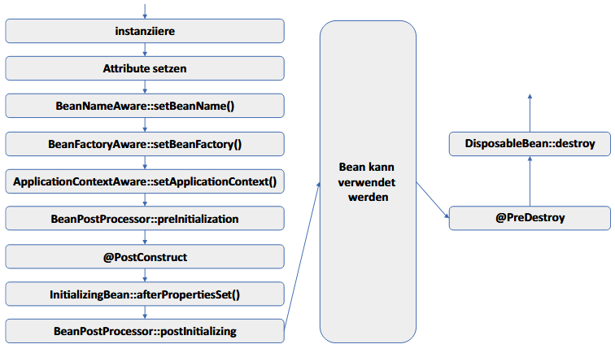

### Annotationen & Interfaces

Durch Annotationen werden Metadaten in den Code eingebunden. Diese **Metadaten können vom Compiler ausgewertet und verarbeitet werden**.

| Annotation                      | ==Beschreibung==                                                                                                                                                                                                                                       | Verarbeitung                                                                                                                                                                                                                                                                                                                                                                                                                                                                                                                                                                                                                                                                                                                                                                     |
| ------------------------------- | ------------------------------------------------------------------------------------------------------------------------------------------------------------------------------------------------------------------------------------------------------ | -------------------------------------------------------------------------------------------------------------------------------------------------------------------------------------------------------------------------------------------------------------------------------------------------------------------------------------------------------------------------------------------------------------------------------------------------------------------------------------------------------------------------------------------------------------------------------------------------------------------------------------------------------------------------------------------------------------------------------------------------------------------------------- |
| `@SpringBootApplication`        | Startet Spring Boot Anwendung und aktiviert automatisch Spring MVC Konfigurationen.<br>Mit den Annotationen `@Configuration`, `@EnableAutoConfiguration` und `@ComponentScan` werden die Beans des Spring Containers zusammengesucht und instanziiert. | `@Configuration` markiert die Klasse als Quelle für Bean-Definitionen.<br><br>`@EnableAutoConfiguration` sagt Spring, automatisch die Konfiguration basierend auf den hinzugefügten Abhängigkeiten zu wählen.<br><br>`@ComponentScan` ermöglicht Spring, nach anderen Komponenten, Konfigurationen und Services im angegebenen Paket zu suchen, sodass es diese automatisch finden und registrieren kann.<br><br>Unterschied `@Component` und `@Configuration`: `@Configuration`-Klasse beinhaltet eine mit `@Bean` annotierte Methode.<br>Bei Ausführung zur Laufzeit, erfolgt die Abarbeitung des Methodenrumpfes.<br>Das zurückgegebene Objekt wird als Bean in den entsprechenden Spring Kontext abgelegt.<br>Damit können Beans zur Laufzeit vom Programm generiert werden. |
| `@Service`                      | Markiert eine Klasse für die Schicht der Geschäftslogik.                                                                                                                                                                                               |                                                                                                                                                                                                                                                                                                                                                                                                                                                                                                                                                                                                                                                                                                                                                                                  |
| `@Controller`                   | Markiert eine Klasse als Spring MVC Controller, der Request Handler Methoden beinhaltet.                                                                                                                                                               | Innerhalb der Klasse werden Methoden durch die Verwendung von Annotationen wie `@RequestMapping` bestimmten HTTP Requests zugeordnet.<br><br>Jede Methode kann Daten bearbeiten, aufbereiten, in Form eines **Models** zurückgeben und eine **View** spezifizieren, die für die Dartstellung der Antwort verantwortlich ist.<br><br>Parameter werden durch Annotationen wie`@RequestParam` übergeben.<br><br>Diese Annotationen verbinden HTTP Requests eng mit der Anwendungslogik.                                                                                                                                                                                                                                                                                             |
| `@RequestMapping`               | Ordnet eine Methode einem spezifischen Request-Type und Pfad zu.                                                                                                                                                                                       | Anstelle einer spezifizierten `@RequestMapping`-Annotation, kann man mittels der Annotationen `PostMapping` oder `GetMapping` direkt kennzeichnen, ob es sich um eine POST- oder GET-Anfrage handelt.                                                                                                                                                                                                                                                                                                                                                                                                                                                                                                                                                                            |
| `@RequestParam`                 | Bindet einen Methodenparameter an einen Request-Parameter mit dem gleichen Namen oder einem spezifizierten Namen.                                                                                                                                      | Diese Annotation wird verwendet, um Parameter aus einem **Query-String** einer URL oder Formulardaten in einer POST-Anfrage zu binden.                                                                                                                                                                                                                                                                                                                                                                                                                                                                                                                                                                                                                                           |
| `@Component`                    | Ist eine generelle Kennzeichnung einer verwalteten Komponente.                                                                                                                                                                                         | Sie kennzeichnet eine Klasse als Bean, die vom Spring Container verwaltet wird.<br><br>Sie signalisiert, dass eine **Klasse automatisch vom Spring Framework erkannt und in den Anwendungskontext aufgenommen** werden soll.                                                                                                                                                                                                                                                                                                                                                                                                                                                                                                                                                     |
| `@Entity`                       | Notwendig, um Objekte einer Klasse als datenbankfähig / JPA Entität auszuzeichnen.<br>Klasse repräsentiert eine Datenbank-Tabelle.                                                                                                                     | Ein Primärschlüssel in einer Datenbank dient zur eindeutigen Identifikation eines Datensatzes.<br><br>Dieser wird mit `@Id` annotiert. `@GeneratedValue` bedeutet, dass der Schlüssel automatisch von der Datenbank erzeugt wird.<br><br>Nutzt ein Attribut als Datenstruktur eine Map, so wird es mit `@MapKey` und `name=...` annotiert.<br>Hierdurch wird [name]-Spalte als Schlüssel für die Map festgelegt.                                                                                                                                                                                                                                                                                                                                                                 |
| `@OneToMany`, `@ManyToOne`, ... | Kennzeichnen die Art der Beziehungen zu anderen Entitäten, wie **1:1, 1:n oder n:m**.                                                                                                                                                                  |                                                                                                                                                                                                                                                                                                                                                                                                                                                                                                                                                                                                                                                                                                                                                                                  |
| `@Embedded`                     | Kennzeichnung eingebetteter Objekte.                                                                                                                                                                                                                   |                                                                                                                                                                                                                                                                                                                                                                                                                                                                                                                                                                                                                                                                                                                                                                                  |
| `@Embeddable`                   | Klasse kann in anderen Entitäten eingebettet werden.                                                                                                                                                                                                   |                                                                                                                                                                                                                                                                                                                                                                                                                                                                                                                                                                                                                                                                                                                                                                                  |
| `@Table`                        | Optional zur Feinabstimmung der Abbildung auf die Datenbank.<br>Wird verwendet, um zusätzliche Informationen über die Tabelle in der Datenbank anzugeben, wie Tabellen-Name, wenn dieser vom Klassen-Namen abweicht.                                   |                                                                                                                                                                                                                                                                                                                                                                                                                                                                                                                                                                                                                                                                                                                                                                                  |
| `@Query`                        | Dient der Definition eigener Query-Methoden.                                                                                                                                                                                                           | Man platziert die Annotation **direkt über der Repository-Methode** und gibt die JPQL- oder **SQL-Abfrage als String-Wert** an.<br>**Parameter** in der Query können durch **Platzhalter** (z.B. "?1") **oder benannte Parameter** (z.B. ":name") definiert werden, die durch die Methodenparameter zur Laufzeit ersetzt werden.                                                                                                                                                                                                                                                                                                                                                                                                                                                 |
| `@Autowired`                    | Bean-Objekt wird zur Verfügung gestellt, inklusive Instanziierung.                                                                                                                                                                                     |                                                                                                                                                                                                                                                                                                                                                                                                                                                                                                                                                                                                                                                                                                                                                                                  |
| `@Override`                     | Die mit dieser Annotation versehene Methode **definiert die Methode der Superklasse neu**.                                                                                                                                                             | Der Compiler überprüft, ob die Superklassenmethode existiert und meldet im negativen Fall einen Fehler.<br><br>Java-Annotationen sind im JSR (Java Specification Request) definiert worden.                                                                                                                                                                                                                                                                                                                                                                                                                                                                                                                                                                                      |
| `@SpringBootTest`               | Festlegung, dass ein Test durchgeführt wird.                                                                                                                                                                                                           |                                                                                                                                                                                                                                                                                                                                                                                                                                                                                                                                                                                                                                                                                                                                                                                  |
| `@ServiceTest` & `@Test`        | Definiert, dass ein JUnit-Test-artiger Testlauf durchgeführt werden soll.                                                                                                                                                                              | In den Testklassen verwenden wir die Java-Bibliothek **AssertJ**.<br><br>Mit AssertJ werden Tests mit verketteten Aufrufen von Methoden lesbarer und leichter verständlich.<br><br>Die Fehlermeldungen sind oft detaillierter und aussagekräftiger als die von JUnit verwendete Standard-Bibliothek.                                                                                                                                                                                                                                                                                                                                                                                                                                                                             |
| `@WebMvcTest`                   | Für die Verwendung von MockMVC in einem Testkontext.<br>Alternativ konfiguriert man MockMvcBuilders manuell.                                                                                                                                           |                                                                                                                                                                                                                                                                                                                                                                                                                                                                                                                                                                                                                                                                                                                                                                                  |
|                                 |                                                                                                                                                                                                                                                        |                                                                                                                                                                                                                                                                                                                                                                                                                                                                                                                                                                                                                                                                                                                                                                                  |

| Interface         | Beschreibung                                                                                                                                                                                                                                                                                                     |
| ----------------- | ---------------------------------------------------------------------------------------------------------------------------------------------------------------------------------------------------------------------------------------------------------------------------------------------------------------- |
| CommandLineRunner | Eine Methode init() mit dem Rückgabetyp CommandLineRunner und der Annotation `@Bean`.<br>Diese Methode hat ein Objekt als Rückgabewert, das als Bean leben und vom Spring Container verwaltet wird.<br>Das Interface bewegt den Spring Container dazu, nach dem Start der Anwendung sofort die Bean auszuführen. |

### Convention over Configuration
- Die Präferenz für **Standardkonventionen über ausführliche Konfigurationen, um die Effizienz zu steigern**.
- Es existieren vorgefertigte Konfigurationseinstellungen, die der Entwickler nicht explizit angeben muss.
- Im Falle von (gewünschten) Änderungen wird der Entwickler eine Konfigurationseinstellung vornehmen.
- Damit werden die Prinzipien DRY und KISS unterstützt.

### Log Level

- Hauptzweck des Loggings ist, Fehler und ungewöhnliches Verhalten in einer Anwendung zu dokumentieren.
- Logging zeichnet Zustände von und Ereignisse in Programmausführungen auf, indem es diese Informationen in Dateien speichert oder auf der Konsole ausgibt.
- Mögliche Informationen sind:
	- Zeitstempel
	- Log-Level
	- Prozess-ID
	- Thread-Name
	- ausgeführte, den Log-Level enthaltene Klassen
	- vom Entwickler formulierte Log-Nachricht
- Die Log-Ausgaben können angepasst, konfiguriert und nach eigenen Vorzügen formatiert werden.
- Die zu protokollierenden Meldungen sind sind in verschiedene Log-Level klassifiziert:

| Log Level | Beschreibung                                                                                                                                                                                           | 
| --------- | ------------------------------------------------------------------------------------------------------------------------------------------------------------------------------------------------------ |
| TRACE     | Bietet die **detailliertesten Informationen**, inkl. Details zum Ablauf.                                                                                                                                |
| DEBUG     | Enthält **Informationen**, die hauptsächlich **während der Entwicklung / Fehlersuche nützlich** sind, wie **Zustandsinformationen** von Objekten und Ausführungspfaden.                                |
| INFO      | Bietet **allgemeine Informationen über den Systemlauf** bzw. auftretende Ereignisse, wie Start- und Abschlussmeldungen von wichtigen Prozessen (z.B. Verbindung zur Datenbank) oder Konfigurationen.                                                                |
| WARN      | **Warnt vor Ereignissen, die auf potentielle Probleme hinweisen**, z.B. veraltete APIs, schlechte Datenqualität oder unerwartete Ausnahmen, die jedoch nicht notwendiger Weise die Anwendung stoppen. |
| ERROR     | **Zeigt ernsthafte Probleme an, die die normale Funktion der Anwendung beeinträchtigen**, wie nicht abgefangene Ausnahmen oder kritische Dienstausfälle.                                               |

##### Konfiguration

In einer Spring-Boot-Anwendung können Log-Levels durch Hinzufügen von Einträgen in die `application.properties` Datei angepasst werden, um die Ausführlichkeit der Log-Nachrichten zu steuern.

### User Stories
- Einfaches und effektives Mittel zur Beschreibung von Kundenanforderungen aus Sicht des Nutzers

> [!NOTE] Schema
> Als `Nutzer in Rolle` möchte ich `Wunsch / Ziel`, damit / weil / denn `Ergebnis / Nutzen`.

| Als ...              | möchte ich ...,                                     | damit/weil/denn ...                                     |
| -------------------- | --------------------------------------------------- | ------------------------------------------------------- |
| Registrierter Nutzer | mich einloggen,                                     | ich chatten kann.                                       |
| Registrierter Nutzer | alle meine Chats sehen,                             | ich eine Konversation mit einem Kontakt auswählen kann. |
| Registrierter Nutzer | meine ein- und ausgehenden Posts eines Chats sehen, | ich die gesendeten Posts (jederzeit) im Überblick habe. |

##### Unterschied User Stories und User Case
| Gemeinsamkeit                                               | Use Case                                                                                                                                                                                 | User Story                                                                                                                                         |
| ----------------------------------------------------------- | ---------------------------------------------------------------------------------------------------------------------------------------------------------------------------------------- | -------------------------------------------------------------------------------------------------------------------------------------------------- |
| Beschreiben Interaktion von Nutzer und System oder Software | Beschreibt Anwendungsfall und die darin notwendigen Aktivitäten und Abläufe.<br>Behandelt verschiedene Szenarien inklusive Fehlersituationen.<br>Er ist detaillierter und eher formaler. | Beschreibt ein Szenario und ist weniger detailliert, deutlich kompakter und nicht formal.<br>Sie enthält keine oder weniger Kontext-Informationen. |

## Spring MVC
### Servlet

> [!NOTE] Servlet
> Ein Servlet ist eine Java-Klasse, die HTTP Requests (Anfragen) von Webclients bearbeiten kann. Als Ergebnis liefert sie Webinhalte (z.B. HTML Codes) zurück.
> Ein Servlet Container verwaltet die Servlets und kann Bestandteil eines Web- oder Anwendungsservers sein. Der Webserver erkennt aufgrund der Anfrage, ob er sie mittels einer statischen Website beantworten kann oder ordnet sie einem Servlet zu.

### Model-View-Controller

- Im **Model** befinden sich die Daten der Anwendung
- Der **Controller** ist verantwortlich für die Verarbeitung von eingehenden anfragen (HTTP Requests), stellt geeignete Model-Objekte zur Verfügung und leitet die Model-Objekte an die View weiter.
- Die **View** übernimmt die Generierung der an den Client auszuliefernden HTML-Datei, in der die gewünschten Model-Objekte integriert sind.

##### Typische Abhängigkeiten im MVC Kontext

- Thymeleaf: Template Engine
- Spring Data JPA: Zugriff auf Datenbanken
- H2: In-Memory Datenbank
- Spring Devtools: Werkzeuge für einfache Entwicklung (z.B. automatisches Kompilieren nach Speichern)

### Controller (Bindeglied)

- Die Methoden der Controller-Klassen werden aufgerufen, wenn das Dispatcher-Servlet ein HTTP Request bekommt, zu der er eine geeignete Klasse mit passender Methode mittels RequestMapping-Annotation findet.

##### Ablauf im Backend

1. Der Ablauf eines Requests in Spring MVC beginnt beim **Dispatcher Servlet**. Es agiert als Controller, der als zentrale Komponente für das **Routing** (Routenkontrolle & Anfrageverarbeitung) **von eingehenden HTTPS Requests** an die entsprechenden Handler dient.
2. Es **liest die Konfiguration mit Hilfe des Handler-Mappings** (durch URL-Mapping oder Annotationen `@Controller` und `@RequestMapping`), um den **passenden Controller und die zugehörige Methode für den Request** zu bestimmen. Der Annotation `@RequestMapping` muss als Wert die zugehörige URI (Unique Resource Identifier) angegeben werden.
3. Anschließend werden alle **erforderlichen Parameter an die richtige Controller Methode übergeben**. Dabei wird dem Controller ein **Model-Objekt** mitgegeben, in dem **Informationen (Daten)** für die Methode eingespeist werden können. Hier wird die **Geschäftslogik ausgeführt**.
4. Der Controller führt die Methode aus und kann **Daten in das Model-Objekt einfügen**. Der **Rückgabewert** der Methode ist der **View Name**.
5. Der View Name muss auf einer konkreten Web-Ressource (HTML Seite) abgebildet werden. Dies übernimmt der **View Resolver**.
6. Das **DispatcherServlet kennt die konkrete View** und **integriert die Daten** aus dem Model-Objekt in die **View Templates** (via Template Engine Thymeleaf). 
7. Die finale Web-Ressource wird an den Browser/Client ausgeliefert und angezeigt.

	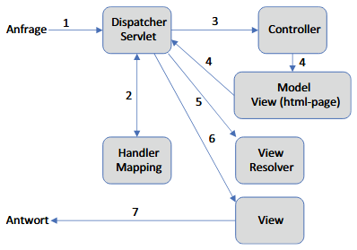

	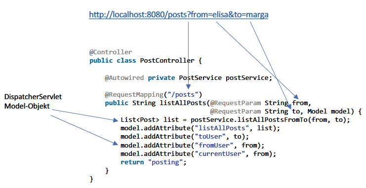

### Model (Daten)
##### Spring Data

- Projekt, das auf Spring Framework aufbaut
- Dient dem Zugriff auf Datenbanken, egal ob relational oder nicht.
- Bietet für alle Datenbanksysteme eine gemeinsame Schnittstelle (API)
- Datenbank-Konfigurationen werden in `application.properties` vorgenommen

##### Entitäten

- Entitäten sind Java-Klassen, die Tabellen in einer Datenbank repräsentieren. Durch die Annotation `@Entity` werden Objekte dieser Klasse als datenbankfähig ausgezeichnet.
- Der **Konstruktor** benötigt **keine Parameter** und kann auch einen leeren Rumpf haben.
- Ein **Primärschlüssel** in einer Datenbank dient zur **eindeutigen Identifikation** eines Datensatzes. Ein solcher wird durch die Annotation `@Id` festgelegt.
- `@GeneradtedValue` bedeutet, dass der **Primärschlüssel automatisch von der Datenbank erzeugt** wird.
- Mit den Annotationen `@OneToMany` und `@ManyToOne` werden die Beziehungen der Datenbanktabellen festgelegt.
- **Werden Objekte  über ein Netzwerk transferiert und in einem anderen Kontext abgespeichert, sollten Sie das Interface `Serializable` implementieren**. Diese Flag dient der Kennzeichnung für die JVM, dass die Objektinstanzen serialisiert werden können.

> [!NOTE] **Merke:**
> Bei der Typdeklaration des Attributes `id`, das der Primärschlüsselspalte entspricht, haben wir einen **Objekttyp (z.B. Integer) verwendet**. Alternativ wäre auch ein primitiver Datentyp (z.B. int) möglich gewesen.
> Bei der Initialisierung des Attributes durch einen Default-Wert würde bei einem **primitiven Datentyp ein konkreter Wert** zugewiesen. Normalerweise ist dies 0.
> Wenn wir wie in unseren Programmen vorgehen und **Objekttypen** verwenden, dann ist der **Initialwert null**. Dies bedeutet, dass der **Primärschlüssel noch nicht gesetzt** worden ist. 
> Wann erfolgt die Zuweisung eines konkreten Primärschlüsselwertes?
> Durch die erstmalige Ausführung der save-Operation. Mit Objekttypen können wir in dem vorherigen Ablauf feststellen, ob das Objekt bereits in der Datenbank abgespeichert worden ist oder nicht.

- In Entity-Klassen werden keine Setter-Methoden definiert. Anstelle dessen übernehmen add- und with-Methoden die Aufgaben. 
- Die add-Methode fügt ein Objekt in eine Collection ein, wohingegen mit einer with-Methode ein Objekt gesetzt wird.
- Unterschied: set-Methoden keinen Rückgabetyp und add- und with-Methoden hingegen schon.
- Der Rückgabetyp ist jeweils der umschließende Klassentyp. Die add- und with-Methoden werden mit `return this;` beendet. 
- Mit diesen Methoden kann das Konzept der sogenannten Fluent Interfaces (Lesbarkeit durch Methodenverkettung) angewendet werden.

##### Base-Entity

- Abstrakte Klasse mit der Annotation `@MappedSuperclass`
- Bietet eine Basisimplementierung für Entitätsklassen.
- Definiert gemeinsame Attribute für Entitäten, wird aber nicht als separate Tabelle in der Datenbank abgelegt
- `equals()` und `hashCode()` sind Boilerplate Code

> [!NOTE] **BoilerplateCode**
> Wiederverwendbarer Code, der mit minimalen oder keinen Änderungen in verschiedenen Kontexten eingesetzt wird. 
> Er dient als Standardvorlage für wiederkehrende Aufgaben.

| Methode      | Eigenschaften                                                                                                                              |
| ------------ | ------------------------------------------------------------------------------------------------------------------------------------------ |
| `equals()`   | Bestimmt, ob zwei Instanzen gleich sind.<br>Wird verwendet, um die Speicherortbestimmung in einer Hashtabelle zu steuern.                  |
| `hashCode()` | Muss denselben Wert zurück liefern, wenn zwei Objekte gleich sind.<br>Muss überschrieben werden, wenn die Gleichheitslogik verändert wird. |

- Beide Methoden sollten überschrieben werden, da oft nicht alle Attribute in den equals-Vergleich mit einbezogen werden. Häufig ist sogar nur der Primärschlüssel, also das mit `@Id` annotierte Attribut, für den Vergleich heranzuziehen.
-  In (relationalen) Datenbanken haben Tabellen einen eindeutigen Primärschlüssel, durch den jeder zugehörige Datensatz eindeutig beschrieben ist. 
- ==Das **Überschreiben von hashCode und equals** ist notwendig, um **Konsistenz bei der Gleichheitsprüfung** von Objekten zu gewährleisten==, insbesondere, wenn diese als Schlüssel in HashMaps oder in anderen hash-basierten Collections verwendet werden.
- ==Wenn zwei **Objekte laut `equals()` gleich sind**, müssen sie **denselben Hashcode** haben==, damit sie korrekt in Collections verwaltet werden können.
- **Ohne Übereinstimmung** kann es zu **inkonsistentem Verhalten von Collections** kommen

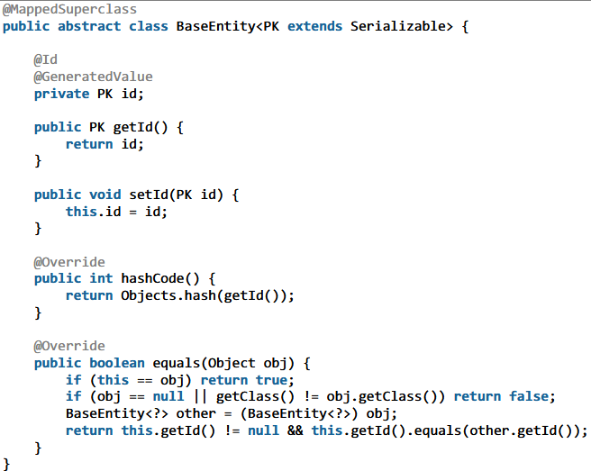

##### Assoziationen

- Verbindung von einer Quell-Klasse zu einer Ziel-Klasse.
- Dabei verwendete Multiplizitäten (1,0..\*) geben an, wie viele Objekte der assoziierten Ziel-Klassen im Quell-Objekt referenziert sind.
- Beispiel: Kunde (Quell-Klasse) kann mehrere Bestellungen (assoziierte Klassen) haben → 1-0..* / 1-n

**Direktionalität**

- Aspekt von Assoziationen
- Drückt die Navigierbarkeit im Modell aus.
- Durch Navigierbarkeit wird ausgedrückt und eingeschränkt, von welchen Objekt aus ein anderes Objekt erreicht werden kann.

**Unidirektionalen Beziehungen**

- Beziehung in eine Richtung → Beispiel: Person und Handy(s)
- **Nur eine Entität muss von der Existenz der anderen sowie deren Beziehung wissen.**
- Bei `ManyToOne` wird die Verbindung nur von einer Seite verwaltet.
- Bei einer `@ManyToMany`-Beziehung kann die Verknüpfung der Fremdschlüssel nicht mehr bei einer Entitätstabelle gehalten werden. Es wird eine JOIN-Tabelle benötigt, welche die Fremdschlüssel miteinander verknüpft.
- Reduziert die Komplexität der Entitätsmodelle.
- Ermöglichen eine einfachere Modellierung von Beziehungen.
<br>
- Mögliche Assoziationen:
	- Unidirektionale 1:1 → PersonImHaus : Person
	- Unidirektionale 1:n → Gebäude : Räume
	- Unidirektionale n:1 → PersonImHaus : Gebäude
	- Unidirektionale n:m

**Bidirektionalen Beziehungen**

- Zweiseitige Beziehung → Beispiel: Kunde und Bestellungen
- Nur die **Besitzerseite der Beziehung** ist für die **Aktualisierung der Datenbankbeziehung** verantwortlich.
- Das `(mappedBy="...")` Attribut muss auf der "inversen" Seite verwendet werden, um die "besitzende" Seite zu definieren.
- Von der besitzenden Seite kann mittels der Fremdschlüsselspalte auf die inverse Seite zugegriffen werden
- Um bidirektionalen Beziehungen in JPA korrekt zu implementieren, muss man sicherstellen, dass **Änderungen auf beiden Seiten der Beziehung reflektiert** werden.
- Dies bedeutet, das beim **Hinzufügen oder Entfernen einer Entität** aus einer Beziehung, die Änderungen **nicht nur auf Besitzerseite (Seite, die Fremdschlüsselbeziehung in der Datenbank definiert)**, sondern auch auf der gegenüberliegenden Seite durchgeführt werden muss.
- Dies erfordert oft die **Implementierung von Hilfsmethoden in den Entitätsklassen**, um sicherzustellen, dass beide Seiten der Beziehung konsistent bleiben und Änderungen korrekt in der Datenbank widergespiegelt werden. 
- Bspw. sollte beim **Setzen einer Beziehung** in einer `@OneToMany`-Beziehung auch die **entsprechende Referenz** in der `@ManyToOne`-Beziehung gesetzt (oder entfernt) werden, um die **Konsistenz zu wahren**.
- Bei einer `@ManyToMany`-Beziehung kann die Verknüpfung der Fremdschlüssel nicht mehr bei einer Entitätstabelle gehalten werden. Es wird eine JOIN-Tabelle benötigt, welche die Fremdschlüssel miteinander verknüpft.
- Ohne `@Transactional` muss sichergestellt werden, dass ein abschließender `save`-Befehl für das geänderte Objekt erfolgt. Mit `@Transactional` ist das nicht notwendig, da alles in einer Session (Sitzung) bearbeitet wird.
<br>
- Mögliche Assoziationen:
	- Bidirektionale 1:1 → Gebäude : Adresse
	- Bidirektionale 1:n → Raum : PersonImHaus
	- Bidirektionale n:1
	- Bidirektionale n:m → Gebäude : Person

##### Lebenszyklus

- Zentral für das Verständnis, wie Änderungen an Objekten gehandhabt und mit der Datenbank synchronisiert werden.
- Durch das Verwalten von ==Entitätszuständen== kann gesteuert werden, wann **Änderungen persistent**, wann sie **im Kontext gehalten** oder wann sie **verworfen werden**.
- Ermöglicht effiziente Datenoperationen und hilft, Datenintegrität und -konsistenz zu wahren.

| Zustand     | Beschreibung                                                                                                                                                                                                                                                                                             |
| ----------- | -------------------------------------------------------------------------------------------------------------------------------------------------------------------------------------------------------------------------------------------------------------------------------------------------------- |
| 1. NEW      | Entität wurde neu erstellt, ist aber noch nicht im Persistence Context. Sie ist transient.<br>Durch den `save`-Aufruf kann ein transientes Objekt persistent werden und geht in den MANAGED Zustand über.                                                                                                |
| 2. MANAGED  | Entität ist im Persistence Context und wird von JPA verwaltet und überwacht.<br>Die persistente Entität hat eine eindeutige Identität durch den Primärschlüssel.<br>Im PersistenceContext werden Änderungen bis zum Commit gesammelt.<br> Nach dem Commit geht die Entität in den Zustand DETACHED über. |
| 3. REMOVED  | Entität ist zum Löschen markiert.<br>Am Ende einer Transaktion oder des Commits wird das Objekt aus der Datenbank gelöscht.<br>Bist dahin wird es als REMOVED markiert.                                                                                                                                  |
| 4. DETACHED | Entität wurde aus dem Persistence Context entfernt.<br>Die Entität existiert als Java-Objekt und ist von der Datenbank losgelöst.                                                                                                                                                                                                                                                  |

> [!NOTE] **Persistente Objekte:**
> Stellen Daten aus Datenbanken dar und sind daher langlebig, da heißt sie können auch nach Absturz/Beendigung und Neustart der Anwendung wiederverwendet werden.
> Sie haben eine eindeutige Identität, mit der sie gefunden werden.

##### Objekt-relationales Mapping (ORM)

- Idee: Objekte werden nach festen Vorschriften auf Relationen abgebildet
- Technik, die relationale Datenbanken mit objektorientierten Programmiersprachen verbindet, indem sie **Datenbanktabellen als Klassen und Zeilen als Objekte** darstellt.
- ORM fungiert als Zwischenschicht, die **SQL-Details verbirgt**.
- Bekannte ORM Frameworks: Hibernate
<br>
- **Vorteil Datenbankunabhängigkeit**: Der Code ist oft nicht an ein spezifisches DBMS gebunden.
<br>
- Ein häufiges Problem dabei ist der Impedanz Mismatch, der entsteht, wenn Datenbankoperationen nicht effizient auf die Objektstruktur abgebildet werden können.

> [!NOTE] **Impedanz Mismatch:**
> Fehlen einer Übereinstimmung zwischen zwei Systemen, was zu ineffizienter Datenkompatibilitätsproblemen führt.
> Inkompatibilität zwischen objektorientierten Modellen und relationalen Datenbanken.

##### JPA Repositories

- Die Jakarta Persistence API (JPA) ist eine Standard-Spezifikation, die von ORM-Realisierung implementiert wird. 
- **Standardisierte Zugriffschnittstelle für zu persistierende Objekte**.
- Ermöglicht es, Java-Objekte (Entities) direkt in relationalen Datenbanken zu speichern, zu aktualisieren und abzurufen, ohne manuell SQL-Code schreiben zu müssen, was die Datenbankpersistenz vereinfacht.
<br>
- **CRUD-Operationen**:
	- Spring Data Repositories bieten **vordefinierte Methoden für gängige CRUD Operationen** an, wodurch man diese nicht manuell implementieren muss.
	- Dies reduziert Boilerplate-Code und erleichtert die Entwicklung.
<br>
- **Query-Methoden durch Konvention**:
	- Durch die benennt man die Methode entsprechend der **Query-Methode-Konventionen** können **spezifische Datenabfragen** definiert werden, ohne dass explizite Implementierungen oder SQL-Abfragen erforderlich sind.
	- Bspw. übersetzt die Methode `findByName(String name)` automatisch eine SQL-Abfrage, die Einträge anhand des Namens sucht.
<br>
- **Einfach Integration**:
	- Die Integration mit verschiedenen Datenbanktechnologien (z.B. JPA, MongoDB) wird durch das Spring Data Projekt vereinfacht, indem für jede Technologie spezifische Erweiterungen bereitgestellt werden, die auf dem gleichen Grundprinzip basieren.
<br>
- Um eigene Query-Methoden zu definieren, nutzt man die Assoziation `@Query` über einer Respository-Methode. 

	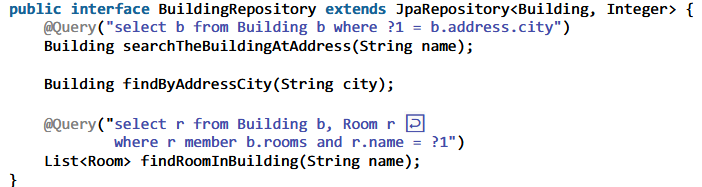

###### Komponenten

- **Persistence Context**: 
	- Verwaltet eine Menge von Entitätsinstanzen, die aktuell in einer Transaktion sind.
	- Er verwaltet die MANAGED-Entitäten.
- **Persistence Provider** 
	- Implementiert JPA-Spezifikationen.
	- Bietet die notwendige Funktionalität, um Enitäten zu verwalten, darunter das **Persistieren, Lesen, Aktualisieren und Löschen von Entitäten**.
	- Agiert als Brücke zwischen Anwendung und Datenbank.
	- Über den PersistenceProvider wird die konkrete Implementierung der API eines Herstellers festgelegt. In den Standardeinstellungen von Spring Boot ist das Hibernate.
- **Persistence Unit**
	- Definiert, welche Entitäten verwaltet werden, die Datenbankverbindungen und andere ORM-spezifische Einstellungen
	- Eine sorgfältig konfigurierte Persistence Unit kann die Performance optimieren, indem sie z.B. Caching-Strategien festlegt, und bestimmt, wie die Anwendung auf die Datenquelle zugreift
	- Dies verbessert die Flexibilität und Wartbarkeit der Anwendung

##### Vor- und Nachteile JPA und ORM

| Vorteile                                                                                            | Nachteile                                                                                                                                                           |
| --------------------------------------------------------------------------------------------------- | ------------------------------------------------------------------------------------------------------------------------------------------------------------------- |
| + Erleichterte und vereinheitlichte Verwendung von relationalen bis zu NoSQL Datenbanktechnologien  | - Kann zu Overhead führen, der die Leistung bei großen Datenmengen beeinträchtigt.                                                                                  |
| + Reduktion Boilerplate-Code:<br>Bereitstellung generischer Operationen ohne spezifischen Code.     | - Datenbankwissen wird empfohlen, insbesondere bei Verwendung von Querys                                                                                            |
| + Die Beziehungen `@OneToOne`, `@OneToMany`, `@ManyToOne` & `@ManyToMany` können realisiert werden. | - Bei schlechter Performance, werden manuelle Optimierungen oder Konfigurationen notwendig, wofür tiefgreifendes Wissen über Hibernate und die DB unerlässlich ist. |
| + Vereinfachung Datenzugriffsschicht:<br>Automatische Implementierung von CRUD-Operationen.         |                                                                                                                                                                     |
| + Hibernate wurde über viele Jahre (weiter-)entwickelt und läuft stabil.                            |                                                                                                                                                                     |

##### Kaskadierung

- Abhängigkeiten wie in Eltern Kind Situationen können genutzt werden, um **beim Speichern des Eltern Objektes auch die Kind Objekte mit zu speichern**.
- Entitäten beinhalten oft Abhängigkeiten zu anderen Objekten (Beziheungsgeflecht). Daher sollte eine Persistenzoperation auf einer Entität auch auf die abhängigen Objekte ausgeführt werden. Dafür sorgt Kaskadierung.
- Kaskadierungstypen: `PERSIST`, `MERGE`, `REMOVE`, `REFRESH`,`DETACH`
- Gleichzeitige Aktivierung mit `CascadeType.ALL`
- **Nachteil**: Komplexität und damit einhergehende Abhängigkeiten der Speicheroperationen nehmen zu

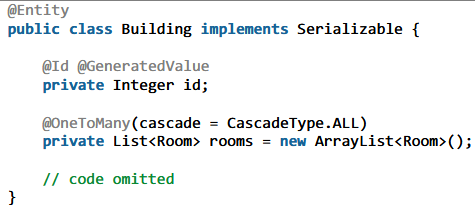

##### Vererbungs-Strategien

- Eine weitsichtige Lösung ist die Vererbung auf die Repositories zu übertragen.
- Dazu definieren wir ein Basis Interface, das die Annotation `@NoRepositoryBean` enthält.
- Hierdurch wird gekennzeichnet, dass Spring für das Interface keine Repository Implementierung erzeugen soll. 
- Da das Basis Interface im weiteren Verlauf nicht verwendet wird, muss auch keine entsprechende Repository Bean von Spring angelegt werden.

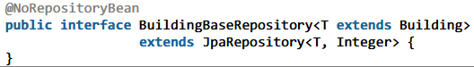

- In JPA Spezifikation werden 3 Strategien beschrieben, wie die mit Vererbung ausgestattet Objekte in die Datenbank persistiert werden können.
- Standard-Fall, der keiner Konfiguration bedarf, ist `InheritanceType.SINGLE_TABLE`

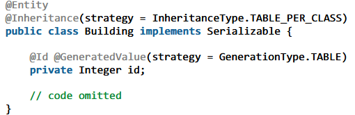

| Single Table Strategie                                                                                                | Joined Strategie                                                                                                                                                                                        | Table per Class                                                                                                                                                                                                                                                                              |
| --------------------------------------------------------------------------------------------------------------------- | ------------------------------------------------------------------------------------------------------------------------------------------------------------------------------------------------------- | -------------------------------------------------------------------------------------------------------------------------------------------------------------------------------------------------------------------------------------------------------------------------------------------- |
| Elternklassen: `@Inheritnce(stragtegy=InheritanceType.SINGLE_TABLE)`                                                  | Elternklassen: `@Inheritnce(stragtegy=InheritanceType.JOINED)`<br>Hier sind alle Attributwerte, auch von abgeleiteten Objekte enthalten.                                                                | Elternklassen: `@Inheritnce(stragtegy=InheritanceType.TABLE_PER_CLASS)`                                                                                                                                                                                                                      |
| **Eine Tabelle**: Alle Entitäten werde in einer Tabelle gespeichert, die in der die Vererbung beginnt.                | **Getrennte Tabellen**: Jede abgeleitete Klasse erhält eine eigene Tabelle.<br>Hier werden nur neu hinzukommende Informationen abgelegt.<br>Zudem existiert eine Fremdschlüsselspalte zur Elternklasse. | Eine Tabelle pro Klasse<br>Alle Informationen enthalten.<br>Geerbte Attribute werden direkt in der Klasse abgelegt.<br>An dem ID-Attribut wird der Annotation `@GeneratedValue` noch die Konfiguration `(strategy=GenerationType.TABLE)` hinzugefügt.<br>Verbindungstabellen für Beziehungen |
| **Diskriminator-Spalte**: Die Spalte `DTYPE` wird genutzt, um den Typ jeder Entität zu identifizieren.                | **JOIN-Operationen**: Zum Laden einer Entität werden Daten mittels JOINs aus verschiedenen Tabellen zusammengeführt.                                                                                    | **Nachteil**: keine gute Performance und aufwändige Wartungsarbeiten, wenn Veränderungen an den Klassen vorgenommen werden müssen.                                                                                                                                                           |
| **Performance**: Schnellere Zugriffe, da keine JOIN-Operationen erforderlich sind.                                    | **Performance Nachteil**: Langsamer als Single Table, da mehrere JOINs nötig sind.                                                                                                                      |                                                                                                                                                                                                                                                                                              |
| **Null-Werte**: Potentiell viele NULL-Spalten, insbesondere bei unterschiedlichen Feldern der abgeleiteten Entitäten. | **Null-Werte**: Reduziert unnötige NULL-Werte durch spezifische Felder in der Tabelle.                                                                                                                  |                                                                                                                                                                                                                                                                                              |

##### Lade-Strategien

- Collection Objekte sind sehr groß und können zu einer hohen Beanspruchung der Internetverbindung führen. 
- Ein Proxy Objekt (per Lazy Load) hat die Fähigkeit, das Nachladen bei Bedarf automatisch durchzuführen.
- Die Annotation `@Transactional` sorgt dafür, dass die Verbindung (Session) zur Datenbank bestehen bleibt.

| Strategie     | Eigenschaft                   | Vorteile                                                                                                                                                                                                                                                                                                                                                                                                              | Nachteile                                                                                                                                                                                                                                                                                                                                                                                                                                                                                          |
| ------------- | ----------------------------- | --------------------------------------------------------------------------------------------------------------------------------------------------------------------------------------------------------------------------------------------------------------------------------------------------------------------------------------------------------------------------------------------------------------------- | -------------------------------------------------------------------------------------------------------------------------------------------------------------------------------------------------------------------------------------------------------------------------------------------------------------------------------------------------------------------------------------------------------------------------------------------------------------------------------------------------- |
| Lazy Loading  | Lädt Beziehungen bei Bedarf.  | + **Verbesserte Startzeit**: Objekte & Beziehungen werden erst geladen, wenn sie explizit benötigt werden.<br><br>+ **Speicher-Effizienz**: Da nur benötigte Daten geladen werden, wird Speicherplatz gespart.<br>Nützlich bei Anwendungen mit großen Datenmengen oder vielen Beziehungen.<br><br>+ **Vermeidung unnötiger Datenbankabfragen**: Verhindert, dass große Mengen ungenutzter Daten vorab geladen werden. | - **Problem bei Zugriff auf viele einzelne Entitäten in einer Schleife**: Bei großer Anzahl Datenbankabfragen (1 pro Entität) wird die Performance negativ beeinflusst.<br><br>- **Komplexität**: Wenn auf nicht geladene Daten außerhalb einer offenen Session zugegriffen wird, tritt ein `LazyInitializationException`-Fehler auf.<br><br>- **Potentielle Performance-Probleme**: Anfangsperformance verbessert, aber spätere Zugriffe auf nicht geladene Daten können zu Verzögerungen führen. |
| Eager Loading | Lädt alle Beziehungen sofort. | + sofortiges Laden der Daten                                                                                                                                                                                                                                                                                                                                                                                          | Erzwingen des sofortigen Ladens mit `fetch=FetchType.EAGER` ist nicht professionell                                                                                                                                                                                                                                                                                                                                                                                                                |

##### Eingebettet Objekte und Aufzählungen

- Eingebettete Objekte (`@Embedded` & `@Embeddable`) und Aufzählungen werden innerhalb der Tabelle der übergeordneten Entität gespeichert.

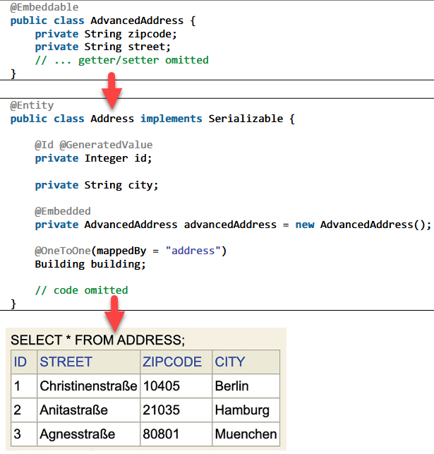

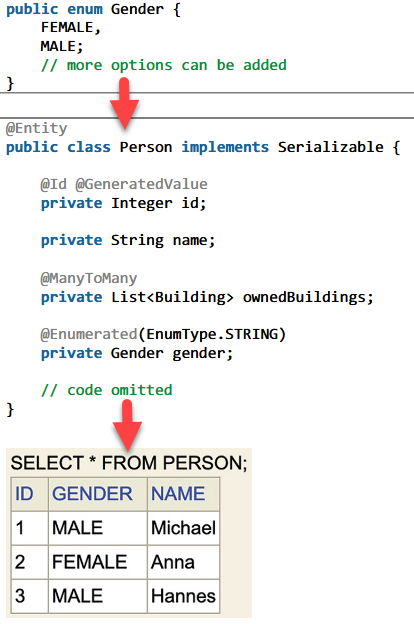

##### EntityManager

- Interface und  wird in die JpaRepository Bean injiziert, was nicht direkt, sondern als Proxy erfolgt. 
- Dies ist entscheidend, um **in verschiedenen Transaktionen den EntityManager zur Laufzeit verwenden** zu können. 
- Der Proxy delegiert die Persistenzmethoden zu dem geeigneten EntityManager
<br>
- Verwaltet mit `@Entity` ausgezeichnete Objekte und hat die Fähigkeit, sie einer Datenbank zu übergeben, speichern, verändern und finden.
- Spring bietet für diesen Mechanismus die `Repositories` als eine einfache abstrakte Lösung an.
- Für dieses Interface wird **zur Laufzeit** mittels Spring-Mittel eine **geeignete Realisierung injiziert**. 
- Spring stellt **Standard-Klassenimplementierungen in Abhängigkeit von der jeweiligen Datenbanktechnologie** zur Verfügung (~DAL)
- Das neue Interface ist von dem allgemeinen Interface `Jpa-Repository` abgleitet, das die nachfolgenden Methoden und noch mehr zur Verfügung stellt:

	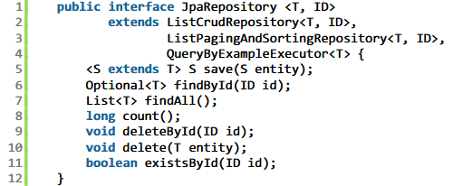

| Methode                           | Beschreibung                                                                                                                                                                          |
| --------------------------------- | ------------------------------------------------------------------------------------------------------------------------------------------------------------------------------------- |
| `<S extends T> S save (S entity)` | Ein Objekt `entity` wird in die Datenbank abgespeichert.<br>Dabei wird die Konvertierung von Objekten in Datenbankeinträge automatisch durchgeführt.                                  |
| `Optional<T> findById(ID id)`     | Mithilfe eines Primärschlüssels `id` wird das in der Datenbank abgelegte Objekt gesucht.<br>Die zugehörigen Objektdaten werden in der Datenbank gesucht und als Objekt zurückgegeben. |
| `List<T> findAll()`               | Alle zugehörigen Objekte werden gesammelt und zurückgeben.                                                                                                                            |
| `long count()`                    | Die Anzahl der abgelegten Objekte wird ermittelt.                                                                                                                                     |
| `void deleteById(ID id)`          | Die Daten mit dem Primärschlüssel `id` werden in der Datenbank gelöscht.                                                                                                              |
| `void delete(T entity)`           | Die `entity` betreffenden Daten werden in der Datenbank gelöscht.                                                                                                                     |
| `boolean exists(ID id)`           | In der Datenbank wird nachgefragt, ob ein Primärschlüssel `id` vorliegt.                                                                                                              |
| Eigene Datenbankabfragen          | Ergänzung zu den CRUD Methoden.<br>Spring leitet aus dem **Zusatz am Methodennamen und dem übergebenen Parameter** den Zwecke der Methode ab.                                         |

##### EntityListener

- Manche Aktivitäten auf Entity-Objekten müssen protokolliert oder Zustände von Objekten versioniert werden.
- Änderungen können mittels Timestamp erfasst werden, aber eleganter ist der **EntityListener**.
- Die EventListener Klasse ist eine POJO 
- Ein wichtiger Zusatz zur Annotation `@EntityListener` ist, die Angabe  der Klassen, die auf Ereignisse reagieren sollen mit bspw. `(BuildingListener.class)`.
- Beim Eintreten eines Ereignisses (Erreichen eines Zustandes) wird reagiert und eine Aktivität ausgeführt. Bei den Beans haben wir dies mit Callback Methoden wie `@postConstruct` erreicht.

> [!NOTE] **Merke**:
> ***Callback-Methoden*** werden aufgrund des Eintretens eines Ereignisses aufgerufen.
> ***POJO*** ist eine reguläre Java-Klasse, die Daten kapselt und Methoden zum Zugriff auf und zur Bearbeitung dieser Daten bereitstellt.

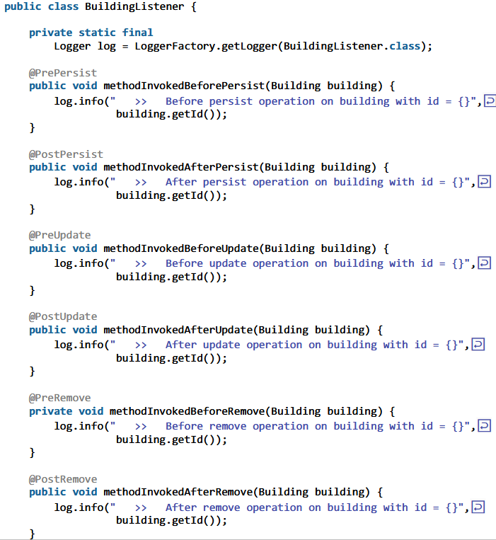

### View (Frontend)

##### CSS

- Ein Stylesheet beinhaltet ein Menge von Regel, die Formatierungsanweisungen festlegen. 
- ***Cascading Style Sheets*** (CSS) sind Sammlungen von Formatvorlagen.
- Hierdurch werden Formate (oft in eigenen Dateien) für die verwendeten HTML Elemente definiert.

##### Bootstrap
- freies Frontend CSS Framework
- definiert die grafische Darstellung einer Menge von HTML-Elementen vor.
- Responsive Design mit Cards umsetzbar

##### Template Engine Thymeleaf

- Eine Template Engine ist eine Softwarekomponenten, die Templates und Datenmodelle verwendet, um **dynamische Websites oder Dokumenten zu generieren**.
- Sie **sucht, bearbeitet und ersetzt bestimmte Befehle** in den Templates.
- Sie ermöglicht die Trennung von **Präsentation** und **Geschäftslogik**.
- Im Spring MVC Kontext wird häufig **Thymeleaf** eingesetzt.
<br>
- Um redundante HTML Elemente (z.B. seitenbergreifende Header Skript-Injektionen) auszulagern, packt man diese in extra Dateien und legt sie unter dem Pfad `src/main/resources/templates/fragments` ab.

```HTML
<!DOCTYPE html>
<html lang="de" xmlns:th="http://www.thymeleaf.org">
<head th:fragment="head">...</head>
</html>
```

- An Stelle dieser HTML Elemente wird bspw. folgender Thymeleaf-Ausdruck eingesetzt:

```HTML
<head th:insert="~{fragments/header :: head}"></head>

<div th:replace="~{fragments/body :: nav}"></div>

<footer th:insert="~{fragments/footer :: footer}"></footer>
```
<br>

- Für HTML-Elemente, die abhängig vom übergebenen Wert des Parameters angezeigt oder befüllt werden, werden Thymeleaf-Bedingungen eingesetzt:

```HTML
<button th:if="${ all != true }"/>

<input type="email" id="email" th:field="*{email}" class="form-control" th:value="${customerForm.email}" required>

<p th:if="${hasError}" class="text-danger" th:text="${error}">❌ Falsche Email</p>

<input type="hidden" th:name="${_csrf.parameterName}" th:value="${_csrf.token}" />
```

- Die Thymeleaf Engine wertet den in `${...}` gesetzten Ausdruck aus und ersetzt diesen durch den Wert der gleichnamigen Variablen im Model-Objekt.
<br>
- Mit dem Input-Typ `submit` wird das Element zum Button, der bei Drücken den Eingabetext eines (oder mehrerer) Input-Fields von Typ `text` (oder ähnliches, wie `email`) mithilfe eines HTTP Requests an den Webserver übersendet wird.

```HTML
<form th:action="@{/customer/add}" th:object="${customerForm}" method="post">

<button type="submit" class="btn btn-success w-100">Kundendaten speichern</button>

</form>
```

- Die Übertragungsmethode wird bei bspw. Formularen auf "POST" festgelegt - mittels `method="post"`
- Durch `action="@{...}"` wird bestimmt, wie der HTTP-POST Aufruf an den Server aufgebaut wird.
- Zusätzlich überträgt der Aufruf eine Payload, welche den Inhalt (Nutzerdaten) des Eingabeformulars enthält.
<br>

- Hat der Webserver die Anfrage inklusive Payload erhalten, entscheidet das DispatcherServlet die geeignete Methode in einem Controller. Er sucht also nach folgender Annotation:

```Java
@RequestMapping(value = "/customer/add", method = RequestMethod.POST)
// ODER
@PostMapping("/customer/add")
```
<br>

- Die übergebenen Parameter des HTTP Requests werden durch die Annotation `@RequestParam` ausgezeichnet.

```Java
public String addCustomer(@RequestParam String email, Model model) {
	return "redirect:customer/success";
}
```

- Als Rückgabewert wird ein `redirect`-Befehl ausgegeben, der dazu führt, dass eine Weiterleitung auf einen HTML-Aufruf stattfindet.

### Testen mit MockMvc

> [!NOTE] Kurze Info:
> Mock kann mit "vortäuschen" übersetzt werden.
> Beim Testen von Objekten stehen nicht immer die referenzierten Objekte zur Verfügung bzw. der Aufwand, diese referenzierten Objekte zu erzeugen, ist hoch. Hier kommen die Mock-Objekte (Attrappen) ins Spiel.
> Bei der Initialisierung des Mock-Objektes wird festgelegt, auf welche Methoden es mit welchen Rückgaben zu reagieren hat. Es ist deutlich einfacher aufgebaut als sein Original. Aber Achtung: Das originale Objekt kann wiederum eine Vielzahl an assoziierten Objekten haben.

- **MockMVC** ist Teil des Spring Frameworks und wird verwendet, um das Verhalten von SpringMVC Controllern zu **testen, ohne einen tatsächlichen Webserver starten** zu müssen.
- Ermöglicht das Senden von simulierten HTTP-Anfragen an die Controller und das Überprüfen der Antworten, um **korrekte Funktion** der Webanwendung in einer **isolierten Umgebung sicherzustellen**.
- Trägt zur Steigerung der Qualität und Sicherheit der Anwendung bei.
- Durch die Verwendung von MockMVC können **komplexe Szenarien simuliert** werden, wie das **Verhalten der Anwendung unter Stressbedingungen oder bei Eingabe ungültiger Daten**, indem sie benutzerdefinierte Anfragen und Sicherheitskontexte erstellen.
- **Hauptfunktion** besteht darin, die **Geschwindigkeit der Anwendungsentwicklung zu erhöhen**, indem es die Zeit für das Deployment auf Testservern eliminiert.

##### Verhaltens-Test einer Spring MVC Anfrage

- Mit der Annotation `@SpringBootTest` wird festgelegt, dass ein Test durchgeführt wird.
- Für die Ablaufumgebung ist ein `WebApplicationContext` nötig, der eine Erweiterung des ApplicationContext ist.
- Das Spring MVC Framework bietet Testunterstützung, indem es eine Testinfrastruktur mit MockMVC erstellt. Hierfür wird eine Variable `mockMvc` benötigt, in der das Mock-Objekt der Webinfrastruktur abgelegt wird. 
- Mit **MockMVC** können Entwickler das Verhalten beim Durchführen von Anfragen an die Spring MVC Controller in Spring Boot testen, indem sie **HTTP Requests simulieren und Assertions** (Annahme zu Programmzustand, die wahr sein muss) über die Antworten machen.
- **MockMVC** wird in Testklassen verwendet, um **GET, POST, PUT, DELETE und andere HTTP-Methoden nachzuahmen**, wobei sowohl der Request-Inhalt als auch die Response-Assertions detailliert spezifiziert werden können.
- Zudem werden **Beans zum Testen** bereitgestellt, das nennt man **Mocken**.
- Es ermöglicht das **Testen von Controller-Logiken** ohne den Server zu starten, indem es eine Umgebung bereitstellt, in der Requests durch das Spring MVC Dispatcher Servlet geroutet werden.

```Java
@SpringBootTest
public class HttpRequestTest {

	@Autowired
	private WebApplicationContext wac;
	private MockMvc mockMvc;

	@BeforeEach
	public void setup() {
		mockMvc = MockMvcBuilders.webAppContextSetup(wac).build();
	}
}
```

##### Test einer POST-Anfrage, die JSON Daten als Anfrageinhalt erwartet?

- Um eine POST-Anfrage mit JSON-Inhalt und erforderlicher Authentifizierung zu testen, können Anfragen per `mockMVC.perform()` durchgeführt werden. 
- Die `content()`-Methode von MockMVC wird verwendet, um den zu sendenden JSON-Inhalt als String anzugeben.
- Zusätzlich kann die `contentType(MediaType.APPLICATION_JSON)` genutzt werden, um den Content-Typ der Anfrage festzulegen.
- Parameter der POST-Anfrage werden mittels der `.param()`-Methode an die Anfrage gehängt.
- Durch `andExpect()` wird überprüft, ob die Antworten auf die jeweiligen Anfragen den erwarteten Status zurückliefern.
- Eine weitere Überprüfung behandelt die Rückgabewerte der Controller-Methoden, das heißt die Prüfung, ob die passende View aufgerufen wird.

```Java
@Test
public void newPost() throws Exception {
	mockMvc.perform( post("/add")
		.contentType( MediaType.APPLICATION_JSON_VALUE )
		.param( "from", "elisa" )
		.param( "to", "marga" )
		.param( "pcontent", "test" )
	)
	.andExpect( status().is3xxRedirection() )
	.andExpect( redirectedUrl( "posts?from=elisa&to=marga" ) );
}
```

- Die Annotation `@MockBean` stellt Mock-Objekte im ApplicationContext zur Verfügung, wobei das ursprüngliche Bean-Objekt durch das MockBean-Objekt ersetzt wird.
- **Mockito** bietet das Anlegen und Verwalten solcher Mock-Objekte an, wodurch Abhängigkeiten von Service- oder anderen Klassen einfacher bearbeitet werden können.

```Java
@MockBean private PostService postServiceMock;

@Before
public void setup() {
	mockMvc = MockMvcBuilders.webAppContextSetup(wac).build();

	when(postServiceMock.listAllPostsFromTo( "elisa", "marga" ) )
		.thenReturn( List.of( new Post(), new Post() ) );
}

```

## Abhängigkeiten

### Anwendungsserver

Verwaltet Ressourcen, Middleware-Dienste und ermöglicht die Ausführung von Geschäftslogik.

### Inversion of Control

- Hollywood-Prinzip: "*Don't call us, we call you*"
- Der IoC Container wird im Spring Framework realisiert durch die beiden Klassen `BeanFactory` (einfachere Implementierung) und `ApplicationContext` (mehr Komfort).
- BeanFactory: 
	- einfachere Implementierung
	- Initialisierung so spät wie möglich nach explizitem Methodenaufruf 
<br>

<br>
- Objektbindungen und Objektabhängigkeiten erfolgen durch eine dritte Instanz (Framework oder Laufzeitsystem).
- Konkret kann dies durch Dependency Injection (Injizieren von Abhängigkeiten), Reflection (inspizieren und ändern von Laufzeit-Objekten) oder Dependency Lookup realisiert werden.
- **DI bindet Abhängigkeiten durch Abstraktion (in Spring durch Interfaces)**.
- Der **IoC Container liest die Konfiguration** und löst Abhängigkeiten auf, um **Beans zu instanziieren, zu konfigurieren** und zusammenzubauen, was zu folgenden **Vorteilen** führt:
	- losen Kopplung der Komponenten
	- einfache Konfiguration der Instanzen, wie z.B. Singleton, pro Thread oder Factory
	- bessere Testbarkeit
	- bessere Code-Lesbarkeit

| Arbeitsweise                                       | Beschreibung                                                                                                                                                                                                                                                                                                                                                                                                                                                                                                                                                                                                                                                                                                                                                                         |
| -------------------------------------------------- | ------------------------------------------------------------------------------------------------------------------------------------------------------------------------------------------------------------------------------------------------------------------------------------------------------------------------------------------------------------------------------------------------------------------------------------------------------------------------------------------------------------------------------------------------------------------------------------------------------------------------------------------------------------------------------------------------------------------------------------------------------------------------------------ |
| Verwaltung der Objekterstellung und -konfiguration | - **Inversion of Control (IoC)** ist ein Designprinzip, bei dem die **Kontrolle** über den Fluss einer Anwendung umgekehrt wird.<br><br>- Das bedeutet, sie wird von den traditionellen Komponenten (wie Funktionen und Klassen) **auf externe Rahmenwerke oder Container übertragen**.<br><br>- Der IoC Container ist verantwortlich für die **Instanziierung, Konfiguration und das Zusammenbauen von Beans**.<br><br>- Er liest die Konfiguration, sei es durch XML, Annotationen (`@Autowired`) oder Java-Konfiguration, und nutzt diese Informationen, um die Abhängigkeiten zwischen den Beans zu lösen und sie bei Bedarf zu injizieren.<br><br>Der IoC Container managed den gesamten Lebenszyklus der Beans und wird durch Spring Interface `ApplicationContext` umgesetzt. |
| Kernfunktion des IoC Containers                    | - **Dependency Injection (DI)** eine Technik zur Implementierung von IoC.<br><br>- Er ermöglicht die Erstellung und das Lebenszyklusmanagement, indem er **Abhängigkeiten von Klassen** basierend auf der Konfiguration **extern injiziert** statt sie innerhalb der Klassen selbst zu instanziieren.                                                                                                                                                                                                                                                                                                                                                                                                                                                                                |
| Ergebnis der IoC Containerarbeit                   | - DI fördert lose Kopplung und erleichtert die Wartung und das Testen von Software.                                                                                                                                                                                                                                                                                                                                                                                                                                                                                                                                                                                                                                                                                                  |

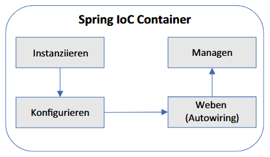

- Soll der IoC Container eine Injektion vornehmen und weiß nicht, welche Implementierung (mehrere Klassen von einem Interface abgeleitet) er verwenden soll, wird die Annotation `@Qualifier("...")` an beide betroffenen Klassen gehängt.

##### ApplicationContext

- In Spring bezeichnet der ApplicationContext eine zentrale Schnittstelle für die Konfiguration und das Management von Spring-bezogenen Objekten.
- Der Kontext in Spring ist ein fortgeschrittener Container, der für das **Instanziieren, Konfigurieren und Assemblieren der Anwendungsobjekte** sowie für die **Verwaltung ihrer Abhängigkeiten (DI) und Lebenszyklen** verantwortlich ist.
- Der Kontext verwendet **Dependency Injection (DI)**, um die Abhängigkeiten zwischen den Objekten zu verwalten und **unterstützt verschiedene Arten von Scopes für Beans**. Außerdem **erleichtert er den Zugriff auf Konfigurationsdaten und Ressourcen**.
- ApplicationContext wird frühzeitig (eager) zusammengestellt
- Bean-Objekt stehen direkt nach Erzeugung und Initialisierung zur Verfügung
<br>
- Interface, von dem vier Realisierungen vorliegen:
	- ==Bei Verwendung der Klasse `AnnotationConfigApplicationContext` werden annotierte Komponenten als Bean registriert.==
	- Durch `ClassPathXmlApplicationContext` werden die Komponenten in einer XML-Datei als Bean definier, wobei sich die XML im ClassPath befinden muss.
	- Mit Hilfe der Klasse `FileSystemXmlApplicationContext` kann die Bean konfigurierende Datei im Dateisystem oder per URL erreichbar sein.

##### WebApplicationContext

- Erbt vom ApplicationContext
- Verwaltet die web-spezifischen Beans wie Controller und View-Resolver Beans
- Das DispatcherServlet verwendet den WebApplicationContext

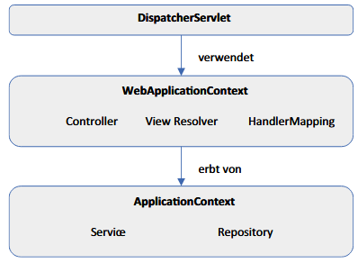

##### Vorteile der Unterscheidung beider Kontexte

- Klare Trennung zwischen den Aufgabenbereichen Backend, Geschäftslogik und Präsentation
- Für verschiedene DispatcherServlets können verschiedene WebApplicationContexts erzeugt werden, wodurch Trennung im Webbereich unterstützt wird

### Dependency Injection

- Die Möglichkeit, Abhängigkeiten zur Laufzeit festzulegen.
- Die Abhängigkeit soll nicht über ein festes "new" einprogrammiert sein.

| Art                  | Beispiel                             | Vorteile                                                                                                                                                                                                                                           | Nachteile                                                                                                                                                                                                                                                                                                                     |
| -------------------- | ------------------------------------ | -------------------------------------------------------------------------------------------------------------------------------------------------------------------------------------------------------------------------------------------------- | ----------------------------------------------------------------------------------------------------------------------------------------------------------------------------------------------------------------------------------------------------------------------------------------------------------------------------- |
| Setter Injection     | 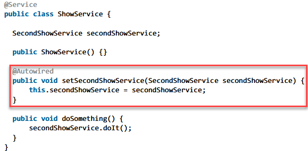      | + Einfügen von Abhängigkeiten über Setter-Methoden nach der Bean-Erstellung nützlich für **optionale Abhängigkeiten**<br>+ Flexibilität                                                                                                            | - Birgt das Risiko, dass Beans teilweise ohne notwendige Konfigurationen genutzt werden, wenn Set-Methode nicht ausgeführt wird. → NullPointerInjection<br>- weniger sicher                                                                                                                                                   |
| Constructor Injection | 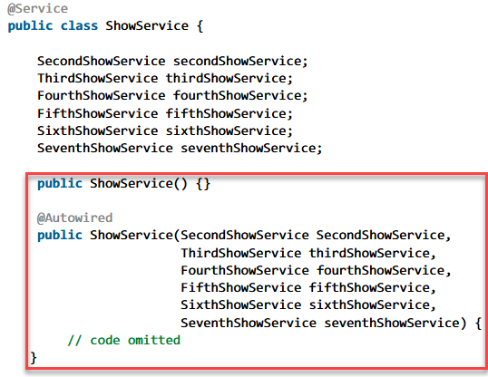 | + Erzwingt Vollständigkeit der Abhängigkeiten bei Instanziierung<br>Indizien für nötiges Refactoring sind erkennbar.<br>+ Fördert Unveränderlichkeit<br>+ Erleichtert das Testen<br>+ Sicherer Code, um gewisse NullPointerExceptions zu vermeiden | - Kann bei einer großen Anzahl von Abhängigkeiten unübersichtlich werden<br>Wird bei dieser Klasse noch hohe Kohäsion eingehalten oder wird Refactoring nötig?<br>- Enthält nun BoilerplateCode, den es zu vermeiden gilt.<br>- Bei fehlender Angabe des Parameters tritt bei Konstruktoraufruf bereits ein Build-Fehler ein. |
| Field Injection      | 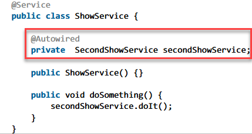       | + Bekannt für **Einfachheit**, da sie direkte Injections ohne Setter und Constructor erlaubt.<br>+ Weniger und verständlicherer Code                                                                                                               | - Führt zu einer **schwierigen Testbarkeit** und potentiellen Missachtung des SOLID-Prinzips                                                                                                                                                                                                                                  |

### Scopes

- Um den Regelfall auszuschalten, setzt man sogenannte Scopes ein.
- ==Scopes sind Bindungsbereiche, in denen Beans zur Verfügung stehen.==

| Scope     | Beschreibung                                                                                                                                                                                                                                                                                                                                                                                                                                                                                                                                          | Einsatzgebiet           |
| --------- | ----------------------------------------------------------------------------------------------------------------------------------------------------------------------------------------------------------------------------------------------------------------------------------------------------------------------------------------------------------------------------------------------------------------------------------------------------------------------------------------------------------------------------------------------------- | ----------------------- |
| Singleton | Standard-Scope, bei dem **pro Spring-Container** genau eine Bean-Instanz existiert.<br>Das Bean-Objekt darf keinen eigenen Zustand (Attribute) haben.<br>Wenn doch, dann können die Werte mit hoher Wahrscheinlichkeit nach erneutem Aufruf einer Bean-Methode falsch sein.                                                                                                                                                                                                                                                                           | Zustandslose Services   |
| Prototype | Erzeugt bei jedem **Aufruf von getBean()** oder jeder **Injection einer solchen Prototype-Bean** eine neue Bean-Instanz.<br>Ermöglicht das Speichern von Zuständen, daher der Name "zustandsbehafteter Scope".                                                                                                                                                                                                                                                                                                                                        | Zustandsbehaftete Beans |
| Request   | Erzeugt für **jede HTTP-Anfrage** eine neue Bean-Instanz.<br>Baut eigenen WebApplicationContext für den Zeitraum eines HTTP Requests auf.<br>Nach Erhalt der Antwort, wird der WebApplicationContext und alle enthaltenen Beans wieder gelöscht.                                                                                                                                                                                                                                                                                                      | Webbasierte Anwendungen |
| Session   | Erzeugt für **jede HTTP-Session** eine neue Bean-Instanz.<br>Die nun aktuelle Scope-Annotation setzt sich zusammen aus der Festlegung des Session Scope (`WebApplicationContext.SCOPE_SESSION`) und einem Attribut proxyMode mit dem Wert `ScopedProxyMode.TARGET_CLASS`.<br>Dieser letzte Wert muss gesetzt werden, da beim Anlegen des WebApplicationContext noch keine Bean-Anfrage vorliegen kann.<br>Der Context entsteht direkt beim Starten der Anwendung.<br>Also instanziiert Spring hier ein Stellvertreter-Objekt für die spätere Instanz. | Webbasierte Anwendungen |

- Die Spring-Philosophie unterstützt die Verwendung von Service-Objekten, die keine Zustände haben und damit zustandslos sind.
- Spring selbst verwaltet Beans und Beans sind Services (Dienste für irgendetwas).
- Zustandslose Services haben die Eigenschaft, threadsicher (thread safe) zu sein.
- Damit können sie hervorragend skalieren und viele gleichzeitige Service-Anfragen bewältigen, sofern eine geeignete Infrastruktur zur Verfügung steht.
- Der große Vorteil von zustandslosen Services ist die sehr gute Performance bedingt durch gut Skalierung und Caching.


> [!NOTE] **Merke:**
> ***Thread safe*** bedeutet, dass ein Service gleichzeitig von mehreren Services (oder Komponenten) verwendet werden kann, ohne dass die Abläufe sich gegenseitig behindern.
> ***Skalieren*** bedeutet, dass die Anwendung bei mehr Ressourcen bessere Performance aufweist und mehr gleichzeitige Anfragen bearbeiten kann.
> ***Caching*** bedeutet, dass Objekte in lokalen schnellen Speichermedien zwischengespeichert werden, um damit die Ausführungsgeschwindigkeit deutlich zu erhöhen.

## Validierung und Sicherheit
### SpringSecurity

- Spring Security wird zur **Implementierung von Sicherheitsfeatures** genutzt, welche einen umfassenden Rahmen für Sicherheit von Webanwendungen bieten.
- Konfiguration:
	- **Sicherheitskonfigurations-Klasse erstellen** 
	- **Authentifizierung konfigurieren**:
		- In Methoden (z.B. `authenticationManager()`) können Benutzer und ihre Rollen definiert werden.
		- Hier kann festgelegt werden, wie die Anmeldedaten überprüft werden sollen (z.B. In-Memory, Datenbank).
		- Ermöglicht Nutzeranmeldung über Login-Formulare oder OAuth2 mit Diensten wie Google oder Facebook.
	- **Autorisierung konfigurieren**:
		- In Methoden (z.B. `filterChain()`) kann festgelegt werden, welche URLs gesichert werden sollen und welche Rollen für den Zugriff auf diese URLs erforderlich sind.
		- Regelt den Zugriff mit Anntationen wie `@PreAuthorize` und URL-basierten Regeln.
- **Erweiterungen** umfassen benutzerdefinierte Benutzerdienste und Authentifizierungslogiken.
- **Angriffsschutz** beinhaltet Maßnahmen wie CSRF- und CORS-Konfigurationen.
- **Sicherheitsprotokolle** wie HTTPS schützen die Datenübertragung

### Grundlegende Begriffe

> [!NOTE] **Merke**:
> ***User*** ist der Anwender der Anwendung, beide Begriffe werden in diesem Kapitel synonym verwendet.
> ***Authority oder GrantedAuthority*** sind Berechtigungen eines Users, die durch Rollen festgelegt werden können, welche in der Authority gespeichert werden.
> ***Credentials*** speichert den Namen des Users und das Passwort oder ein Token ab. (Anmeldeinformationen)
> ***Principal*** enthält den Namen des aktuell eingeloggten Users.
> ***Authentication*** speichert eine Liste mit GrantedAuthority, möglichen Credentials (Passwort), Principal (Passwort und evtl. zusätzlichen Informationen wie UserID, User E Mail und Rolle). Es kombiniert alle diese Informationen für den Authentifizierungsprozess.
> ***SecurityContext*** enthält und verwaltet das Authentication Objekt.
> ***SecurityContextHolder*** enthält den SecurityContext für einen User und ist an den aktuellen Thread sowie den Request und seiner Session gebunden. Mit `SecurityContextHolder.getContext()` erhält man den SecurityContext als ThreadLocal Variable. Da jeder HTTP Request an einen einzelnen Thread gebunden ist, können wir somit auf den Kontext des aktuellen Requests zugreifen.

##### SecurityContext

- zentraler Bestandteil von Spring Security, der das **Authentication-Objekt enthält und verwaltet**.
- **Authentication-Objekt** repräsentiert den aktuell interagierenden Benutzer und **enthält Details wie Benutzername, Rolle und Berechtigung**.
- SecurityContext wird **während der gesamten Lebensdauer einer Anfrage aufrechterhalten** und ermöglicht es Spring Security, **Autorisierungsentscheidungen basierend auf** den im **Authentication-Objekt** enthaltenen Details zu treffen.

##### SecurityContextHolder

- **Hilfsklasse**, die den SecurityContext für den aktuellen Benutzer enthält. Er ist **an aktuellen Thread und Request sowie seine Session gebunden**.
- Verwendung eines **ThreadLocal-Objekts zur Speicherung des SecurityContexts**. Das bedeutet, dass der **SecurityContext für jeden HTTP-Request in einem separatem Thread gespeichert** wird.
- Mit der Methode `SecurityContextHolder.getContext()` können wir auf den SecurityContext des aktuellen Requests zugreifen. Dies ermöglicht es, auf die **Authentifizierungsdetails des aktuellen Benutzers zuzugreifen**, wo immer wir sie benötigen.

### Sicherheitsfilter

- **Sicherheitsfilter** prüfen und steuern den **Zugriff auf Ressourcen und Dienste** basierend auf **Authentifizierung und Autorisierungsdaten**.
- Werden in einer Filterkette eingesetzt, um verschiedene Sicherheitsanforderungen wie Authentifizierung und Autorisierung zu bearbeiten.
- **Sicherheitsfilterkette**: Reihe von Filtern, die in einer spezifischen Reihenfolge abgearbeitet werden, um verschiedene Sicherheitsaufgaben bei der Bearbeitung einer eingehenden HTTP-Anfrage zu erfüllen.
-  Sofern es bei einem Filter zum Abbruch kommt, wird die ganze Filterkette beendet.

1. **DisableEncodeUrlFilter**
	- Mit diesem Filter wird erreicht, dass die Anwendung keine Session IDs in URLs einbettet.
2. **WebAsynManagerIntegrationFilter**
	- Der Filter verbindet SecurityContext und WebAsyncManager, der asynchrone Requests (für AJAX Requests) verwaltet.
3. **SecurityContextHolderFilter**
	- Dieser Filter der Filterkette hat die Aufgabe, den SecurityContext eines bereits authentifizierten Users aus dem internen Repository SecurityContextRepository zu laden. Damit steht ein geeignetes Authentication Objekt zur Verfügung. Der SecurityContext wird im SecurityContextHolder gespeichert. Wenn der User sich noch nicht authentifiziert hat, wird durch einen späteren Filter ein geeigneter SecurityContext erstellt. Nach Beendigung eines HTTP Requests wird der SecurityContextHolder bereinigt und der SecurityContext in das Repository gespeichert
4. **HeaderWriterFilter**
	- Die Header Daten der HTTP Response können ergänzt werden. Dies kann sinnvoll sein, um den Schutz im Browser zu verbessern, wie zum Beispiel durch Verwendung von X Frame Options oder X XSS Protection. Dies beinhaltet einen Schutz, um zu verhindern, dass die eigene Webseite oder Teile davon in anderen Webseiten eingebettet werden. Normalerweise ist dieser Filter aktiviert
5. **CorsFilter**
	- Dieser Filter ist standardmäßig aktiviert und behandelt Cross Origin Resource Sharing (CORS) Anfragen.
6. **CsrfFilter**
	- Dieser Filter ist standardmäßig aktiviert. Die HTTP Requests wie POST, PUT oder DELETE müssen mit einem gültigen CSRF Token übertragen werden. Das CSRF Token wird in einem Cookie gespeichert und jedes HTML Formular mit einem versteckten Feld (hidden field) versehen. Dadurch können Cross Site Request Forgery Attacken verhindert werden. 
7. **LogoutFilter**
	- Der User loggt sich aus und damit wird auch der Principal ausgeloggt. Es können mehrere LogoutHandler ausgeführt werden. Der SecurityContextLogoutHandler macht die Servlet Session und die HTTP Session ungültig und bereinigt den SecurityContext. Nach dem Logout wird auf die konfigurierte logoutSuccessUrl weitergeleitet.
8. **UsernamePasswordAuthenticationFilter**
	- Durch den Filter wird der Authentifizierungsprozess angestoßen.
9. **RequestCacheAwareFilter**
	- Der Filter überprüft im Cache, ob ein HTTP Request schon erfolgt ist, und sendet im positiven Fall die Anforderung an die URL des bereits erfolgten HTTP Requests.
10. **SecurityContextHolderAwareRequestFilter**
	- Mit diesem Filter können die Standardsicherheitsmethoden der Servlet API verwendet werden.
11. **RememberMeAuthenticationFilter**
	- Hat der User die RememberMe Funktion eingeschaltet, wird der HTTP Request ein RememberMe Cookie beinhalten. Dadurch muss sich der User nicht jedes Mal wieder neu anmelden, auch wenn er seinen Browser zwischen zeitlich geschlossen hat. Das Cookie besteht aus einem Hashwert der Kombination aus Username und Passwort. Der Filter berechnet aus den Login Anmeldedaten einen Hashwert und vergleicht ihn mit dem Cookie Hashwert. Wenn beide identisch sind, dann wird der User eingeloggt.
12. **AnonymousAuthenticationFilter**
	- Falls kein Authentication Objekt im SecurityContextHolder durch die vorherigen Filter angelegt wurde, dann wird ein Authentication Objekt für den User Anonymous an und abgelegt.
13. **ExceptionTranslationFilter**
	- Der Filter verbindet Security Exceptions mit HTTP Error Meldungen.
14. **AuthorizationFilter**
	- Der Filter sorgt für die Sicherheit der HTTP Ressourcen. Für jeden HTTP Request wird geprüft, ob der User die dazu notwendigen Rechte besitzt.

### Sicherheitskomponenten

- Allgemeines Hauptziel: **Sicherheit und Integrität** der Anwendung
- **Authentifizierung** stellt sicher, dass Nutzer die sind, für die sie sich ausgeben, indem sie deren **Identitäten** überprüft.
- **Validierung** schützt vor **ungültigen oder bösartigen Eingaben**, die zu Sicherheitslücken führen können.
- **Session-Management** erhält Nutzeridentitäten über verschiedene Anfragen hinweg aufrecht, um **unautorisierte Zugriffe** zu vermeiden.
- **Authentifizierungsverfahren**, wie OAuth
- **MockMVC** trägt zur Steigerung der Qualität und Sicherheit der Anwendung bei.

### Data Transfer Object (DTO)

- Entwurfsmuster
- Effiziente Möglichkeit, **Daten zwischen Schichten zu übertragen**, indem mehrere Daten in einem Objekt gekapselt werden, um diese über ein Netzwerk durch das gekapselte Objekt zu transportieren. → **Reduziert Kopplung**
- Ermöglicht **bessere Abstraktion und Trennung von Anliegen**, indem die spezifische Datenstrukturen für verschiedene Operationen definieren. → **Erhöht Flexibilität** durch Datenabstraktion
- Kann **Netzwerklast minimieren**, da nur die notwendigen Daten übertragen werden. **In einem Aufruf werden verteilte Informationen gesammelt übertragen**.
- Unterstützen die Sicherheit, indem sie verhindern, dass sensible Informationen der Domain-Modelle nach außen gelangen.
- Umsetzung mit Java Records
	- reduziert Boilerplate Code
	- immutable
	- Getter, Konstruktor und die Methoden `equals()`, `hashCode()` und `toString()` werden automatisch generiert
	<br>
	```Java
	public record UserDTO(String username, String email) {}
	```

### Session-Management

- Entscheidend für die Sicherheit in Webanwendungen, weil es **Benutzeridentitäten über verschiedene Anfrage hinweg aufrechterhält, ohne Anmeldeinformationen wiederholt senden** zu müssen.
- Verhindert unbefugten Zugriff durch **sichere Session-IDs** und unterstützt **Sicherheitsmaßnahmen wie Session-Zeitlimits**.
- **Verwendung von Sessions oder Cookies**, um den Zustand einer Nutzerinteraktion über mehrere Anfragen hinweg zu speichern.
- Nach erfolgreichem Login wird eine **eindeutige Session-ID** erzeugt und dem Nutzer zugewiesen.
- ID wird für die Dauer der Sitzung verwendet, um **Nutzeranfragen zu authentifizieren** und sicherzustellen, dass Zugriff auf Websites und Ressourcen nur dem authentifizierten Nutzer gewährt wird.

### Authentisierung

- ==Vorzeigen eines möglichen Nachweises einer Nutzer-Identität.==
- Beispiel: Login mit Benutzername und Passwort

##### Verfahren

1. 2FA
	- **höchste Sicherheit**
	- Erfordert Kombination aus etwas, das der Nutzer weiß, und etwas, das der Nutzer besitzt
	- Erreicht hierdurch ein höheres Maß an Identitätsprüfung
2. Biometrisches Verfahren
	- Bestätigt Identität des Nutzers durch einzigartige körperliche Merkmale → schwer zu fälschen
3. Passwortauthentifizierung
	- geringeres Sicherheitsniveau, leichter zu kompromittieren
	- Nutzer muss Passwort eingeben und unter Umständen persönliche Sicherheitsfragen beantworten

### Authentifizierung

- ==Überprüfung (Verifikation) der Identität durch den Server.==
- Beispiel: Abgleich der eingegebenen Logindaten mit den in der Datenbank gespeicherten Informationen
- `CurrentUser` ist nur während der Web-Session (Bean mit Session Scope) gültig. Er dient der Nutzerverwaltung sowie Authentifizierung.
	- Bei erfolgreicher Login Prüfung wird ein `CurrentUser` angelegt mithilfe der `CurrentUerControllerAdvice`-Klasse, die mit `@ContollerAdvice` annotiert ist.
	- Jener wird benötigt, um für jede Website den eingeloggten Nutzer zu kennen.
	- Mit `model.addAttribute()` werden die für die Website notwendigen Informationen übergeben, dabei wird der Aspekt-Mechanismus verwendet.
	- Die in der `CurrentUerControllerAdvice`-Klasse mit `@ModelAttribute` annotierte Methode wird für jeden Methodenaufruf eines Controller-Objektes ausgeführt und legt das Ergebnis im jeweiligen Model-Objekt ab.
- `UserCreateForm` ist ein klassisches DTO Objekt, das der Übertragung eingegebener Formular-Daten dient und nach Übertragug wieder gelöscht wird.

 ##### AuthenticationManager
- **Anmeldeinformationen** werden an einen **AuthenticationManager** gesendet, der sie **an einen oder mehrere AuthenticationProvider** weiterleitet.

1. Authentifizierung beginnt mit `UsernamePasswordAuthenticationFilter.attemptAuthentication`, erstellt **UsernamePasswordAuthenticationToken aus Benutzername und Passwort**.
2. ProviderManager verwaltet **AuthenticationProvider zur Überprüfung der Anmeldedaten**. Nutzt DaoAuthenticationProvider.
3. **Authenticate-Methode wird von DaoAuthenticationProvider ausgeführt**.
4. **Cache-Check**, wenn der Benutzer im Cache ist, werden die **UserDetails zurückgegeben**.
5. **Datenbank-Check**, wenn der Benutzer nicht im Cache ist, wird das **Benutzerobjekt aus der Datenbank** mittels `UserDetailsService` und seiner Methode `loadUserByUsername` geladen.
6. **Überprüfungen kontrolliert den Benutzerstatus und vergleicht Passwort-Hashwerte**. Bei Erfolg werden die **Credentials im Authentication-Objekt, SecurityContextHolder und UserChache gespeichert**. Ein UsernamePasswordAuthenticationToken wird erstellt.
	- Durch den Aufruf von `passwordEncoder()` wird mittels einer Spring eigenen PasswordEncoderFactories eine Bean generiert, die standardmäßig als Passwort Verschlüsselung das **BCrypt Verfahren** verwendet, eine **Hashfunktion für das Speichern von Passwörtern**. 
	- Dabei wird **aus dem Passwort und einem Salt** für das Passwort der **Hashwert berechnet**. Salt ist eine zufällige Zeichenfolge, die vom Verfahren generiert wird.

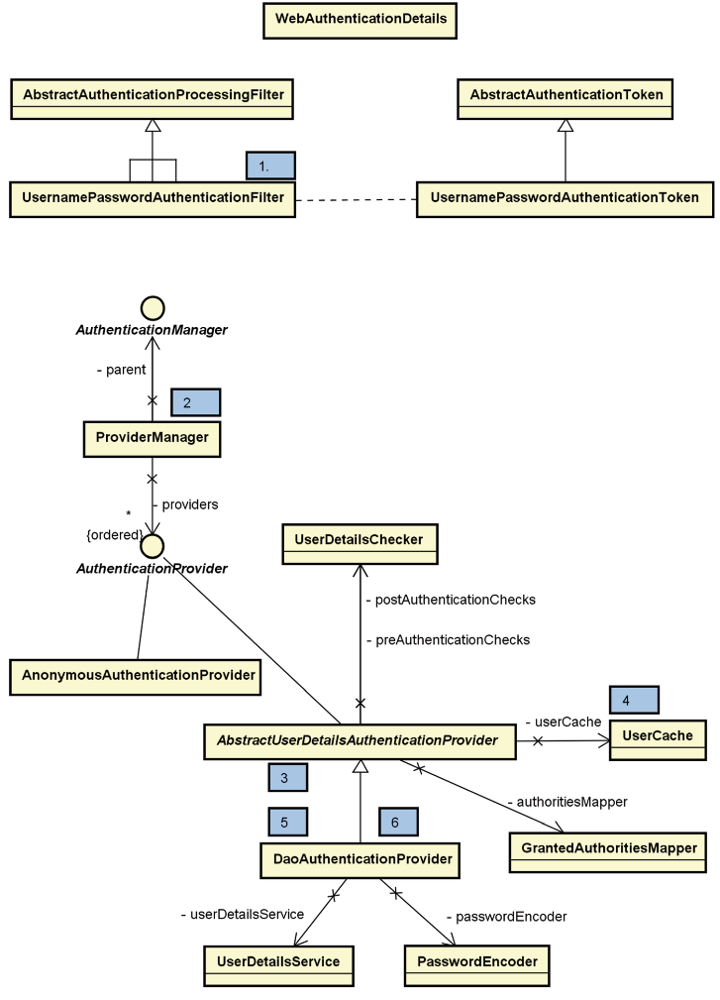

##### URL-basierte Authentifizierung

- Im Projekt haben wir auf **URL-basierte Authentifizierung** gesetzt. 
- Realisierung über eine **Zuordnung von URL-Pfaden zu bestimmten Authentifizierungsmethoden**.

**Konfiguration:**
- Mit `authorizeHttpRequests()` wird die Authentifizierung von HTTP Requests für noch zu spezifizierende Webseiten (oder URIs) eingeschaltet
- **URL-Muster**:
	- Mit `.requestMatchers()`wird Zugriffskontrolle auf bestimmte URL-Pfade festgelegt, die bestimmte Sicherheitskonfigurationen erfordern.
	- Mit `preAuthorize()` werden feingranulare Zugriffsregeln auf **Methodenebene** definiert

	```Java
	@PreAuthorize("#id == principal.id or hasAuthority('ADMIN')")
	```

- **Zugriffssteuerung**: 
	- Festlegen, welche Rollen oder Berechtigungen für den Zugriff auf bestimmte URLs erforderlich sind.
	- Mit `.hasRole('ADMIN')` oder `.hasAuthority("ROLE_ADMIN")` kann der Zugriff auf bestimmte URLs auf Benutzer mit der Rolle 'ADMIN' beschränkt werden.
- **Permit All**:
	- Mit `.permitAll()` kann der Zugriff auf bestimmte URLs für alle Benutzer erlaubt werden, unabhängig von ihren Rollen und Berechtigungen. 
- **Authenticated**:
	- Mit `.authenicated()` kann der Zugriff auf bestimmte URLs auf authentifizierte Benutzer beschränkt werden.
- **Formulare**:
	- Mit `formLogin()` wird die formularbasierte Authentifizierung eingeschaltet.
	- Mit `loginPage("/login")` wird gekennzeichnet, dass das Login Formular in der login.html Seite enthalten ist.
	- Mit `defaultSuccessUrl("/first", true)` wird nach erfolgreichem Login die first.html Seite aufgerufen.
	- Mit `failureUrl("/login?error")` wird bei fehlerhaftem Login die angegebene Seite aufgerufen.
	- Mit `usernameParameter("email")` wird das Feld im Formular der login.html als Eingabefeld für den Usernamen festgelegt.
	- Mit `invalidateHttpSession(true)` wird die HTTP Sitzung gelöscht. Dies ist die Standardeinstellung und müsste daher nicht erfolgen.
	- Mit `deleteCookies("JSESSIONID")` wird das Cookie mit Namen „JSESSIONID“ aus dem Browser Cache gelöscht.
	- Mit `rememberMe()` kann ein Nutzer über mehrere HTTP Sessions hinweg eingeloggt bleiben. Dieser Mechanismus wird durch die Verwendung eines Cookies realisiert. Damit ist in einem gewissen Zeitrahmen, den man definieren kann, ein erneutes Einloggen nicht notwendig.

> [!NOTE] **Remember-Me-Authentifizierung**:
> Ermöglicht es Benutzern, sich **automatisch anzumelden**, ohne ihre Anmeldedaten erneut einzugeben.
> Kann die Sicherheit einer Anwendung verbessern, indem sie die Häufigkeit reduziert, mit der Benutzer ihre Anmeldedaten eingeben müssen.

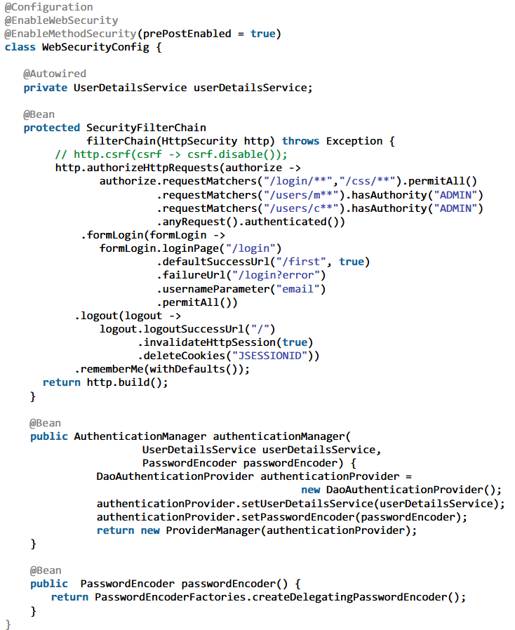

### Autorisierung

> [!NOTE] **Grundprinzipien IT-Sicherheitsstrategie**:
>  ***Vertraulichkeit*** bedeutet, dass die Daten und Informationen ausschließlich von Personen verwendet werden, die dazu berechtigt sind.
>  ***Integrität*** bedeutet, dass die Informationen nicht unerlaubt verändert worden sind.

> [!NOTE] **Merke**:
> ***Nutzer*** ist ein „realer“, registrierter Nutzer der Anwendung.
> ***Gruppe*** ist eine (oft organisatorische) Zusammenfassung von Nutzern. Häufig werden sie durch die Unternehmensstruktur (Abteilungen) gebildet.
> ***Rolle*** beschreibt in der Regel die Tätigkeit oder Aufgabe eines Nutzers (in der Abteilung).
> ***Rechte*** beschreiben Berechtigungen, um in der Anwendung bestimmte Dinge durchführen zu dürfen. Häufig verwendete Rechte sind Lesen oder Schreiben einer Ressource.

- Erlaubnis (auf Basis der vorherigen Authentifizierung), auf eine Ressource zugreifen zu dürfen.
- Implementierung der Autorisierung auf Methodenebene:
	- Durch `@PreAuthorize` für spezifische Zugriffskontrollen
	- Durch Nutzung von Spring Security's Ausdruckssprache (SpEL) in Annotationen zur Feinsteuerung der Zugriffsbedingungen.

### Validierung

- **Überprüfung** der Nutzereingaben **auf Gültigkeit, Format und Größe**
- Schutz gegen **Sicherheitslücken wie SQL-Injection, Cross-Site-Scripting (XSS) und andere Art von Injection Angriffen**
- Verhindern, dass Angreifer schädlichen Code einschleusen oder unautorisierten Zugriff auf Datenbanken und andere Ressourcen erhalten.
- Gewährleistung der Datenintegrität 
- Angemessene Verarbeitung und Nutzererfahrung sichern

##### @Valid

- Mit `@Valid` werden Attribute der Parameter-Klasse (z.B. `UserCreateForm`) validiert.
- Das Attribut email wird mit `@NotEmpty` annotiert, also führt eine leere Eingabe zu einem Fehler.
- Mit `@ModelAttribute` wird ein Attribute unter dem jeweiligen Namen (z.B. `myform`) erzeugt, das bedeutet, dass in der zugehörigen HTML Datei ein Thymeleaf-Objekt mit diesem Namen existiert und in der Controller Methode unter dem zugewiesenen Namen verwendet wird.
- Der Parameter `BindingResult` ist eine Erweiterung des Error Interfaces, in dem Validierungsfehlermeldungen abgelegt und weiterverarbeitet werden können.

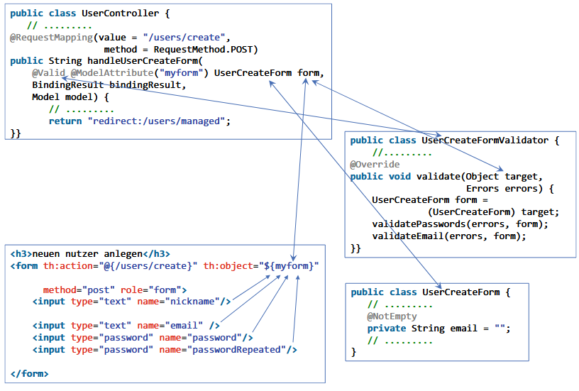

##### Validator

- Die Klasse `UserCreateFormValidator` implementiert das Interface `Validator`.
- `@Override` + `supports()` legt fest, welche Klassen ein Validator definiert wird.
- `validate()` hat den Parameter `target`, durch den die zu validierenden Eingaben des Webformulars übergeben werden. Der Parameter `errors` speichert die Validierungsergebnisse.
- Innerhalb der Methode wird zunächst das target Objekt zu `UserCreateForm` gecastet und dann die Validierung des Passwortes und der E Mail angestoßen.
- Damit eine Bindung von Webformular und Validator stattfindet, wird im Controller die Methode `initBinder` definiert, die durch die Annotation `@InitBinder` mit dem Zusatz einer Webformular-Komponente (z.B. myform) gekennzeichnet ist, die in der HTML Datei mit `th:object="${myform}"` im form-Element angegeben wird.

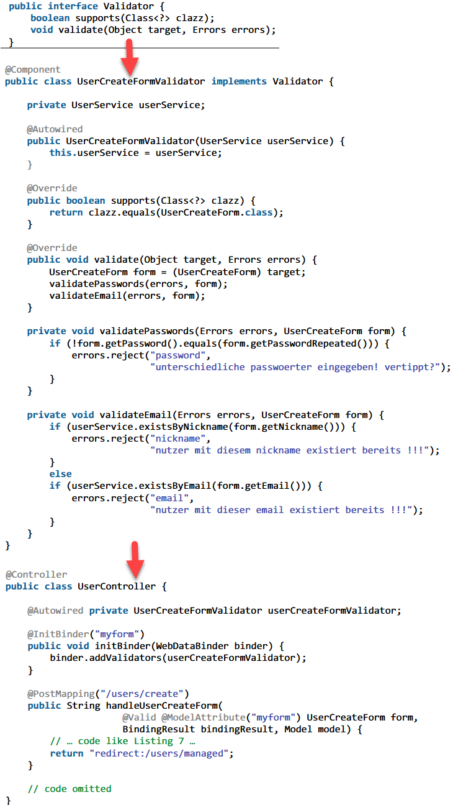

##### Methoden

- **clientseitige Validierung** mit JavaScript für sofortiges Feedback
- **serverseitige Validierung** zur Sicherstellung der Datenintegrität und Schutz vor bösartigen Eingaben
- **Framework-spezifische Validierungsmöglichkeiten und Annotationen**, die die Einhaltung der Geschäftsregeln sicherstellen.

### Testen

- Bean pro HTTP Session existiert.
- Wenn mehrere Nutzer die Anwendung verwenden, wird nach erfolgreichem Login für jeden Nutzer eine eigene `CurrentUser`-Bean angelegt.
- Beim Testen muss also eine **Session eröffnet** werden, **die eine CurrentUser Bean beheimatet**. 
- Dazu ergänzen wir das Test Programm um ein **Session Objekt mocksession der Klasse MockHttpSession**, das injiziert wird. 
- In der `@BeforeEach` Methode wird das `CurrentUser` Objekt mit Testdaten initialisiert. 
- In den den Testmethoden wird der jeweilige HTTP Request in dem injizierten Session Objekt ausgeführt, wodurch die `CurrentUser` Daten zur Verfügung stehen und in den Controllern auch verwendet werden.

### Cross-Site Request Forgery (CSRF)

- Nutzt bestehende Session des Nutzer aus, um Angriffe durchzuführen
- Angriffstyp, bei dem ein böswilliger **Akteur den Authentifizierungsstatus eines Opfers ausnutzt**, um ohne dessen Wissen **schädliche Aktionen auf einer Website** oder Anwendung durchzuführen.
- Dies erfolgt durch das **Klicken manipulierter Links** oder das **Einreichen präparierter Formularen**.
- Da Browser authentifizierende Cookies automatisch versenden, kann der Angreifer unbefugte Aktionen im Namen des Nutzers ausführen.
- Spring Security schützt davor durch:
	1. Verwendung von **CSRF Tokens**, die bei jeder Formulareinreichung oder API-Anfrage überprüft werden.
	2. Aktivierung des **CSRF-Schutzes** ist standardmäßig in Spring Security, was unautorisierte Anfragen blockiert.

### Cross-Origin Resource Sharing (CORS)

- Kontrolliert Zugriff über verschiedene Domains, um Angriffe durchzuführen
- CORS-Angriffe treten auf, wenn eine zu laxe CORS-Policy **unautorisierten Websites erlaubt, sensible Ressourcen anzufordern**.
- Ein Angreifer könnte eine bösartige Seite erstellen, die Ressourcen der Anwendung anfordert, was zu **Datenlecks oder Missbrauch** führen kann.
- Spring Security schützt davor durch:
	1. Nur **vertrauenswürdige/autorisierte Quellen** werden zugelassen, um auf Ressourcen zuzugreifen. → CORS-Policies auf Server konfigurieren
	2. **Bestimmte HTTPS-Methoden** für Cross-Origin-Anfrage werden erlaubt, um potentiell gefährliche Aktionen zu begrenzen.
	3. **CORS-Header** wie Access-Control-Allow-Origin werden genutzt, um zu steuern, welche Ursprünge Zugriff haben.
	4. **Anmeldeinformationen** bei Cross-Origin-Anfragen werden **vorsichtig gehandhabt**, um Missbrauch zu verhindern.

### Verschlüsselte Verbindung

- HTTPS (Hypertext Transfer Protocol Secure)
- SSL Zertifikat benötigt
- Bestandteil einer Java Installation ist das Kommandozeilen Tool `keytool`, das `public-key/private-key` Paare generieren kann und diese in einem Java Key Store abspeichert
- Key Tool Optionen:
	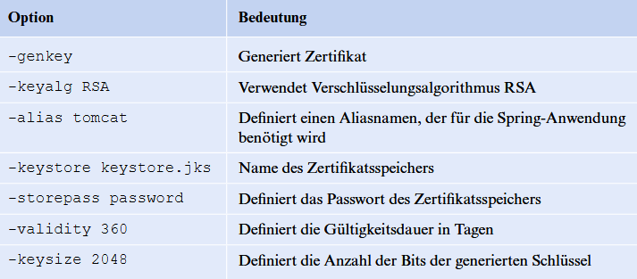
- `application.properties`:
	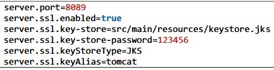

## Warenkorb

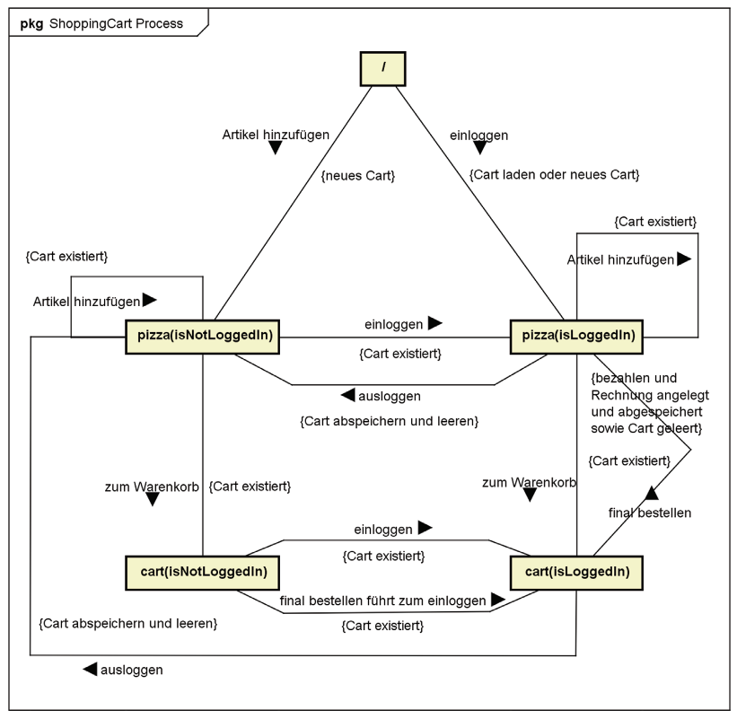

## Login 
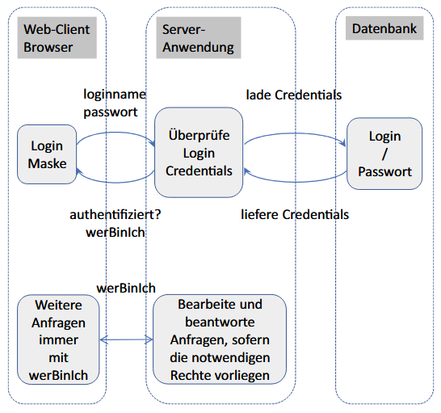

### Wie wird das Passwort übertragen?

- Das hängt vom eingesetzten Übertragungsprotokoll oder der HTTP Authentifizierung ab. 
- Die Kombination von Basic Authentication und HTTPS Protokoll bewirkt somit eine grundlegende Sicherheit für den Schutz unserer Credentials (Anmeldedaten).

## Aspektorientierte Programmierung (AOP)

- Trennung von Anwendungslogik und Geschäftslogik
- Konzentriert sich auf die **Modularisierung von Querschnittsbelangen** wie Transaktionsmanagement, Sicherheit und Logging
- Dies verbessert die **Wiederverwendbarkeit, Wartbarkeit und die Trennung von Belangen** innerhalb Softwareanwendungen

### Aspekte

- Realisierung **durch direkte Manipulation der Bytecodes** oder **durch Annotation und AOP-Unterstützung**
- Um Aspekte zu definieren und anzuwenden, nutzt man die Annotation `@Aspect`, um eine Klasse als Aspekt zu kennzeichnen. (Alternative: Realisierung über XML-Konfigurationen)
- Innerhalb dieses Aspekts werden Pointcuts zur Definition von Kriterien für die Auswahl von Joinpoints verwendet, an denen Advices ausgeführt werden sollen.
- Allerdings werden Joinpoints in Spring AOP nicht direkt definiert, sondern durch die Definition von Pointcuts implizit bestimmt.

### Prinzip

- In der AOP definiert ein ==Pointcut== eine Menge von ==Joinpoint==, an denen ein ==Advice== ausgeführt wird.
- Gleichung ==AOP = Aspect + Advice + Joinpoint + Pointcut== soll die Beziehungcder grundlegenden Bestandteile ausdrücken

> [!NOTE] **Merke:**
> ***Aspekt***:
> - Klasse, in der ein Aspekt implementiert wird.
> - Enthaltene Methoden werden durch Spring aufgerufen und enthalten die Advices.
> 
> ***Advice***: 
> - Aktion, die an einem spezifizierten Joinpoint ausgeführt wird.
> - **Anweisung**, die spezifiziert, **wann ein Aspekt ausgeführt wird**.
> 
> ***Joinpoint***: 
> - Spezifische Stelle im Programm, wie ein **Methodenaufruf, wo ein Aspekt angewendet werden kann**.
> - Methode, die vor einem anderen Methodenaufruf ausgeführt wird.
> 
> ***Pointcut***: 
> - **Definiert** an **welchen Joinpoints die Advices angewendet werden** sollen.
> - Definition erfolgt über Ausrücke unter Verwendung von SpEL

##### Advices

| Advice            | Beschreibung                                                                        |
| ----------------- | ----------------------------------------------------------------------------------- |
| `@Before`         | Ausführung vor Joinpoint.                                                           |
| `@AfterReturning` | Ausführung nach erfolgreichem Abschluss des Joinpoints.                             |
| `@AfterThrowing`  | Ausführung, wenn während der Ausführung des Joinpoints eine Ausnahme geworfen wird. |
| `@After`          | Ausführung nach Joinpoint.                                                          |
| `@Around`         | Umschließt den Joinpoint - ermöglicht Ausführung vor und nach dem Joinpoint.        |

### Proxies

- Aspekte werden in Spring als Proxies realisiert
- Das Proxy umhüllt das Objekt, dessen Methode aufgerufen wird. Dieses Objekt wird Target genannt. 
- Das Target Objekt hat keine Kenntnisse von den anderweitig auf ihn angewendeten Aspekten.
- Der **Spring AOP Container** übernimmt die Aufgabe des Zusammenführens von Aspekt und Objekt, auch **weaving** genannt und **erzeugt zur Laufzeit das Proxy-Objekt**.
- Die **Aufrufe an das Target-Objekt werden vom Proxy Objekt weitergeleitet** (delegiert). 
- Zur Realisierung existieren zwei Varianten von Proxies, zum einen JDK Dynamic Proxies und zum anderen CGLIB Proxies

| Eigenschaft              | JDK Dynamic Proxies                                                                                                                                               | CGLIB (Code Generation Library) Proxies                                                                                            |
| ------------------------ | ----------------------------------------------------------------------------------------------------------------------------------------------------------------- | ---------------------------------------------------------------------------------------------------------------------------------- |
| Arbeitsweise             | Arbeiten nur mit Schnittstellen.<br>Das Zielobjekt muss eine oder mehrere Schnittstellen (/ Interfaces) implementieren, die dann auch von der Proxy-Klasse implementiert werden. | Kann sowohl **mit Klassen als auch Schnittstellen arbeiten**.<br>Erstellt Proxies, indem es Unterklassen der Zielklasse generiert. |
| Generierte Proxy-Klassen | Proxy-Klassen, die sich strikt an die definierten Schnittstellen halten.                                                                                          | Proxies werden zu Unterklassen der Zielklasse.<br> Es ist keine Schnittstelle erforderlich.                                        |
| Verwendung               | Eignet sich für Objekte, die Schnittstellen verwenden. (→ **Proxying von Schnittstellen**)                                                                        | Kann auch Klassen ohne Schnittstellen bearbeiten.                                                                                  |

##### Vor- und Nachteile von Proxies

| Vorteile                            | Nachteile                                                                                                  |
| ----------------------------------- | ---------------------------------------------------------------------------------------------------------- |
| + Sicherheitskontrollen             | - Overhead durch zusätzliche Proxy-Klassen                                                                 |
| + vereinfachte Ressourcenverwaltung | - Komplexität bei Fehlersuche, da die Proxy-Schicht die Fehlermeldungen und Stacktraces beeinflussen kann. |
| + Möglichkeit zur AOP               |                                                                                                            |

## Transaktionen

- Folge von Operationen, die als logische Einheit betrachtet wird und ganz oder gar nicht ausgeführt werden.
- Die Ablaufverarbeitung übernimmt ein Transaktionsmanager. 
-  Aufgaben zählen die beschriebenen Tätigkeiten der Transaktionsverarbeitung, das Merken (Aufzeichnen) der Operationen sowie der Umgang mit (verteilten) Transaktionen.
- Ziele: **Datenintegrität & Datenkonsistenz**

> [!NOTE] **Merke:**
> ***Datenintegrität*** umfasst die physikalische Korrektheit und logische Stabilität.
> ***Konsistenz*** stellt sicher, dass Daten in Systemen einheitlich und ohne logische Widersprüche sind.
> **Datenintegrität und -konsistenz gewährleisten die Zuverlässigkeit, Genauigkeit und Widerspruchsfreiheit von Daten über ihren gesamten Lebenszyklus**.

- Transaktionen verwenden Mechanismen wie **Sperren und Versionskontrolle**, um sicherzustellen, dass **gleichzeitige Zugriffe und Änderungen** an Daten **nicht zu Dateninkonsistenzen führen**.
- Durch **Isolationsgrade** kann gesteuert werden, wie Transaktionen voneinander isoliert werden, was eine **Balance zwischen Konsistenz und Durchsatz** ermöglicht.

> [!NOTE] **Merke:**
> ***Propagation*** bestimmt, wie Transaktionen in Bezug aufeinander gestartet werden.
> ***Isolation*** steuert, wie und wann die Änderungen einer Transaktion für andere sichtbar werden
> **Propagation und Isolation sind zentral für die Gewährleistung von Datenintegrität und Konsistenz.**
<br>
Durch @Transactional wird das Verhalten einer Transaktion durch die folgenden
Merkmale festgelegt:
- **Propagation Type**
	- Je nach Einstellung wird bei Aufruf einer Methode entschieden, unter welcher Transaktion der Aufruf ausgeführt wird. Verschiedene Werte sind einstellbar: Required, RequiresNew, Supports, NotSupported, Mandatory, Never.
- **Isolation Level**
	- Je nach Einstellung können Ergebnisse anderer aktiver Transaktionen verwendet werden.
- **Timeout**
	- Überschreitet die Ausführung der Transaktion ein Zeitlimit, dann wird sie abgebrochen.
- **readOnly Flag**
	- Wenn eine Transaktion nur Lese-Operationen durchführt, können vom PersistenceProvider Optimierungen vorgenommen werden.
- **Rollback**
	- Hier können bestimmte Regel für Exceptions bestimmt werden, die zum Rollback führen.
- **value**
	- Festlegen eines Transaktionsmanagers.
<br>
- Spring verwaltet Transaktionen und bindet sie an den aktuellen **EntityManager**, wenn eine Methode mit `@Transactional` ausgeführt wird.
- Der EntityManager spielt zentrale Rolle bei der Transaktionsverwaltung in JPA, indem er den **Kontext für Transaktionen bereitstellt**, innerhalb dessen **Entitäten persistiert, aktualisiert, und gelöscht** werden.
- Er steuert den Beginn, das Commit und das Rollback von Transaktionen, um die Datenintegrität zu gewährleisten.
- Um Entitäts-Änderungen zu persistieren, muss der EntityManager die Änderungen innerhalb einer Transaktion sammeln, die dann mit einem Commit bestätigt oder einem Rollback zurückgerollt werden
- Änderungen an Entitäten innerhalb einer Transaktion werden beim Commit automatisch in der Datenbank gespeichert.

### Transaktionsverarbeitung

- Die Ablaufverarbeitung übernimmt ein Transaktionsmanager. 
- Transaktionen auf einer Datenbank = lokale Transaktion
- Transaktionen auf mehreren Datenbank = verteilte Transaktion
-  Der Ressourcen-Manager ist für den Datenbankzugriff auf die Daten (Objekte) der Transaktion verantwortlich.

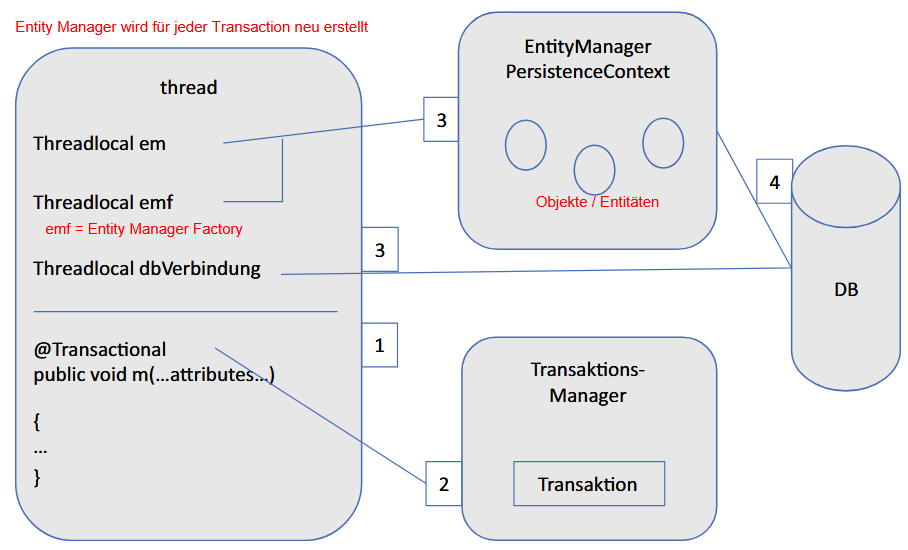

1. Ausführen der transaktionalen Methode.
2. Anlegen einer neuen Transaktion oder Verwenden einer existierenden Transaktion.
3. Wenn neue Transaktion, dann neue EntityManager als ThreadLocal anlegen
4. Transaktion wird comitted oder gerollbacked.

### ACID

- Transaktionen werden nach den sogenannten ACID-Eigenschaften realisiert.
	- **Atomicy** (Unteilbarkeit)
		- Alle oder keine Änderung wird ausgeführt
		- Transaktion kann jederzeit von Initiator oder auftretendem Fehler zurückgesetzt werden
	- **Consistency** (Konsistenzerhaltung)
		- Konsistente Form einer Datenbank muss nach Ausführung wieder vorliegen.
	- **Isolation** (Abgrenzung)
		- Bei parallelen Transaktionen dürfen sich diese nicht gegenseitig beeinflussen
		- Der Umgang mit konkurrierenden Datenzugriffen wird nach Isolationsgraden konfiguriert, die festlegen, wie eine Beeinflussung stattfinden kann.
	- **Durability** (Dauerhaftigkeit)
		- Nach erfolgreicher Transaktion ist garantiert, dass die veränderten Daten in der Datenbank endgültig gespeichert sind.

### Isolationsgrade

| Isolationsgrad            | Beschreibung                                                                                                                                |
| ------------------------- | ------------------------------------------------------------------------------------------------------------------------------------------- |
| Read Uncommitted          | Transaktion kann Daten von nebenläufigen Transaktionen lesen.<br>Erlaubt "Dirty Reads"                                                      |
| Read Committed (STANDARD) | Transaktion kann Daten von nebenläufigen Transaktionen lesen, wenn diese bereits committed sind.<br>Erlaubt keine "Dirty Reads"             |
| Repeatable Read           | Transaktion kann wiederholt dieselbe Lese-Operation durchführen und bekommt jeweils dasselbe Ergebnis.<br>Verhindert "Non-Repeatable Reads" |
| Serializable              | Nebenläufige Transaktionen können sich nicht beeinflussen.<br>Verhindert "Phantom Reads"                                                    |

> [!NOTE] **Merke:**
> ***Dirty Read*** tritt auf, wenn eine Transaktion Daten liest, die von einer anderen, noch nicht abgeschlossenen (uncommitted) Transaktion geändert wurden.
> ***Non-Repeatable Read*** ist ein Datenbankphänomen, bei dem eine Transaktion dieselbe Zeile zweimal liest, aber aufgrund einer zwischenzeitlichen Änderung durch eine andere Transaktion unterschiedliche Daten erhält.
> ***Phantom Read*** ist ein Datenbankphänomen, bei dem eine Transaktion bei zweimaligen Ausführen derselben Abfrage unterschiedliche Datensätze erhält, da eine andere, parallele Transaktion in der Zwischenzeit neue Datensätze hinzugefügt oder gelöscht hat.

- **Höhere Isolationsgrade**:
	- Verbessern die Datenintegrität, indem sie **Konflikte zwischen Transaktionen reduzieren**.
	- Können die Leistung aufgrund erhöhter Sperren und verminderter Parallelität beeinträchtigen.
- **Niedrigere Isolationsgrade**:
	- Erlauben mehr Parallelität und verbessern die Leistung
	- Erhöhen das **Risiko von Dateninkonsistenzen**, wie Dirty Reads oder Phantom Reads.

### Propagationstyp

| Propagationstyp | Beschreibung                                                                                                                                                                                                                                                                                          |
| --------------- | ----------------------------------------------------------------------------------------------------------------------------------------------------------------------------------------------------------------------------------------------------------------------------------------------------- |
| NotSupported    | Transaktion nicht unterstützt                                                                                                                                                                                                                                                                         |
| Supports        | Transaktion unterstützt                                                                                                                                                                                                                                                                               |
| Required        | Transaktion erforderlich (STANDARD)                                                                                                                                                                                                                                                                   |
| RequiresNew     | Neue Transaktion erforderlich<br>Nützlich, wenn eine unabhängige neue Transaktion erforderlich ist, die nicht von der übergeordneten Transaktion beeinflusst werden soll.<br>Wichtig in Szenarien, in denen eine Operation unabhängig vom Ausgang anderer Operationen committen oder rollbacken muss. |
| Mandatory       | Bestehende Transaktion erforderlich                                                                                                                                                                                                                                                                   |
| Never           | Bestehende Transaktion verboten                                                                                                                                                                                                                                                                                                      |


### Lost Update

- Zwei Transaktionen bearbeiten dieselben Daten. Nach dem Ablauf ist aber nur die Änderung einer Transaktion erfolgt.

## REST
### Grundprinzipien für REST-Konformität

- Anwendung ist REST-konform, wenn sie die Prinzipien der REST-Architektur befolgt.

1. **Eindeutige Identifikation von Ressourcen**: 
	- Jede Ressource ist durch eine URI klar identifizierbar
2. **Zustandlose Kommunikation**: 
	- Jede Anfrage enthält alle nötigen Informationen ohne sich auf vorherige Anfragen zu beziehen.
	- Der Server speichert keine Informationen über vorherige Anfragen (Sessions).
	- Zustandsinformationen im Client, nicht im Server
3. **Standardmethoden**: 
	- Verwendung einheitlicher Schnittstelle
	- Nutzung von HTTP-Methoden (GET, POST, PUT, DELETE) für standardisierte Aktionen auf Ressourcen, um Client/Server-Interaktion einheitlich und vorhersehbar zu machen.
	- Nebeneffekte:
		- potentielle, unbeabsichtigte Auswirkungen, die sich aus der Änderung der Repräsentation eines Zustands ergeben können.
		- kann positive und negative Auswirkungen haben, z.B. veraltete Daten durch Caching oder unbeabsichtigte Zustandsänderungen auf dem Server
4. **Entkopplung von Ressourcen und Repräsentationen**: 
	- Einsatz repräsentativer Zustandsübertragungen (durch HTML, JSON, XML, etc.)
	- Ressourcen können in verschiedenen Formaten dargestellt werden.
5. **HATEOAS** (Hypermedia as the Engine of Application State): 
	- Antworten enthalten Hyperlinks zu anderen relevanten Ressourcen, was die Navigation und Interaktion zwischen ihnen ermöglicht.

- REST-Konformität verbessert Skalierbarkeit, Flexibilität und Wartbarkeit der Webanwendung

### Anforderungen an URIs (Uniform Resource Identifier):

- **Sprechende Namen** verwenden, die die Art der Ressource und deren Beziehung klar kommunizieren.
- **Hierarchische Strukturen** widerspiegeln, um die Organisation der Daten und deren Zusammenhänge zu verdeutlichen.
- **Keine Methodennamen oder temporäre Zustandsinformationen in der URI**, da diese Aspekte durch HTTP-Methoden bzw. die Zustandslosigkeit von REST gehandhabt werden.

### Vor- und Nachteile

| Vorteile                                                                                         | Nachteile                                             |
| ------------------------------------------------------------------------------------------------ | ----------------------------------------------------- |
| + **Skalierbarkeit** durch eine klare Trennung zwischen Client und Server.                       | - Komplexität aufgrund der Zustandslosigkeit          |
| + **Interoperabilität** durch **Zustandslosigkeit** und Einhaltung standardisierter Methoden.    | - Mangel von Standardisierung für Dienstbeschreibung. |
| + **Performance** durch Caching-Mechanismen, die wiederholte Anfragen effizienter machen.        |                                                       |
| + **Flexibilität** durch die Unterstützung verschiedener Datenformate → erleichtert Integration. |                                                       |

### Idempotent vs. Sicher

- **Idempotenz** bedeutet, dass wiederholte identische Anfragen die gleichen Auswirkungen haben wie eine einzelne Anfrage
- Die HTTP-Methoden GET, POST, PUT, DELETE sind idempotent, unabhängig davon, wie oft sie ausgeführt werden
<br>
- Eine Methode ist **sicher**, wenn sie keine Änderungen auf dem Server verursacht.
- Die HTTP-Methoden GET ist sicher, da sie lediglich Daten abruft.

### Richardson Maturity Models (RMM)

Je reifer desto REST-artiger ein Service:

| Reifegrad | Beschreibung                                      |
| --------- | ------------------------------------------------- |
| Stufe 0   | Einfacher Austausch von Informationen über HTTP   |
| Stufe 1   | Ressourcen werden durch URIs identifiziert        |
| Stufe 2   | Verwendung von HTTP-Methoden für CRUD Operationen |
| Stufe 3   | Hinzufügen von HATEOAS zur dynamischen Navigation |

### Controller und Methoden

- Mit `@RestController` annotierte Klassen definieren Controller, die REST-Anfragen bearbeiten.
- Diese Annotation ermöglicht die automatische Serialisierung von Daten in Formate wie JSON oder XML für die HTTP Antwort.
- Anfragen werden mittels `@GetMapping` und `@PostMapping` den Methoden zugewiesen.
- `@PathVariable` injiziert URL-Parameter direkt in Methodenparameter.
- `@RequestBody` bindet den Body einer Anfrage an einen Methodenparameter

## Events & Aktualisierung
### Event-Komponenten

- Die Event-Verarbeitung in Spring umfasst typischerweise drei Hauptkomponenten:
	- **Event Source** sendet oder generiert das Event.
	- **Event Listener** reagiert auf das Event.
	- **Event Object** trägt Informationen über das Ereignis.

### Konfiguration Event Listener

1. Erstellung einer Listener-Methode
	- Definieren einer Methode in einer Komponente (Bean), die als EventListener fungieren soll. Der Name kann frei gewählt werden.
	- Diese Methode muss einen Parameter haben, der dem Typ des Ereignisses entspricht, auf das sie reagieren soll.
2. Annotieren der Methode mit `@EventListener`
	- Markieren der Methode mit der Annotation `@EventListener`.
	- Dadurch wird Spring angewiesen, diese Methode als EventListener zu behandeln und sie aufzurufen, wenn ein Event des entsprechenden Typs veröffentlicht wird.

### ApplicationEvents

- Ereignisse, um verschiedene Teile einer Anwendung **über bestimmte Vorgänge oder Zustandsänderungen zu informieren**, wodurch eine **lose Kopplung zwischen Komponenten gefördert** wird.
- Anwendungskomponenten können **miteinander kommunizieren**, ohne direkt voneinander abhängig zu sein.
- Einsatzbereiche:
	- **Benachrichtigung über Zustandsänderungen**, wie das Erstellen eines neuen Benutzerkontos
	- **Auslösen asynchroner Verarbeitung**, um Aufgaben im Hintergrund auszuführen
	- **Inter-Modul-Kommunikation** in modularen Anwendungen
	- Auslösen von **Benachrichtigungen oder Alarmen** bei bestimmten Ereignisse

### Vor- und Nachteile

| Vorteile                                      | Nachteile |
| --------------------------------------------- | --------- |
| + Verbesserte Skalierbarkeit                  |           |
| + Entkopplung von Komponenten                 |           |
| + Flexible und wartbare Anwendungsarchitektur |           |
| + Erweiterbarkeit und Anpassbarkeit           |           |

### Möglichkeiten der Website-Aktualisierung

- Ajax
- Seite neuladen
- WebSockets

> [!NOTE] **Merke:**
> ***WebSockets***:
> - Ein auf TCP basierendes Netzwerkprotokoll, das eine dauerhafte, bidirektionale Vollduplex-Verbindung zwischen Client und Server ermöglicht.
> - Es wird primär für Echtzeitanwendungen wie Live-Chats genutzt, da es eine wesentlich geringere Latenz als HTTP bietet.
> - Die Verbindung startet mit einem HTTP-Handshake und bleibt für effizienten Datenaustausch offen.
> 
> ***Vollduplex-Verbindung***:
> - Übertragungsmethode in der Netzwerktechnik, die den gleichzeitigen Datenverkehr in beide Richtungen ermöglicht.
> - Dabei können beide Kommunikationspartner jederzeit unabhängig voneinander senden und empfangen.
> - Das verhindert Kollisionen und verdoppelt die Datengeschwindigkeit im Vergleich zu Halbduplex.

---

### Prüfungsfragen Kapitel 1
1. Welche fachlichen Anforderungen können bei Unternehmensanwendungen mit vielen Nutzern auftreten?
2. Welche technologischen Anforderungen müssen gelöst werden?
3. Definieren Sie die Begriffe Komponente und Komponentenmodell.
4. Nennen Sie Client/Server Architekturen und deren Unterschiede.
5. Was versteht man unter Middleware? Was sind Vorteile von Middleware? Welche Probleme treten auf und müssen gelöst werden? Wie werden diese Probleme gelöst?
6. Nennen Sie verschiedene Transparenzarten und erläutern Sie diese.
7. Skizzieren Sie den Unterschied zwischen synchroner und asynchroner Kommunikation.
8. Was sind Annotationen und wozu werden sie verwendet?

### Prüfungsfragen Kapitel 2
1. Erläutern Sie das Konzept Convention over Configuration.
2. Was ist ein Servlet? Welche Aufgaben hat ein Servlet Container?
3. Vergleichen Sie Beans und Java-Objekte.
4. Wozu dient die Annotation `@Component`?
5. Wie können Sie ein Spring-Projekt anlegen?

### Prüfungsfragen Kapitel 3
1. Erklären Sie die Arbeitsweise von Spring MCV.
2. Wie können Sie Spring MVC in ihrem Projekt einsetzen?
3. Mit welchen Spring-Mitteln können sie Java-Objekte in die Datenbank abspeichern?
4. Welche Aufgaben hat ein DispatcherServlet?
5. Wie bauen Sie eine Controller-Klasse für Spring MVC auf? Wie die einzelnen Methoden, die auf HTTP Requests reagieren sollen?
6. Erläutern Sie die Verwendung von Annotationen `@Controller`, `@RequestMapping` und `@RequestParam`.
7. Was bewirkt und beinhaltet die Annotation `@SpringBootApplication`?
8. Erläutern Sie den Begriff Template Engine. Welche Aufgaben übernimmt diese?
9. Wie können Sie Mock-Objekte zum Testen einer Spring-Anwendung einsetzen?
10. Erklären Sie das Muster Domain, Service, Boundary.
11. Welche Vorteile hat das Refactoring nach der Aufteilung in Domain, Service und Boundary?

### Prüfungsfragen Kapitel 4
1. Welche Aufgaben übernimmt ein Anwendungsserver?
2. Definieren und erläutern Sie IoC und DI.
3. Was ist ein Kontext? Welche Aufgaben erfüllen Kontexte in Spring?
	- Ein **Kontext** in Spring (genauer: der _ApplicationContext_) ist die zentrale Konfigurations- und Laufzeitumgebung einer Spring-Anwendung. Er verwaltet alle sogenannten **Beans** (Objekte), die von Spring erstellt und gesteuert werden.
	- Kurzum: Der Kontext ist die **zentrale Verwaltungsinstanz einer Spring-Anwendung**.
	- Aufgaben:
		- Bean-Verwaltung
		- Lebenszyklusmanagement
		- Konfigurationsverwaltung
		- Event-Handling
		- Integration weiterer Funktionalitäten, wie AOP

4. Erläutern Sie das Zusammenspiel von Container und Kontext.
	- Der **Container** ist das grundlegende IoC-Prinzip (Inversion of Control). Er verwaltet Objekte (Beans) und injiziert deren Abhängigkeiten.
    - Der **ApplicationContext** ist eine **erweiterte Form des Containers**. Technisch ist er eine Spezialisierung des `BeanFactory`-Containers.
    - Zusammenspiel:
	1. Der Container (BeanFactory) stellt die Grundfunktionalität zur Bean-Erstellung und -Verwaltung bereit.
	2. Der ApplicationContext baut darauf auf und erweitert diese Funktionalität um:
	    - Event-Mechanismen
	    - automatische BeanPostProcessor-Registrierung
	    - komfortablere Konfigurationsmöglichkeiten

6. Beschreiben Sie die Arbeitsweise des IoC Containers.
7. Skizzieren Sie den Lebenszyklus einer Bean.
8. Welche der verschiedenen Möglichkeiten zur Dependency Injection existieren in Spring? Diskutieren Sie Vor- und Nachteile.
9. Nennen Sie die verschiedenen Scopes. Erklären Sie ihre Unterschiede.

### Prüfungsfragen Kapitel 5
1. Nennen und erläutern Sie Vor- und Nachteile von JPA.
2. Was sind Entitäten? Was müssen Sie bei deren Erstellung in Spring beachten?
3. Was bedeutet ORM? Welche Probleme treten dabei auf? Mit welchen konkreten Problem müssen sie bei der Realisierung rechnen?
4. Welche Bestandteile sollten Sie in einer Entity-Klasse definieren?
5. Wie können Sie Beziehungen zwischen Objekten mit JPA abbilden?
6. Welche Arten von Beziehungen können Sie mit welchen Annotationen realisieren?

### Prüfungsfragen Kapitel 6
1. Wie können Sie mit Spring Data JPA eigene Query-Methoden definieren?
2. Welche Vorteile bieten Spring Data Repositories?
3. Welche Möglichkeiten existieren, um Vererbungsbeziehungen mit JPA abzubilden? Erläutern Sie die Vor- und Nachteile der jeweiligen Verfahren.
4. Nennen und erläutern Sie die JPA-Ladestrategien.
5. Wie können Sie eingebettete Objekte und Aufzählungen in Ihrer Anwendungen einsetzen und wie werden sie in der Datenbank abgespeichert?
6. Erklären Sie die Konzepte BaseEntity und EntityListener?

### Prüfungsfragen Kapitel 7
1. Erklären Sie, wie die Prüfung einer Nutzeridentität erfolgen kann.
2. Definieren Sie Authenisierung.
3. Welche Aufgaben haben Data Transfer Objects?
4. Wie können Sie Nutzereingaben validieren?
5. Erklären Sie den Zusammenhang von Authentisierung und Validierung.
6. Wie können Sie in Ihrer Anwendung sicherstellen, dass die Webseiten nach erfolgreichem Login einem Nutzer eindeutig zugeordnet sind?
7. Erläutern Sie das Testen einer Spring MVC Anwendung. Wie gehen Sie dabei vor?

### Prüfungsfragen Kapitel 8 (!)
1. Erklären Sie die Begriffe Authentisierung, Authentifizierung und Autorisierung.
2. Erläutern Sie GrantedAuthority, Credentials, Principal und Authentication.
3. In welchem Zusammenhang werden SecurityContext und SecurityContextHolder benötigt?
4. Beschreiben Sie, wie eine Konfiguration für Spring Security erfolgt. Was sollten Sie dabei alles angeben?
5. In welchen Situationen ist eine Remember-Me-Authentifizierung bei Spring hilfreich?
6. Skizzieren Sie das Zusammenspiel von fachlichen Nutzern und dem Spring Security User?
7. Wie funktioniert die URL-basierte Authentifizierung bei Spring?
8. Erklären Sie den Ablauf der Authentifizierung.
9. Erläutern Sie die Zugriffskontrollen per `requestMatcher` und `preAuthorize`. In welchen Situationen können sie eingesetzt werden?
10. Wie funktioniert die Autorisierung bei Spring auf Methodenebene?
11. Erläutern Sie die Sicherheitsfilter der Spring Security.
12. Erklären Sie die Nutzung von Spring Security in der Beispielapplikation.
13. Beschreiben Sie CSRF Angriffe und welche Vorsichtsmaßnahmen Sie treffen können.
14. Beschreiben Sie CORS Angriffe und welche Vorsichtsmaßnahmen Sie treffen können.

### Prüfungsfragen Kapitel 9
1. Erklären Sie die grundlegende Idee von aspektorientierter Programmierung.
2. Erläutern Sie die Begriff Joinpoint, Pointcut und Advice.
3. Nennen Sie verschiedene Arten von Advices.
4. Wie können Sie Aspekte in Spring realisieren?
5. Wozu können Sie SpEL verwenden?
6. Erläutern Sie die beiden Proxy-Varianten und deren Unterschied.

### Prüfungsfragen Kapitel 10
1. Erklären Sie Transaktionen und ihre Bestandteile sowie ihren allgemeinen Ablauf.
2. Erläutern Sie Propagation und Isolation und ihre praktische Relevanz.
3. Beschreiben Sie den Einsatz von JDK Proxies und CGLIB Proxies.
4. Skizzieren Sie den Entitäten-Lebenszyklus.
5. Erklären Sie die Begriffe PersistenceContext, PersistenceProvider und PersistenceUnit.
6. Skizzieren Sie im Detail den Ablauf der Transaktionsverarbeitung. Erläutern Sie dabei auch das Zusammenspiel von Transaktion und EntityManager.

### Prüfungsfragen Kapitel 11
1. Erläutern Sie die Grundprinzipien von REST.
2. Welche Vorteile sprechen für die Verwendung von REST.
3. Was sind Nachteile von REST.
4. Erläutern Sie die HTTP-Methoden, die für die Umsetzung von REST genutzt werden können. Gehen Sie dabei auf die Begriffe "sicher" und "idempotent" ein.
5. Bei dem dritten REST-Prinzip können Nebeneffekte auftreten. Was ist damit gemeint?
6. Wie sollten URIs nach dem REST-Ansatz aufgebaut sein?
7. Was bedeutet REST-konform?
8. Skizzieren Sie das Richardson Maturity Model. Welche Stufen definiert das Model?
9. Wir müssen REST Controller bei Spring aufgebaut sein? Wie die einzelnen Methoden die auf REST-Anfragen reagieren sollen?
10. Wenn Sie bereits Wissen über SOAP besitzen, dann vergleichen Sie SOAP und REST miteinander.

| Eigenschaft           | SOAP                                                                                     | REST                                                                                  |
| --------------------- | ---------------------------------------------------------------------------------------- | ------------------------------------------------------------------------------------- |
| Datenformat           | XML                                                                                      | meist JSON                                                                            |
| Struktur-Beschreibung | DTD / XSD, WSDL                                                                          | Dokumentation                                                                         |
| Anwendungsbereich     | Bank oder Versicherung<br>Wenn formale Verträge zwischen Systemen benötigt werden (WSDL) | öffentliche API<br> Wenn einfache Implementierung und Skalierbarkeit priorisiert wird |
| Nachteile             | Mehr Overhead bei Übertagung<br>Komplizierter zu implementieren.                         | Mangel von Standardisierung für Dienstbeschreibung                                    |
| Vorteile              | Klare Servicebeschreibung durch WSDL                                                     | Skalierbarkeit, zustandslose Kommunikation                                            |

### Prüfungsfragen Kapitel 12
1. Erläutern Sie die an einer Event Verarbeitung beteiligten Komponenten.
2. Welche Aufgaben hat ein EventListener in der Eventverarbeitung?
3. Welche Vorteile haben Events?
4. Was sind ApplicationEvents und wozu können sie eingesetzt werden?
5. Wie können Websites aktualisiert werden? Welche Möglichkeiten existieren dafür? Diskutieren Sie Vor- und Nachteile der verschiedenen Ansätze.
6. Erläutern Sie die JavaScript Lösung zum permanenten Aktualisieren von Websites.
