# Hardwarenahe Programmierung
## Wiederholung Computerarchitektur (wichtig, aber nicht prüfungsrelevant)

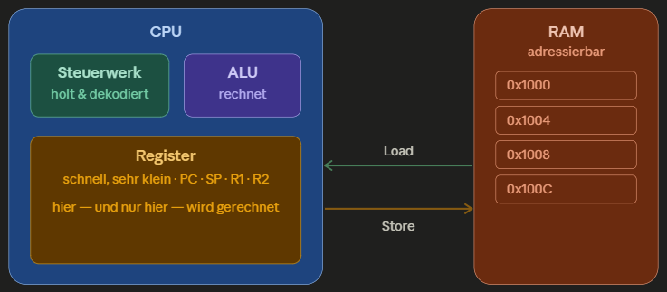

- Computer Grundaufagben
  - EVAS Prinzip: Eingabe - Verarbeitung - Ausgabe - Speicherung
  - Sprünge in der Verarbeitung sind der Grund warum ein Rechner nicht stur von oben nach unten
    - Sprungbefehle (`jump`, bedingt Sprünge) setzen Program Counter auf eine andere Adresse und ermöglich so `if`, Schleifen und FUnktionsaufrufe
    - `call`-Befehl ist ein spezieller Sprung, der zusätzlich die Rücksprungadresse sichert.

- CPU:
  - Steuerwerk (Control Unit)
    - holt den nächsten Befehl und dekodiert ihn
  - Rechenwerk (ALU - Arithmetic Locig Unit)
    - führt die eigentlichen Rechen- und Logikoperationen aus 
  - Register
    - winziger, extrem schneller Speicher direkt in der CPU
    - hier liegen Operanden und Zwischenergebnisse
    - **Program Counter (Instruction Pointer / Adressregister)** hält die Adresse des nächsten Befehls.
    - **Befehlsregister (Instruction Register)** hält den aktuell geholten Befehl, der gerade dekodiert und ausgeführt wird.
    - **Akkumulator (Rechenregister)** hält einen Operanden und das Ergebnis der ALU-Operationen.
    - **Stack Pointer** zeigt auf die Spitze des Callstacks

- Befehlsabarbeitung / Der Befehlszyklus
  - CPU arbeitet einen Befehl nach dem anderen in einem sich wiederholendem Zyklus ab:
    - **Fetch**: holt nächsten Befehl aus RAM (Adresse steht im Program Counter)
    - **Decode**: Steuerwerk dekodiert den Befehl
    - **Execute**: ALU rechnet bzw. es wird auf Speicher zugegriffen
    - Dannach schaltet der Programm Counter weiter und der Zyklus beginnt von vorn.

- RAM Zugriff
  - Random Access Memory: jede Speicherzelle ist über ihre Adresse direkt erreichbar (**O(1)**)
  - CPU kann nicht direkt im RAM rechnen, sie rechnet nur mit Werten in Registern
  1. Wert per Load-Befehl aus dem RAM in ein Register laden
  2. ALU rechnet
  3. Store-Befehl schreibt das Ergebnis zurück in den RAM

  - **Load-Store-Architektur**
    - nur dedizierte Load- und Store-Befehle greifen auf den Speicher zu
    - alle anderen Operationen (Addieren, Vergleichen, ...) arbeiten auf Registern

  - Prozess im RAM hat 4 Segmente:
    1. Textsegment (Code) enthält den Maschinencode, meist read-only.
    2. Datensegment enthält globale & statische Variablen.
    3. Callstack wächst nach unten.
    4. Heap wächst nach oben.

- Wie entsteht Assembler / Maschinencode
  > Assembler Test: peterhigginson.co.uk/LMC

  - Assemblersprache = menschenlesbare Form der Maschinenbefehle: `ADD`, `MOV`, `JMP` statt Bits
  - Maschinencode = Binäre Form (1 und 0), die die CPU direkt ausführt
  - Assembler = Programm, das Assemblersprache in Maschinencode übersetzt
  - Übersetzungskette
  > Hochsprache (C++) 
  >> → Compiler übersetzt in Assemblersprache
  >>> → Assembler übersetzt in Maschinencode 
  >>>> →  Maschinencode landet in ausführbarer Datei (`.exe` unter Windows) 
  >>>>> → bei Start wird sie ins Textsegmente des RAM geladen und ausgeführt.
  - Assemblersprache ist nicht portable, sie ist an bestimmte ISA gebunden

- ISA (Instruction Set Architecture)
  - Befehlssatz-Vertrag zwischen Software und CPU
  - definiert, welche Maschinenbefehle es gibt, welche Register, wie Speicher adressiert wird
  - 2 Prozessoren:
    - x86 (Desktop/Server, Intel/AMD)
      - CICS Architektur: viele, komplexe Befehle
    - ARM (Smartphones, Apple Silicon, Embedded)
      - RISC Architektur: weniger, einfache Befehle
    - `.exe` für x86 läuft nicht direkt auf einem ARM-Prozessor
    - C++ Quellcode ist portabel (neu kompilieren genügt), Maschinencode ist es nicht.

### Brücken zu C++
- Variable ist ein benannter Platz im RAM mit einer Adresse
  - Adressoperator `&` liefert genau diese Adresse
  - Zeiger ist diese Adresse als Wert
- `const`-Optimierung = Load-Store-Logik
  - Weiß der Compiler, dass ein Wert konstant ist, kann er ihn im Register halten, statt ihn bei jedem Zugriff per `LOAD` neu aus dem RAM zu holen
  - Spart einen Speicherzugriff
- Da Register/Cache um Größenordnungen schneller als der RAM sind, ist Speicherzugriff teuer
  - Daher ist `std::vector` mit zusammenhängendem Speicher cache-freundlich und schneller als über Heap verstreute Einzelobjekte

### Managed Languages vs Native Languages
- Interpreter: JavaScript
  - schrittweise Übersetzung des Bytecodes in zugehörigen Maschinencode -> pro Zeile/Einheit
  - Fehler treten zur Laufzeit auf
- Manages Languages: Java, JVM-Sprachen, C#, F#, ...
  - Laufzeitumgebung
    - Programme liegen in Plattform-unabhängiger Binärsprache vor (Java: Bytecode) -> für abstrakte CPU
    - Just-in-Time Compilierung (JIT -> am Chip compiliert)
    - Optimierung zur Laufzeit möglich
  - Vorteile JVM: 
    - Sandboxing/Abstraktion (Abgrenzung zur Hardware)
    - automatische Speicherverwaltung (verbraucht aber viel Speicher)
    - plattformunabhängig, solang JVM auf System läuft
  - GraalVM: Versuch Java in native Language zu compilieren
- Native Languages: C++
  - Ahead-of-Time Compilierung (AOT)
  - Binäry ist plattformunabhängig

---

## Kurs Einführung
> Lehrbuch: C++ programmieren von Ulrich Breymann
> Cheatsheet: https://cppreference.com/

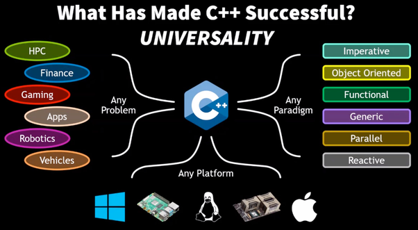

**Wodurch zeichnen sich Systemprogrammiersprachen aus?**
> Eine Systemprogrammiersprache gibt dir maximale Kontrolle über Hardware und Speicher bei minimalen Laufzeit-Overhead, auf KOsten der Sicherheit, für die man selbst verantwortlich ist.
> C++, C und Rust sind die typischen Vertreter. Java, C# und Python sind es wegen Virtual Maschine und Garbage Collector nicht. 

### C++
- Von `C` über `C with classes` zu `C++` 
- Ende 1998 erster `C++` Standard erschienen
- Multiparadigmen Sprache
  - objektorientiert, prozedural/imperativ oder funktional möglich
- Compiler:
  - Gnu Compiler Collection (GCC) -> läuft auf allen Plattformen
  - Clang
  - Microsoft Visual Studio 
- Hohes Abstraktionsniveau
  - weniger Code, aber dennoch auf Hardware-Ebene zugreifen

**Kernaussagen**
- **Direkte Zuordnung zur Hardware (direct map to hardware)**
  - Sprachbefehle und Datenstrukturen entsprechen unmittelbar Hardware-Operationen und Speicherlayout
  - Basis-Sprachbefehle bilden das ab, was die Hardware tatsächlich kann:
    - `int` = bildet auf einen natürlichen CPU-Ganzzahltyp ab
    - `std::size_t` = so groß wie eine Adresse / kann jede mögliche Größe fassen
    - Pointer = echte Speicheradresse
    - Array = zusammenhängender Speicherblock
    - `+` wird zum Additionsbefehl der CPU
  - Keine Laufzeitumgebung dazwischen wie bei JVM (Java Virtual Maschine)  
  - Nativer Zugriff auf Hardware und Hardware-Fähigkeiten: 
    - **CPU (central processing unit)** und **RAM (random access memory)**
      - Kompilierter Code läuft unmittelbar auf der CPU (kein Bytecode, kein JIT)
      - Zugriff auf RAM-Adressen über Pointer
    - **SIMD (Single Instruction/Multiple Data)**
      > Klassifikation von Computerarchitekturen, bei der ein Befehl gleichzeitig auf mehrere Datenpunkte angewendet wird, was zu Datenparallelität und somit zu Leistungsgewinnen führt.
      - Moderne CPUs haben SIMD-Befehlssätze, die C++ nutzen kann, weil
        - Compiler Schleifen automatisch vektorisiert
        - explizit über Intrinsics (= systemnahe Funktionen, die direkt vom Compiler in prozessorspezifische Assemblerbefehle übersetzt werden)
      - Spezielle CPU-Fähigkeiten aus Sprache heraus ausnutzen, was mit Managed Language kaum möglich ist.
  - C++ als Grundlage spezialisierter Werkzeuge, nicht als direkter Ausführungsweg:
    - **GPU (graphics processing unit)**
      > Ist ein eigener Prozessor mit eigenem Speicher und Befehlssatz
      - CUDA (NVIDIA's C++-Erweiterung) oder Standard-C++ mit `std::execution`-Policies können auf die GPU auslagern.
- **Hohe Abstraktion ohne Laufzeitkosten (zero-cost abstraction)**
  - Zero Cost bezieht sich auf Laufzeit, nicht Compilezeit.
  - Abstraktion ist ein Ideal, manche kommen dem näher als andere.
  - **Was nicht genutzt wird, kostet nichts.**
    - ungenutztes Sprachfeature verursacht keinen Laufzeit- oder Speicher-Overhead.
    - Features, die noch etwas kosten und Optin sind: `virtual` (vptr + vtable + Indirektion), aber nicht-virtuell ist der Default → in C++ entscheidet man bewusst
    - In Java ist jede Methode standardmäßig virtuell → man zahlt immer
  - **Was genutzt wird, kann von Hand nicht besser geschrieben werden.**
    - Abstraktion kompiliert zu genauso effizientem Maschinencode, wie wenn man dasselbe manuell mit Low-Level-Sprachkonstrukten implementieren würde.
    - Beispiele:
       - `unique_ptr` ist gegenüber Raw Pointer eine echte Abstraktion, aber kompiliert zu selben Maschinencode wie manuelle `new / delete`. 
          - Kein Reference Counting, kein GC, keine Extra-Daten.
             - Kontrast dazu: `shared_ptr` mit Reference Counting, der durch atomaren Zähler Laufzeitkosten verursacht.
          - Destruktoraufruf steht zur Compilerzeit fest. Sicherheit von RAII geschenkt ohne Laufzeitkosten.
       - Templates: `std::vector<int>` wird zur Compilezeit für `int` spezialisiert, wodurch Code entsteht, der genauso effizient wie ein manuelles int-Array ist. 
          - Java löscht (Type Erasure) wegen Rückwärtskompatibilität → nur eine List-Version existiert im Bytecode → kein Aufbähen (Code Bloat), aber Object-Boxing, GC & Laufzeitkosten nötig.
          - C++ generiert pro Typ eigene, echte, typspezifische Code-Instanz. Keine Laufzeit-Typprüfung, kein Boxing, kein GC, volle Geschwindigkeit. Aber erhöht Übersetzungsdauer und bläht Binärcode auf.
       - Standard-Algorithmen mit Iteratoren kann der Compiler so gut optimieren, dass sie zum selben Maschinencode werden wie eine manuelle Zeigerschleife → **Grundprinzip: Wiederkehrende Probleme lieber durch Algorithmen (`#include <algorithm>`) in den Standard-Bibliotheken als eigene `for`-Schleifen lösen.** → Algorithmen sind losgelöst von den Datentypen
> C++ will systemnah, schnell und abstrakt sein
> C++ will beides gleichzeitig - zero-cost abstraction und direct map to hardware. Diese Kombination ist der Grund, warum es für Spiele, Betriebssysteme, Embedded und Hochleistungsrechnen genommen wird.

**C++20-Modulsystem für Imports funktionieren noch nicht universell**
- `import`/`export module` sollen das alte Modell aus `#include` + Präprozessor ablösen
- `#include` kopiert bei jeder Übersetzungseinheit den komplette Header-Text, was langsam ist und Include-Guards, `#pragma once` und One Defintion Rule nötig macht.
- Module müssen stattdessen vorkompilierte Schnittstelle bereitstellen, was schneller und sauberer gekapselt ist.
- seit C++20 Standard, aber Toolchain-Unterstützung ist noch uneinheitlich und noch nicht überall reibungslos einsetzbar (Compiler (GCC, Clang, MSVC) und Buildsysteme (CMake) haben Unterstützung über die Jahre ausgebaut)

**Call by Value Sprache**
> Call by Value
> - Variablen werden beim Methoden-Aufruf an eine Methode mit Call-By-Value übergeben, wenn der Variablen-Wert in den Variablen-Wert der Funktionsvariable kopiert wird.
>
>   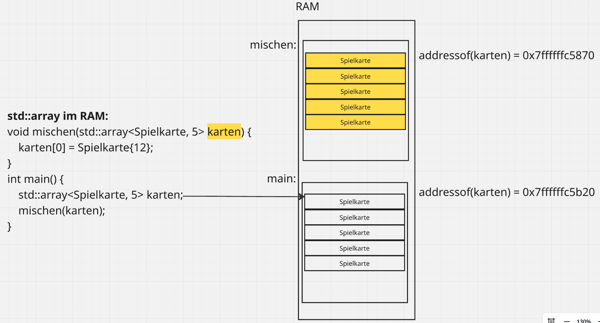
>
> Call by Reference
> - Variablen werden beim Methoden-Aufruf an eine Methode mit Call-By-Reference übergeben, wenn nur die Referenz auf den Variablen-Wert im Speicher übergeben wird.
>
>   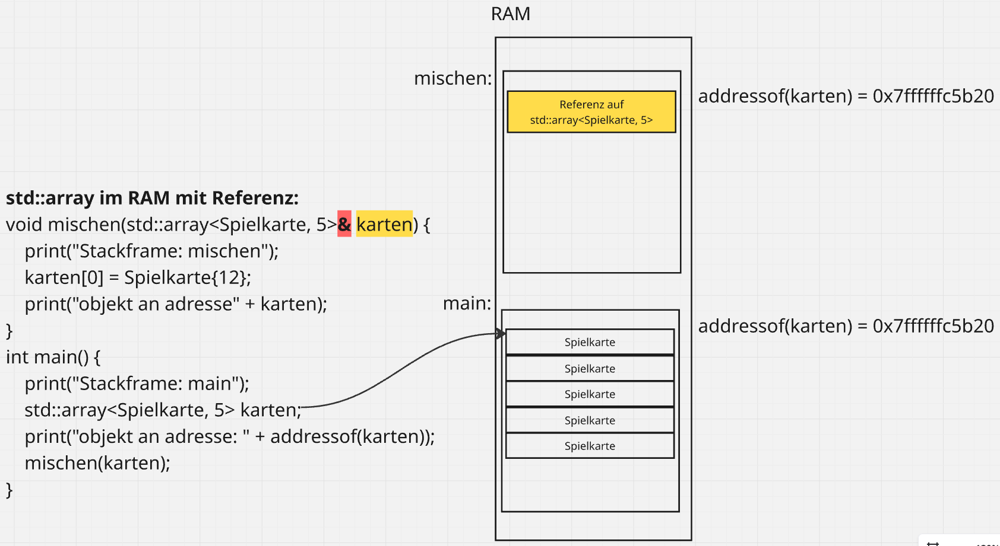

**Statische Datentypen == statische Typisierung**
> statisch typisiert
> - Typ ist fix, nur unsichtbar, z.B. `auto f{3.14}`
> - Compiler leitet Typ nur her → **Typ Inferenz**
- Typ jeder Variable steht zur Compilezeit fest und Compiler prüft Typkorrektheit vor Ausführung
- Folglich kann Compiler Stack-Frame berechnen, weil Type (und `sizeof`) zur Compilzeit bekannt sind.
- Python oder JavaScript sind dynamisch typisiert, das heißt die Typen stehen erst zur Laufzeit fest.

**Kritik: Sicherheitslücke durch Speicherverwaltung**
- C++ macht Freigabe manuell, demnach ist es nur sicher, wenn der Entwickler es richtig macht.
- manuelle Speicherverwaltung (kein Garbage Collector, Raw Pointer, new/delete) erlaubt die **Fehlerklassen**: 
  - **doppeltes `delete`**
  - **dangling Pointer** (Zustand)  
    - Pointer hält Adresse, aber das Objekt existiert dort nicht mehr. 
    - Kommt durch Heap-Freigabe mit `delete` oder Pointer/Referenz zeigt auf lokale Variable deren Stack-Frame beim Rücksprung verschwunden ist. 
  - **use-after-free** (Handlung)
    - Dereferenzierung eines Pointer, das heißt Lese-/Schreibzugriff auf bereits freigegebenen Heap-Speicher.
    - Kommt durch Nutzung eines dangling Pointers.
  - **Buffer Overflows**
    - Zugriff über die Grenzen eines Puffers hinaus
    - Raw-Arrays oder `operator[]` machen keine Bereichsprüfung, der Zugriff gelingt und überschreibt benachbarten Speicher.
    - Sicherheitskritisch ist **Stack Buffer Overflow**: Möglichkeit die Rücksprungsadresse zu überschreiben, wodurch ein Angreifer den Programmfluss auf seinen Code umlenkt.
- **Array kennen keine Länge**
  - `at()` macht Bereichsprüfung und wirft bei Überschreitung ein `std::out_of_range`, `operator[]` nicht
- Google & Microsoft berichten, dass ca. 70% ihrer schweren Sicherheitslücken auf fehlende Memory Security zurückzuführen ist.

**Alternative Programmiersprachen**
- **RUST**: 
  - Systemnah wie C++, aber die **Memory Safety wird zur Compilezeit über das Ownership-/Borrows-Checker-Modell erzwungen** ohne Garbage Collector
  - **keine Laufzeitkosten**
  > Ownership
  > - Jeder Wert hat zu jedem Zeitpunkt einen Besitzer (Variable). Endet dessen Gültigkeitsbereich, wird der Wert freigegeben. (→ RAII und `unique_ptr`)
  > - Standardregel für jeden Wert, kein Optin über Bibliotheksklasse
  > - Wird ein Wert einer anderen Variable zugewiesen, wird der Besitz verschoben (`move`) und alte Variable ungültig. Der Compiler verbietet weiteren Zugriff.
  > Borrowing
  > - "Ausleihen" per Referenz, ohne Besitz zu übergeben.
  > - Geprüfte Regel zur Compilezeit: Entweder beliebig viele lesende Referenzen (`&`) oder eine schreibende Referenz (`&mut`), nie beides gleichzeitig. Keine Referent darf ihren Besitzer überleben.
  - **Effekt: RUST ist sicherer als C++ → Fehlerklassen werden zu Compiler-Fehler statt zu Runtime-Abstürzen oder Sicherheitslücken. C++: Selbe Idee, aber Konvention und Disziplin, Compiler zwingt dich nicht.**
- **Java, C#, Go**
  - speichersicher, aber **Sicherheit wird per Garbage Collector zur Runtime erkauft**
  - GC: Laufzeit-Mechanismus verfolgt, welche Objekte noch erreichbar sind und gibt nicht mehr erreichbaren Speicher automatisch frei, folglich ist kein use-after-free oder doppeltes Free möglich.
  - **Laufzeit-Overhead**: GC läuft während Programm, verbraucht CPU-Zeit und zusätzlichen Speicher und läuft nicht-deterministisch (ungezwungen → er startet, "wann es ihm passt")
  - Daher für harte Echtzeit- und Kleinstgeräte-Fälle ungeeignet
> C++ = schnell, aber unsicher, wenn man Fehler macht.
> RUST = schnell und sicher, aber der Compiler ist streng.
> Java/Go = sicher und bequem, aber Laufzeitkosten durch GC.

**Speicher im Micro-Controller** 
- Fensterheber: 
  - simpler 8-Bit-Controller
  - wenig Rechenleistung nötig, dafür extrem billig und stromsparend
  - meist wenige KB RAM und einige MHz (z.B. 16 MHz bei *ATmega328P*)
- batteriegetriebene Messgeräte
  - 16-Bit (z.B. *MSP430*) 
  - extrem niedriger Stromverbrauch
  - etwas mehr Rechenkraft und Adressraum als 8-Bit und sparsamer als 32-Bit
- Motorsteuerung
  - 32-Bit (z.B. *ESP32*)
    - ESP32 = Paradebeispiel, weil er WLAN und Bluetooth integriert hat und daher in viele IoT-/SmartHome-Systeme steckt. 
  - echte Rechenleistung, viel Speicher oder Konnektivität benötigt
  - Hier läuft schon ein kleines Echtzeit-Betriebssystem und OOP/C++ mit vtables wird bezahlbar, weil viel Speicher da ist.
- Je mehr Rechenleistung, Speicher und Konnektivität, desto weiter nach oben.
- Je mehr es auf Preis und Stromsparen ankommt, desto weiter nach unten.
- Auf kleinen Controllern nimmt man C/C++, weil Objektorientierung mit vtable, Heap Verwaltung etc. zu viel vom knappen Speicher wegnehmen würde

### Umsetzung mit VS Code
- Visual Studio Code-Erweiterung „Entwicklungscontainer“ ermöglicht Nutzung eines Docker-Containers als vollwertige Entwicklungsumgebung.
  - Beliebige Ordner innerhalb eines Containers öffnen
  - vollen Funktionsumfang von VS Code nutzen
- `devcontainer.json` teilt VS Code mit, wie ein Entwicklungscontainer mit einem klar definierten Tool- und Laufzeit-Stack erstellt oder darauf zugegriffen werden kann.
- Dieser Container kann zum Ausführen einer Anwendung oder zum Trennen von Tools, Bibliotheken oder Laufzeitumgebungen verwendet werden, die für die Arbeit mit einer Codebasis benötigt werden.
- Vorgehen
  - Arbeitsbereichsdateien werden vom lokalen Dateisystem eingebunden oder in den Container kopiert oder geklont.
  - Erweiterungen werden im Container installiert und ausgeführt und haben dort vollen Zugriff auf Tools, Plattform und Dateisystem.
  - So können Sie Ihre gesamte Entwicklungsumgebung nahtlos wechseln, indem Sie einfach eine Verbindung zu einem anderen Container herstellen.

**Containerarchitektur**

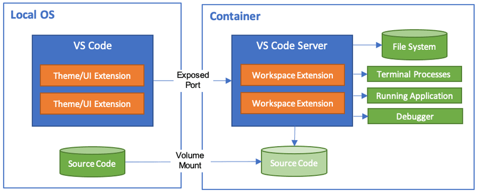

- VS Code bietet ein Entwicklungserlebnis in lokaler Qualität, einschließlich vollständiger IntelliSense-Funktionen (Codevervollständigung), Codenavigation und Debugging, unabhängig davon, wo sich Ihre Tools (oder Ihr Code) befinden.
- Die Dev Containers-Erweiterung unterstützt zwei primäre Betriebsmodelle:
  - Sie können einen Container als Ihre vollständige Entwicklungsumgebung nutzen.
  - Sie können sich mit einem laufenden Container verbinden, um ihn zu untersuchen.

### Speicher
**Call-Stack**
- **automatischer Speicher**, der in Stack-Frames (Aktivierungsblöcke) organisiert ist
  - Pro Funktionsaufruf ein Frame
  - In einem Frame liegen lokale Variablen, Rücksprungsadressen und gesicherte Registerinhalte
- Jeder Threat hat einen eigenen Callstack, weil jeder Threat eine eigene Aufrufkette hat
- **Die Größe des Stack-Frame muss zur Compilezeit feststehen**
  - Compiler erzeugt Code, der beim Funktionaufruf den Stack-Pointer um einen festen Betrag verschiebt und ihn beim Verlassen wieder zurückdreht
  - Frame-Größe zur Compilezeit, bestehend aus Signatur, lokaler Variablen und Rückgabewert, bestimmt den Betrag
- Vorteile
  - **O(1) → konstante Laufzeit**: 
    - Auf-/Abbau eines Frames kostet nur das Verschieben des Stack-Pointers um einen festen Betrag, unabhängig von der Anzahl bestehender Frames
    - auch bei `[]`-Zurgiff auf `std::vector`, da die Adresse direkt aus *Basisadresse + Index x Elementgröße* berechnet wird
  - **LIFO → Last In First Out**:
    - automatische Freigabe am Ende des Gültigkeitsbereichs 
  - **keine Fragmentierung aufgrund strenger LIFO**
    - Es wird immer oben aufgelegt und weggenommen
    - Grenze: Stack-Pointer → darunter ist alles lückenlos belegt und darüber alles frei
    - somit können keine Löcher entstehen
    - Einer der Gründe für Geschwindigkeit des Stacks
- Nachteile
  - Größe ist fix
  - Lebensdauer an Scope gebunden

**Heap**
- **dynamischer Speicher**
- gehört dem gesamten Prozess, alle Threats teilen sich einen Heap
- Anlegen von Objekten mit beliebiger Größe zu beliebiger Zeit und manuell steuerbarer Lebensdauer (maximal bis Prozessende)
- Allokation mit `new`
  - alloziert zusammenhängenden Speicherblock von `sizeof(T)` Byte 
  - ruft bei Klassentypen den Konstruktor auf und liefert einen Zeiger auf das Objekt zurück
  - reicht der Speicher nicht, wirft es `std::bad_alloc`
- Freigabe mit `delete`, bei Arrays `delete[]`
  - ruft den Destruktor auf bevor es freigibt
- Vorsicht: Der Entwickler ist selbst verantwortlich
  - Allokation ist vergleichsweise teuer
  - `delete` vergessen → Speicherloch (**memory leak**)
  - Zugriff nach `delete` → use-after-free (**undefined behaviour**)
- Typisches Problem: Fragmentierung
  - Freier Speicher liegt in vielen, kleinen, nicht zusammenhängenden Lücken verstreut, sodass eine große Anforderung scheitert, obwohl in SUmme genug frei wäre
  - Wenn in wechselnder Reihenfolge Blöcke unterschiedlicher Größe alloziert und freigegeben werden, entstehen diese Löcher zwischen belegten Blöcken. 

**Callstack vs Heap**

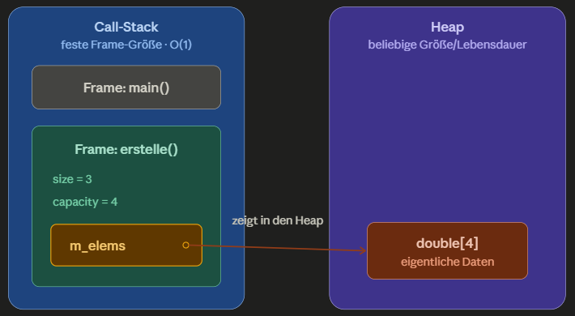

- **Auf dem Stack liegen nur Metadaten fester Größe** 
- **Auf dem Heap liegen die eigentlichen, dynamischen großen Daten**
- Folglich hat `erstelle()` eine feste, zur Compilezeit bekannte Größe, obwohl der Vektor zur Laufzeit wachsen kann.

> Warum können Datenstrukturen mit dynamischer Größe nicht komplett auf dem Callstack liegen?
> - Weil Frame-Größe zur Compilezeit feststehen muss, damit der Compiler den Stack-Pointer um einen festen Betrag verschieben kann.
> - Man könnte Stack-Pointer theoretisch zur Laufzeit anpassen, aber wenn Datenstruktur mehrere Frames tiefer liegt, müsste man beim Vergrößern alle darüberliegenden Frames verschieben.
> - Unpraktikabel aus **Performance- und Komplexitätsgründen**.
>
> Rückfrage 1: Der Pointer `m_elems` ist ein Raw Pointer und drückt keinen Besitz (**Ownership**) aus. Wer ist verantwortlich den Heap-Speicher also freizugeben?
> - Problem: Raw Pointer ist eine nackte Adresse, man sieht ihm also nicht an, ob er aufräumen muss oder nur beobachtet.
>   - Bei Vergessen des `delete`, vorzeitigem `return` oder Exception verliert man die letzte Referenz → memory leak
>   - Ruft man `delete` doppelt auf, gibt es ein undefined behaviour
> - Lösung: RAII + Smart Pointer
>   - `unique_ptr` macht Besitz im Typ sichtbar und gibt im Destruktor frei
>   - C++ garantiert, dass dieser am Ende des Gültigkeitsbereich aufgerufen wird, egal ob normal, per `return` oder per Exception.
> - Deshalb braucht man kein `finally`
>   - Java-Konstrukt bei `try/catch`, das garantiert ausgeführt wird und der Aufräumanweisung für den Garbage Collector dient
>   - **Bei C++ liefern Destruktor & RAII die Aufräumgarantie**
>   - Destruktor wird am Ende des Gültigkeitsbereichs aufgerufen, sei es bei normalem Verlassen, bei `return` oder auch beim Stack Unwinding (Abbau) einer Exception.
> 
> Rückfrage 2:
> - Weil der Frame von `erstelle()` beim Rücksprung verschwindet, darf keine Referenz oder Pointer auf eine lokale Variable zurückgegeben werden, da diese sonst auf abgebauten, ungültigen Speicher zeigt (**dangling Pointer**).
> - Der Vektor kann aber effizient zurückgegeben werden, weil die Move-Semantik dem Rückgabewert die Heap-Daten "klaut", statt sie zu kopieren.
>
> Rückfrage 3:
> - Wenn eine Klasse so einen Heap-Pointer als Member hat, brauchst du auch eigenes Kopieren und Verschieben (**Rule of 3/5**), sonst hat man Shallow Copy oder am Ende einen doppelten `delete`.
>   - Shallow Copy (flache Kopie) = kopiert nur Member-Werte eines Objektes; bei einem Pointer also nur die Speicheradresse, nicht den deren Inhalt. Dies entspricht dem Standard-Verhalten des vom Compiler generierten Kopierkonstruktors.
>   - Doppeltes `delete` auf denselben Speicher = undefined behaviour
>     ```C++
>     MyVector a{...};   // a.m_elems zeigt auf Heap-Block X
>     MyVector b = a;    // Shallow Copy: b.m_elems zeigt AUCH auf Block X
>     ``` 
>   - Lösung: **Deep Copy** mit selbstgeschriebenem Kopiekonstruktor
>     - Alloziert eigenen neuen Heap-Block und kopiert Inhalt hinein, sodass jedes Objekt seinen eigenen Speicher besitzt.
>     - **Rule of 3/5**: Heap-Speicher verlangt Destruktor → wird fast immer Kopierkonstruktor und eine Kopier-Zuweisung benötigt, sonst bekommt man kaputt Shallow Copy.

### Programmstruktur
**`main()`**
- Einstiegspunkt mit Rückgabetyp `int`
- Rückgabewert ist der Exit-Code an das Betriebssystem:
  - `0` entspricht Erfolg, alles andere signalisiert einen Fehler.
- einzige Funktion, die ohne `return` automatisch `0` zurürckgibt
- 2 gültige Signaturen:
  - `int main()`
  - `int main( int argc, *char argv[] )`für Kommandozeilenargumente

**Freie Funktionen**
- Funktionen, die nicht an eine Klasse gebunden sind, sogenannte "Nicht-Memberfunktionen"
  - Beispiel: `main()`
- C++ = Multiparadigmensprache, das heißt freie Funktionen sind vollwertig und der Normalfall für alles, was nicht zum Zustand eines Objektes gehört.
- Gegensatz Java: Alles steht in einer Klasse, auch `main` ist eine statische Methode

**Lokale Variablen**
- leben im Stack-Frame
- automatischer Speicher, Scope-gebunden

### Namensräume
> bekannter Bereich, der Namen (Funktionen, Klassen, Variablen) gruppiert und so Namenskollisionen vermeidet.
> Namensraum macht Namen eindeutig, indem er sie "unter ein Dach" stellt
> In großen Projekten mit vielen Bibliotheken können 2 davon eine Funktion `sortiere()` oder Klassen `Logger` definieren → mögliche Konflikte

- Vergleich zu Java: ähnlich wie Packages nur ohne Bindung an Verzeichnisstruktur

**`std::`**
- `std` kapselt Standard-Bibliothek, dass ihre Namen nicht mit den eigenen kollidieren
- `::` ist der Bereichsauflösungsoperator (scope resolution operator)

**`using`**
1. Direktive: `using namespace std;`
  - zieht ganzen Namensraum bequem hinein
  - in Headern verpönt, da überall Namenskollisionen riskiert werden
2. Deklaration: `using std::cout;`
  - holt nur einen Namen
3. Typalias: `using Karte = std::vector<Spielkarte>`
  - gibt einem Type einen kürzeren Namen

**Arten von namespaces**
- Erweiterbarkeit
  - selben Namensraum an mehreren Stellen öffnen und ergänzen (wie es bei `std` der Fall ist)
- Verschachtelung für hierarchische Gliederung: `namespace a::b::c {}`
- Anonymer Namensraum: `namespace {...}`
  - Alles darin ist nur in der eigenen Übersetzungseinheit sichtbar
  - Modernes Mittel für "datei-lokal", ersetzt das alte `static` bei freien Funktionen

### Kontrollfluss: `if` und Schleifen
- Bekannt: `if / else`, `for`, `while`, `do-while`
- moderne Ansätze:
  - **range-based for loop**: `for( const auto &karte : kartenstapel )`
  - **if mit Initialiserer**: `if( auto it = map.find( x ); it != map.end() ) {...}`
- Empfehlung: Nutzung von Standard-Bibliothek-Methoden bevorzugen → Compiler versteht die Algorithmen und kann besser optimieren

### `auto`
- Typ Inferenz zur Compilezeit
- spart Tipparbeit, vermeidet Redundanz, ändert aber nichts an der statischen Typisierung

### Ein- / Ausgabe
**`std::cin`**
- ist der Eingabestrom (console in, `std::istream`)
- **`>>` ist der überladene Eingabeoperator**
  - überspringt fhrende Lehrzeichen und liest bis zum nächsten Whitespace
  - liest Token, keine ganze Zeile (für Zeile mit Leerzeichen: `std::getline`)
  - Prüfen, ob Eingabe gültig war: `if( std::cin >> wert ) = true`
  - für eigene Typen kann man `operator>>` schreiben
- Klassische Endlosschleifen-Falle:
  - Eingabe von Buchstaben statt erwarteter Zahlen → Strom geht in Fehlerzustand (fail state)
  - Wert bleibt unverändert und jedes weitere Einlesen scheitert auch bis Strom mit `.clear()` zurückgesetzt und ungültige Eingabe mit `.ignore()` verworfen wird

**`std::cout`** 
- ist der Ausgabestrom (console out, ein `std::ostream`)
- Schreibt aus Performancegründen nicht jedes Zeichen einzeln zum Terminal
- Sammelt Ausgaben in einem Puffer im Speicher und schreibt diese gebündelt raus
- **`<<` ist der überladene Ausgabeoperator**
  - für eigene Typen kann man `operator<<` schreiben
> **Flush** = Ausgabepuffer sofort leeren, also zwischengespeicherten Text rausschreiben

**`\n`**
- Standard für Zeilenumbruch
- Der Puffer wird geleert, wann es dem System passt (pätestens am Programmende)

**`std::endl`**
- Nutzung, nur wenn die Ausgabe garantiert sofort sichtbar sein muss (z.B. vor Absturz oder bei fortschrittsanzeigender Ausgabe)
- Generiert Zeilenumbruch und flusht zusätzlich den Puffer
- Kostet in einer Schleife spürbar Performance, da bei jedem Durchlauf ein Flush erzwungen wird.

**`#include`**
- fügt über den Präprozessor den kompletten Text der Haader-Datei ein
  - `<iostream>` für Standard-Header
  - `"meins.hpp"` für eigene Header

**`std::print / std::println` und `std::format`**
- Moderne, komfortablere Ausgabe
- übernimt Funktionalität der externen `{fmt}`-Bibliothek in die Standard-Bibliothek, mit Format-Strings wie `std::println( "i = {}", i )`

### Speicheradresse
- `&` als **Adressoperator** (überladbar / umdefinierbar): `auto p = &i;`
- `std::addressof( x )` 
  - liefert die echte Adresse, egal ob `operator&` überladen wurde
  - robuste Variante, wenn man sich nicht auf das Verhalten des Typs verlassen kann

- `&` als **Referenz-Deklaration**: `int &ref = i;`
  - `&x` liefert Speicheradresse der Variable `x` → Grundlage für Zeiger
  - `&` ist das freundliche `*`, beides ist eine Referenz

### Unit-Testing mit Catch2
> Automatisiert und isoliert einzelne Einheiten (Funktionen, Klassen) prüfen
> Fehler früh und reproduzierbar aufdecken

- Bedingungen mit `REQUIRE(...)`
- Beispiel:
  ```C++
  #include <catch2/catch_test_macros.hpp>

  unsigned int Factorial( unsigned int number ) {
    return number <= 1 ? number : Factorial(number-1)*number;
  }

  // ↓

  TEST_CASE( "Factorials are computed", "[factorial]" ) {
    REQUIRE( Factorial(0) == 1 ); // throws exception
    REQUIRE( Factorial(1) == 1 );
    REQUIRE( Factorial(2) == 2 );
    REQUIRE( Factorial(3) == 6 );
    REQUIRE( Factorial(10) == 3628800 );
  }

  // ↓

  unsigned int Factorial( unsigned int number ) {
    return number > 1 ? Factorial(number-1)*number : 1;
  }
  ```

**Vergleich von Fließkommazahlen**
- `float` und `double` niemals mit `==` vergleichen, weil die meisten Dezimalzahlen im binären IEEE-754-Format nicht exakt darstellbar sind
- Beispiel: `0.1 + 0.2 != 0.3`
- Problem: Rundungsfehler in der binären Gleitkommdarstellung
- Lösung: **Vergleich innerhalb einer Toleranz (Epsilon) und lieber relativ als absolut**
- Fertige Matcher von Catch2: 
  - `WithinAbs( ziel, epsilon )` prüft absolute Toleranz
    - Eine absolute Toleranz (fester Abstand) passt gut für Zahlen nahe null, wird aber bei großen Zahlen unbrauchbar (fester Abstand von 0.0001 ist bei einem Wert von 1_000_000 sinnlos streng).
    - Beispiel: *Ist der Wert höchstens `epsilon` von `ziel` entfernt?*
  
  - `WithinRel( ziel, epsilon )` prüft die relative Toleranz
    - Eine relative Toleranz (Prozentsatz) skaliert mit der Größe und ist deshalb meist die bessere Wahl, versagt aber genau bei null (relativ zu null ist jede Abweichung "unendlich" groß).

> **In der Praxis werden beide oft kombiniert. Der Kerngedanke: Wegen Rundungsfehlern bei Gleitkommadarstellung vergleich man nie auf Gleichheit, sondern immer auf "nah genug".**

### Klassen
> - Bauplan für einen eigenen Datentyp. Sie bündelt zwei Dinge:
> 1. Datenelemente (Attribute / Member-Variablen → Zustand)
> 2. Member-Funktionen (Methoden → Verhalten)
> - Ein konkretes Exemplar nennt man Objekt oder Instanz.

```C++
class Spielkarte {
public:
  Spielkarte(int wert) : _wert{wert} {} // Konstruktor
  int getWert() const { return _wert; } // const-Getter

private:
  int _wert; // Datenelement (Zustand)
};
```

**Kapselung (encapsulation)**
- zentrales Prinzip
- interner Zustand wird nach außen verborgen, Zugriff läuft über kontrollierte Schnittstelle

**Zugriffsspezifizierer**
1. `private`: nur innerhalb der Klasse sichtbar
2. `public`: von überall zugänglich (Schnittstelle)
3. `protected`: wie private, aber zusätzlich für abgeleitete Klassen sichtbar

- Warum kapseln?
  - Um interne Darstellung zu ändern ohne den Nutzer-Code zu brechen
  - Zur Vermeidung der Entstehung ungültiger Zustände (Konstruktor und Methoden wachen über die Regeln)
  - Daher sind Datenelemente `public` und der Zugriff läuft über `public`-Methoden

**Unterschied zwischen `class` und `struct`**
- technisch identisch bis auf den Standard-Zugriff
- `class`: 
  - alles ohne Angabe ist `private`
  - für alles mit Invarianten und Verhalten
- `struct`: 
  - alles ohne Angabe ist `public`
  - für simple Datenbündel ohne Kapselung (reine Wertträger)
  - Geheimhaltungsprinzip aufgelöst

**Konstruktor**
- spezielle Methode, die beim Erzeugen eines Objektes aufgerufen wird und es in einen gültigen Anfangszustand bringt
- sorgt dafür, dass ein Objekt nie uninitialisiert existiert
- Default Konstruktor = Konstruktor ohne Parameter
  - wird automatisch vom Compiler erzeugt, wenn dieser nicht manuell angelegt wird

**Destruktor**
- Wenn Konstruktor `C` heißt, dann heißt Destruktor `~C`
- C++ garantiert, dass der Destruktor am Ende des Gültigkeitsbereichs aufgerufen wird
- primitive Datentypen haben keinen Destruktor
- Die Verwendung von `delete this` im eigenen Destruktor ist falsch
  - Compiler weiß nicht, ob er Raw Pointer (Zeiger auf Ressource) löschen darf
  - Compiler weiß nicht, in welchem Speicherbereich das Objekt liegt → SmartPointer nutzen

**Member-Initialisierungsliste**
- Variable mit `_wert` = Daten-Member (Member = Datenwert)
- Bevor man in den Body des Constructors kommt, werden die Member default initialisiert, um im nächsten Schritt überschrieben zu werden (→ Assembler: 2x `STO`)
- Vermeidung durch Zuweisung direkt in der Konstruktorzeile:

  ```C++
  Spielkarte::Spielkarte(int wert) : _wert{wert} {}
  ```

- Warum die Liste und keine Zuweisung im Rumpf?
  1. Member werden in der Liste direkt initialisiert, im Rumpf dagegen erst default-konstruiert und dann zugewiesen. Effizienzsteigerung bei teuren Membern, wie `std::string`
  2. `const`-Member und Referenz-Member müssen zwingend in die Liste, weil man diese nach ihrer Erzeugung nicht mehr zuweisen.
  3. Member ohne Default-Konstruktur
  
  > - Member gehören in die Initialisierungsliste, nicht in den Rumpf
  > - Member werden in Reihenfolge ihrer Deklaration in der Klasse initialisiert, nicht in der Reihenfolge der Liste. Aufpassen, wenn ein Member von einem anderen abhängt.

**Der `this`-Zeiger**
- Innerhalb einer Member-Funktion ist `this` ein Zeiger auf das aktuelle Objekt, auf dem die Methode aufgerufen wird
- selten benötigt, nur bei Namensgleichheit (`this->_wert = wert;`) oder wenn das eigene objekt zurückgegeben wird.
- In einer `const`-Methode ist `this` ein Zeiger auf ein `const`-Objekt, weshalb man dort keine Member ändern kann.

**Getter, `const`, Rückgabetyp**
- Getter sollte `const` sein (reine Abfrage ohne etwas zu verändern und aufrufbar auf `const`-Objekten)
- Getter möglichst mit `const`-Referenz-Rückgabetyp:

  ```C++
  const std::string &getName() const { return _name; }
  ```

  - Bei teuren Typen spart das die Kopie (→ Effizienz)
  - `const` an der Referenz verhindert, dass der Aufrufer über den Getter am internen Zustand herumpfuscht
  - Bei billigen Typen (`int`) gibt man die Kopie zurück.

**Lebensdauer: Konstruktor rein, Destruktor raus**
- Zu jedem Konstruktor gehört ein Destruktor (`~Spielkarte()`), der beim Zerstören des Objektes aufgerufen wird
- bei lokalem Objekt automatisch am Ende des Gültigkeitsbereichs
- hat eine Klasse nur einfach Member, reicht der vom Compiler erzeugte Destruktor
- besitzt eine Klasse eine Ressource (Heap-Speicher, Datei, Sperre) muss der Destruktor ausräumen → hier greift **RAII** und die **Rule of 3/5**

### `explicit`
- verhindert die implizite Umwandlung vom Argumenttyp in den Klassentyp bzw. stillschweigende Typumwandlung
- Konstruktor lässt sich nur noch direkt aufrufen, nicht als versteckte Konvertierung

> Ein-Argument Konstruktor fast immer `explicit`, außer man will die implizite Umwandlung bewusst.
> Grund: Implizite Umwandlungen führen zu überraschenden, schwer auffindbaren Bugs.

```C++
// ohne explicit
class Karte { public: Karte( int wert ); };
void f( Karte k );
f(5); // kompiliert!  5 wird still zu Karte{5} — meist ungewollt

// mit explicit
class Karte { public: explicit Karte( int wert ); };
f(5); // FEHLER — keine implizite Umwandlung
f( Karte{5} ); // OK — explizit
```

### `[[nodiscard]]`
- Attribut an einer Funktion, das den Compiler warnen lässt, wenn man Rückgabewert ignoriert
- Wird das Ergebnis weggeworfen, war der Aufruf entweder sinnlos oder man übersieht was wichtiges

```C++
[[nodiscard]] bool istLeer() const;
istLeer(); // Compiler-Warnung: Rückgabewert ignoriert
```

- Standardbeispiel: `[[nodiscard]] std::vector::empty()`
  - `empty()` = fragt, ob leer
  - `clear()` = macht leer
  - wird das Ergebnis von `v.empty();` ignoriert, meinte man vermutlich `v.clear()`
  - Warnung fängt diesen Bug ab

### `const` (Unverändertbarkeitsversprechen)
- Versprechen an den Compiler, dass sich etwas nach der Initialisierung nicht mehr ändern wird
- reine Typprüfung, die einen Compile-Fehler wirft, wenn man dagegen verstößt

- Einsatzorte:
  1. Macht eine Variable nach Initialisierung unveränderbar; immuable, read-only Zugriff:

  ```C++
  const int maxKarten{150};
  ```

  2. Verspricht, dass die Member-Funktion den Objekzustand (Member) nicht verändert:

  ```C++
  int getWert() const { return _wert; }
  ```

- Innerhalb einer const-Methode ist `this` ein Zeiger auf ein `const`-Objekt, du kommst also an keinen Member schreibend heran, der Compiler verbietet es.

- **Auf einem `const`-Objekt (oder `const`-Referenz) dürfen nur `const`-Member-Funktionen aufgerufen werden.**
- `const`-Referenzen sind durch "Pass-by-const-Reference" überall
  - Referenz vermeidet die Kopie des Objektes und `const` stellt sicher, dass die Funktion das Original trotzdem nicht verändert → Effizienz und Sicherheit
  - Daher sind Getter immer `const`, da dieser sonst nicht auf einem `const`-Objekt aufrufbar ist

- Vorteile aus Entwicklersicht:
  - **const-correctness**
    - Absicht ausdrücken
    - Fehler durch versehentliche Änderungen wird zur Compilezeit abgefangen
    - billiger als Runtime-Error
  - **Schnittstellen-Klarheit**
    - `const`-Parameter sagt "Ich lese das Objekt nur, ich verändere es nicht."
    - `const`-Getter sagt "Reine Abfrage ohne Nebenwirkung"
    - `const` ist folglich selbst-erzwingende "Dokumentation" (Zwang durch Compiler)
      - Kommentar informiert, aber `const` informiert und garantiert

- Nebeneffekt Optimierung:
  - **Wegen Aliasing kann der Compiler bei einem `&const`-Parameter nicht garantieren, dass sich der Wert nicht ändert. Anderer nicht-`const`-Zeiger kann dasselbe verändern.**
  - Werkzeug für **echten Compilezeit-Gewinn** wäre `constexpr` für die Berechnung zur Compilezeit statt zur Laufzeit

- Vergleich zu `final` (Java)
  - `final` schützt nur die Variable, nicht den Inhalt
  - Variable kann nicht neu zugewiesen werden, aber z.B. `final List<Karte> stapel` kann dennoch erweitert werden mit `stapel.add(...)` oder verändert mit Setter
  - Java kennt kein Gegenstük zu `const`, man muss auf Koventionen und Immutable-Klassen (wie `String`) ausweichen

  > - Java nagelt die Variable fest.
  > - C++ friert das ganze Objekt ein.

**`const` bei Zeigern**
- Zeiger besteht aus zwei Dingen
  1. Zeiger (Adresse, die er speichert)
  2. Wert, auf den er zeigt (Inhalt der Adresse)
- `const` kann verbieten, die Zeiger umzuhängen oder Wert zu ändern oder beides

- Fall 1: Fester Wert, beweglicher Zeiger
  - Der Wert auf den `p` zeigt ist unveränderbar, `p` selbst darf umgehängt werden

  ```C++
  int a = 10, b = 20;
  const int* p = &a; // "p ist ein Zeiger auf ein const int"
  *p = 99; // FEHLER — Wert ist const
  p = &b; // OK
  ```

- Fall 2: Fester Zeiger, beweglicher Wert
  - Zeiger darf nicht umgehangen werden, der Wert schon.

  ```C++
  int a = 10, b = 20;
  int* const p = &a; // "p ist ein const Zeiger auf int"
  *p = 99; // OK
  p = &b; // FEHLER - Zeiger ist const
  ```

- Fall 3: Fester Zeiger, fester Wert
  - Weder Zeiger umhängbar noch Wert änderbar

  ```C++
  int a = 10, b = 20;
  const int* const p = &a;
  *p = 99; // FEHLER — Wert ist const
  p = &b; // FEHLER - Zeiger ist const
  ```

- Warum kommt das überhaupt so oft vor?
  - Fall 1 kombiniert mit dem Getter-Thema: `const T&` als Funktionsparameter verweist auf etwas, das nur gelesen, aber nicht verändert werden soll.

**`mutable`**
- einzelner Member wird trotz `const` veränderbar
- Typischer Einsatz: Cache oder Mutex
  - Dinge, die den logischen Zustand des Objektes nicht betreffen
  - kontrollierte Ausnahme von der Regel

**`const`-Overloading**
- Methode zweimal anbieten, einmal `const` und einmal nicht

```C++
T &at( size_t i ); // für nicht-const-Objekte, erlaubt Ändern
const T &at( size_t i ) const; // für const-Objekte, nur lesen
```

- je nach Konstanheit des Objektes wählt der Compiler die passende Version
- genauso macht es `std::vector`

### Exceptions
> - Mechanismus zur Fehlerbehandlung, der den normalen Ablauf sauber vom Fehlerpfad trennt.
> - Alternative: Fehler über Fehlercodes als Rückgabewert → 2 Schwächen:
> 1. Man kann Rückgabewert ignorieren (Fehler geht unter)
> 2. Eigentlicher Code verstopft mit `if( fehler )` Prüfungen
> - Wird die Exception nicht gefangen, bricht das Programm kontrolliert ab.

```C++
try {
auto karte = stapel.ziehe(); // wirft evtl. std::out_of_range
} catch (const std::out_of_range& e) {
  std::println("Fehler: {}", e.what());
}
```

**Stack Unwinding**
> Bei Exception sucht C++ nach passendem `catch` und baut Callstack Frame für Frame ab.

- mit `throws` oder `try{} catch{}`
- Beim Aubbau werden die Destruktoren aller lokalen Objekte in den verlassenen Frames korrekt aufgerufen.
- kein `finally` nötig (wird bei Java immer ausgeführt), weil RAII Ressourcen (`unique_ptr`, `std::vector`) durch Unwinding im Destruktor freigegeben werden.
- Nacktes `new` ohne Smart Pointer bei Exception ist gefährlich, da `delete` übersprungen wird und ein memory leak entsteht → Grund für RAII

**Exception Hierarchie**
- `std::exception` = Basisklassen mit Vererbungshierarchie
- `std::runtim_error` → erst zur Laufzeit erkennbar
- `std::logic_error` → Programmierfehler
- `std::out_of_range` → Bereichsprüfung mit `at()` → ungültiger Index 
- `std::invalid_argument` & `std::bad_alloc` → kein Speicher mehr
- `std::domain_error { std::format(...) }` → wir halten uns nicht an Eingabebereiche (Strings sind Arrays mit terminierender 0 → `format` verwenden)

- Basisklasse hat virtuelle Methode `what`, die die Fehlerbeschreibung als `const char*` liefert
- Eigene Exception-Typen definiert man durch Ableitung von `std::exception` & `std::runtim_error`

- **Abwägung `operator[]` oder `at()`**
  - Sicherheit-gegen-Geschwindigkeit-Kompromiss
  - `[]` macht keine Bereichsprüfung, greif folglich auf ungültigen Index zu → undefined baviour
    - unsicher
    - schneller Zugriff
    - kein sofortiger Fehler, Programm liefert Müll oder überschreibt fremden Speicher (Buffer Overflow)
  - `at()` macht Bereichsprüfung und wirft `std::out_of_range` Exception
    - sicher
    - Prüfung kostet bei jedem Zugriff Zeit
    - mit `try/catch` abfangen

  > - `at()`, wenn der index aus einer unsicheren Quelle kommt (Nutzereingabe) und ein Fehler abfangbar sein soll.
  > - `[]`, wenn durch die Programmlogik ohnehin sicher ist, dass der Index gültig ist (z.B. bei `for`-Schleife von `0` bis `size()`)

**Catch by `const&` - Bezug zu Object Slicing**

```C++
catch (const std::exception& e) // Abfangen per `const`-Referenz → richtig
catch (std::exception e) // Anfangen per Wert → falsch → Object Slicing
```

- Per Wert wird eine abgeleitete Exception auf Basisklasse zurechtgeschnitten (**Object Slicing**)
  - Konkrete Typinformation geht verloren, die virtuell `what()` liefert nur Basis-Meldung
- Per Referenz bleibt der konkrete Typ erhalten und die Polymorphie (Basis `virtual`) funktioniert
- 3 Detail-Regeln:
  1. `catch`-Blöcke von speziell zu allgemein ordnen (der erste passende greift)
  2. `catch(...)` fängt alles
  3. `throw;` ohne Argument im `catch` reicht die Exception unverändert weiter (**rethrow**)

**Wann exception, wann nicht?**
- Exceptions sind für **außergewöhnliche Situationen**, nicht für normalen Kontrollfluss
- Der Fehlerpfad (Unwinding) ist relativ teuer, der Normalpfad praktisch kostenlos → **zero-cost solange nichts geworfen wird**
- Für **erwartbare Fehlschläge** (Parsen scheitert, Wert fehlt) nimmt man deshalb **`std::optional` oder `std::expected`**, keine Exception

**`noexcept`**
- Destruktor darf keine Exception werfen → passiert das während Unwinding, gäbe es zwei gleichzeitige Exceptions > C++ ruft direkt `std::terminate` auf
- Daher sind Destruktoren `noexcept`, was verspricht keine Exception zu werfen
- Wichtig für Move-Konstruktor, ist er nicht `noexcept`, greift `std::vector` beim Wachsen sicherheitshalber auf Kopieren statt Verschieben zurück

### Strings und C-Strings
- C-String = Array von `char`, das durch Nullterminator-Zeichen `\0` abgeschlossen wird 
- `char*` zeigt auf erstes Zeichen
- Länge wird nicht gespeichert, daher erkennt jede Funktion das Ende der Zeichenkette am `\0`

```C++
const char* gruss = "Hallo";
// im Speicher: 'H' 'a' 'l' 'l' 'o' '\0'  — 6 Bytes für 5 Zeichen
```

**Probleme von C-Strings**
1. Keine gespeicherte Länge
  - `strlen` ist `O(n)` (lineare Laufzeit)
  - Um Länge zu bestimmen, muss der ganze String bis `\0` durchlaufen werden
  - `std::string` dagegen hat `.size()` konstante Laufzeit `O(1)`, weil die Länge als Member mitgeführt wird
2. Buffer Overflow
  - Weil keine Länge bekannt ist und keine Prüfung stattfindet, kann man leicht über Puffer hinausschreiben
  - `strcpy` schreiben stur bis `\0` → ist das Ziel zu klein, wird fremder Speicher überschrieben → undefined behaviour, Absturz und Sicherheitslücke
3. Fehlender Terminator
  - Vergisst oder überschreibt man `\0`, weiß keine Funktion mehr, wo der String endet
  - Läuft weiter bis zufällig ein `\0` im Speicher steht → undefined behaviour
4. Manuelle Speicherverwaltung
  - dynamischer C-String muss händisch mit `new[]/malloc` alloziert und `delete[]/free` freigegeben werden
  - birgt die Gefahr von memory leak und dangling Pointer
5. Umständliche Operationen
  - Verketten, Vergleichen, Kopieren geht nur über Funktionen (`strcat`, `strcmp`, `strcpy`)
  - `str1 == str2` bei `char*` vergleich nur Adressen, nicht den Inhalt

**Lösung: `std::string`**
> `std::string` ist innen ein dynamisches `char`-Array, also ein `MyVector<char>` mit String-spezifischen Methoden
> Auf dem Stack liegen die Metadaten (Länge, Kapazität, Zeiger), die eigentlichen Zeichen im Heap.

1. RAII Typ, der seinen Speicher selbst verwaltet
  - alloziert Heap-Speicher bei Bedarf, wächst automatisch, Destruktor gibt alles frei
  - kein manuelles `new/delete`, keine memory leaks
2. Kennt seine Länge `.size()`
3. Bietet komfortable Operationen 
  - `+` zum Verketten, `==` für echten Inhaltsvergleich
  - Methoden wie `.substr()`, `.find()`, `.at()`
4. Sicher
  - kein Terminator-Problem
  - kein versehentlicher Overflow bei Standard-Operationen

**Weitere Vorteile von `std::string`**
- Small String Optimization (SSO)
  - kurze String (~15 Zeichen) speichert `std::string` direkt im Objekt auf de Stack, ohne teure Heap-Allokation → **zero-cost**
- Kompatibilität mit C
  - Wenn C-String für alte C-Bibliotheken/Betriebssystem-APIs benötigt werden, gibt `std::string` mit `.c_str()` einen nullterminierten `const char*` heraus
  - Komfort & Schnittstellenkompatibilität
- `std::string_view`
  - leichtgewichtige, nicht-besitzende Sicht auf einen bestehenden String (Zeiger & Länge)
  - Für Funktionsparameter, die String nur lesen → vermeidet unnötige Kopien
  - Lebt der String nicht mehr, ist die View ein dangling Pointer

**Moderner Ansatz für String-Literale**
- Beispiel: `std::string s = "Hallo";`
  - `std::string` Konstruktor schreibt String-Literal (`const chat[6]`) in eigenen, selbstverwalteten Speicher
  - `std::string_literals`
    - ohne Suffix bleibt es ein nacktes C-Array
    - mit Suffix s (`"Hallo"s`) wird aus Literal direkt ein `std::string`
    - mit Suffix sv (`"Hallo"sv`) wird aus Literal direkt ein `std::string_view`

### Moderne String-Formatierung
- `std::format` enthält Funktionalität der externen `{fmt}`-Bibliothek
- ersetzt ältere Ansätze: C-`printf` (nicht typsicher) und umständliche `<<`-Verkettung mit `std::cout` 

**Format-String mit Platzhaltern**
- Argumente werden der Reihe nach eingesetzt

```C++
std::string s = std::format("Karte {} hat Wert {}", name, wert);
```

- `std::format` erzeugt `std::string` und gibt ihn zurück
- Für direkte Ausgaben gibt es `std::print/std::println`, die dasselbe Format-Prinzip nutzen plus Zeilenumbruch nach `std::cout`

**Vorteile**
1. Typsicher & Erweiterbarkeit (im Gegensatz zu C-`printf`)
  - Compiler prüft, dass Format-String und Argumente zusammenpassen
  - funktioniert auch mit eigenen Typen, man kann Formatter für seine Klassen definieren
2. Lesbarkeit
  - besser als lange `<<`-Kette
3. Mächtigkeit
  - in den geschweiften Klammern, kann man Formatierung angeben (Breite, Ausrichtung, Nachkommastellen, Zahlenbasis)
  - `{:>8}` = rechtsbündig, Breite 8
  - `{:.2f}` = zwei Nachkommastellen

### Call-by-Copy vs Call-by-Reference
**Call-by-Value / Call-by-Copy**
- Funktion erhält Kopie des Arguments
- Kopie liegt im Stack-Frame und wird bei Rücksprung mitsamt dem Frame zerstört
- Änderungen wirken sich nicht auf das Original aus beim Aufrufer
- Probleme:
  - Kopieren ist teuer bei großen Objekten (Zeit & Speicher)
  - Original nicht veränderbar
 
**Call-by-Reference** 
- Funktion erhält Zugriff auf das Original
- keine teure Kopie und Änderungen wirken echt

- Weg 1: Referenz (`&`) 
  - Referenz als Alias (zweiter Name für bereits existierendes Objekt)
  - Referenz muss bei der Deklaration initialisiert werden, man kann sie nicht versehentlich auf ein anderes Objekt umhängen und sie kann nicht `null` sein
  - `&` steht nur in der Signatur → bequem, aber man dem Aufruf nicht ansieht, ob die Funktion das Argument verändert
  - Für nur lesenden Zugriff auf große Objekte nimmt man `const`-Referenz
  - keine Kopie (Effizienz), keine Änderung (Sicherheit)

- Weg 2: Zeiger (`*`)
  - speichert Adresse des Objektes
  - Aufruf mit `&`
  - Zugriff auf den Wert durch Derefernzierung mit `*`
  - Zeiger kann umgehängt werden und kann `null` sein

- Welchen Weg sollte man einschlagen?
  - Standardmäßig Referenz: sicherer, nie `null`, nicht umhängbar, syntaktisch sauber
  - Zeiger, wenn man
    - das Argument optional sein soll (`nullptr` als "kein Wert")
    - während der Laufzeit umhängen können muss
    - mit dynamischem Speicher oder C-Schnittstellen arbeitet
  > Referenz außer du brauchst `null` oder Umhängbarkeit, dann Zeiger.

- Rückgabe:
  - Ergenisse gibt man per Kopie zurück, dank Move-Semantik ist das oft keine echte Kopie
  - Niemals Referenz oder Zeiger auf eine lokale Variable → dangling Pointer bei Rücksprung

### `std::array` vs `std::vector`
- `std::array<T, N>`
  - Array mit fester Größe `N` zur Compilezeit
  - liegt als lokale Variable auf dem Callstack, wo das Objekt liegt
  - keine Heap-Allokation
  - keinerlei Overhead gegenüber C-Array → moderner Ersatz für C-Array
  - richtig Objekt-Schnittstelle: `.size()`, `.at()`, Iteratoren, range-based `for`

  ```C++
  std::array<int, 3> werte{10, 20, 30}; // 3 ints, direkt im Frame
  ```

- `std::vector`
  - Array mit dynamischer Größe zur Laufzeit
  - Equivalent der ArrayList in Java
  - Vektor-Objekt liegt auf dem Callstack und hält nur Metadaten (Zeiger auf die Daten, aktuelle Größe und Kapazität)
  - eigentliche Elemente liegen im Heap-Speicher

  ```C++
  std::vector<Spielkarte> stapel; // startet leer
  stapel.push_back(karte); // wächst automatisch
  ```

  - Trennung von `size` und `capacity`
    - `size()` = Anzahl der tatsächlich enthaltenen Elemente
    - `capacity()` = reservierter Platz
    - wenn `size < capacity` ist `push_back` billig (`O(1)`)
    - wenn `size == capacity`, muss der Vektor reallozieren
      - größeren Heap-Block anfordern (typischerweise mit Verdopplung der Kapazität)
      - Elemente hinüberkopieren/verschieben → einzelnes `push_back` teuer (`O(n)`)
      - alten Block freigeben
      - Verdopplung verteilt sich über viele kleine Einfügungen (`push_back`)
        - Reallokation exponentiell seltener
        - **durchschnittliche Kosten** über viele `push_back` konstant, also amortisiert **`O(1)`**

- **Einheitliche Container-Schnittstelle**
  > Beide cache-freundlich
  > Selber Algortihmus für beide anwendbar

  - selbes Zugriffsmuster: `[]` (ohne Prüfung, schnell) oder `at()` (Bereichsprüfung, wirft `std::out_of_range`)
  - Außerdem: `.size()`, `.front()/.back()`, `.begin()/.end()` (Iteratoren), ranged-based `for` loop

- Wann nimmt man was?
  - `std::array` → Größe fest und zur Compilzeit bekannt, auf dem Callstack, keine Allokation, schnell
  - `std::vector` → Größe variable und zur Laufzeit bekannt → Standard-Container
    - **Problem: Reallokation invalidiert Verweise**
      - Dangling Pointer → wächst der Vektor, wird der Heap-Block verschoben, alle vorherigen Zeiger, Referenzen und Iteratoren auf Elemente zeigen ins Leere
      - Subtiler Bug: Referenz auf ein Element halten, dann `push_back`, dann Referenz benutzen 
      - **Lösung: `reserve()`**, wenn man Anzahl der Elemente abschätzbar sind, um Platz vorab anzufordern und Reallokation zu vermeiden → Performance

**Nachteile nativer Arrays**
> Native Arrays sind das C geerbte, eingebaute Array-Form: `int werte[5]`

- Schwächen:
  - **kennen kein Länge**
    - nur ein Speicherblock zur Laufzeit, kein richtiges "Objekt"
    - kein `.size()`, daher muss Größe als separater Wert als zweiten Parameter übergeben werden
    - Magic Numbers müssen beide zusammenpassen
    - keine Schleifen möglich
  - **Array-to-Pointer-Decay**
    - Decay = Bei Übergabe an eine Funktion zerfällt das native Array zu bloßem Zeiger auf das erste Element
    - Größeninformation geht verloren → `sizeof()` liefert Größe des Zeigers (z.B. 8 Byte), nicht die des Arrays (liegt nur im Original vor)
  - **Keine Bereichsprüfung (Buffer Overflow)**
    - Indizes werden nie geprüft
    - Lesen und Speichern in fremden Speicher
    - kein `.at()`, keine Exception, kein Schutz
    - fällt erst auf bei Absturz oder korrupte Daten
  - **Keine Wert-Semantik**
    - nicht kopierbar, nicht zuweisbar, nicht per Wert rückgabefähig
  - **Keine STL-Schnittstelle**
    - lässt sich nicht mit Standard Algorithmen (`.begin()/.end()`, `.size()`) und Iteratoren nutzen
  - **Feste Größe zur Compilezeit**
    - kann nicht zur Laufzeit wachsen
    - bei dynamischer Größe, muss man auf manuelle Speicherverwaltung (`new[]/delete[]`) ausweichen

- Lösung
  - Ein **natives Array** ist ein nackter Speicherblock ohne Selbstauskunft
    - kennt keine Größe, prüft keine Grenzen, zerfällt bei Übergabe zum Zeiger, verwaltet nichts selbst
    - nur nutzbar **bei C-Schnittstellen, ganz hardwarenaher Programmierung oder String-Literals**
  - **Standard-Container** verpacken denselben zusammenhängenden Speicher in ein sicheres Objekt 
    - mit Größenwissen, Bereichsprüfung und STL Schnittstelle
    - **gleiche Effizienz, aber sicher und komfortabel**

### Iteratoren
- Objekt, das auf ein Elemente in einem Container, mit dem man durch den Container wandern kann
- Grundoperationen:
  - `*it` → Dereferenzieren: das Element, auf das it zeigt
  - `++it` → ein Element weiterrücken
  - `it != andererIterator` → vergleichen (sind wir am Ende?)
- Jeder Container liefert zwei Iteratoren `begin()` und `end()`
  - `end()` zeigt auf die Position hinter dem letzten Elemente = Markierungspunkt
  - diese Spanne ist halb-offen: `begin()` gehört dazu, `end()` nicht
  - auf leeren Container prüfen: `begin() == end()`
  - immer funktionierende Abbruchbedingung: `it != end()`

```C++
for( auto it = v.begin(); it != v.end(); ++it ) {
  std::cout << *it;
}
```

Warum Bindeglied zwischen Container und Algorithmen?
- Algorithmen kennen keine Container
- Container liefert Iteratoren, welche vom Algorithmus konsumiert werden
- Effekt: **Entkopplung**
  - jeder Container kann auf den gleichen Algorithmus zugreifen
  - Ohne Iteratoren bräuchteman n Container x m Algorithmen einzelne Implementierungen

**Iterator-Kategorien**
- nicht alle Iteratoren können gleich viel
- grobe Staffelung:
  - `vector` und `array`
    - liefern Random Access Iteratoren
    - springen, `it + 5`, vergleichen mit `<`
    - O(1)-Indexzugriff
  - `list`
    - nur bidirektionale Iteratoren
    - `++/--`, keine Sprünge, weil verkette Liste nicht zusammenhängend im Speicher liegt

**Iterator-Invalidierung**
- verändert man den Container während des Iterierens, durch `push_back` mit Reallokation oder `erase`
- somit werden bestehende Iteratoren ungültig, weil sich der Speicher verschiebt

### ranged-based loop
```C++
for( const auto &karte : stapel ) {
    std::cout << karte.wert();
}
```

- Kein Index, kein `begin()/end()`, kein `++it`, keine Abbruchbedingung
- häufigste Fehlerquelle (falsche Indexgrenzen, Off-by-One) fällt weg
- ranged-based loop als syntaktische Verschönerung, weiß trotzdem nichts von konkreten Containern
- funktioniert nur für `std::vector`, `std::array`, sogar C-Arrays und Klassen mit `begin()/end()`

**Schleifenvariablen richtig deklarieren**
- Fall 1: `for( const auto &x : container )` (Standardfall zum Lesen)
  - `&` vermeidet Kopie jedes Elements (wichtig bei großen Objekten).
  - `const` stellt sicher, dass das Objekt nicht verändert wird.

- Fall 2: `for( auto &x : container )` (zum Ändern)
  - Referenz ohne `const`, Änderungen wirken auf die echten Container-Elemente.

- Fall 3: `for( auto x : container )` (Kopie)
  - Kopie eines jeden Elements
  - nur sinnvoll bei billigen Typen (`int`) oder wenn man eine wegwerfbare Kopie braucht
  - Performance-Falle bei größeren Objekten

**Grenzen**
- Wenn Index benötigt wird
- Wenn man Container während des Durchlaufs verändern will (→ Iterator Invalidierung)

### std::shuffle
- bringt die Elemente eines Containers in eine zufällige Reihenfolge
- Zufälligkeit wird nicht von `shuffle` selbst erzeugt, es braucht eine Zufallsquelle (Zufallsgenerator)

```C++
std::random_device random; // Quelle für echten Zufall (Seed)
std::mt19937 generator { random() }; // der eigentliche Generator, geseedet
std::shuffle( stapel.begin(), stapel.end(), generator );
```

- Trennung des Algorithmus (wie wird gemischt) von Zufallsquelle (woher kommt der Zufall) 
  - verschiedene Generatoren nutzen
  - für Test festen See setzen, sodass der "Zufall" reproduzierbar wird
- `std::random_device`
  - Quelle für echte, nicht-deterministischen Zufall
  - zieht Entropie aus dem Betriebssystem
  - langsam und liefert oft nur begrenzt Zufall
  - Nutzung, um schnellen Generator zu seeden (mit Startwert zu versorgen)
- `std::mt19937`
  - Zufallsgenerator, ein "Mersenne-Twister"
  - schnell und liefert qualitativ gute Zufallszahlen, 
  - Zufall pseudozufällig, da der Startwert immer dieselbe Zahlenfolge erzeugt
> `random_device` seedet den `mt19937` und der `mt19937` treibt den `shuffle`
> Echte Entropie als Startwert, schneller Pseudo-Generator für die Masse
> C++ Philosophie "Kontrolle und Sichtbarkeit statt versteckter Magie" → Trennung von Zufallsquelle und Algorithmus, sodass Quelle kontrollierbar ist (Qualität, Reproduzierbarkeit)

- das alte `std::random_shuffle` versteckte die Zufallsquelle und war schwer testbar und kontrollierbar, deshalb wurde es entfernt
- `std::shuffle` mit explizitem Generator ist der Nachfolger
- `std::ranges::shuffle` ist die moderne Variante, die den Container direkt statt `begin/end` nimmt

### STL Algorithmen
**Das Prinzip**
- STL Algorithmen sind freie Funktionen, die auf einer Iterator-Spanne arbeiten
- kennen den Container nicht, nur seine Iteratoren, funktionieren daher für alle Containerarten
- Zweck: drücken ihre Absicht deklarativ aus

**count_if**
- zählt, wie viele Elemente einer Spanne eine Bedingung erfüllen (`true`-Fälle)
- bekommt `begin`, `end` und Prädikat (Einheit, die ein Element nimmt und `true/false` zurückgibt)
- Prädikat ist fast immer ein Lambda.

```C++
// inline lambda:
auto negative = std::count_if( stapel.begin(), stapel.end(), [](const Spielkarte &k) { return k.wert() < 0; } );
```

**Algorithmen Landschaft**
- `count_if/find_if/all_of` = Funktion / Callable, das genau einen Wahrheitswert über ein Element liefert und ein Prädikat nehmen.
- Kategorien:
  - Nicht-verändernd (read-only)
    - zählen: `count`, `count_if`
      - Unterschied:
        - `count` zählt Elemente, die einen konkreten Wert gleichen
        - `count_if` zählt nach einer Bedingung
    - suchen: `find`, `find_if`
    - Quantoren: `all_of`, `any_of`, `none_of`
    - etwas mit jedem Element tun: `for_each`
  - Verändernd
    - `transform` → jedes Element durch eine Funktion schicken und Ergebnis schreiben
    - `copy`
    - `remove`
  - Umordnend
    - sortieren: `sort`
    - umdrehen: `reverse`
    - mischen: `shuffle`
  - Numerisch
    - aufsummieren: `accumulate`

**Warum Algorithmen statt Schleifen?**
- `count_if` sagt sofort was passiert und Schleife mit Zähler muss man erst lesen und interpretieren
- **Korrektheit**: 
  - keine Off-by-One-Fehler, keine falschen Indexgruppen
- **Effizienz**:
  - hochoptimiert
  - kompilieren einer manuellen Schleife ebenbürtigen Code (zero-cost abstraction)
- **Wiederverwendbarkeit**:
  - über Iteratoren container-unabhängig und kombinierbar
> Algorithmen benennt die Absicht, Schleife beschreibt die Mechanik.

**Moderner Zusatz: Ranges**
- `std::ranges` Algorithmen, die den Container direkt entgegennehmen statt zweier Iteratoren: 
  - `std::ranges::sort(v)` statt `std::sort(v.begin(), v.end())`
  - `std::ranges::count_if(stapel, istNegativ)` statt `std::count_if(stapel.begin(), stapel.end(), istNegativ)`
- bequem, weniger fehleranfällig, intern weiterhin über Iteratoren

### Lambda Ausdrücke
> Anonyme Funktion, die man direkt dort ohne Code definiert, wo man sie braucht

- ohne Name, ohne sie separat als freie Funktion zu deklarieren
- typischer Einsatz: kurze Prädikate oder Operationen, die man an einen Algorithmus übergibt

```C++
auto istNegativ = []( const Spielkarte &k ) { return k.wert() < 0; };
std::count_if( stapel.begin(), stapel.end(), istNegativ );
```

- Vorteil: **Lesbarkeit**, da die Logik an der Stelle steht, wo sie benutzt wird

**Die Anatomie**
- syntaktische Verschönerung für ein Funktionsobjekt
- Compiler erzeugt eine unbekannte Klasse mit einem überladenen `operator()` und die eingefangenen Variablen werden zu Member-Variablen dieser Klasse
- `[x]`-Capture ist also ein Klassen-Member, das im Konstruktor gesetzt wird
- Daher kann Lambda ein Zustand haben, freie Funktionen dagegen nicht

```C++
[ capture ]( parameter ) { rumpf }
//   ^           ^           ^
//   |           |           Rumpf: der Code
//   |           Parameterliste: wie bei jeder Funktion
//   Capture Clause: welche Variablen aus der Umgebung mitgenommen werden
``` 

- Rückgabetyp:
  - meist automatisch abgeleitet
  - explizit mit Trailing Return Type: `[](int x) -> double { ... }`

**Der Kern: Capture Clause**
- Lambda kann Variablen aus seiner umgebenden Funktion "einfangen" (capture) und im Rumpf verwenden
- `[x]` Capture by Value
  - Lambda bekmmt eigene Kopie von `x` zu Zeitpunkt seiner Definition
  - spätere Änderungen an `x` draußen wirken sich nicht mehr aufs Lambda aus
  - eingefangene Variablen sind standardmäßig `const`, aber man kann Lambda-interne lokale Kopie verändern: `[ capture ]( parameter ) mutable { rumpf }`
- `[&x]` Capture by Reference
  - Lambda greift auf das Original zu
  - spätere Änderungen wirken in beide Richtungen
- Sammel-Captures
  - `[=]` fängt alles Benutzte per Kopie ein
  - `[&]`fängt alles per Referenz ein
  - `[=, &summe]` = fängt alles Benutzte per Kopie ein, aber `summe` per Referenz

**Die Falle: Cature by Reference und Lebensdauer**
- Lebt das Lambda länger als der Kontext, in dem es definiert wurde → per Value einfangen
- Für kurzlebige Lambdas, die sofort an einen Algorithmus gehen (üblicher Fall), ist `[&]` unbedenklich

### `std::pair` und `std::map`
- `std::pair<A, B>` bündelt zwei Werte zu einem
  - Zugriff über `.first` und `.second`
  - nützlich als Rückgabetyp von zwei Werten oder als Element einer Map
- `std::map<K, V>` als assoziativer Container
  - bildet Schlüssel → Wert ab
  - Eigenschaften für die Prüfung:
    - Schlüssel sind eindeutig
    - Elemente sind nach Schlüssel sortiert
    - intern balancierter Baum → Einfügen/Suchen in `O( log(n) )` (effizientes Wachstum)
      > **O( log(n) )** bedeutet, dass sich die Rechenzeit logarithmisch zur Eingabemenge n verhält. Wenn sich die Datenmenge beispielsweise verdoppelt, steigt die Anzahl der Rechenschritte nicht an, sondern es kommt lediglich ein einziger konstanter Schritt hinzu
  - Jedes Element ist ein `std::pair<const K, V>`
- Typische Falle beim Zugriff:
  - `map[key]` legt den Schlüssel an, falls er nicht existiert
    - Default-Werte können ungewollte Einträge erzeugen
  - Nachschauen ohne Einfügen: `.find(key)` → liefert Iterator und `end()` wenn nicht da
- `std::unordered_map` macht dasselbe, aber hash-basiert → `O(1)` amortisiert, dafür unsortiert

> - `std::map`: sortiert gebraucht
> - `std::unordered_map`: nur schnelles Nachschlagen

### Structured Bindings
- Entpackt ein zusammengesetztes Objekt in mehrere benannte Variablen:

```C++
auto [wert, farbe] = karte_und_farbe; // statt .first / .second
for (const auto &[key, wert] : meineMap) {} // map lesbar durchlaufen
```

- Funktioniert für `tuple`, `pair`, `struct` und Arrays
- Zerlegung des Pairs mit `[...]` in Einzelteile
- kryptische `.first` und `.second` vermeiden und sprechende Namen gewährleisten
- Referenz mit `&`, weil Kopien sind aufwändiger als ein Verweis in die Map

### `signed/unsiged` und Zweierkomplement
- `signed char` = mit positivem / negativem Vorzeichen (Bitbreite: 8 Bit → Wertebereich: -128 bis +127)
  - Wertebereich unsymmetrisch, weil 0 zu den positiven Zahlen zählt
- `unsigned char` = nur ≥ 0, aber doppelter poitiver Wertebereich (Bitbreite: 8 Bit → Wertebereich: 0 bis +255)
  - Wertebereich hat kein Vorzeichenbit

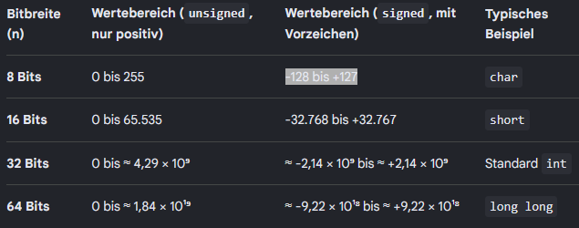

- **Zweierkomplement = Art, wie negative Ganzzahlen binär dargestellt werden**
  - `const unsigned int` = Integer hat kein Vorzeichen (wie jeder `int` bei Java)
  - **Negieren: Alle Bits invertieren, dann +1**
  - Warum?
    - Es gibt nur eine Null (kein +0/-0 Problem)
    - Addition/subtraktion funkionieren mit derselben Hardware wie bei positiven Zahlen (`a − b` ist einfach `a + (−b)`)
    - kein Sonderfall für Vorzeichen, ein Überlauf hebt sich weg
    - oberste Bit signalisiert Vorzeichen (1 = negativ) → **Vorzeichenbit**

  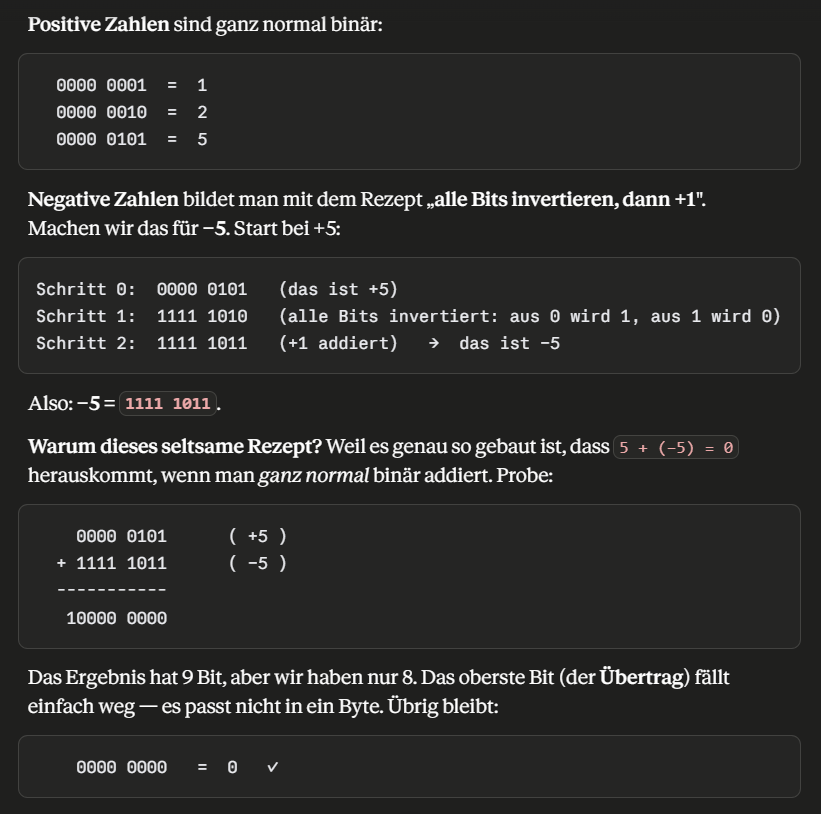

- Praktische Falle: `unsigned`-Unterlauf
  - `0u - 1 != -1`, sondern größtmögliche `unsigned`-Zahl (Wrap-Around bzw. Unterlauf)
  - `.size()` gibt `unsigned` zurück, daher sind Vergleiche zwischen `size()` und `int` eine klassische Bug-Quelle

  ```C++
  for( size_t i = 0; i < v.size() - 1; ++i ) // v leer:
  for( size_t i = 0; i < 18'446'744'073'709'551'615; ++i ) // fast endlos!
  ```

  - Wenn `v` leer ist, läuft die Schleife fast unendlich und greift mit `v[i]` auf einen leeren Container zu
  - führt zu undefined behaviour → Absturz
  - Lösung:
    - Subtraktion vermeiden, lieber addieren: `i + 1 < v.size()` (kein Unterlauf möglich)
    - ODER vorher auf leer prüfen
    - ODER gleich range-based `for` loop bzw. Algorithmus nehmen, die Indexproblem umgehen

  > `size()` ist `unsigned`, das nicht negativ werden kann. Jede Subtraktion, die unte 0 rutschen könnte, kippt auf einen Riesenwert um. Vorsicht bei `size() - 1`. 

### `constexpr`
> `constexpr`-Variable ist eine Compilezeit-Konstante.
> Eine `constexpr`-Funktion wird zur Compilezeit ausgewertet, wenn ihre Argumente Compilezeit-Konstanten sind (sonst zur Laufzeit).

**Nutzen**
- Kein Laufzeitaufwand, da das Ergebnis schon im fertigen Binary steht
- überall verwendbar, wo eine Compilezeit-Konstante gebracuht wird
  - Array-/`std::array`-Größe
  - Template-Argument

**Unterschied `const` und `constexpr`**
- `const` heißt "unveränderbar", der Wert darf aber erst zur Laufzeit feststehen
- `constexpr` heißt "schon zur Compilezeit bekannt"
- Jedes `constexpr` ist auch `const`, aber nicht umgekehrt
- `constexpr` ist damit die Vollausbaustufe der `const`-Optimierung → nicht nur "im Register halten statt nachladen", sondern **"gar nicht mehr zur Laufzeit rechnen"**
- `consteval` = Funktion, die zwingend zur Compilezeit laufen muss

### Modularisierung
- Warum modularisieren?
  - großes Programm gehört nicht in eine Datei
  - Einteilung in Übersetzungseinheiten, die getrennt kompiliert werden
  - 3 Gründe:
    1. schnellere Neu-Übersetzung (nur die geänderte Datei muss neu kompiliert werden, nicht alles)
    2. Wiederverwendbarkeit
    3. klare Trennung von Schnittstelle und Umsetzung

**Der Kern: Deklaration vs Definition**
> Deklaration sagt, dass etwas existiert und wie seine Signatur: `int wert( const Karte &karte );`
> Defintion liefert die eigentliche Implementierung: `int wert( const Karte &karte ) { return k._wert; }`
> Faustregel: Deklarieren darf man beliebig oft, definieren nur einmal.

- Header-Dateien (`.h` oder`.hpp`)
  - enthalten die Deklarationen ("dass es existiert")
  - relevante Infos um Softwarekomponente verwenden zu können → **Schnittstellendefinition** 
    - Klassendefinition, Funktionsdeklaration, Konstanten
    - Compiler braucht Infos wie Objekte aus Datensicht aussehen 
    - Welche Werte werden in der Methode übergeben?
  - Einbindung über `#include`, wo man die Sachen benutzen will (Mehrfacheinbindung möglich)

  ``` C++
  class C {
      public:
      void f(); // Deklaration
  }
  ```

- Implementierungs-Dateien (`.cp` oder `.cpp`)
  - enthalten die Defintionen ("wie")
  - eigentliche Implementierung der Schnittstelle mit voll qualifiertem Methodennamen (einmalige Einbindung nötig)
  - wird einmal kompiliert

  ``` C++
  void C::f() {...} // Defintiion
  ```

- Nutzen
  - Wenn Code benutzt werden soll, muss nur `.hpp` (Schnittstelle) gelesen werden
  - Ändert sich die `.cpp` (Implementierung) muss Nutzer-Code nicht neu kompiliert werden, nur neu gelinkt
  - Das ist die Kapselung auf Datei-Ebene

**One-Definiton-Rule**
> Jede Funktion / jedes Objekt darf im gesamten Programm nur genau eine Definition haben.

- Warum wird das `#include` zum Problem?
  - Präprozessor kopiert den Header-Text stur hinein
  - Bindet man denselben Header in mehrere `.cpp` (oder über Umwege mehrfach in dieselbe), landet sein Inhalt mehrfach im Code → **ODR Verletzung** → Der Linker meckert "multi definition"
  - Daher gehören nur Deklarationen (die man wiederholen darf), keine Defintionen in Header

**Include Guards / `#pragma once`**
> Das Mittel gegen mehrfaches Einbinden desselben Headers in einer Übersetzungseinheit

```C++
#ifndef KARTE_H // "if not defined"
#define KARTE_H
   ... Header-Inhalt ...
#endif
```

ODER

```C++
#pragma once
```

- beim ersten `#include` wird `KARTE_H` definiert und der Inhalt eingebunden
- beim zweiten `#include` ist `KARTE_H` schon definiert → Präprozessor überspring Block
- Moderne Kurzform: `#pragma once` macht dasselbe in einer Zeile

**Compilervorgang**
1. Präprozessor
- Stufe, die vor dem eigentlichen Compiler läuft
- arbeitet rein auf Textebene, er versteht kein C++ und ersetzt nur Text
- Verarbeitung:
  - `#include` fügt den kompletten Text der Header-Datei ein
  - `#define` definiert Makros (Text-Ersetzungen)
  - `#ifdef / #ifndef / #endif` schließen Code bedingt ein oder aus (Grundlage der Include-Guards)
- Ergebnis = große **Übersetzungseinheit aus reinem C++-Text**, die an Compiler geht
- Nachteil:
  - reine Textmanipulation, keine Typprüfung, keine Kenntnis von Scopes
  - führt zu üblen Seiteneffekten, daher gelten Makros als problematisch
  - Ersatz: `constexpr`, `inline`, Templates und C++20 Module 

2. Compiler
- übersetzt C++ in Assembler
- Aufgabe:
  - prüft Syntax und Typen
  - übersetzt jede Übersetzungseinheit einzeln und lässt für Funktionen/Variablen, die woanders definiert sind, eine "Lücke" (unaufgelöster Verweis / Symbol) offen

3. Assembler
- übersetzt Assembler in Maschinencode
- Ergebnis: Objektdateien (`.o`) mit offenen Lücken

4. Linker / Laufzeit
- verbindet Objektdateien und Bibliotheken
- füllt Lücken mit echten Adressen (Symbol-Auflösung)
- **klassischer Fehler: undefined reference** → Lücke, die der Linker nicht füllen kann
- **statisches Linken**
  - Bibliothekscode wird fest mit in die ausführbare Datei kopiert (`.a / .lib`)
  - Symbole/externe Ressourcen werden zur Link-Zeit aufgelöst
  - Vorteil:
    - Programm ist eigenständig, aber größer
    - keine externen Abhängigkeiten zur Laufzeit
  - Nachteil: 
    - größere ausführbare Datei ("monolithisch")
    - jedes Programm trägt seine eigene Kopie
- **dynamisches Linken**
  - Bibliothek (shared library) bleibt separate Datei (`.so / .dll`), die erst zur Laufzeit "on demand" vom Loader (Partner vom Linker) geladen wird, meist aber zur Ladezeit (bei Programmstart)
  - Vorteil: 
    - kleinere ausführbare Datei
    - Beim ersten Laden wird shared library einmalig von Festplatte in Arbeitsspeicher geladen
    - bereits geladene Bibliothekskopie kann von mehreren Programmen geteilt werden (Speicherersparnis)
    - völlige Flexibilität bzgl. Abhängigkeiten
    - Austauschbarkeit: Bibliothek aktualisieren ohne Programm neu zu bauen
  - Nachteil:
    - Bibliothek muss zur Laufzeit vorhanden und kompatibel sein, sonst **bekannte Fehler: "DLL_Fehler" / "shared library not found"**
- Ergebnis: ausführbare Datei

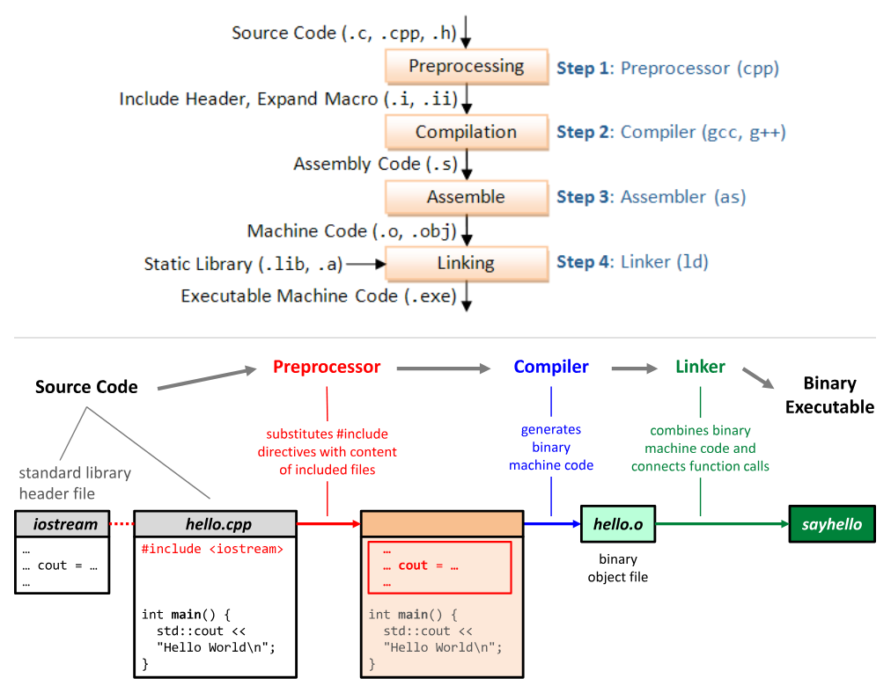

**Zugreifbarkeit + Linken**
- `static`-Funktion / anonymer Namespace
  - macht freie Funktion datei-lokal (nur in der eigenen `.cpp` sichtbar)
  - verhindert Namenskonflikte beim Linken
  - Modern nimmt man anonymen Namespace `namespace {...}` statt `static`

**`std::optional<T>`**
- typsichere Antwort auf "diese Funktion liefert vielleicht kein Ergebnis"
- früher wurde "kein Ergebnis" über Befehle wie Sentinel-Wert (`-1`, `nullptr`), Boolean plus Ausgabeparameter oder Exception
  - Sentinels sind fehleranfällig (Ist `-1` ein gültiger Wert oder "kein Ergebnis") und eine Exception ist für einen erwartbaren Fehlschlag zu schwer

```C++
std::optional<int> parseZahl( const std::string &s );

auto ergebnis = parseZahl( eingabe );
if ( ergebnis.has_value() ) { // oder: if (ergebnis)
  std::cout << *ergebnis; // Wert auslesen (wie ein Zeiger)
} else {
  std::cout << "keine gültige Zahl";
}
```

- Schnittstelle: `has_value()`
- Dereferenzieren mit `*opt` zum Auslesen des Inhaltes des Optional Containers
- `opt.value()` wird `std::bad_optional_access`, wenn leer
- `opt.value_or(standard)` liefert Ersatzwert, falls leer
- **`std::nullopt` ist der leere Zustand**
- `std::expected<T, E>` ist wie `optional`, aber liefert Fehlerwert `E` statt nur "nichts"

> `optional` = "Wert oder nichts"
> `expected` = "Wert oder Fehlergrund"

## Speicherverwaltung
### Überblick 
- **Callstack**
  - Teil des Daten-Segments
  - Rückrufaddresse für Prozeduren wird chronologisch immer in Top of Stack (ToS) abgelegt
  - Compiler berechnet Werte für Callstack-Frame, indem er lokale Variablen mit `size()` aufruft → Der Wert landet dann im Assembler Code
  - wird am Scope-Ende automatisch freigegeben
  - automatischer wiederverwendbarer Speicher
  - Speicherkonflikte, wenn Callstack zu groß wird, werden schwierig entdeckt, daher eigene Speicherverwaltung nötig
  - organisiert in Frames, jeder Frame steht für einen Prozeduraufruf
  - Einschränkung: 
    - keine dynamische Größe
      - Methodensignatur, Übergabewerte, lokale Variablen, Rückgabewerte/Rücksprungaddresse, CPU Registerinhalte müssen zur Compilezeit bekannt sein
    - Scope-Lebensdauer
      - Deshalb macht es keinen Sinn, eine Referenz auf lokale Variablen zurückzugeben

  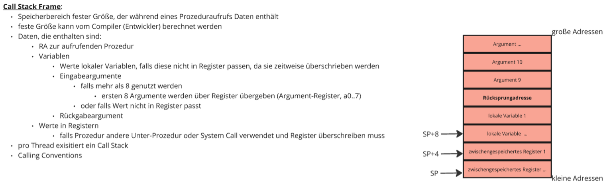

- **Heap**
  - Speicher anfordern mit `new` und freigeben mit `delete`
  - Speicherloch bei vergessenem `delete`
  - Dangling bei Zugriff nach `delete`

> **Heap und Callstack wachsen aufeinander zu**, um sich längstmöglich nicht im Weg zu sein

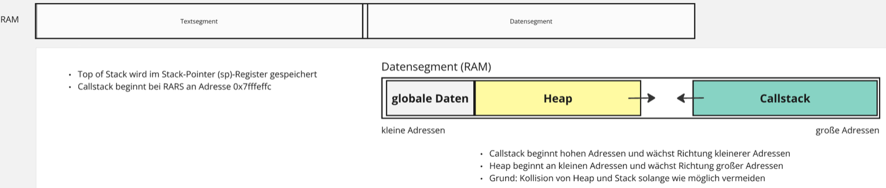

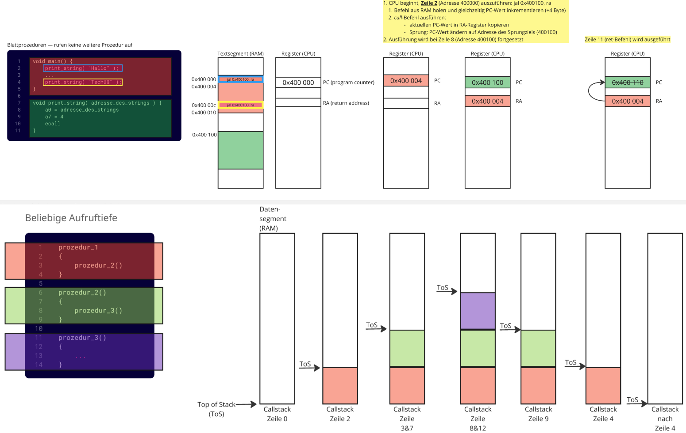

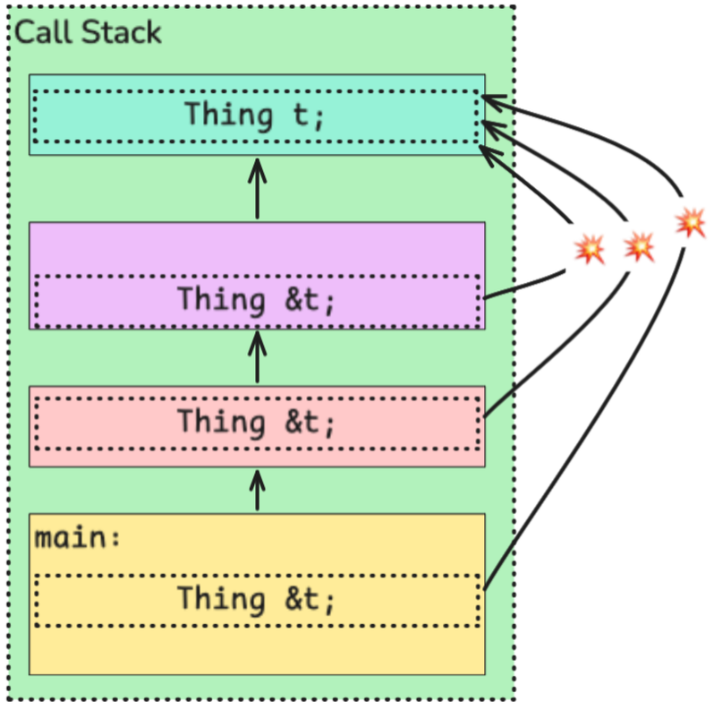

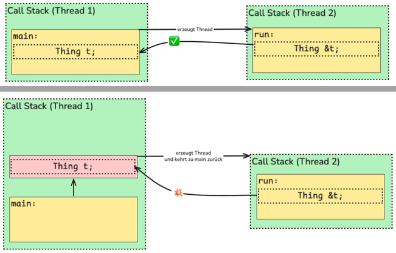

### Heap (Dynamischer Speicher)
- Heap für einen gesamten Prozess (= sich in Ausführung befindliches Programm)
    - mind. 1 Thread, alle Threads teilen sich einen Heap
    - pro Thread 1 Callstack, weil jeder Thread seinen eigenen Aufruf macht

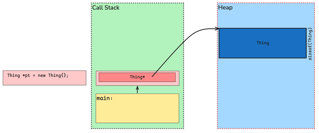

- Eigenschaften:
  - Lebensdauer bis Speicher freigemacht wird - Verweise/Referenzen nur auf tiefere Objekte
  - Speicherobjekte können zu belieber Zeit in beliebigen Größen angelegt werden - Verantwortung für Speicher liegt beim Entwickler
  - Wenn Speicher nicht ordentlich aufgeräumt wird, können Speicherlöcher entstehen
  - Speicher auf dem Heap allozieren: `Thing *pt = new Thing{}`
    1. alloziert `sizeof( Thing )` zusammenhängende Bytes im Heap-Speicher, falls Speicher nicht vorhanden werfe Exception (`std::bad_alloc`)
    2. default-initialisiere neue Thing-Instanz durch Default-Konstruktor
    3. liefert Zeiger (Raw pointer) auf (Anfang des) Speicherobjekt zurück
    - geht auch mit anderen Datentypen: int, floats, chars, ...
  - Lebenszeit von Heap-Speicherobjekten: beliebig lang, manuell steuerbar (max. bis Ende des Prozesses) -> Großer Unterschied zu Managed Languages (mit Garbage Collector)
  - Speicher auf dem Heap aufräumen: `delete` 

**Arrays**

```C++
size_t n = ...; // size_t größter Wert den die Hardware Archtitektur fassen kann
Thing *pt = new Thing[n];
```

- Größe des Arrays im Heap Speicher: `n * sizeof(Thing)` (mehrere Objekte von `sizeof(Thing)` untereinander)
- **Pointer decay** = Information, dass es ein Array ist, verblasst
- Bei Löschen-Aufruf, löschen wir nur das erste Element -> es sieht aus als wäre alles frei, was nicht der Fall ist
- Beispiel:

  ```C++
  void f() {
      Thing *tp = new Thing{}; // Raw Pointer, drücken keinen Besitz aus, nur Besitzer kann delete ausführen, Compiler kann nicht wissen dass Speicher gelöscht werden darf
      foobar_might_throw(); // vorzeitiges return? Verlieren Referenz auf den Pointer -> Speicherloch
      if(...) return; // bedingtes return -> verlieren Referenz auf den Pointer -> Speicherloch
      delete tp;
  }
  ```

**Primitive Datentypen**
- Raw Pointer ist  ein primitiver Datentyp und hat keinen Destruktor
- Wenn Zeiger seinen Scope verlässt, wird nur der Zeiger zerstört, aber nicht das Objekt

``` C++
int *pi = new int{}; // {} gibt Defaultwert 0, sonst undefined behaviour
int i = *pi;
*pi = 42; // * dereferenziert, sodass Speicheradresse nicht mit 42 überschrieben wird
std::print(*pi);
```

- Verwendung des Dereferenzierungsoperators um mithilfe von Zeiger auf `int` (Raw Pointer) auf den eigentlichen `int` zugreifen 

**Manuelle Freigabe von dynamischen Speicher:**
- `delete` Operator ruft Destruktor der Instanz auf und gibt das zugehörige Speicherobjekt im Heap frei

``` C++
Thing *pt = new Thing{};
delete pt;
```

- nach `delete` ist Zeiger zwar noch vorhanden, zeigt aber auf speicher, der nicht mehr verwendet werden darf → **Dangling Pointer**
- wenn man die Variable nach einem `delete` nochmal nutzen will, gibt Laufzeitfehler -> **undefined behaviour**
- um Laufzeitfehler zu vermeiden setzt man die Variable nach einem `delete` auf `nullptr`

  ```C++
  int *pi = new int{42};
  delete pi;
  pi = nullptr;
  ```

- dynamischer Speicher kann zu beliebigen Zeitpunkt in beliebiger Funktion freigegeben werden.
- wichtig ist, dass der richtige Zeiger übergeben wird, sodass jedes Speicherobjekt genau einmal freigegeben wird.
- man muss sich merken, dass man `new[]` aufgerufen hat, um das mit `delete[]` freizugeben, gibt jedes Objekt im Array frei → daher solche Arrays eher vermeiden

```C++
void g(int *pi) {
  *pi = 23;
  std::print("Neuer Wert: {}", *pi); 
}

void f() {
    int *p = new int(42);
    g(p);
}
```

**typische Fehler**
- Speicherlöcher durch verlorene Referenz
- double-free
- use-after-free → dangling pointer
  - `nullptr` verwenden
> Garbage Collector von Managed Languages löst genau diese Fehlerklassen, daher gelten sie als sicherer und bequemer.

- Warum nutzt C++ keinen Garbage Collector?
  - Laufzeit-Overhead
    - GC verbraucht CPU-Zeit und zusätzlichen Speicher
    - man zahlt Leistung für Sicherheit
  - Nicht-Determinismus
    - GC läuft, wann es ihm passt, nicht wann man es will
    - für harte Echtzeit kann man sich keine unvorhersehbaren Pausen leisten (Herzschrittmacher)
  - "Stop-the-world"-Pausen
    - Viele GCs müssen Programm zum Aufräumen kurz anhalten (Ruckler im Spiel)
  - Ressourcen sind nicht nur Speicher
    - GC kümmert sich nur um Speicher
    - Bei Ressourcen (Dateien, Sperren, Verbindungen) hilft er nicht, da diese sofort und deterministisch freigegeben werden sollen
    - daher braucht Java `finally` als Ergänzung zum GC

  > RAII gibt C++ die Sicherheit des GC (kein manuelles Aufräumen) ohne dessen Preis → deterministisch, sofort, kein Laufzeit-Overhead, für alle Ressourcen.
  > **Hauptgrund für RAII statt GC: Kontrolle & Vorhersagbarkeit.**

**Speicherlöcher:**
- entstehen bei Heap-alloziertem Speicher, wenn dieser nie mit `delete` freigegeben wird und die Methode mit der lokalen Varible beendet ist
- **use after free:** lokale Variable / Zeiger weg, aber Speicher noch da
- können durch **Smart Pointer** vermieden werden

**Gründe für Notwendigkeit der manuellen Speicherfreigabe**
- Lokale Variable ist nur Zeiger (Raw Pointer), nicht der Heap-Speicher → drücken keinen Besitz aus → keine automatische Freigabe möglich
- Am Funktionsende wird lokale Variable zerstört → Speicherloch
- **Non-owning Pointer** verwendet den Heap-Speicher nur temporär, es ist nicht dessen Besitzer

### Resource Acquisition is Initialization (RAII)
**3 Garantien:**
1. Destruktor läuft garantiert am Ende des Scopes
  - Egal, ob normal, per `return` oder per Exception (Stack Unwinding)
  - Passender Destruktor-Aufruf durch Compiler für jeden Kontrollflusspfad 
2. Turtles all the way down
  - Destruktor eines Objektes ruft automatisch die Destruktoren aller Teilobjekte (Childs) auf → reskursiv bis nur noch primitive Datentypen und Raw Pointer übrig sind (haben keinen Desktruktor)
  - Implizit/Default-Destruktor, wenn kein eigener definiert wurde
3. Globale Objekte
  - Destruktor derer läuft am Ende des Scopes

**Die RAII Idee**
- Objekt übernimmt im Konstruktor Verantwortung für eine Ressource und gibt sie im Destruktor wieder frei
- Ressource ist alles, was man akquirieren und wieder freigeben muss: Heap-Speicher, Datei, Sperre (Lock), Netzwerk- / Datenbankverbindung
- Da Destruktor garantiert läuft, wird auch garantiert aufgeräumt → kein `finally` bei Exceptions nötig

**Vergleich zu Java**
- RAII Typen können in Java mit `try`-with-resource und `auto-closable` Klassen erreicht werden
- Java-Compiler ruft garantiert `close()` auf
- vorher wurde die von einem `auto-closable`-Typen zu verwaltende Ressource im Konstruktor an die `auto-closable`-Instanz gegeben

### Smart Pointer
- übernehmen Verantwortung für Heap Speicher
- Als **Wrapper** "umschließen" sie einen Pointer, der auf Heap-Speicher verweist

``` C++
class smart_pointer {
public:
  smart_pointer( Demo *p ) : verwaltetes_objekt{p} {}
  ~smart_pointer() { delete verwaltetes_objekt; }
  ~smart_pointer() = default; // Destruktor weiß nicht, ob das Objekt mit new initialisiert wurde, erstellt nicht automatisch delete
private:
  Demo *verwaltetes_objekt;
}

int main() {
  smart_pointer p { new Demo{} }
} 
// hier wird Destruktor aufgerufen
```

- Smart Pointer sind gewöhnliche Objekte, sie sind RAII Typen
- Bei Konstruktion wird der Zeiger auf den Heap-Speicher übergeben, fpr den diese Smart-Pointer-Instanz verantwortlich ist.
- Beim Verlassen des Gültigkeitsbereichs der Smart-Pointer-Instanz wird deren Destruktor aufgerufen. Er zerstört mithilfe von `delete` den Heap-Speicher, für den die Instanz verantwortlich ist.
- **valgrind** ersetzt `new` und `delete` durch eigene Implementierungen und kann Memory Leaks erkennen

**Vergleich zu Java**
- mit `new` initialisierte Objekte werden in den Heap gelegt
- Freigabe des Speichers, der von nicht mehr erreichbaren Objekten belegt wird, durch **Garbage Collector**
  - betrachtet ein Objekt als freigebbar, wenn es vom laufenden Programm nicht mehr erreichbar ist
  - Objekt ist erreichbar, wenn es direkt / indirekt über GC Roots referenziert wird
  - Wird Objekt nicht mehr verwendet, ist aber weiterhin referenziert, kann es nicht freigegeben werden → **Java Speicherlecks**
  - Speicherfreigabe bei Nicht-Erreichbarkeit ist nicht deterministisch und kann nicht erzwungen werden → läuft, wann es passt → Blackbox
  - Problem bei zeitlich terministischen System (z.B. Herzschrittmacher)
- C++ Objekte werden deterministisch zerstört
  - Destruktor wird bei lokalen Objekten am Ende ihres Gültigkeitsbereichs automatisch aufgerufen

**`std::unique_ptr<T>`**
- RAII-Wrapper um einen Raw Pointer
  - **alleinige Besitzer eines Heap-Objektes**
  - ruft in seinem Destruktor automatisch `delete` auf
- manuelles `delete` verschwindet → keine Speicherlöcher, auch bei Exceptions

```C++
auto pk = std::make_unique<Karte>(5); // statt new; besitzt die Karte
pk->wert(); // Zugriff wie ein Zeiger
// kein delete nötig — passiert automatisch am Scope-Ende
```

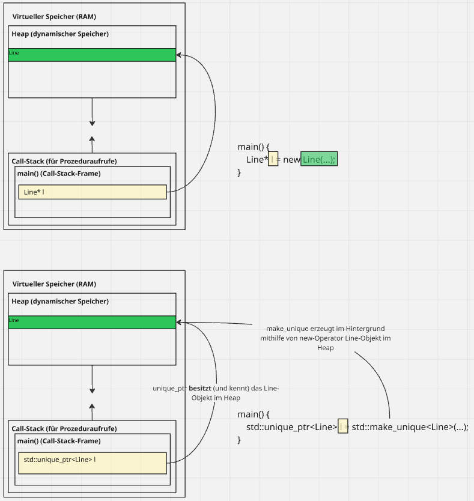

- Eigenschaften
  - nicht kopierbar, nur verschiebbar
    - Grund: Zwei Kopien würden beide densleben Speicher besitzen → doppeltes `delete`
    - "Alleiniger Besitzer" schließt Kopieren logisch aus.
    - Verschieben (`std::move`) überträgt den Besitz und der alte Zeiger ist leer (`nullptr`)
  - zero-cost
    - `unique_ptr` kompiliert praktischzu selben Code wie manuelles `new/delete`
    - kein Overhead, nur Sicherheit

**`std::shared_ptr<T>`**
- erlaubt geteilten Besitz
- mehrere `shared_ptr` können auf dasselbe Objekt zeigen
- zählt per **Referenzzähler**, wie viele Besitzer es gibt und gibt das Objekt frei, wenn der Zähler 0 erreicht
  - Zähler ist atomar (thread-sicher) → Laufzeit-Overhead 
- Zwei `shared_ptr`,die sich gegenseitig halten, ergeben einen Zyklus
  - Zähler wird niemals 0 → Leck
  - Lösung: `std::weak_ptr` beobachtet ohne zu besitzen

**Regel**
> `unique_ptr` als Standard.
> `shared_ptr` nur bei echtem geteiltem Besitz. (Ausnahme zur zero-cost-Regel)

## Das Grundprinzip: Vererbung
> - modelliert eine `ist-ein`-Beziehung
> - abgeleitete Klasse (Subklasse) erbt Datenelemente und Methoden von einer Basisklasse und kann sie erweitern oder anpassen

- Zugriffsmodifikator `protected` wird hier relevant → nur für abgeleitete Klassen sichtbar

```C++
class Shape { // Basisklasse
public:
  virtual double flaeche() const { return 0; }
};

class Kreis : public Shape { // Kreis ist-ein Shape
  double r;
public:
  explicit Kreis(double r) : r{r} {}
  double flaeche() const override { return 3.14159 * r * r; }
};
```

### Polymorphie
> Laufzeit-Polymorphismus
> - Aufruf über eine Basisklassen-Referenz/-Zeiger landet bei der Methode des tatsächlichen (abgeleiteten) Objektes
> - erst zur Laufzeit wird entschieden, welche Methoden-Implementierung aufgerufen wird.
> - beruht auf dem Mechanismus der sogenannten späten Bindung (**Late Binding**)
  
```C++
void druckeFlaeche(const Shape& s) { // nimmt jedes Shape
  std::cout << s.flaeche(); // ruft die RICHTIGE flaeche()
}
Kreis k{2.0};
druckeFlaeche(k); // ruft Kreis::flaeche(), nicht Shape::flaeche()
```

- Basisklassen können in einer separaten .hpp Datei gebaut werden und diese bei allen erbenden Klassen inkludiert werden.
- ermöglicht verschiedene Typen einheitlich über die Basis zu behandeln
- Benötigt:
  - polymorphe (überschreibare) Methoden müssen mit `virtual` versehen werden
    - `virtual` ist quasi ein Optin-Verfahren → bytelastiger, aber diesen "Preis" muss man bei bewusster Wahl zahlen
  - Zugriff über Referenz oder Zeiger

**`virtual`**
- `virtual` Methoden erlauben, dass abgeleitete Klassen sie überschreiben und dass zur Laufzeit die richtige Version gewählt wird
  - **Late Binding** über `vtable`
    > `vtable`: pro Klasse eine Tabelle von Funktionszeigern, jedes Objekt hat einen `vptr`
- ohne `virtual` gibt es **Early Binding**
  - Compiler entscheidet schon zur Compilezeit anhand des statischen Types
  - folglich würde immer `Shape::flaeche()` laufen, egal welches Objekt dahintersteckt

- wenn ein abgeleitetes Objekt über einen Basisklassen-Zeiger löscht, muss der Basis-Destruktor `virtual` sein
  - sonst wird nur Basis-Destruktor aufgerufen, aber nicht der der abgeleiteten Klassen
  - Ressourcen werden nicht freigegeben
  - Ergebnis: Speicherloch

```C++
Shape* s = new Circle{2.0};
delete s; // ohne virtual ~Shape(): nur ~Shape() läuft, ~Circle() NICHT!
```

- Hat eine Klasse eine `virtual` Methode (wenn als Basisklasse gedacht), braucht sie einen `virtual` Destruktor
  - um dem Compiler zu überlassen, den Destruktor zu bauen, gibt man `virtual ~Shapes() = default;` an → erzwingen eines Default-Destruktors
  - Late-Binding Prinzip auf Destruktoreben
    - ohne `virtual`: Aufruf wählt anhand des statischen Types (`Shape`)
    - mit `virtual`: Aufruf wählt anhand des echten Types (`Circle`)

**`override`**
- Sicherheitsschlüsselwort signalisiert, dass diese Methode eine virtuelle Basis-Methode überschreiben soll
- passt die Signatur nicht, gibt es einen Compile-Fehler statt eines stillen Bugs

> Beim Überschreiben immer `override` dranschreiben.

```C++
void draw() const override {...}
```

**Abstrakte Klassen**
- rein virtuelle Methode (`= 0`) hat keine Implementierung und erzwingt, dass abgeleitete Klasse sie definieren:

```C++
class Shape {
public:
  virtual double flaeche() const = 0;   // rein virtuell
  virtual ~Shape() = default;
};
```

> Eine Klase mit mindestens einer virtuellen Methode ist abstrakt.

- Man kann keine Instanz von einer abstrakten Klasse erzeugen (Fehler: `Shape s;`), nur von konkreten abgeleiteten Klassen
- Abstrakte Klasse dient als Schnittstelle, die vorschreibt, was jedes abgeleitete Objekt (Form) können muss (`flaeche()`) ohne zu sagen wie.
- Gegenüberstellung zu Java:
  - Jede Methode ist standardmäßig virtuell (immer Late Binding → man zahlt den `vtable` Preis immer)
  - In C++ ist vitual Optin → nicht-virtuell ist der Default
    - zero-cost ("what you don't use, you don't pay for") → keine Vererbung, kein `virtual` → kein `vptr`, kein Overhead

**Zentrale Falle: Object Slicing**
> - Passiert, wenn man ein abgeleitetes Objekt per Wert in ein Basisklassen-Objekt kopiert (Call-by-Value)
> - Dabei werden zusätzliche Teile der abgeleiteten Klassen "abgeschnitten"

```C++
Kreis k{2.0};
Shape s = k; // SLICING → der Kreis-Teil wird abgeschnitten
s.flaeche(); // ruft Shape::flaeche() → 0, nicht die Kreis-Fläche!
```

- **Grund**
  - `Shape` hat auf dem Callstack eine feste, kleinere Größe als ein `Circle`
  - kopiert man `Circle` in einen kleinere Platz, passt nur der Basis-Teil hinein inklusive `vptr`, der auf `Shape-vtable` zeigt
  - Polymorphie geht verloren

  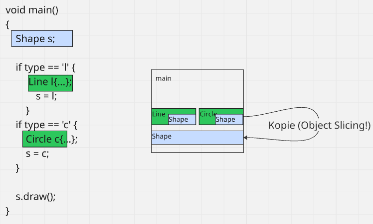

- **Abgeleitete Regel**
  > - Polymorphie funktioniert nur über Referenz (`Shape&`) oder Zeiger (`Shape*`), niemals per Wert
  - Referenz/Zeiger hat feste Größe (verweist nur) und lässt echte Objekt intakt, daher bleibt `vptr` korrekt und richtige Methode wird aufgerufen
  - Daher fängt man Exceptions per `const&`

  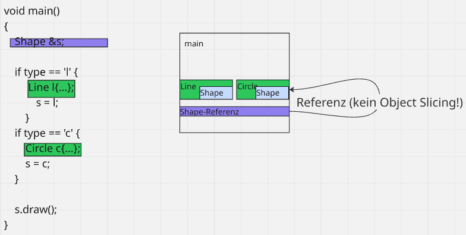

- **Wie kann Object Slicing passieren?**
  - Sobald ich ein abgeleitetes Objekt per Wert an etwas vom Basistyp übergebe.
  - Am häufigsten ist dies ein Funktionsparameter, bei dem das & fehlt. 
  - Es kompiliert fehlerfrei, schneidet aber die abgeleiteten Teile ab. 
  - Deshalb übergibt man polymorphe Objekte immer per Referenz oder Zeiger.

- Vergleich zu Java:
  - Slicing kann nicht passieren, da Objekte immer über Referenzen angefasst werden
  - `Shape s = k;` lässt `s` auf das echte `Circle`-Objekt verweisen, nichts wird kopiert

## MyVector & Rule of 0/3/5
### Ausgangslage: MyVector besitzt Heap-Speicher
- Callstack: Metadaten (`m_size`, Zeiger, `m_elems`)
- Heap: eigentliche Daten
- Klasse besitzt den Heap-Block (Ownership)

```C++
class MyVector {
  std::size_t m_size;
  double* m_elems; // Zeiger auf einen Heap-Block
public:
  explicit MyVector( std::size_t size ) : m_size{ size }, m_elems{ new double[size] } {} // Konstruktor alloziert
};
```

**Schritt 1: Der Destruktur**
- Wer besitzt, muss auch aufräumen
- Ohne Destruktor entsteht ein Speicherloch
- Am Scope-Ende wird lokale Variable freigegeben, aber Heap-Block bleibt liegen, da Zeiger keinen Destruktor haben

```C++
~MyVector() { delete[] m_elems; }
```

**Schritt 2: Das Problem der Shallow Copy → Rule of 3**
- schreibt man einen Destruktor, sind der vom Compiler erzeugte **Kopierkonstruktor und die Kopiezuweisung** gefährlich
- sie machen eine **Shallow Copy** (nur Zeiger kopieren, aber nicht die Daten)

```C++
MyVector v1{3};
MyVector v2 = v1; // Compiler-Kopie: v2.m_elems = v1.m_elems (nur die Adresse!)
```

- Im Beispiel zeigen `v1.m_elems` und `v2.m_elems` auf denselben Heap-Block
- Folgen:
  - Aliasing (änderst du `v2`, ändert sich `v1` mit)
  - Am Scope-Ende laufen beide Destruktoren und rufen `delete[]` auf denselben Block auf → doppeltes `delete` → undefined behaviour
- **Lösung: Deep Copy**
  - eigenen Heap-Block anlegen und Inhalt hineinkopieren
  - dafür schreibt man zwei Dinge selbst:

    ```C++
    // Kopierkonstruktor
    MyVector( const MyVector &other ) : m_size{ other.m_size }, m_elems{ new double[other.m_size] } { // eigener Block
      std::ranges::copy( other, begin() ); // Inhalte kopieren
    }

    // Kopierzuweisung
    MyVector &operator=( const MyVector &other ) {
      if ( this == &other ) return *this; // Selbstzuweisung abfangen!
      delete[] m_elems; // erst eigenen alten Block freigeben
      m_size = other.m_size;
      m_elems = new double[ other.m_size ]; // neuen anlegen
      std::ranges::copy( other, begin() );
      return *this; // für Verkettung a = b = c
    }
    ```

> **Rule of 3**: Brauchst man einen Destruktor, brauchst man fast immer auch Kopiekonstruktorund Kopierzuweisung.
> - Wenn man ans Zerstören denken muss, muss man auch ans Kopieren denken.
> - Selbstzuweisung abfangen, da sie sonst den eigenen Speicher wegwirft
> - Kopierzuweisung muss den alten Speicher zuerst freigeben

**Schritt 3: Kopieren ist teuer → Move Semantik**
- Deep Copy ist korrekt, aber teuer: allozieren und jedes Element kopieren
- Deep Copy ist unnötig, wenn die Quelle sowie gleich stirbt:
  - temporäres Objekt
  - ein Rückgabewert
  - etwas, das bewusst freigegeben wird
- In diesem Fall wäre die Kopie der Daten und die Zerstörung des Originals Verschwendung

- Idee der Move Semantik:
  - Statt zu kopieren, klaut man den Heap-Zeiger
  - man nimmt `other.m_elems` einfach für sich selbst und setzt `other.m_elems` auf `nullptr`
  - Destruktor des ausgeraubten Objektes gibt nichts frei
  - Das ist O(1): nur ein Zeiger umbiegen, keine Allokation, kein Element-Kopieren

```C++
// Verschiebekonstruktor
MyVector( MyVector &&other ) noexcept : m_size{ other.m_size }, m_elems{ other.m_elems } { // Zeiger übernehmen ("klauen")
  other.m_elems = nullptr; // Quelle entwaffnen
  other.m_size = 0;
}

// Verschiebezuweisung
MyVector &operator=( MyVector &&other ) noexcept {
  if ( this == &other ) return *this;
  delete[] m_elems; // eigenen alten freigeben
  m_size = other.m_size;
  m_elems = other.m_elems; // klauen
  other.m_elems = nullptr; // Quelle entwaffnen
  other.m_size = 0;
  return *this;
}
```

> - Verschieben transferiert den Besitz, es dupliziert nichts.
> - Nach dem Move ist das Quell-Objekt leer, aber gültig (`nullptr`, `size 0`).
> - Destruktor läuft noch, tut aber nichts mehr.

**Schritt 4: Was ist `&&` und was macht `std::move`?**
> - **Rvalue-Referenz** (`MyVektor&&`) bindet an Rvalues.
> - **Rvalues**: temporäre Objekte ohne bleibende Identität / Namen, z.B. Funktionsrückgabewert oder ein frisch erzeugtes `MyVektor{3}`.
> - **Lvalues**, Dinge mit Namen, die weiterleben (`MyVektor v;`).

- Compiler wähle automatisch:
  - Rvalue → stirbt sowieso gleich → Verschieben
  - Lvalue → lebt weiter → Kopieren (lebenden Variable kann man nicht heimlich Daten klauen)
- `std::move` verschiebt nicht, es ist nur ein Cast zu einer Rvalue-Referenz
  - man behandelt die Variable als entbehrlich, man darf ihr die Daten klauen
  - Verschiebekonstruktor übernimmt die Arbeit
  - `std::move(v)` heißt also, dass `v` danach nicht mehr gebraucht wird

**Schritt 5: Warum steht `noexcept` an den Move-Operationen?**
- Verschiebe-Operationen sollten `noexcept` sein (keine Exception werfen)
- Grund:
  - wenn `std::vector` wächst und seine Elemente realloziert (in den neuen, größeren Block umzieht), benutzt er das Verschieben nur, wenn es `noexcept` ist
  - ohne `noexcept` fällt er sicherheitshalber aufs Kopieren zurück, da bei Exception die originalen Elemente im alten Block bleiben
  - ohne `noexcept` verschenkt man die ganze Move-Optimierung beim Wachsen, man opfert Geschwindigkeit für Sicherheit

**Schritt 6: Rule of 5**
1. Destruktor
2. Kopierkonstruktor
3. Kopierzuweisung
4. Verschiebekonstruktor
5. Verschiebezuweisung

> **Rule of 5**: Definiert man eine davon (weil man eine Ressource verwaltet), sollte man alle 5 bedenken. 
> - Destruktor + das Kopier-Paar für die Korrektheit + das Verschiebe-Paar ist die Optimierung obendrauf

> **Rule of 0**: Am besten schreibt man keine der 5. (**= Ideal**)
> - Wenn Klasse ihre Ressourcen über RAII-Member hält statt über Raw Pointer, macht der Compiler-generierte Kram automatisch das Richtig.
> - Die Member räumen selbst auf, kopieren und verschieben sich korrekt.

- Das Beispiel `MyVektor` schreibt die 5 nur, weil es den Raw Pointer `double*` direkt verwaltet.

## MyUniquePtr (`unique_ptr` selbst gebaut)
### Aufbau
- `myUniquePtr` hält genau einen Raw Pointer als Member

```C++
template <typename T>
class MyUniquePtr {
  T *m_ptr;
public:
  explicit MyUniquePtr( T *p = nullptr ) : m_ptr{ p } {} // übernimmt Besitz
  ~MyUniquePtr() { delete m_ptr; } // gibt garantiert frei
  ...
};
```

- Konstruktor übernimmt Verantwortung für übergebenen Heap-Speicher (RAII:"bei Entstehung Ressource übernehmen")
- Destruktor gibt diesen garantiert wieder frei, manuelles `delete` weg, auch bei Exceptions

**Besonderheit: Kopieren wird verboten**
- keine Deep Copy wie bei `MyVector` möglich
- `unique` bedeutet, dass es nur einen Besitzer geben darf
- zwei Kopien würden densleben Zeiger besitzen → doppeltes `delete`
- Folglich streicht man das Kopier-Paar explizit mit `= delete`

```C++
MyUniquePtr( const MyUniquePtr& ) = delete; // kein Kopieren
MyUniquePtr& operator=( const MyUniquePtr& ) = delete; // keine Kopierzuweisung
```

- `= delete` bedeutet, dass diese Methode existiert, aber ihr Aufruf ein Compile-Fehler ist
- Compiler meckert sofort, wenn jemand `auto b = a` mit zwei `unique_ptr` versucht
- daher ist `unique_ptr` nicht kopierbar, es ist beuwsst so gebaut

**Verschieben ist erlaubt**
- Übertragung des Besitz, der Zeiger wandert von einem `MyUniquePtr` zum anderen
- Nach dem Veschieben wird die Quelle auf `nullptr` gesetzt

```C++
MyUniquePtr( MyUniquePtr &&other ) noexcept : m_ptr{ other.m_ptr } { // Zeiger übernehmen
  other.m_ptr = nullptr; // Quelle entwaffnen
}

MyUniquePtr &operator=( MyUniquePtr &&other ) noexcept {
  if( this == &other ) return *this; // Selbstzuweisung vermeiden
  delete m_ptr; // eigenen alten freigeben
  m_ptr = other.m_ptr; // klauen
  other.m_ptr = nullptr; // entwaffnen
  return *this;
}
```

> Das zeigt die **Rule of 5 in ihrer Reinstform**
> - Destruktor + das Verschiebe-Paar ist definiert + das Kopier-Paar ist gelöscht.
> - Diese Kombination macht "unique": nicht kopierbar, aber verschiebbar.

**Die Zeiger-Schnittstelle**
- Dass `MyUniquePtr` sich wie ein Zeiger anfühlt, überlädt man beide Zeiger-Operatoren

```C++
T &operator*() const { return *m_ptr; } // *p  → das Objekt
T *operator->() const { return m_ptr; } // p-> → Member-Zugriff
T *get() const { return m_ptr; } // der rohe Zeiger (ohne Besitzabgabe)
explicit operator bool() const { return m_ptr != nullptr; }  // if (p)
```

- Folglich kann man `p->methode()` und `*p` schreiben, als wäre es ein echter Zeiger
- Daher "SmartPointer": von außen wie ein Zeiger, innen mit automatischen Aufräumen 

**Hilfsmethoden**
- `release()` gibt Zeiger heraus und löscht ihn nicht
- Aufrufer übernimmt Verantwortung (`MyUniquePointer` lässt los)

```C++
T *release() { // Besitz ABGEBEN, NICHT löschen
  T *alt = m_ptr;
  m_ptr = nullptr;
  return alt; // Aufrufer ist jetzt verantwortlich
}
```

- `reset()` gibt den aktuellen Speicher frei und übernimmt einen neuen

```C++
void reset( T *p = nullptr ) { // altes löschen, neues übernehmen
  delete m_ptr;
  m_ptr = p;
}
```

> `release` = "Besitz abgeben, ohne aufzuräumen"
> `reset` = "aufräumen und neu übernehmen"

**`std::make_unique`**
- statt `MyUniquePointer<Karte>{ new Karte {5} }` nutzt man eine Fabrikfunktion `make_unique<Karte>(5)`
- Vorteil:
  - man tippt kein rohes `new` → weniger Fehlerquellen und Exception-sicher
  - `new` und Übernahme in den Smart Pointer passieren in einem Schritt, sodass kein Speicher zwischendurch "unbesessen" herumliegen kann.

## MySharedPointer (`shared_ptr` selbst gebaut)
### Die Idee
- manchmal benötigt, dass mehrere Stelle dasselbe Heap-Objekt gemeinsam besitzen
- Freigabe soll erfolgen, wenn letzte Besitzer fertig ist
- Beispiel: Game Level im Heap, auf das mehrere Systeme/Threads zugreifen
- `shared_ptr` steht für gemeinsamen Besitz mit automatischer Freigabe, wenn der Letzte geht

**Mechanismus: Reference Counting**
- Referenzzähler (`ref_count`) zählt Besitzer, die auf dasselbe Objekt zeigen
- Regeln:
  - Kopie eine `shared_ptr` erhöht den Zähler um `+1`
  - Zerstört man einen oder weist ihn neu zu, sinkt der Zähler um `-1`
  - Erreicht der Zähler `0`, gibt der letzte verbleibende Besitzer das Objekt frei
- Unterschied zu `unique_ptr`: `shared_ptr` ist kopierbar

**Control Block**
- **Referenzzähler muss geteilt sein**, würde dieser in den `shared_ptr`-Objekten liegen würde, hätte jedes seine eigene Kopie des Zählers
- Hierfür gibt es einen separaten, heap-allozierten ControlBlock, bestehend aus:
  - Zeiger auf das eigentliche Objekt
  - Referenzzähler
- Alle `shared_ptr`, die dasselbe Objekt verwalten, zeigen auf diesen ControlBlock

```C++
template <typename T>
class MySharedPtr {
  struct ControlBlock {
    T *ptr; // das verwaltete Objekt
    std::size_t ref_count; // Anzahl der Besitzer
  };
  ControlBlock *m_control; // alle Kopien zeigen auf DENSELBEN Block
public:
  explicit MySharedPtr( T *p ) : m_control{ new ControlBlock{ p, 1 } } {} // erster Besitzer → count = 1
}
```

**Rule of 5 mit erlaubtem Kopieren**
- hier liegt der **Sinn im Kopieren, es teilt den Besitz**

```C++
// Kopierkonstruktor: denselben ControlBlock übernehmen, Zähler hoch
MySharedPtr( const MySharedPtr &other ) : m_control{ other.m_control } {
  ++m_control->ref_count;
}

// Destruktor: Zähler runter — bei 0 alles freigeben
~MySharedPtr() {
  if ( --m_control->ref_count == 0 ) {
    delete m_control->ptr; // das Objekt
    delete m_control; // den ControlBlock selbst
  }
}
```

- Destruktor ist das Herzstück
  - senkt den Zähler und räumt nur auf, wenn der Zähler auf 0 fällt
  - sonst lebt das Objekt weiter
- Verschiebe-Operation überträgt den Besitz ohne den Zähler zu ändern
  - beide Zeiger klauen
  - Quelle auf `nullptr`
  - bequemer Helfer: `std::exchange` setzt auf `nullptr` und gibt alten Wert zurück
- `MyUniquePtr` und `MySharedPointer` sind als selbe Bauform mit gegensätzlicher Kopier-Entscheidung
  - eindeutiger Besitz → Kopieren verboten
  - geteilter Besitz → Kopieren zählt hoch

**Der Preis: atomarer Zähler → Overhead**
- weil mehrere Threads gleichzeitig Kopien anlegen und zerstören können, muss der `ref_count` atomar (thread-sicher) hoch- und runtergezählt werden
- Das kostet Laufzeit → "nicht ganz zero-cost"
- daher `shared_ptr` nur bei echtem geteiltem Besitz, sonst `unique_ptr`
- Präszisierung:
  - thread-sciher ist nur der Zähler, nicht das verwaltete Objekt
  - zwei Threads dürfen gefahrlos `shared_ptr`-Kopien desselben Objektes anlegen
  - gleichzeitiges Arbeiten am Objekt braucht trotzdem eigene Synchronisation

**Die Falle: Zyklen → `weak_ptr`**
- Szenario:
  - zwei Objekte halten sich gegenseitig per `shared_ptr` (A → B und B → A)
  - keiner der beiden Zähler fällt je auf 0 → jeder wartet auf den anderen → Speicherloch
- Lösung: `std::weak_ptr`
  - Referenz, die das Objekt beobachtet, ohne es zu besitzen, sie erhäht den Zähler nicht
  - Zyklus wird durchbrochen und eine Richtung wird "weak"
  - `weak_ptr` kann nicht dereferenziert werden, man fragt mit `.lock()` nach echtem `shared_ptr`, der `nullptr` liefert, falls das Objekt inzwischen weg ist.

**Bezug zur Garbage Collection**
- Reference Counting ist quasi "Garbage Collection for free", aber deterministisch und lokal auf ein Objekt begrenzt
- Swift nutzt ein "Reference-Counting-GC" für seinen kompletten Heap
  - Zyklus-Schwäche ist dieselbe

**Empfehlung: `std::make_shared<T>(...)`**
- wie `make_unique`
- legt Objekt und ControlBlock in einer einzigen Allokation an, spart also eine Heap-Anforderung
- Vorteil:
  - man tippt kein rohes `new` → weniger Fehlerquellen und Exception-sicher
  - Eine Allokation sparen, weil Objekt und ControlBlock zusammengelegt werden

```C++
MySharedPtr<Karte> p{new Karte{5}};
//   |                └─ 1. Allokation: die Karte
//   └─ im Konstruktor: new ControlBlock{...}  = 2. Allokation: der ControlBlock

// ↓

auto p = std::make_shared<Karte>(5); // ein einziger Heap-Block:  [ ControlBlock | Karte ]
//                        ^^^^^  ^^
//                        Typ T  Argumente für den Karte-Konstruktor
```

## Dynamische Liste
### Templates
> Templates sind das Fundament der generischen Programmierung in C++ und der Mechanismus hinter dem ganzen `MyVector<T>`.

**Wozu nutzt man Templates?**
- Szenario:
  - benötigt wird eine `max`-Funktion für `int`, `double` und `std::string`
  - ohne Template bräuchte man dreimal den identischen Code nur für unterschiedliche Typen

  ```C++
  int    max(int a, int b)       { return a > b ? a : b; }
  double max(double a, double b) { return a > b ? a : b; }
  // ... und so weiter für jeden Typ
  ```

- Das nennt man **Code-Duplikation**
- **Template schreibt die Logik einmal mit dem Tyo als Parameter**

**Wie funktioniert ein Template?**

```C++
template <typename T>
T max(T a, T b) { return a > b ? a : b; }
```

- `template <typename T>` sagt "`T` ist ein Platzhalter für einen beliebigen Typ."
- Bei Aufruf setzt der Compiler den konkreten Typ ein und generiert draus echten Code

```C++
max(3, 5); // Compiler erzeugt die int-Version
max(2.5, 1.0); // Compiler erzeugt die double-Version
```

**Kern: Instanziierung**
- Template ist kein fertiger Code, sondern eine Bauanleitung
- Für jeden Typ, mit dem es genutzt wird, generiert der Compiler zur Compilezeit eine eigene, typspezifische Version
- `max(3,5)` erzeugt buchstäblich sieselbe `int`-Funktion, die man manuell geschrieben hätte
- Folge:
  - zero-cost abstraction
  - C++ Templates generieren echten, typspezifischen Code (volle Geschwindigkeit, kein Boxen)
  - Nachteil: Code Bloat → eine Instanz pro Typ → größerer Binärcode und längere Übersetzung
- Vergleich zu Java:
  - Java Generics, die die Typen per "Type Erasure" löschen und zur Laufzeit alles auf `object` reduzieren

### Klassentemplates (`MyVector<T>`)
```C++
template <typename T>
class MyVector {
  std::size_t m_size;
  T *m_elems; // statt double* jetzt T*
public:
  explicit MyVector( std::size_t size ) : m_size{ size }, m_elems{ new T[size] } {}
  // ...
};

MyVector<int> zahlen{ 10 }; // Compiler erzeugt MyVector für int
MyVector<Karte> karten{ 5 }; // ... und eine für Karte
```

- Aus konkreten `*double` wird `*T`, sodass derselbe Code für jeden Elementtyp funktioniert
- Übergang von "Vektor für `double`" zur **"dynamischen Liste als Klassentemplate"**

**Problem: schlechte Fehlermeldungen**
- Template akzeptiert erstmal jeden Typ
- `max` braucht einen Typ, der den operator `</>` unterstützt und `bool` zurückliefert, sonst schlägt es fehl
- tief drinnen bei der Instanziierung, mit kryptischen, seitenlangen Fehlermeldungen
- Fehler zeigt auf Template-Implementierung, nicht auf den falschen Aufruf

### Lösung: Concepts
> Concepts ist eine benannte Bedingung an einen Typ, eine Anforderung, die ein Typ erfüllen muss, dass er als Template-Argument erlaubt ist.
> Sie sind eine Beschränkung, welche Typen ein Template erlaubt.

```C++
#include <concepts>

template <typename T>
concept Vergleichbar = requires( T a, T b ) {
  { a > b } -> std::convertible_to<bool>; // T muss > unterstützen
};

template <Vergleichbar T> // nur Typen, die Vergleichbar erfüllen
T max( T a, T b ) { return a > b ? a : b; }
```

**Nutzen**
- klare Fehlermeldungen
  - bei ungeeignetem Typ, sagt der Compiler direkt: "Typ X erfüllt das Concept `Vergleichbar` nicht"
  - verständliche Fehlermeldung an der Aufrufstelle
  - Fehler werden frühzeitig und am richtigen Ort gefangen
- selbstdokumentierte Schnittstelle
  - `template<Vergleichbar T>` sagt dem Leser sofort, welche Eigenschaft `T` haben muss
  - Anfoderung steht explizit da, statt implizit im Code versteckt zu sein

**Feinheit aus `MyVector`: Template-Techniken**
- `if constexpr` = Compilzeit-Switch:
  - je nach Typ-Bedingung wird der eine oder andere Codezweig gar nicht kompiliert
  - so kann `MyVector<T>` sich für primitive Typen anders verahalten als für Klassentypen

- `emplace_back` + perfect forwarding:
  - statt fertiges Objekt zu übergeben und zu kopieren, gibt man `emplace_back` die Konstruktor-Argumente und lässt das **Objekt direkt in-place bauen**
  - `std::forward<Args>( args )`sorgt dafür, dass Argumente in ursprünglicher Wertkategorie (Lvalue / Rvalue) weitergereicht werden → **perfect forwarding** (fortgeschritten)

- sonstige Werkzeuge:
  - `requires`
  - `static_assert`
  - `:: operator new` alloziert roher Bytes auf dem Heap und ruft keinen Konstruktor auf
    - Rückgabe von `void*` auf uninitialisierten Speicher ("Datenmüll")
    - `new(adresse) T(args)` ruft KOnstruktor auf ohne zu allozieren → fügt Elemente in Rohspeicher ein
  - `:: operator delete` gibt rohe Bytes frei ohne Destruktor aufzurufen
    - manueller Destruktoraufruf für jedes per placement gebaute Element: `(m_elems + i)->~T()`, bevor Rohspeicher freigegeben wird
  - Ersatz für placement `new` und manuellem Destruktor: 
    - `std::construct_at`
    - `std::destroy_at`
  - Type Traits (Anforderungen an Typeiegnschaften) zur Compilezeit:
    - `std::is_arithmetic_v<T>` ist ein `constexpr bool`
    - `std::is_fundamental_v<T>`
    - `std::is_copy_constructible_v<T>` (Trait)
    - `std::copy_constructible_v<T>` (Concept)
  - natives `new T[]` brauchte `T` default-konstruierbar → `std::is_default_constructible_v`
  - `:: operator new` mit placement `new` braucht `T` kopier- und verschiebekonstruierbar → `std::is_copy_constructible_v`, weil `push_back` übergebenes Element per placement `new` in den Slot baut

### Der C-Ansatz
- `malloc` == `:: operator new`
- `free` == `:: operator delete`
- `realloc` == bestehenden Block in-place vergrößern oder woanders neu allozieren und umkopieren → Iterator-Invalidierung
- `ensure_capacity`-Wachstum
  - beim Volllaufen doppelten Rohspeicher mit `:: operator new` holen
  - neue Elemente mit placement `new` + `std::move` in neuen Block verschieben
  - alte Elemente mit `~T()` zerstören und alten Block freigeben