# Requirements Engineering
## Einleitung und Grundlagen
### Warum Requirements Engineering? 
- Für erfolgreiche IT-Projekte.
- Steigende Erwartungshaltung an System (innovativer, individueller, umfangreicher, höhere Qualität)
- Früherkennung und Behebung von Fehlern
- Fehlerfreie und vollständige Anforderungen

### Wann entstehen Fehler?
- Mehrheit der Fehler entsteht bei der Aufgabenklärung
  - Analysefehler
  - Fehler in der Realisierung
- Aufwand für Behebung eines Analysefehlers steigt exponentiell an.
- Je früher man Fehler vermeiden kann, desto besser für das Endprodukt.

### Symptome und Gründe für mangelhafter RE?
- Unklare Formulierungen
  - Kontexte sollten sauber formuliert werden
  - Einsatz von KI später im Prozess für Präzisierug und Perspektiven
- Fehlende oder lückenhafte Anforderungen durch implizites Wissen
  - Trivialitäten werden als selbstverständlich erachtet und oft nicht dokumentiert
- Kommunikationsprobleme 
  - entstehen durch unterschiedliche Erfahrungs- und Wissenstände
  - Wichtig: Urteilskraft / fachliche Bewertung

> **Erst verstehen, dann formulieren, dann beschleunigen.**

### Zentrale Begrifflichkeiten (!)
> **Anforderung (gemäß IEEE):**
> 1. Benötigte Bedingung oder Fähigkeit zur Lösung eines Problems oder Erreichung eines Ziels
> 2. Geforderte Bedingung oder Fähigkeit an ein (Teil-) System, um einen Vertrag / Norm / Spezifikation oder andere, formell vorgegebene Dokumente zu erfüllen.
> 3. Eine dokumentierte Repräsentation einer Bedingung oder Eigenschaft

> **Stakeholder:**
> - Person oder Organisation, die (direkt oder indirekt) Einfluss auf die Anforderungen des betrachteten Systems hat.

> **Requirements Engineering:**
> - Systematischer und disziplinierter Ansatz zur Spezifikation und zum Management von Anforderungen mit den folgenden Zielen:
> 1. Die relevanten Anforderungen zu kennen, Konsens unter den Stakeholdern über die Anforderungen herzustellen, die Anforderungen konform zu vorgegebenen Standards zu dokumentieren und die Anforderungen systematisch zu managen.
> 2. Die Wünsche und Bedürfnisse der Stakeholder zu verstehen, zu dokumentieren sowie die Anforderungen zu spezifizieren und zu managen, um das Risiko zu minimieren, dass das System nicht den Wünschen und Bedürfnissen der Stakeholder entspricht.

### 4 Hauptätigkeiten
1. **Ermitteln**: Anforderungen ermitteln, detaillieren, verfeinern
2. **Dokumentieren**: Adäquates Beschreiben von Anforderungen
3. **Prüfen und abstimmen**: Qualität der Anforderung sicherstellen
4. **Verwalten**: Requirements Management (z.B. Ausbereitung)

### Vorgehensmodelle (!)
- Definition eines organisatorischen Rahmen für Systementwicklung
- klare Zielsetzung
- Unterscheidung von schwer- und leichtgewichtigen Modellen

#### Schwergewichtige Vorgehensmodelle
- Anforderungen werden insgesamt in einer Projektphase erhoben
- Im Vorfeld der Umsetzung werden alle Anforderungen ermittelt

#### Leichtgewichtige Vorgehensmodelle
- Anforderungen werden bei der Realisierung ermittelt
- Weniger Schwierigkeiten mit Änderungen

### Kommunikationstheorie
- Sprache ist regelgeleitet und allen zugänglich

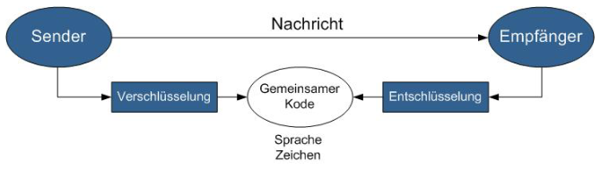

#### Problematiken
- Art des Kommunikationsmediums
  - mündlich: Redundanz, Rückkopplung
  - schrifltich:
- Unterschiedliche Begriffswelten bei Informationsaustausch
- Implizites und vorausgesetztes Vorwissen
  - Vereinfachung im sprachlichen Ausdruck schüren Missverständnisse

> **Je mehr Gemeinsamkeiten existieren, desto leichter fällt die Kommunikation.**

### Fähigkeiten eines Requirement Engineers

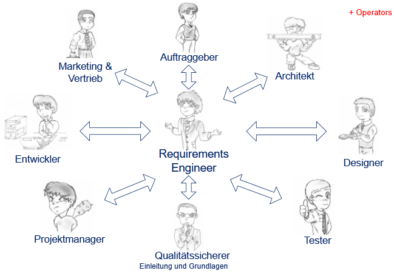

- Analytisches und methodisches Denken
- Selbstbewusstes Auftreten
- Kommunikation
- Empathie
- Moderation
- Überzeugung
- Komfliktlösung

**Aber:**
- meist Outsourcing, sodass externe RE'ler ab vom Geschehen urteilen
- nicht empfohlen Projektmanager zum RE'ler zu machen

### Funktionale Anforderung (FA) (!)
> - Anforderung bezüglich eines Ergebnisses oder Verhaltens, das von einer Funktion eines Systems bereitgestellt werden soll.
> - Verhaltens-, Struktur-, Funktionanforderungen
> - Bestehen aus:
>   - Arbeitsumfang für das zu untersuchenden Geschäftsfeld
>   - Vorgsehene Produktgrenzen und Verbindungen zu Nachbarsystemen (Use Cases!)
>   - Anforderungen an Funktion und Daten des Produktes

### Nicht-funktionale Anforderung (NFA) (!)
> - Oberbegriff für Qualitätsanforderungen und Randbedingungen (Normen, juristische Anforderungen), die funktionale Anforderungen ergänzen.
> - Gute NFA machen Qualität verbindlich und prüfbar. Der Test weist sie nach.
> - NFA gehören zu konkreten Funktionen.
> - Gute NFA haben Kontext, Messgröße und Grenzwerte.
> - Beispiele enden mit prüfbarer Formulierung.
> - Aus NFA entstehen Akzeptanzkriterien und Prüfungen.

- Zu jeder nicht-funktionalen Anforderung sollte eine funktionale Anforderung formuliert werden.
- **Nicht-funktionale Anforderungen sind früh relevant, da sie sonst oft teuer werden.**
- Sie beeinflussen:
  - Architekturentscheidungen
  - Technologieauswahl
  - Aufwandsschätzungen
  - Risiken und Priorisierung
  - Teststrategie
  - Betrieb und Wartung

#### Qualitätsanforderung
> - Anforderung, die sich auf ein **Qualitätsmerkmal** bezieht, das nicht durch funktionale Anforderungen abgedeckt wird.
> - Mit Normen (wie ISO) wird Qualität vereinbart. Aktuelle Produktqualitätsnorm: ISO/IEC 25010:2023

- Jede Anforderung sollte überprüfbar sein, das ohne Qualitätsmerkmal nicht möglich ist.
- Sie legen die gewünschte Qualität fest und beeinflussen stark die Systemarchitektur.
- Typische Kategorien:
  - Look and Feel (Oberflächenanforderung)
    - Beschreibt Stimmung, Stil usw. des Aussehens und Verhaltens des Produktes
  - Benutzbarkeit (Benutzbarkeitsanforderung)
    - spezifizieren Verbraucherfreundlichkeit, Bedienbarkeit für die erwartete Zielgruppe
    - Schnittstelle Mensch / Maschine
  - Leistungseffizienz (Performanceanforderung)
    - beschäftigen sich mit Geschwindigkeit, Genauigkeit, Kapazität, Vefügbarkeit, usw.
    - Beispiel: *wie schnell, groß, genau, sicher, verfügbar, robust, skalierbar, ...*
  - Funktionalität (Operationale und Umgebungsanforderung)
    - Was kann das Produkt? Passt alles zusammen?
    - "Productization" und Releases
  - Wartbarkeits- und Supportanforderungen
  - Sicherheitsanforderungen
    - Datenschutz, Datensicherheit
    - Informationssicherheit
    - Gefährdungssicherheit
  - Kulturelle und politische Anforderungen
  - Rechtliche Anforderungen
    - Erfüllung zutreffender gesetzlicher Forderungen und Anpassung an Standards
  - Zuverlässigkeit
    - 99,9 % Verfügbarkeit gewährleistet?
    - Was ist, wenn ein Teil meines System ausfällt?
  - Änderbarkeit
  - Übertragbarkeit
  - Kompatibilität
- Beispiele: *Antwortzeit, Verfügbarkeit, Sicherheit*

#### Randbedingung
> - Anforderung, die **zulässige Lösungen einschränken**, um die funktionalen Anforderungen und die Qualitätsanforderungen zu erfüllen.
> - Bestehen aus:
>   - Geforderte Einschränkungen zu Produkt und Design
>   - Namenskoventionen und Defintionen (Glossar)
>   - Relevante Fakten mit Bedeutung für Produkt und Annahmen der Entwickler

- Sie werden nicht direkt umgesetzt und können nicht beeinflusst werden.
- Sie schränken die Umsetzungsmöglichkeiten ein.
- Sie können sich auf das betrachtete Sytem und/oder den Entwicklungsprozess beziehen.
- **Typische Bereiche**:
  - technologische Vorgaben
    - klimatische Umgebung, Schnittstellen (elektrisch, mechanisch)
    - Vorgaben an Komponenten (Hardware)
  - Benutzeroberfläche
    - Bedienkonzepte
    - Gestaltung der Benutzeroberfläche
    - Bedienelemente
  - durchzuführende Tätigkeiten
    - Requirements Engineering
    - Projektmanagement
    - Test
    - Änderungsmanagement
    - Einführung
    - Inbetriebnahme
    - Wartungs- und Supportleistungen
  - sonstige Lieferbestandteile
    - Schulungsunterlgen
    - Installationssoftware
    - Hardware- und Softwaredokumentation
    - Benutzerhandbuch
    - Wartungshandbuch
  - rechtlich-vertragliche Vorgaben
    - Anforderungen an den Auftragnehmer
    - Kosten
    - Angebotsprozess
    - Angebot
    - Gewährleistung
    - Verschwiegenheit
    - Rechtseinräumung
    - Compliance
- Beispiel: *Werkzeuge, wie Nutzung der Programmiersprache Java*

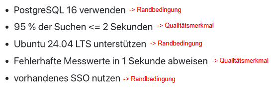

#### Umgang mit nicht-funktionalen Anforderungen
- Dokumentation in natürlicher Sprache
- ebenso wichtig wie funktionale Anforderungen → Zusatzinformationen
- gleichzeitig mit funktionalen Anforderungen ermitteln und dokumentieren
- Testbar durch Ableitung FA oder quantitative Form (Integration konkreter Werte)
  - müssen prüfbar/testbar sein
- werden nicht alle unbedingt umgesetzt, schränken die Umsetzung allerdings ein
- für Architektur und AWS notwendig
- evtl. Absprache mit Fachleuten/Stakeholdern notwendig

#### Schwierigkeiten
- NFA werden erst am Projektende diskutiert.
- NFA stehen ohne Bezug zu Funktionen.
- Auswirkungen auf die Architektur wird unterschätzt.
- Akzeptanzkriterien werden mit Anforderungen verwechelt.
- Vage Wörter bleiben unquantifiziert
  - Beschreiben nur die resultierende Eigenschaft, wenn das System die Anforderung erfüllt
  - Beispiele: *schnell, robus, flexibel, benutzerfreundlich*
- Zielwerte werden nicht hilfreich begründet
  - Es wird nicht erklärt, was passiert, wenn der Wert nicht erreicht wird.
  - Beispiele: *100% verfügbar, keine Fehler, zukunftssicher*
  - Messbare Aussagen entstehen erst durch Kontext und Grenzwerte.
- Messverfahren fehlen.

### Konkretisierung der Anforderungen (Mini-Checkliste)
- Was ist der **Kontext**?
- Wo liegt die **Systemgrenze**?
- Für welche **relevante Funktion** gilt die NFA?
- Welche **Nutzungssituation** ist gemeint?
- Welche **Messgröße** wird verwendet?
- Welcher **Grenzwert** gilt?
- Wie wird die Erfüllung geprüft (**Nachweis**)?

## System und Systemkontext abgrenzen
### Systemkontext (!)
> - Teil der Systemumgebung, der für die Definition und das Verständnis der Anforderungen des betrachteten Systems relevant ist.
> - Unrelevante Anforderungen sollten dennoch dokumentiert sein, um später nachvollziehen zu können, dass diese abgewägt worden.

Zweck des Systemkontextes (Einstiegsfragen bei Anforderungserhebung)
1. Was soll Teil des Sytems sein und was nicht?
2. Was hat einen direkten Bezug zum System?

### Systemgrenze (!)
> - Separiert das geplante System von seiner Umgebung. 
> - Sie grenzt den im Entwicklungsprozess veränderbaren und nicht veränderbaren Teil der Realität von Aspekten in der Umgebung ab.

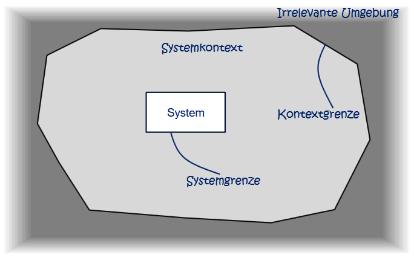

### Kontextgrenze (!)
> Sie separiert den relevanten vom irrelevanten Teil der Umgebung eines geplanten Systems.
> Unrelevant ist der Teil der Umgebung, der keinen Einfluss auf das geplante System und damit auch keinen Einfluss auf die Anforderungen dieses Systems hat.

#### Grauzonen:
- werden meist während der Entwicklung aufgedeckt
- deren Zugehörigkeit muss noch geklärt werden

### Systemkontext dokumentieren (!)
#### Datenflussdiagramm / Kontextdiagramm
Was fließt an Daten hin und her?

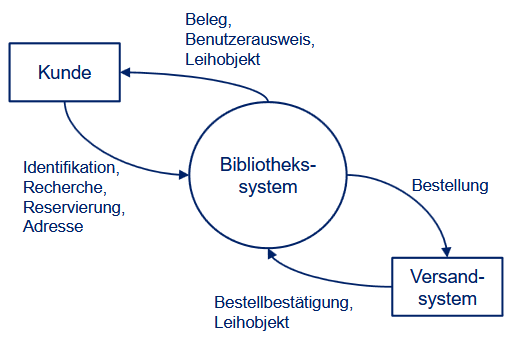

#### Use-Case-Diagramm
Was oder wer ist an welchen Use Cases beteiligt?

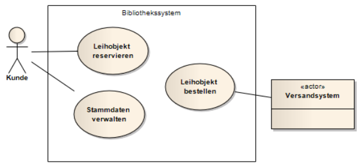

#### Klassendiagramm
Welche Daten manipuliert das System?

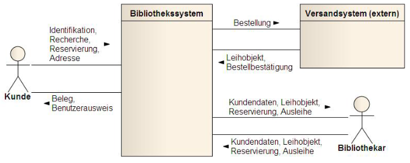

## Anforderungen ermitteln
### Anforderungsquellen (Aspekte im Systemkontext)

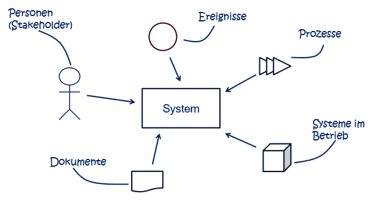

- Stakeholder: Person oder Organisation mit Einfluss auf Anforderung
  - Tabelle: Rolle, Funktion, Name, Wichtigkeit, Verfügbarkeit, Wissensgebiet
- Systeme im Betrieb: Alt- bzw. Vorgängersysteme, Konkurrenzsysteme
- Dokumente: Normen/Standards, Gesetzestexte, Fehlerberichte des Altsystems

#### Recht und Pflichten

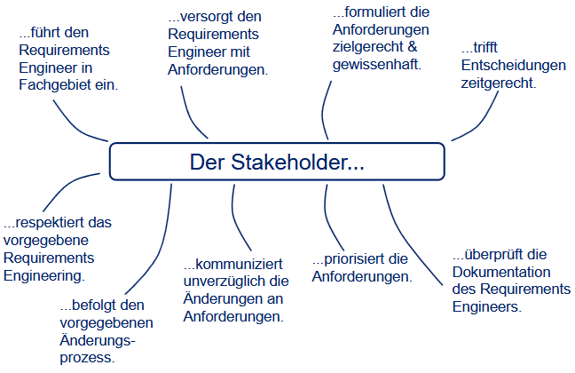

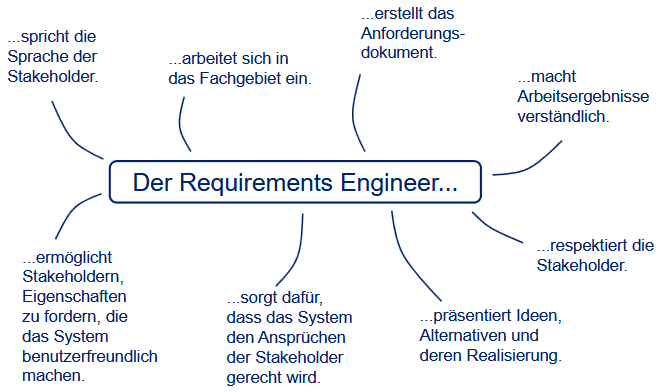

### Anforderungskategorisierung nach dem Kano-Modell (!)
**Unbewusstes Wissen**
- unbekannte Wünsche, die erst als Anforderungen erkannt werden, wenn sie **von außen herangetragen** werden.
- **Beigeisterungsfaktoren** sind Systemmerkmale, die der Stakeholder nicht kennt und erst während der Benutzung als angenehme undnützliche Überraschung entdeckt.
- steigern Zufriedenheit überproportional

**Bewusstes Wissen**
- Wissen über das man sich im klaren ist oder das in seiner vollen Bedeutung **klar erkannt** wird.
- **Leistungsfaktoren** sind die **explizit geforderten** Systemmerkmale.
- Erfüllung führt zu Staktholder-Zufriedenheit. Bei Fehlen sinkt diese.

**Unterbewusstes Wissen**
- Wissen, welches sich dem Bewusstsein im Moment nicht darbietet, aber dennoch **handlungsbestimmend** ist und potentiell aufgerufen werden kann.
- **Basisfaktoren** sind die **selbstverständlich vorausgesetzten** Systemmerkmale.
- **erfüllbar**, da sonst massive Unzufriedenheit beim Kunden.

**Kano-Modell**

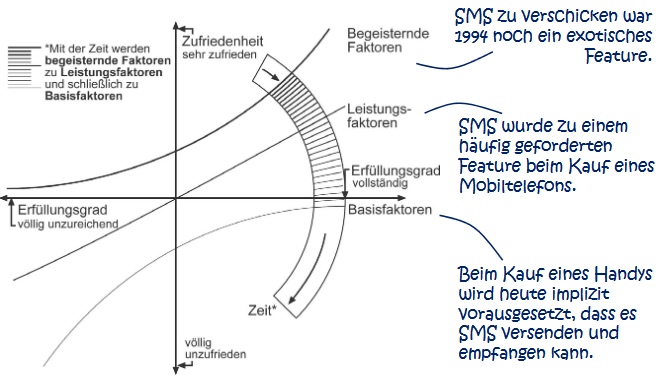

### Ermittlungstechniken (!)
**Ziel**
- Bewusste, unbewusste und unterbewusste Anforderungen der Stakeholder herauszufinden.

**Wichtige Einflussfaktoren**
- Unterscheidung nach bewussten, unbewussten und unterbewussten Anforderungen
- Chancen und Risiken des Projektes
- Erfahrung des RE'lers mit entsprechener Ermittlungstechnik
- Termin- und Budgetvorgaben
- Verfügbarkeit relevanter Anfoderungsquellen

**Auswahl anhand Risikofaktoren**
- Auswahl der geeigneten Ermittlungstechnik durch Analyse der kritischen Randbedingungen des Projektes
  - menschliche Einflüsse
  - organisatorische Einflüssen
  - fachlich-inhaltliche Einflüsse

**1. Befragungstechniken**
- **Fragebogen** 
  - Inhalt: 
    - Erstellung, mit Rückgabedatum versenden, Rückläufer auswerten
    - offene und geschlossene Fragen, Multiple Choice Fragen
  - Pro:
    - viele Stakholder mit geringem Zeit- und Kostenaufwand in Analyse einbeziehen
    - können elektronisch verteilt und tollunterstützt ausgewertet werden
  - Contra:
    - schlecht geeignet, implizites Wissen zu ermitteln
    - Rückfragen oder weiterführende Fragen sind aufwändig
    - Formulierung der Frage beeinflusst Antwort
    - nicht jeder versendete Fragebogen wird beantwortet

- **Interview** 
  - Inhalt:
    - Vorbereitung, Fragen stellen, Rückfragen direkt klären, Prokoll führen, Nachbereitung, Abnahme
    - Audioaufzeichnungen als Hilfstechnik
  - Pro:
    - individuelle und konkrete Anpassung auf die einzelne Person
    - persönliche Anwesenheit der RE'lers erhöht Wahrscheinlich zur Beantwortung der Fragen
  - Contra:
    - mit vielen Stakeholdern zeitaufwändig
    - Effektivität hängt von Erfahrung des Interviewers ab

**2. Kreativitätstechniken**
- **Brainstorming**
  - Inhalt:
    - Gruppe 5-10 Personen mit Moderator
    - vorgegebene Zeit
    - Ideen sammeln, aber nicht beurteilen, sondern analysieren und reflektieren
    - Maßnahmen ableiten
  - Pro:
    - vielen Ideen in kurzer Zeit
    - mehrere Personen entwickeln ihre Ideen gegenseitig weiter
  - Contra:
    - bei schwieriger Gruppendynamic weniger effektiv
    - bei räumlicher Distanz der Teilnehmer höherer Aufwand

- **Brainstorm Paradox**
  - Inhalt:
    - Modifikation des Brainstormings
    - Übliches Thema wird umgekehrt: "Was müssen wir tun, dass unser Projekt innerhalb kürzester Zeit gegen die Wand fährt?"
    - unerwünschte Ergebnisse sammeln und Maßnahmen ableiten, um diese zu verhindern
  - Pro:
    - gleiche Vorteile wie beim Brainstorming
    - zeigt Risiken und Gefahren
  - Contra:
    - gleiche Nachteile wie beim Brainstorming

- **Perspektiv-Wechsel**
  - Inhalt:
    - unterschiedliche Sichweisen einnehmen
    - Sechs-Hut-Denken nach De Bono
      - Objektiv und neutral
      - Subjektive Meinung
      - Negative Argumente
      - Positive Eigenschaften
      - Neue Ideen
      - Moderator
  - Pro:
    - ermöglicht "festgefahrenden" Stakeholdern, ihre eigene Sichtweise zu verlassen
  - Contra:
    - schwierig für introvertierte und konservative Stakeholder

- **Analogietechnik**
  - Inhalt:
    - Analogie suchen und Teilnehmern vorstellen, Frage stellen, Ideen sammeln
    - Wikrliches Problem vorstellen, Ideen übertragen, Maßnahmen ableiten
  - Pro:
    - komplexe Probleme oder schwer vorstellbare Zusammenhänge werden verständlicher
    - Erfahrungen und Lösungen anderer Kontexte in Problemstellung transferieren
  - Contra:
    - Bionik (biologische Prinzipien als Vorbild für Innovation) und Bisozation (Konzepte unterschiedlicher Bereiche verknüpfen) sind zeitaufwändig
    - fehlerhafte Rücktransformation der Ergebnisse kann zu ungeeigeneten Lösungen führen

**3. Dokumentenzentrierte Techniken**
- **Systemarchäologie**
  - Inhalt:
    - Information aus Altsystem oder Konkurrenzsystem beschaffen aus...
      - Dokumentationen (Benutzerhandbuch, Installationsanleitung, ...)
      - Implementierung / Code
      - Verträgen
      - Testfällen
  - Pro:
    - irrelevante Inhalte des Dokuments können ignoriert werden
    - fokussierte Analyse
  - Contra:
    - aufwändig
    - lohnt nicht bei großer Anzahl potentieller Änderungen, Anforderungen müssten neu ermittelt werden

- **Perspektivenbasiertes Lesen**
  - Inhalt:
    - Dokument aus vorbestimmter Perspektive lesen (Realisierer, Tester, Architekt, Auftraggeber, Anwender)
  - Pro:
    - irrelevsnte Inhalte des Dokuemnts können ignoriert werden
    - fokussierte Analyse
  - Contra:
    - Einnehmen der Perspektiven für unterschiedliche Rollen schwierig

- **Wiederverwendung - Reuse**
  - Inhalt:
    - bereits erarbeitete Anforderungen wiederverwenden
    - Anforderungen sammeln, strukturieren, bereithalten
  - Pro:
    - Kostenersparnis, da Anforderungen bereits ermittelt sind
    - Prüfen und Korrigieren der Anforderungen kann reduziert werden
  - Contra:
    - Auffinden der richtigen Anforderungen
    - Qualität der alten Anforderungen nicht ausreichend
    - fehlerhafte Anforderungen werden evtl. übernommen

**4. Beobachtungstechniken**
- **Feldbeobachtung**
  - Inhalt:
    - Prozesse, Handgriffe, Arbeitsabläufe beobachten
    - Videoaufzeichnung als Hilfstechnik
  - Pro:
    - sehr effektiv bei Untersuchung von Abweichungen in Prozessen
    - gut geeignet bei sprachlich schwer vermittelbaren Arbeitsabläufen
    - gut einsetzbar bei schlechter Kommunikationsfähigkeit
  - Contra:
    - Problem bei schwer beobachtbaren Abläufen, z.B. bei Motorsteuerung
    - Stakeholder können sich durch Anwesenheit des RE'lers unwohl fühlen.

- **Apprenticing (Ausbildung)**
  - Inhalt:
    - Stakeholder = Meister
    - Analytiker = Lehrling
    - Analytiker lernt vom Stakeholder
  - Pro:
    - unklare Handlungsschritte können sofort hinterfragt werden
    - gut geeignet, wenn Stakeholder ihr Wissen nicht sprachlich ausdrücken können
    - typisches Machtverhältnis zwischen Stakeholder und RE'ler wird umgedreht
  - Contra:
    - ungeeignet bei kritischem Arbeitsumfeld, z.B. Flugsicherung
    - zeitintensiv

**Unterstützende Techniken**
- **Mindmapping**
  - grafische Darstellung, die Verfeinerungsbeziehungen und Abhängigkeiten zwischen den Begriffen abbildet
- **Workshops**
  - Beim Zusammentreffen von RE'ler und Stakeholder werden Anforderungen intensiv erarbeitet
- **CRC Karten (Class Responsibility Collaboration Cards)**
  - Mit Karteikarten werden Kontextaspekte und deren Eigenschaften und Beziehungen notiert
  - Dient der Erarbeitung von Anforderung
- **Audio- und Videoaufzeichnungen**
  - Ergänzung der Feldbeobachtung, um schnell ablaufende Prozesse wiederholt zu betrachten oder Gesrpäche wiederholt zu hören.
- **Darstellung von Use Cases**
  - Darstellung von Abläufen, die außerhalb des Systems sichtbar sind (mit auslösenden Ereignissen und vom System erwarteten Ergebnissen)
- **Prototypen zur Veranschaulichung**
  - Nutzung von z.B. User-Interface-Prototypen für zusätzliche funktionale Anforderungen

## Anforderungen dokumentieren
### Anforderungsspezifikation (auch: Anforderungsdokument)
> Systematisch dargestellte Sammlung von Anforderungen (typischerweise für ein System oder eine Komponente), die vorgegebenen Kriterien genügt.

### Gründe für Dokumentation
- zentrale Bedeutung von Anforderungen 
  - Eingrenzung Interpretationsspielräume / Mismatches
- rechtliche Relevanz 
  - Nachweisbarkeit für weniger Diskussionspotential 
  - Vorschriften festhalten
- Komplexität 
  - Nachvollziehbarkeit (Einarbeitung, Nacharbeiten → Historie)
- Zugreifbarkeit 
  - fehlende Auskünfte aufgrund von Urlaub oder Fluktuation

### Arten der Dokumentation
#### Perspektiven von Anforderungen (!)
**Strukturperspektive**
- statisch-strukturell orientiert (grobe Struktur)
- Betrachtung: Nutzungs- und Abhängigkeitsbeziehungen des Systems im Systemkontext
- Modell: UML oder ER
- Beispiel:
  - *Struktur von Ein- und Ausgabedaten*
  - *die zu nutzenden Dienste eines externen Systems*

**Funktionsperspektive**
- funktionsorientiert
- Betrachtung:
  - Welche Daten aus dem Systemkontext werden durch das zu entwickelnde System bzw. dessen Funktionen manipuliert?
  - Welche Daten fließen vom System in den Systemkontext?
- Modell: Aktivitätsdiagramm oder Datenflussdiagramm

**Verhaltensperspektive**
- zustandorientiert
- Betrachtung: System und dessen Einbettung in den Systemkontext
- Modell: UML-Zustandsdiagramm
- Beispiel:
  - *Reaktion des System auf Ereignisse im Systemkontext*
  - *Bedingungen eines Zustandswechsels*
    - Zustandswechsel durch Trigger auslöst
    - Unter welchen Bedingungen geht es weiter?

#### Natürlichsprachliche Dokumentation
**Vorteile**
- Jedem verständlich
- Kein Erlernen einer Notation nötig
- Einsetzbar für alle Arten von Anforderungen

**Nachteile / potentielle Gefahren**
- Natürliche Sprache ist oft mehrdeutig oder missverständlich
- Unbeabsichtigtes Vermischen der Perspektiven von Anforderungen
  - Einwegkanal: Man muss mit den erhaltenen Informationen arbeiten können
- Isolation der Anforderungen für nur eine Perspektive schwierig. → Mischform|

#### Modelbasierte Dokumentation
**Vorteile**
- Anforderungen können isoliert in jeder der drei Perspektiven dokumentiert werden
  - verschiedene Werkzeuge
- Kompakt und für geübten Leser Einarbeitungszeit kürzer
- Vermeiden von Missverständnisen

**Nachteile / potentielle Gefahren**
- Kein universaler Einsatz
  - Hängt von Diagrammform ab
- Kenntnis der Notation nötig

#### Mischformen
**1.** Anforderungsdokumente enthalten nicht nur Anforderungen
  - WICHTIG: Dokumentation von Entscheidungen für Nachweisbarkeit
  - Umfang der Erläuterungen eigenes Ermessen, aber sollte nachvolziehbar sein
  - Relevante Informationen, wie Randbedingungen, sollten notiert sein → besser haben als brauchen
**2.** Die Wahl der geeigneten Dokumentationsform ist von mehreren Faktoren abhängig
  - Welche Dokumentationsform ist für die beschriebene Perspektive geeignet? 
    - Einheitlichkeit verwenden
    - unterschiedliche Beschreibung von Perspektiven kritisch betrachten
  - Leserkreis sollte berücksichtigt werden
    - Einheitlichkeit, strukturelle Nachvollziehbarkeit, bestimmtes Wissen vorwegnehmen, um Einarbeitungszeit zu vermeiden
  - zu dokumentierendes Wissen
**3.** Typisch ist eine Kombination aus natürlichsprachlichen Anforderungen und konzeptuellen Modellen
  - Schwächen der einen Dokumentationform werden durch die Stärken der anderen weitgehend ausgeglichen
    - geeignetste aus jeder Dokumentationsform herausnehmen
  - Vorteile beider Dokumentationsformen werden genutzt
  - Beispiel: 
    - *Diagramme (konzeptionelle Modellen) mit mehr Details in natürlicher Sprache beschreiben / kommentieren*
    - *übersichtliche Zusammenfassung von natürlichsprachigen Anforderungen mittels Modellen*
    - *doppelter Aufwand, aber gute Chance auf Eindeutigkeit*

### Struktur eines Anforderungsdokumentes
#### Standardgliederungen
**Vorteile:**
- Hauptgrund: Wiedererkennungswert → schnellere Erfassung des ausgewählten Inhaltes
- Erleichtert Einarbeitung neuer Mitarbeiter
- Ermöglicht systematisches Vorgehen bei Anforderungsermittlung
- Selektives Lesen / Überprüfen von Anforderungsdokumenten
- einfache Wiederverwendung von Inhalten
  - Achtung: nötige kundenspezifische Anpassungen berücksichtigen

> Sie können und sollten an die projektspezifischen Randbedingungen angepasst werden

**Rational Unified Process (RUP)**
- für objektorientierte Softwaresysteme
- Auftraggeber erstellt Business Model
- Auftragnehmer nutzt Software Requirements Specification (SRS) für Anforderungsdokumentation

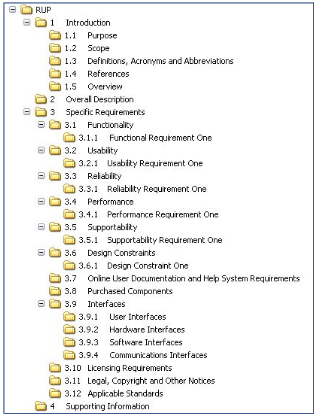

**Volere**
- Urpsrung: Karteikarten → Jede Kateikarte hatte bestimmte Merkmale
- zugeschnitten auf objektorientierte Softwareentwicklung
- Sammlung von Hilfsmitteln und Materialien zum RE
  - guter Blick auf das Gesamtsystem, nicht nur Anforderungen
  - Viele vorgefertigte Schubladen, darunter einige, die sich nicht in anderen Standards wieder finden (z. B. „Kulturelle und politische Anforderungen“)
  - Warteraum für Anforderungen, die in künftigen Releases der Software enthalten sein könnten

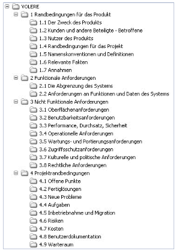

**IEEE 830-1998**
- Inhalt:
  - Einführende Informationen, z.B. Systemzweck, Systemabgrenzung, Begriffsdefinition
  - Allgemeine Beschreibungen der SOftware, z.B. Perspektive des Systems, Merkmale der zukünftigen Benutzer, Einschränkungen für die Entwicklung
  - spezifische Anforderung, z.B. funktionale Anforderungen, Performance
- Produktumfeld fehlt im Volere

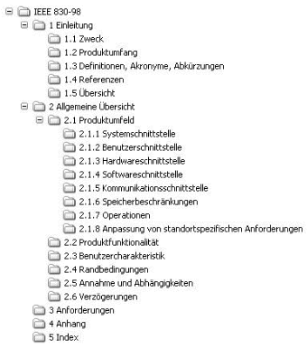

**V-Modell des Bundesministeriums**
- **Lastenheft**
  - Anwendersicht
  - Erstellung vom Auftraggeber
  - Beschreibt das "Was?" und "Wofür?"
  - Gesamtheit der Forderungen für Auftragnehmer → Verhandlungsspielraum
- **Pflichtenheft**
  - Baut auf Vorgaben des Lastenhefts auf
  - Setzt Lastheft ("Wie?") um
  - Konkretisierung der Anforderungen im Lastenheft
  - Realisierungsvorgaben vom Auftragnehmer

#### Standardinhalte anpassen
Punkte, die jede gewählte Struktur umfssen sollte.

**Spezifikation**

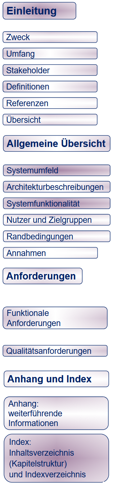

**Verwendung der Spezifikation:**
- Änderungsmanagement
- Architekturentwurf
- Test
- Vertragsmanagement
- Implementierung
- Systemnutzung und Systemwartung
- Planung

#### Gute Anforderungsdokumente
**Qualitätskriterien  nach IEEE 830-1998:**
- angemessener Umfang
- Klare Struktur
  - ermöglicht selektives Lesen
- natürlich hohe Qualität aller einzelnen Anforderungen
  - Anforderungsspezifikation braucht solide Basis
  - Abgestimmtheit (übereinstimmende Meinung aller Stakeholder)
  - Gültigkeit und Aktualität
  - Realisierbarkeit
  - Verständlichkeit
  - Nur eine Anforderung pro Satz (nur je ein Verb)
  - Kurze Sätze, kurze Absätze
- Eindeutigkeit und Konsistenz
  - In sich und zu allen anderen Anforderungen
  - Voraussetzung: gute Qualität der Einzelanforderungen
- Modifizierbarkeit und Erweiterbarkeit
  - Inhalt und Struktur sollten die Änderbarkeit unterstützen
- Verfolgbarkeit
  - Ursprung und Beziehungen zu anderen Entwicklungsdokumenten sicherstellen
- Vollständigkeit
  - Beinhaltet auch formale Gesichtspunkte

#### Glossar
> - Sammlung von Begriffsdefinitionen
> - Steigert die Verständlichkeit der Anforderungen wesentlich.
> - Missverständnisse bzw. unterschiedliche Interpretationen sowie hierdurch potentiell entstehende Konflikte werden von vornherein vermieden.

**Inhalt:**
- kontextspezifische Fachbegriffe
- Abkürzungen und Akronyme
- alltägliche Begriffe, die im gegebenen Kontext eine spezifische Bedeutung haben
- Synonyme
- Homonyme

**Grundregeln zur Nutzung:**
- zentrale Verwaltung
- Verantwortlichen bestimmen
- stetige Pflege zur Projektlaufzeit
- allgemeine Zugänglichkeit
- Erklärung zur verbindlichen Verwendung
- Erfassung der Begriffsquellen
- Einträge mit Stakeholdern abstimmen
- einheitliche Struktur der Einträge festlegen
- frühzeitig mit Aufbau anfangen

## Anforderungen natürlichsprachlich dokumentieren
### Kommunikationsmedium Sprache
#### Grundlegende Problematik
- natürliche Sprache ist mehrdeutig
- viele Menschen sind am Entwicklungsprozess beteiligt
  - Unterschiede in Wissen, sozialer Prägung und Kultur
- Menschen interpretieren Ghärtes, Gesehenedes und GElesendes unterschiedlich
  - aus der Realität wird eine sogenannte "Tiefenstruktur" im Kopf gebildet

#### Transformationsprozesse
- persönliche Wahrnehmung führt zur Wahrnehmungstransformation
- sprachlicher Ausdruck des persönlichen Wissens führt zur Darstellungstransformation

### Sprachliche Effekte und ihre Vertreter
#### Kategorien der Darstellungstransformation nach NLP (!)
**Verzerrung:**
- Indikator für realitätsverfälschende Aussagen
- Vertreter: **Nominalisierung** (Umwandlung eines Wortes in ein Nomen)
- Problem: Signalwörter (z.B. Speicherung, Archivierung) sind an anderer Stelle im Anforderungsdokument nicht ausreichend spezifiziert.
- Lösung: Anforderungen werden mit Vollverben oder einem Glossareintrag näher definiert.
- Beispiel:
   
  *Die Daten müssen dem Anwender grafisch dargestellt werden.*
   ↓ 
  *Nachdem der Bibliothekar die Berechnung der Leihobjektstatistik initiiert hat, muss das Bibliothekssystem dem Bibliothekar alle statistisch berechneten Daten der Leihobjekte grafisch anzeigen.*

**Generalisierung:**
- Indikator für fehlerhafte Verallgemeinerungen
- Vertreter: **Substantive ohne Bezugsindex oder Universalquantoren**
- Problem: Signalwörter (z.B. Anwender, alle) führen zu lückenhaften Informationen, die näher erläutert werden sollten.
- Lösung: 
  - schwammig formulierte Substantive hinterfragen, feststellen für welche Objekte und Akteure die Anforderung gelten soll und die getilgte Information ergänzen.
  - Menge der Objekte einschränken, wenn nur Teilmenge betroffen ist, oder erweitern, wenn zusätzliche Objekte betroffen sind.
  - Berücksichtigung von Ausnahmen
- Beispiel:
   
  *Das Bibliothekssystem muss es jedem Benutzer ermöglichen, alle Benutzerdaten zu ändern.*
   ↓ 
  *Das Bibliothekssystem muss es jedem Benutzer ermöglichen, die über ihn gespeicherten Registrierungsdaten zu ändern.*

**Tilgung:**
- Indikator für unvollständige Informtationen
- Dinge werden gar nicht bewusst wahrgenommen und werden demnach nicht beachtet (nicht spezifiziert, nicht dokumentiert)
- Vertreter: **unvollständig spezifizierte Bedingungen oder Prozesswörter**
- Problem: Signalwörter (z.B. wenn...dann, anzeigen) sollten hinterfragt werden, um Missverständnisse und spätere Nachfragen zu vermeiden
- Lösung: 
  - Spezifikation, wie sich das System verhalten soll, wenn die Bedingung nicht eintritt. Dies bedingt eine Anforderung für jede fehlende Bedingung oder Erweiterung der bestehenden Anforderung um die fehlenden Fälle.
  - W-Fragen stellen (z.B. Was, wem, wann wird angezeigt) und fehlende wissenswerte Informationen ergänzen.
- Beispiel:
   
  *Falls ein Leihobjekt nicht reserviert ist, muss das Bibliothekssystem dem Bibliothekar die Fortsetzung des Ausleihprozesses ermöglichen.*
   ↓ 
  *Falls das Leihobjekt reserviert ist, muss das Bibliothekssystem dem Bibliothekar eine Fehlermeldung anzeigen.*

#### Stilregeln 
- Dokumentation des Subjektes der Anforderung (z.b. durch Aktivformulierung)
- Verwendung einer einheitlichen Terminologie
- Klärung 
  - unklarer Referenzen
  - Mengen- und Häufigkeitsangaben
  - fehlende Bedingungen

### Master Satzschablone
> - Ist ein Bauplan für die syntaktische Struktur einer einzelnen Anforderung.

#### Vorteile
- einfach erlernbar
automatische Reduktion von sprachlichen Effekten
- für alle Arten von Systemen einsetzbar
- Anforderungen von hoher Qualität in ausbalanciertem Zeit- und Kostenrahmen
- stilistisch einheitliche Anforderungen

#### Schablonen für FA
**Funktionsmaster**

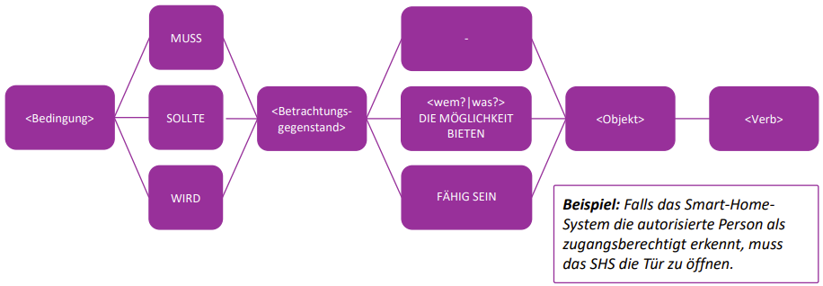

- Schritt 0: Bedingung als Nebensatz voranstellen
- Gegeben: Der Systemname
- Schritt 1: Rechtliche Verbindlichkeit
- Schritt 2: Funktionalität identifizieren
- Schritt 3: Art der Funktionalität festlegen
- Schritt 4: Objekt identifizieren
- Schritt 5: Logische und zeitliche Bedingung formulieren
- Schritt 6: Prüfung auf sprachliche Defekte

**Schritt 0: Bedingung**
- Falls es keine Bedingung gibt, wird der Betrachtungsgegenstand/Interaktionspartner nach vorne verschoben und ersetzt die Bedingung.
- Grundsätzlich voranstellen, weil sich die Anforderung gleich anders liest 
- Bekanntmachung mit Verknüpfung an eine Bedingung → kann sonst schnell überlesen werden
- Reihenfolge egal, sollte stets einheitlich bleiben

**Schritt 1: Rechtliche Verbindlichkeit**
- **Pflicht (muss)**: juristisch verbindlich, ist zwingend zu erfüllen
  - verpflichtende Anforderungen definieren
  - Abnahme des Produktes kann verweigert werden, wenn einer muss-Anforderung nicht entsprochen wurde
- **Wunsch (sollte):** juristisch nicht verbindlich, zeigt jedoch die Intention
  - Beispiel: *Umsetzungsvorschläge*
  - wünschenswerte Anforderungen definieren
  - nicht verpflichtend, müssen nicht erfüllt werden
  - dient besserer Zusammenarbeit von Stakeholdern und Entwicklern und erhöht Zufriedenheit
- **Absicht (wird):** deutet künftige Entwicklungen an
  - Beispiel: *kommende Standards oder Erweiterungen, die berücksichtigt werden müssen, die wiederum juristisch verbindlich sind*
  - Anforderungen, die in der Zukunft integriert werden, definieren
  - zukünftige Anforderungen sind verpflichtend
  - hilft aktuelle Lösungen vorzubereiten, um die spätere Integrationen optimal zu gestalten
- **Kommentar:** für alles, was keine Anforderung ist (z.B. einleitenden, erläuternden Text)

**Schritt 3: Arten der Systemaktivität / Funktionalität**
> TYP 1: **Selbstständige Systemaktivität**
> - Das System STARTET den Prozess SELBSTSTÄNDIG und FÜHRT den Prozess SELBSTSTÄNDIG durch.
  - Beispiel: *Das Bibliothekssystem muss dem Bibliothekar die eingegebenen Kundendaten anzeigen.*
> TYP 2: **Benutzerinteraktion (<wem/was> die Möglichkeit bieten)**
> - Das System STELLT dem Nutzer eine Interaktionsmöglichkeit ZUR VERFÜGUNG.
  - Beispiel: *Das Bibliothekssystem muss dem Bibliothekar die Möglichkeit bieten, Kundendaten über ein Terminal einzugeben.*
> TYP 3: **Schnittstellenanforderung (fähig sein)**
> - Das System führt einen Prozess in ABHÄNGIGKEIT VON EINEM DRITTEN (z.B. Fremdsystem, aber kein Benutzer) aus, ist an sich passiv und wartet auf ein externes Ereignis.
  - Beispiel: *Das Bibliothekssystem muss fähig sein, Ausleihdaten einer anderen Bibliothek zu empfangen.*

**Schritt 2: Konkretisierung des Prozesswortes**
- **WANN** konkretisiert den Zeitpunkt, zu dem ein Prozess gestartet wird oder verfügbar sein soll.
- **WO** konkretisiert einen Betrachtungsgegenstand und eventuell den Standort, an dem ein Przess aufgeführt wird.
- **WOHIN** konkretisiert Betrachtungsgegenstände (Fremd- oder Nachbarsysteme), mit dem das zu spezifizierende System interagiert.
- **WOHER** konkretisiert Betrachtungsgegenstände (Fremd- oder Nachbarsysteme), die mit dem zu spezifizierenden System agieren.

- Beispiel:
   
  *Das Bibliothekssystem muss dem Bibliothekar die Möglichkeit bieten, die Kundendaten zu drucken.*
   ↓ 
  *Das Bibliothekssystem muss dem Bibliothekar die Möglichkeit bieten, die selektierten Kundendaten eines registrierten Kunden auf einem Drucker zu drucken.*

#### Schablonen für NFA 
**EigenschaftsMaster**

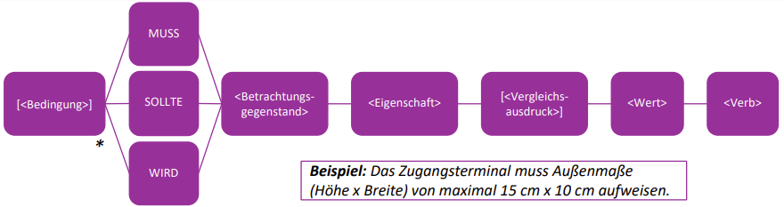

- Beschreibung eines Merkmals, welches das System charakterisiert
- Dies können Größen, Maße oder Gewicht sein
- Beispiel:
  - *Solange das Smartphone inaktiv ist muss der Stromverbrauch des Smartphones kleiner als 50% sein.*

**UmgebungsMaster**

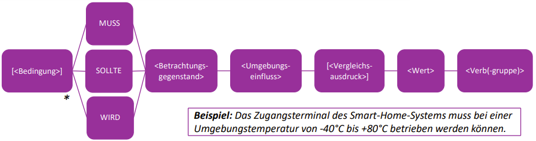

- Beshreibung des Umgebungseinflusses auf das System
- Dies können Temperatur, Luftfeuchtigkeit, Druck oder Lichteinfluss sein
- Beispiel:
  - *Das Smartphone muss so gestaltet sein, dass das Smartphone bei einer Umgebungstemperatur innerhalb -20°C bis 60°C betrieben werden kann.*

**ProzessMaster**

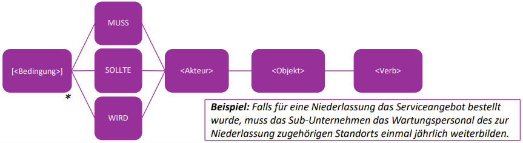

- Beschreibung spezieller Anforderungen an durchzuführende Tätigkeiten oder rechtlich-vertragliche Anforderungen
- Die Anforderung betrifft das betrachtete System nicht direkt
- Beispiel:
  - *Der Auftragnehmer muss ein Betriebshandbuch für das Smartphone erstellen.*

**Bedingungsmaster**

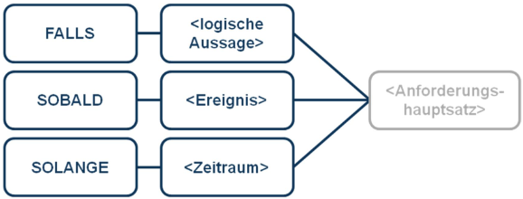

**Logikmaster**

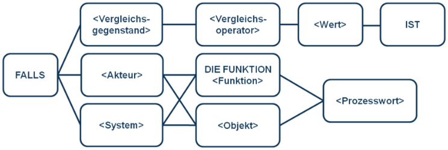

Beispiel:
*Falls die verbleibende Akkulaufzeit kleine gleich 10 Minuten ist, muss das Smartphone sich ausschalten.*

**Ereignismaster**

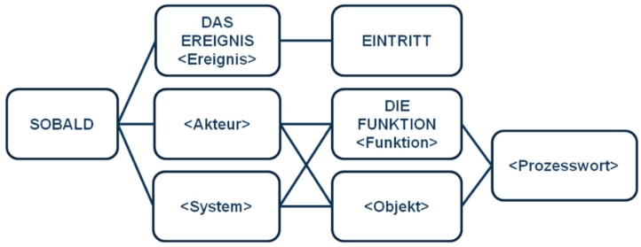

Beispiel:
*Sobald das Ereignis "Ladekabel einstecken" eintritt, muss das Smartphone dem Kunden die Meldung "Smartphone wird geladen" auf dem Display anzeigen.*

**Zeitraummaster**

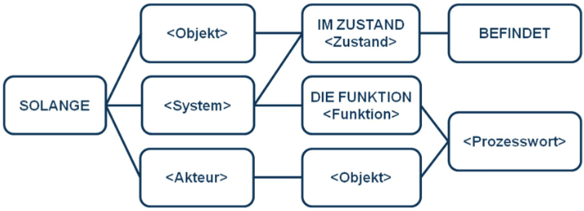

Beispiel:
*Solang sich das Smartphone im Zustand "aktiv" befindet, muss die Bildschirmhelligkeit gleich 100% sein.*

## Anforderungen modellbasiert dokumentieren
3 Ausprägungen von Anforderungen:
- Ziele
- Use Cases
- Systemanforderungen

### Modell
> - Abstrakte Darstellung einer existierenden oder einer noch zu schaffenden Realität.

- Werden ebenso zur Dokumentation von Anforderungen verwendet
- 3 Hauptaspekte von Modellen:
  - **Abbild der Realität**
    - nie 1:1, meist liegt der Fokus auf einem speziellen Problem
  - **Verkürzung der Realität**
    - Folge von Punkt 1
  - **Pragmatische Eigenschaft** 
    - für die Lösung benötigte Eigenschaften, alle anderen sind nebensächlich
    - RE'ler muss herausfiltern, was wichtig ist

#### Konzeptionelle Modellierungssprachen

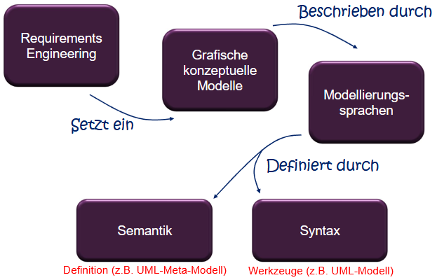

#### Anforderungsmodell
> - Ein konzeptionelles Modell, welches die Anforderungen eines Systems darstellt.
> - Hierfür wird meist UML (Unified Modeling Language) eingesetzt.

**Vorteile**
- Bildhaft dargestellte Informationen können im Gegensatz zu Fließtexten **schneller erfasst und besser memoriert** werden
- **Unterstützt den Analytiker durch Vorgaben** darüber, was in welcher Art und Weise abstrahiert werden muss
- **Definierter Fokus** der Modellierungssprache ermöglicht effiziente Dokumentation

### Zielmodelle
**Ziele**
- ... im Rahmen des RE zu untersuchen verursacht geringen Aufwand.
- ... sind Anforderungen mit großen Abstraktionsgrad, die alle weiteren Anforderungen beeinflussen.
- ... zu betrachten hat erfahrungsgemäß sehr positive Effekte auf Dokumentation.
- ... können natürlichsprachlich, aber auch modellbasiert dokumentiert werden.
- ... müssen verfeinert werden, sogenannte Dekomposition.
- ... werden meist durch eine verbreitete und einfach anzuwendende Technik verfeinert: Und-Oder-Bäume.

  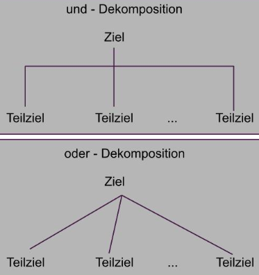

### Use Case Diagramm / Anwendungsfalldiagramm (!)
> - Basiskonzept, das sich über den kompletten Analyse- und Designprozess hinweg spannt.
> - Werden eingesetzt, da sie leicht verständlich und übersichtlich das Verhalten eines Systems aus der Sicht der Akteure beschreiben.
> - Dokumentieren die Funktionalitäten des betrachteten Systems, deren Beziehungen untereinander und die Beziehungen des System zu dessen Umgebung.
> - Grenzen des Systems müssen klar definiert sein und Akteure befinden sich immer außerhalb des Systems.

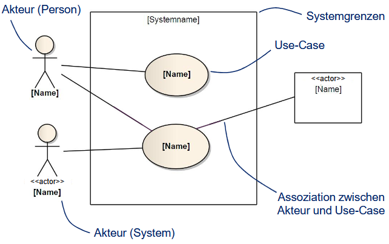

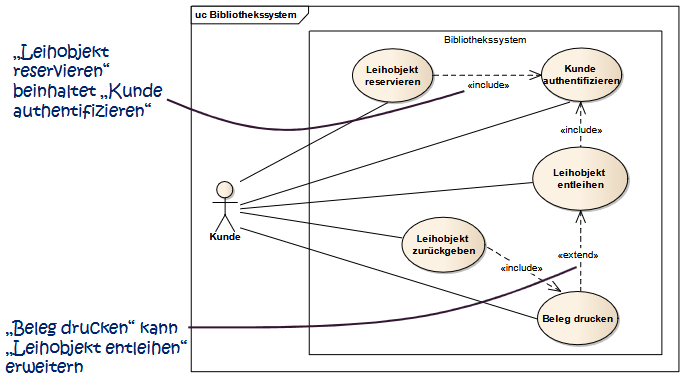

#### Notationen
**Assoziation**

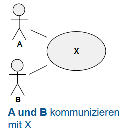

**Generalisierung**

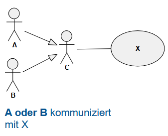

**Eingebundenes Verhalten (notwendig)**

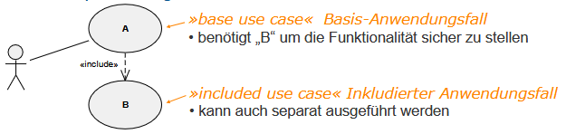

**Erweiterndes Verhalten (optional)**

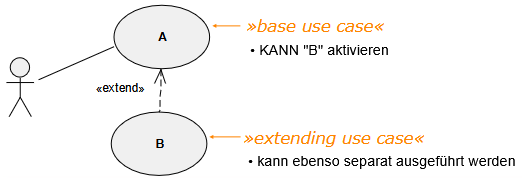

#### Erweiterung
- Aufgrund hoher Abstraktionsebene ist es sinnvoll, zusätzliche Informationen zu einem Use Case zu dokumentieren.
  - menschlich / nicht-menschlich, primär (Hauptnutzer) / sekundär (notwendiges Fremdsystem), aktiv (selbstständiges Anstoßen) /passiv
- Je nach Vorgehen muss entschieden werden, wie viele Datenfelder eine Use Case Spezifikation erhalten sollte.
- Spezifikation geschieht mit Hilfe einer entsprechenden Schablone.

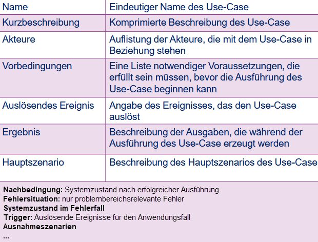

### Strukturperspektive
*Wird nicht näher behandelt, sollte klar sein*
#### UML Diagramme
> - Stellen Beziheungen zwischen Obejtekn dar, besitzen jedoch wegen der erhöhten Zahl an Modellelementen größere BEschreibungsmächtigkeit als ER-Modell.

- Datentypen haben in Anforderungen nichts zu suchen, diese sind technischer Art
- Wenn dann hält man dies als extra Anforderung natürlich-sprachlich fest

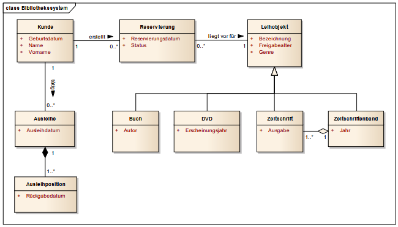

**Notationen**

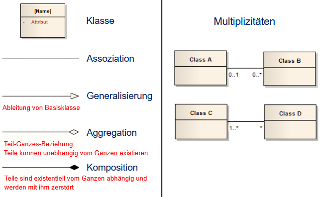

#### Entity Relationship Diagramme
> - Betrachtung der Beziehungen zwischen gleichartigen Objekten oder gleichartigen Personen

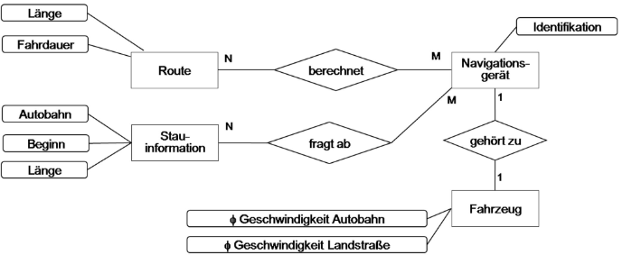

**Notationen**

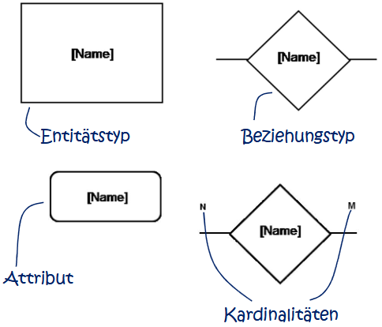

### Funktionsperspektive
#### Aktivitätsdiagramm (!)
> - Modellierung von Abläufen.
> - Fokus auf prozedurale Verarbeitungsaspekte.
> - Spezifikation von Kontroll- und Datenfluss zwischen Arbeitsschritten (Aktionen) zur Realisierung einer Aktivität

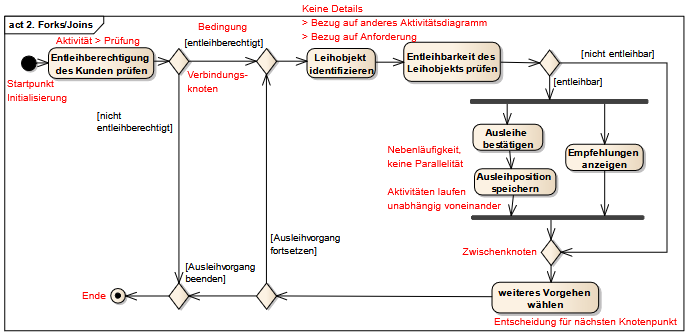

**Arten**
- **Einfacher Ablauf**
  - Mehrere Aktivtäten von einem Punkt ausgehend erlaubt
  - eine Prüfung hat mind. 2 Ergebnisse 
  - bool'sche Logik nicht vorgeschrieben
- **Fork** (Gabelung & Nebenläufigkeit) **and Join** (Vereinigung/Zusammenführung der Zweige)
  - **keine Parallelität**, Aktivitäten laufen unabhängig voneinander
  - Gabelung ohne Fork lässt Diskussionsspielraum, ob man beide Wege geht, aber Petri-Netze (veraltet) bieten die Möglichkeit der Auflösung dessen mit der Übergabe und Prüfung von Tokens
  - Bei Fork geht es nur weiter, wenn alle Zweige erfüllt wurden
- **Partitionen / Swimlanes** zur Unterscheidung von Verantwortlichkeitsbereichen

  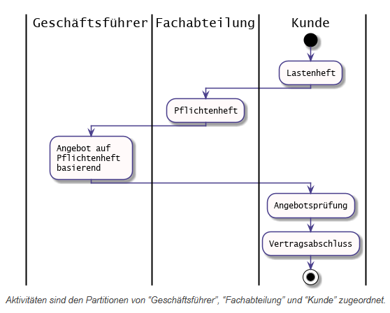

**Notationen**

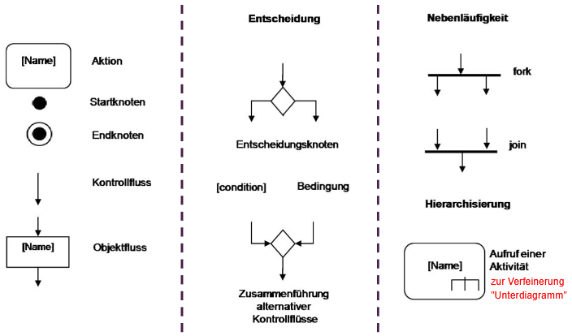

**Erweiterung**
- Kontrollsflusskanten: reine Kontrollabhängigkeit
- Objektflusskanten: Datenabhängigkeit

  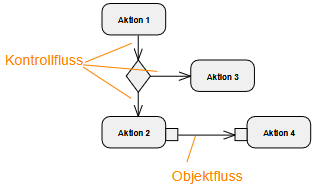

- Vorbedingung: `<<precondition>>`
- Nachbedingung: `<<postcondition>>`
- Aktivitätsendknoten: Beendet alle Abläufe einer Aktivität
- Ablaufendknoten: Beende den Ablauf einer Aktivität (z.B. innerhalb eines Fork) 

#### Datenflussdiagramm
> - Beschreibung des Transports von Daten zwischen Prozessen, Datenspeichern und Personen, Personengruppen oder Systemen.

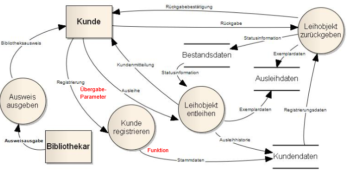

- Aktivitätsdiagramme sind sehr viel genauer, daher seltener verwendet
- Datenflussdiagramme haben keinen Start- und Endpunkt

**Notationen**

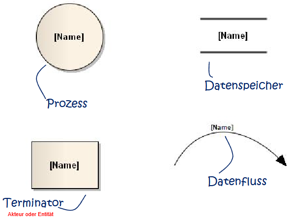

### Verhaltensperspektive
#### UML-Zustandsdiagramm (!)
> - Beschreibung möglicher Folgende von Zuständen eines Modell-Elements
> - Modelliert die 
>   - Zustände eines Systems zu verschiedenen Zeitpunkten
>   - Zustandübergänge (Transition)
>   - Ereignisse und Bedingungen (Guards), die Transitionen auslösen
>   - Aktivitäten, die in Zuständen oder im Zuge von Transitionen ausgeführt werden

- Zustandsautomaten (theoretische Informatik) werden intensive bei der Entwicklung von Compilern eingesetzt.
- Prioritäten von Prüfungen textuell transportieren (Prio1, Prio2, ...)

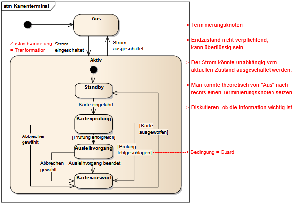

**Nebenläufigkeit**

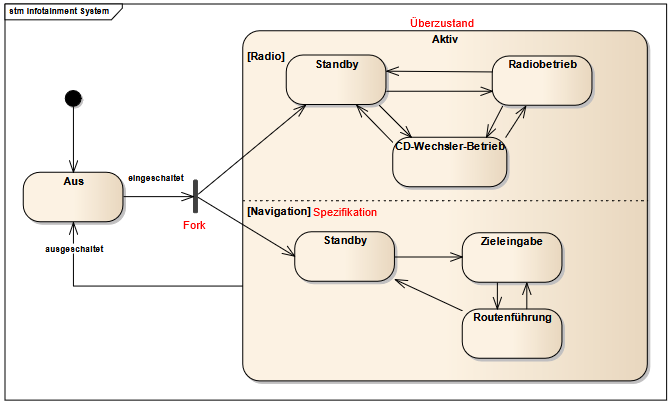

**Zustandsübergänge**

|Name|Beschreibung|Bespiel|
|---|---|---|
|CallEvent|Empfang einer Nachricht (Operationsaufruf)|stornieren()|
|SignalEvent|Empfang eines Signals|"Öffnen"-Taste gedrückt|
|ChangeEvent|Eine Bedingung wird wahr, Bedingung wird permanent geprüft|when(x < y)|
|TimeEvent|Zeitablauf oder Zeitpunkt|after(5 sec)|

**Notationen**

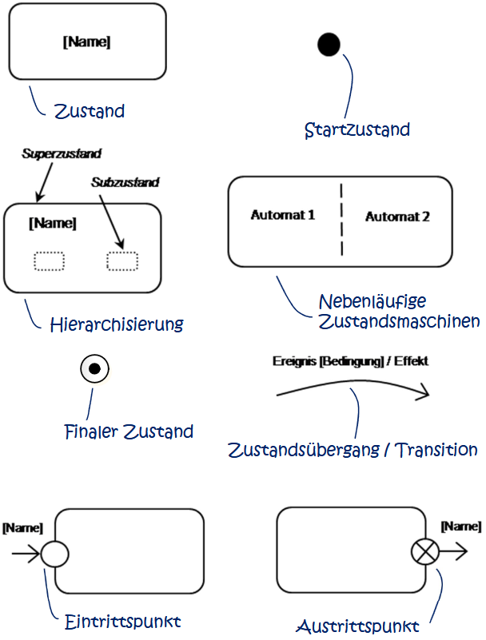

**Praktische Umsetzung**
- entry / "aktivität": Wird beim Eingang in den Zustand ausgeführt
- do / "aktivität": Wird ausgeführt, Parameter sind erlaubt
- exit / "aktivität": Wird beim Verlassen des Zustands ausgeführt

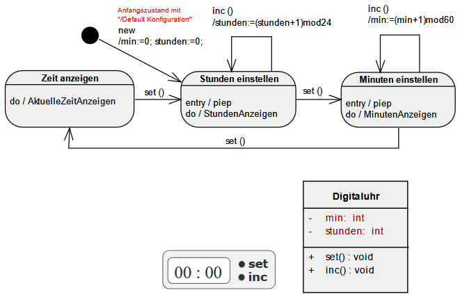

## Anforderungen prüfen (Review)
- Nicht beseitigte Defekte beeinträchtigen alle weiteren Entwicklungsaktivitäten, führen zu hohen Kosten und maximieren Risiken.
- Anforderungen sind Vertragsgrundlage zwischen Auftraggeber und Auftragnehmer.
- Sich wiedersprechende Anforderungen können Konflikte zwischen Stakeholdern erzeugen.

**Ziele**
- Fehler entdecken
- Fehler beheben
- Bei allen Stakeholdern gemeinsames Anforderungs-Verständnis schaffen

### Qualitätsaspekte
- Anforderung ist nur dann für nachfolgende Entwicklungstätigkeiten freigegeben, wenn alle 3 Qualitätsaspekte geprüft sind:
  - Inhalt
  - Dokumentation
  - Abgestimmtheit

#### Prüfkriterien Inhalt (Semantischer Qualitätsaspekt)
- Verfolgbarkeit
  - Woher kommt die Anforderung? Wo führt sie hin?
- Korrektheit
  - fachliche Richtigkeit
  - Übereinstimmung mit tatsächlichen Bedürfnissen des Stakeholders
- Konsistenz
  - keine Wiedersprüche
- Lösungsneutralität
  - nicht zu technisch (keine festgelegte Datenbank)
- Überprüfbarkeit
  - fehlende spezifische Wertangaben: "Das System soll schnell antworten"
- Notwendigkeit
  - keine Nice-to-have oder gute Begründung vorlegen
- Vollständigkeit
  - Unvollständig: "Das System soll den Kunden benachrichten"

#### Prüfkriterien Dokumentation (Syntaktische Qualitätsaspekt)
- Konformität zur Dokumentenstruktur / zum Dokumentationsformat / mit Dokumentationsregeln
  - Schablonen verwenden
  - festes geregeltes Format nutzen
- Eindeutigkeit
- Verständlichkeit

#### Prüfkriterien Abgestimmtheit
- Abstimmung
  - transparent
  - kann gern nach Rollen gewichtet werden
- Abstimmung nach Änderungen
- Konflikte aufgelöst

#### Prinzipien
**Prinzip 1: Beteiligung der Stakeholer**
- **Unabhängigkeit der Prüfer**
  - Ersteller füllt Lücken und Defekte unbewusst durch eigenes Wissen
- **Interne Prüfung**
  - einfach zu koordinieren
  - kann zu Konflikten zwischer Prüfer und Ersteller führen
  - Prüfen müssen als "Friends" gesehen werden
- **Externe Prüfung**
  - erfordert größeren Aufwand
  - meist Einarbeitung in den Kontext des System notwendig
  - primär **für Anforderungen mit hohem Qualitätgrad**

**Prinzip 2: Trennung Fehlersuche und -korrektur**
- Suche vs. Korrektur
  - Trennung ist ein bewährtes Prinzup der Qualitätssicherung von Software → Konzentration auf eine Sache
  - erzielt bessere Ergenisse bei Überprüfung der Anforderungen
- **Konzentration auf das Aufdecken von Fehlern**
  - frühzeitige Korrektur von Fehlern erzeugt oft zusätzliche Fehler
  - **Prüfung kann auch Struktur- und Kontextänderungen zur Folge haben**, dadurch fallen oft Teile weg, deren Korrektur somit hinfällig wäre

**Prinzip 3: Perspektivenbasierte Prüfung**
- mögliche Perspektiven:
  - Kunde / Nutzer
  - Softwarearchitekt
  - Tester
  - Inhalt
  - Dokumentation
  - Abgestimmtheit

**Prinzip 4: Wechsel der Dokumentationsform**
- Nutzung der Stärken einer bestimmten Dokumentationsform, um die Schwächen einer anderen auszugleichen
- Bei Überführung werden Fehler leichter identifizierbar

**Prinzip 5: Eignung Anforderungen für weitere Entwicklungsartefakte**
- Pilotsysteme zur Machbarkeitsprüfung der Anforderung
  - Vermindert das Risiko, dass Anforderungen nicht umsetzbar sind
  - Grenzen festlegen oder feststellen (Hosting, etc.)
- Überführung der Anforderungen in nachgelagerte Entwicklungsartefakte (z.B. Entwurf, Test)
- Fehler werden durch Eignungsprüfung für Entwurf oder Test aufgedeckt
- Findet Fehler, die nur schwer zu finden sind
- **ressourcen-aufwändig**

**Prinzip 6: Wiederholte Prüfung**
- Anforderungen und Wissensstand der Prüfer und Stakeholder ändern sich im Projektverlauf
- Prüfung ist statisch (Momentaufnahme) → Anforderungen können sich ändern → nicht zu viel verlangen
- Empfehlung: spätere Prüfung oder wiederholte Prüfung zu späterem Zeitpunkt
- Indizien, wann Wiederholungsprüfungen Sinn machen:
  - hoher Innnovationsanteil im System
    - viele neue Anforderungen, die das Gesamtsystem um echt Funktionalitäten erweitert
  - hoher Wissenszugewinn durch fortlaufendes RE
  - längerfristige Projekte
  - zu frühe Anforderungsprüfung
  - unbekannte Domäne
  - Wiederverwendung von Anforderungen

#### Ausprägungen von Prüftechniken / Review
- Stellungnahme
  - Spezifikation wird formlos von dritter Person (Kollege) durchgeführt
  - Prüfer fügt Anmerkungen als kurze Kommentare in das Dokument ein
  - Qualitätskriterien helfen dem Prüfer, den Fokus einzuhalten
  - Vorteile:
    - Kommunikation zwischen Kollegen
    - hohe Verfügbakeit
    - kostensparend
- Walthrough
  - leichtgewichtig
  - Autor führt Inspektoren durch seine Spezifikation
  - konsolidiertes Verständnis der Anforderungen unter den Teilnehmern erzeugen
  - bietet dem Autor die Möglichkeit, sein Vorgehen und andere Details zu explizieren
  - Vorteil:
    - direkte Rückfragen möglich
    - weniger Folgefehler
    - Gespräche können zeitaufwändig sein
- Inspektion
  - Formale Einzel- und Gruppenprüfungen unter Verwendung von Quellen und Standards gemäß detaillierten und spezifischen Regeln
  - Systematische Evaluation von Arbeitsprodukten durch Kollegen auf vergleichbarer Hierarchie- oder Qualifikationsstufe (Peers)
  - Vorteil:
    - am meisten formalisierte und effiziente Prüftechnik
    - gute Ergebnisse liefern (z.B. im Hinblick auf Security)
    - Unabhängig von Tools, Technologien, Methoden
  - Nachteil:
    - hoher Aufwand, kann sich über mehrere Wochen ziehen
    - erhebliche Kosten, die durch Einsparungen / höhere Qualität erwirtschaftet werden müssen
    - müssen vom Management forciert werden, kein Entwickler hat Zeit für eine freiwillige Inspektion
  
  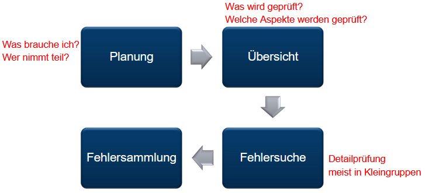

#### Unterstützende Techniken
**Perspektivenbasiertes Lesen**
- führt nachweislich zu besseren Ergebnissen
- für jede der vorgesehenenden Perspektiven muss Prüfungsanweisung erstellt werden

**Prüfung durch Prototypen**
- Ziel ist es, Anforderungen erlebbar zu machen
- sehr effektiv, um Fehler aufzudecken, aber auch ressourcen-aufwändig
- lässt den Prüfer vor allem Benutzbarkeit und Systemverhalten beurteilen
- Auswahl der mittels Prottypen zu prüfenden Anforderungen (z.B. anhand Kritikalität)
- Einarbeitung in neues Terrain → schnelles Minimal-Setup → Kritikalität
- Prototypen
  - Vorbereitende Maßnahmen:
    - Handbuch / Schulung
    - Prüfszenarien
    - Checklisten mit Prüfkriterien
  - Dokumentation der Ergebnisse
    - Protokoll des Prüfers
    - Beobachtungsprotokoll

**Einsatz von Checklisten**
- helfen bei komplexen Sachverhalten, alle Aspekte zu berücksichtigen
- zur Einfachheit sollte Checkliste kontinuierlich während des Einsatzes verbessert werden
- möglichst spezifische Fragen
- Umfang 1 Seite
- **Quellen für Inhalte**:
  - Qualitätkriterien für Anforderungen und Anforderungsdokumente
  - Prinzipien der Prüfung
  - Fehlerstatistiken
  - Erfahrungen der Prüfer aus bisherigen Projekten
  - 3 Qualitätsaspekte der Prüfung

## Anfoderungen abstimmen
> - Abstimmung ist wichtig, um unangebrachte Aspekte auszuschließen.
> - Team sollte gemeinsame Zielsetzung verfolgen, sonst gibt es Probleme
> - Auslösung / Beseitigung von Konflikten stärkt Zusammenarbeit

### Konflikte
> - Risiko für das Projekt
> - Chance auf bessere Zusammenarbeit
> - Ausgangsbasis für neue Ideen

#### Phasen des Konfliktmanagement
> - Projekte sind nur erfolgreich, wenn entstehende Konflikte erkannt und aufgelöst werden.

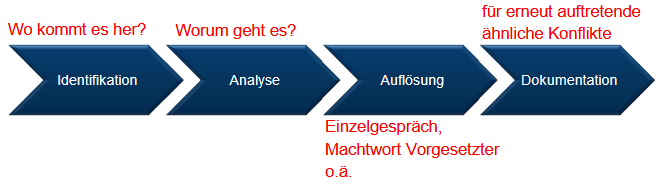

**1. Konfliktidentifikation**
> - Konflikte können während aller RE-Tätigkeiten auftreten
> - Konflikte sollten so früh wie möglich entdeckt, analysiert und aufgelöst werden

- Durch Erfahrung können Konflikte viel früher vermieden werden, da man agiert, sobald es sich in solch eine Richtung entwickelt.

**2. Konfliktanalyse - Konflikttypen**
- Sachkonflikt
  - Grundsatzdiskussion
- Interessenskonflikt
  - unterschiedliche Prioritäten von Stakeholdern
- Wertekonflikt
- Beziehungskonflikt
  - Check vs. Mitarbeiter
  - unabhängig vom Projektinhalt
- Strukturkonflikt
- Vermischte Konfliktursachen

**3. Lösungstechniken**
> - Vorher festlegen, sonst werden Anpassungen vorgenommen, weil das Ergebnis nicht gefällt.

- Einigung
- Kompromiss
- Abstimmung
  - Vorgehensweise vorher festlegen
- Variantentbildung
  - Alternativen zur Abstimmung  → aufwändiger
- Ober sticht Unter
  - Hierarchie
- Consider all facts
  - Faktoren listen Wertungskriterien
  - Gewichtung
- Plus Minus Interesting
  - Daumen hoch oder runter
- Entscheidungsmatrix

**4. Risiken bei fehlender Dokumentation der Konfliktlösung**
- Wiederholte Behandlung des gleichen oder ähnlichen Konfliktes
- Nachvollziehen von Konfliktlösungen, um Lösungsfehler zu finden, ist nicht möglich

## Anforderungen verwalten
### Attributierung von Anforderungen
#### Eigenschaften von Attributen
- Über den gesamten Lebenszyklus eines Systems hinweg müssen **Informationen über Anforderungen** festgehalten werden.
  - Name
  - Autor
  - Quelle
    - Woher kommt die Anforderung?
    - Auf was bezieht sich die Anforderung?
  - Priorität
  - Verantwortlicher
  - eindeutiger Identifikator
    - schnell filtern können
    - auf andere Anforderungen beziehen können
    - Anforderungen könnten alternativ in Bereiche eingeteilt werden

**Strukturierte Anforderungen**
- Informationen über Anforderungen als Attribute (Merkmale) erfassen
- Attribute definieren sich über **Eigenschaften** des Attributs selbst
  - eindeutiger Name
  - kurze Beschreibung der Bedeutung
  - Angaben der möglichen Werte mit denen es belegt sein kann

#### Schablonenbasierte Attributierung
> - Dokumentation der Anforderungsattribute durch Festlegung einer tabellarischen Struktur
> - Definierte Attribute können sich je nach Anfoderungsart (Qualitätanforderung, FA) unterscheiden

**Übersicht einfaches Anforderungsmodell**:
- Anforderung = hat ID, Name, Beschreibung, Status (Review, in Bearbeitung, etc...), Quelle
- Funktionale Anforderung = hat zusätzliche Priorität, Release, Verantwortlichen
- Qualitätsanforderung = hat zusätzlich Messkriterium, Akzeptanzwert

**Vorteile**
- gleichnamige Informationen stehen immer am  gleichen Ort → schnelles Auffinden der Informationen
- Wichtige zu dokumentierende Informationen werden seltener übersehen
- Informationen werden in der Regel zweckmäßig und richtig dokumentiert, unterstützt durch Schablonenstruktur und die vorgegebene Attributwertbereiche

**Nutzen** 
- Anforderungen werden nicht nur fachlich sondern auch organisatorisch strukturiert.
- Modell legt fest:
  - welche Anforderunstypen gibt es 
  - welche Attribute je Typ erlaubt oder verpflichtend sind
  - welche Werte erlaubt sind
  - welche Beziehungen zu anderen Artefakten erlaubt sind

**Attributionsschema**
> - Bildet die Menge aller definierten Attribute für eine Klasse von Anforderungen.

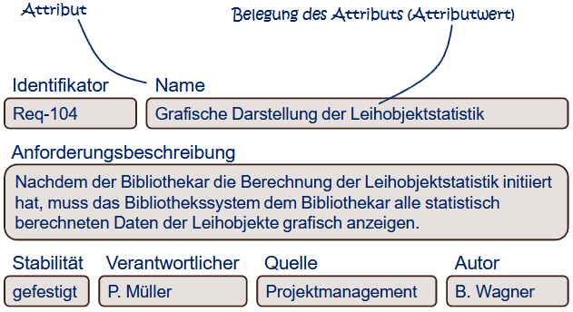

**Attributtypen**
- Identifikator
  - kurze, eindeutige Identifikation einer Anforderung
- Name
  - Eindeutiger, charakterisierender Name
- Beschreibung
  - Beschreibt den Inhalt der Anforderung in kompromierter Form
- Version
  - Aktueller Versionsstand der Anforderung
- Auto
  - Benennt Autor der Anforderung
- Quelle
  - Benennt die Quelle(n) der Anforderung
- Stabilität
  - Umfang erwarteter Änderungswahrscheinlichkeit
  - Unterscheidung: "fest", "gefestigt", "volatil"
- Kritikalität
  - Abschätzung Schadenshöhe und Eintrittswahrscheinlichkeit
- Priorität
  - Wichtigkeit bezogen auf ein definiertes Priorisierungsmerkmal
  - **Priorität braucht einen Bezug**, z.B. Marktakzeptanz, Umsetzungsreihenfolge, Opportunitätskosten

Weitere Attributionstypen:
- Aufwand
- Verantwortlicher
- Status bzgl. des Inhalts
- Querbezüge
- Allgemeine Informationen
- Anforderungstyp
- Release
- Status bzgl. Einigung
- Status bzgl. der Überprüfung (z.B. Review)
- Juristische Verbindlichkeit
 
**Spezifische Anpassungen der Attributierungschemata**
- spezifische Merkmale des Projektes
  - Beispiel: *Projektgröße, lokale bzw. verteilte Entwicklung oder Projektrisiko*
- Vorgaben seitens des Unternehmen
  - Beispiel: *Unternehmensstandards und -vorschriften*
- Eigenschaften und Vorschriften des Anwendungsgebiets
  - Beispiel: *Referenzmodelle, Modellierungsvorschiften, Standards*
- Randbedingungen und Restriktionen des Entwicklungsprozesses
  - Beispiel: *Haftungsrecht und Prozessstandards*

#### Modellbasierte Attibutierung
- Alle Vorteile der tabellarischen Definition
- Als Grundlage für die Defintion der Attributstruktur für ein Requirements Management Werkzeug verwenden
- Erlaubt die Festlegung von Beziehungen zwischen Attributtypen verschiedener Attributtierungsschemata
- Gewährleistet die Konsistenz der Attributierung
- Erlaubt Berücksichtigung von Abhängigkeiten
- Erlaubt auf Basis des Informationsmodells die Erzeugung von Schablonen zur Attributierung

### Sichten auf Anforderungen
#### Sichtenbildung
> - Seletiver Zugriff und Filtern (in Abhängigkeit der Verwendung) von Anforderungen ist unerlässlich.
> - Sichten auf die Anforderungen werden für spezifische Rollen (z.B. Architekten, Tester, Projektmanager, Entwickler) im Entwicklungsprozess
> - Voraussetzung für Sichtenbildung ist die Strukturierung der Anforderungen durch Informationsmodelle (Attributierungsschemata).

#### 1. Selektive Sicht
> - Sicht mit einem Teil der verfügbaren Anforderungsinformationen.
> - 3 Arten der Selektion:
>   - Nur bestimmte Anforderungen enthalten.
>   - Bestimmte Attribute von Anforderungen ausblenden.
>   - Die zwei Selektionsprinzipien beliebig kombinieren.

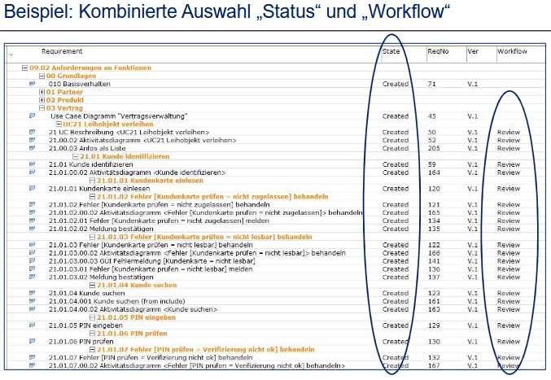

#### 2. Verdichtete Sicht
> - Sicht mit generierten (z.B. prozentuales Verhältnis der Anforderungsquellen) oder verdichteten (z.B. Prozentuales Verhältnis der Status aller Anforderungen) Daten.

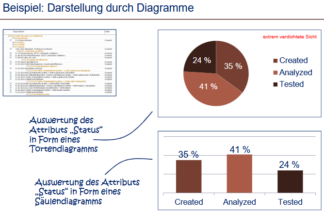

- generelle Beschreibung
- aus großen Datenmengen werden kleine Datenmengen gemacht.

### Priorisierung von Anforderungen
#### Schritt 1: Definition des Priorisierungsziels
- Was ist das Ziel / der gegenstand der Prorisierung?
  - Beispiel: *Priorität des Auftraggebers, Priorität hinsichtlich der Umsetzungsdinglichkeit*
- Welche Randbedingungen herrschen?
  - Beispiel: *Verfügbarkeit bestimmter Stakeholder oder zur Verfügung stehender Ressourcen für die Priorisierung*

#### Schritt 2: Festlegung der Priorisierungskriterien
- Typische Beispiele für Priorisierungskriterien:
  - Wichtigkeit
  - Zeitdauer für Umsetzung
  - Kosten für Umsetzung
  - Risiko
  - Schaden bei erfolgloser Umsetzung
  - Volatilität
- Eine Kombination von Priorisierungskriterien ist ebenfalls möglich!

#### Schritt 3: Auswahl der Stakeholder und Artefakte
- Welche Stakeholder müssen einbezogen werden, damit bei der Priorisierung das erforderliche Expertenwissen zur Verfügung steht?
  - In Abhängigkeit von Ziel und Priorisierungskriterien
  - Beispiel: *Vertreter des Entwicklungsteams oder des Kunden*
- Welche Anforderungen genau sollen priorisiert werden?
  - Auf gleiche oder ähnliche Detaillierungsebene achten
  - Wenn alle Anforderungen priorisiert werden, gibt es auch neutral Prioritäten

#### Schritt 4: Auswahl der Priorisierungstechnik

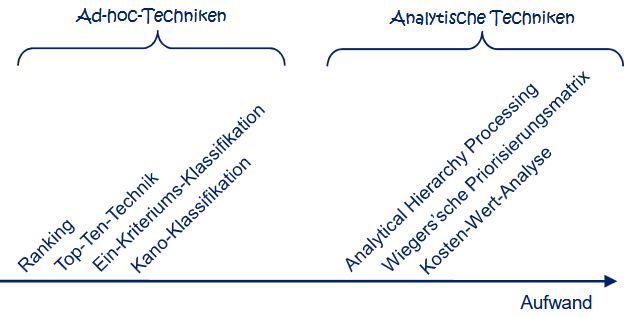

**Ranking**
- Ausgewählte Stakeholder legen eine Rangfolge der zu priorisierenden Anforderungen fest

**Top 10 Technik**
- Anzahl n festlegen
- Die n wichtigsten Anforderungen auswählen
- Die n Anforderungen einem Ranking unterziehen

**Ein Kriterium Klassifikation**
- Detaillierte und objektiv prüfbare Kriterien verwenden

|Mandatory (muss)|Optional (soll)|Nice to Have (wird)|
|---|---|---|
|Unbedingt zu realisieren, um den Systemerfolg nicht zu gefährden.|Nicht zwingend umzusetzen; Vernachlässigung einzelner Anforderungen wird den Systemerfolg nicht gefährden.|Anforderungen, die im Falle einer Nicht-Berücksichtigung den Systemerfolg nicht gefährden.|

**Kano Klassifikation**
- Priorisierung im Hinblick auf die Marktwirkung
- Mit der Zeit KÖNNEN begeisternde Faktoren zu Leistungsfaktoren und schließlich zu Basisfaktoren werden.
  - Basisfaktor:
    - Zwingend erforderlich, um Markteintritt zu ermöglichen
    - Manche Basisfaktoren sind so selbstverständlich, dass diese nicht mehr bedacht werden.
    - Beispiel: *Telefonieren*
  - Leistungsfaktor:
    - Vom Kunden bewusst gefordert
    - Beispiel: *SMS schreiben*
  - Begeisternder Faktor:
    - Vom Kunden nicht erwartete Merkmale → Innovationen
    - Beispiel: *Steve Jobs mit Apple*

**Wiegers'sche Priorisierungsmatrix**
- Kernansatz des analytischen Priorisierungsverfahrens
1. Gewichtung
2. Anforderungen
3. relativer Nutzen
4. relativer Nachteil
5. Gesamtwert aus Gewichtung, Nutzen und Nachteil sowie prozentualer Anteil
6. Relative Kosten auf Basis des Gesamtwertes festlegen und prozentualen Anteil berechnen
7. Relatives Risiko selbst festlegen und prozentualen Anteil berechnen
8. Priorität
9. Rang

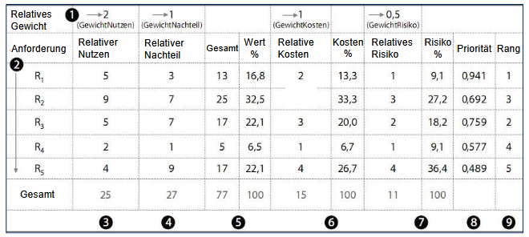

#### Verfolgbarkeit (Traceability) von Anforderungen
> - Fähigkeit, eine Anforderung über den gesamten Lebenszyklus des System hinweg nachvollziehen zu können.

**Verwendungszweck**
> - Unkoordiniert gesammelte Verfolgbarkeitsinformationen sind oft lückenhaft, unstrukturiert und fehlerbehaftet

- Nur Informationen aufzeichnen, für die in der Systementwicklung eine klare Verwendung existiert
- Verwendungszwecke der Verfolgbarkeit festlegen
- Beschränkung auf das Wesentliche, wie Abwägung von Aufwand und Nutzen

**Arten der Verfolgbarkeit**

(1) Pre-Requirements-Specification-Traceability
- Verfolgbarkeitsbeziehungen zu den im Projektverlauf vorgelagerten Artefakten
- Beispiel: *Stakeholder-Aussage oder Dokument zur Unternehmensstrategie*

(2) Traceability zwischen Anforderungen
- Spezifikationsbeziehungen und Abhängigkeiten zwischen Anforderungen
- Beispiel: *abgeleitete Anforderung*

(3) Post-Requirements-Specification-Traceability
- Verfolgbarkeitsinformationen zu den im Projektverlauf nachgelagerten Artefakten
- Beispiel: *Testfall oder Grob- / Feinentwurf*

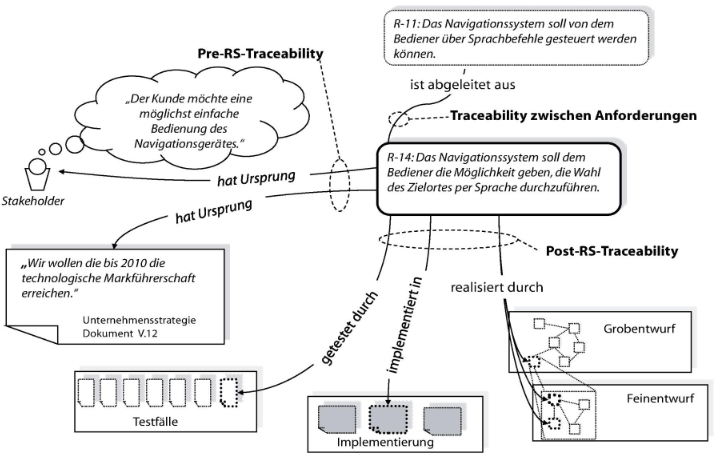

**Darstellung der Verfolgbarkeit**
- Textuelle **Referenzen** (Vermerk des Zielartefaktes am Ausgangsartefakt oder umgekehrt) und **Hyperlinks** (Zwischen Ausgangsartefakt und Zielartefakt)
- Verfolgbarkeitsmatrix
  - können mit steigender Zahl an Anforderungen nur schwer gehandhabt werden

  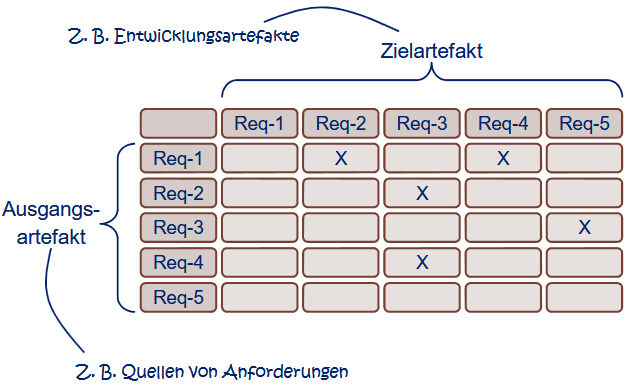

- Verfolgbakeitsgraphen

  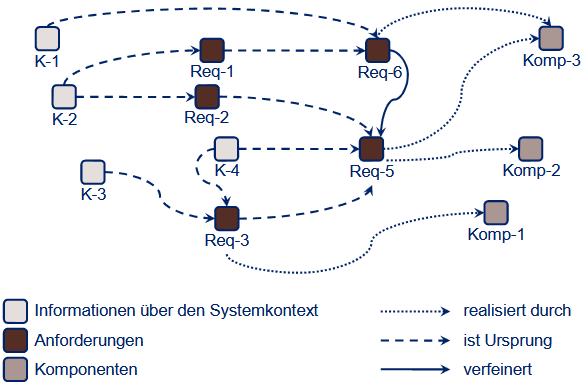

- Verfolgbarkeitsketten
  - Anforderungsverfolgbarkeit über gesamten System-Lebenszyklus hinweg
  - Grundlage für Auswirkungsanalyse und Änderungsmanagament
  - Definition von Darstellungstiefen, z.B. nur die unmittelbaren Anforderungsbeziehungen

  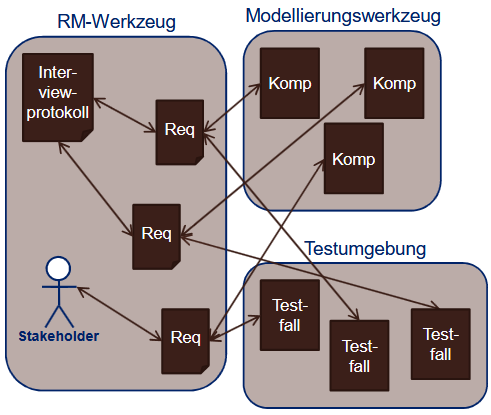

#### Versionierung von Anforderungen
- Anforderungsdokumente ändern sich permanent
  - Anforderungen kommen hinzu, werden verändert oder gelöscht
- Versionierung ermöglicht Zugriff auf spezifische Änderungsstände...
  - ... einzelner Anforderungen
  - ... von Sätzen oder Abschniten
  - ... vollständiger Anforderungsdokumente
  - ... von Anforderungsmodellen oder deren Teilbereichen

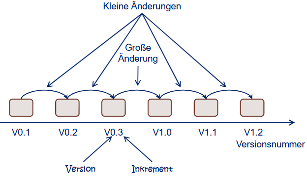

**Anforderungs-Konfiguration**
> - Besteht aus einer Menge von Anforderungen mit der zusätzlichen Bedingung, dass jede der ausgewählten Anfoderungen in genau einer Version enthalten ist.

- Haben eindeutigen Identifikator (ID)
- Sind konsistent
- Sind nicht veränderbar, da Änderungen an Anforderungen zu neuen Versionen und ggf. neuen Konfigurationen führen
- Verfügen über einen sachlogischen Zusammenhang (Gruppierung der Anfoderungen zu einer Konfiguration ist zweckgerichtet)
- Bilden die Grundlage für dsa Zurücksetzen von Anforderungen.

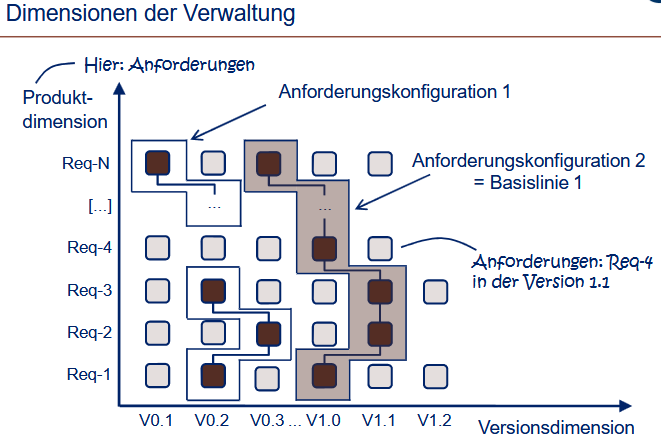

**Anforderungs-Basislinie (-release / -baseline)**
> - Ausgezeichnete Konfiguration von Anforderungen, die in der Regel stabile Versionen umfasst und häufig auch eine Auslieferungsstufe des System definiert.

- Sind nicht nach außen sichtbar
- Bilden die Grundlage zur Planung von Auslieferungsstufen (Systemrelease)
- Ermöglichen eine Abschätzung des Releaseaufwandes
- Werden zum Vergleich mit Konkurrenzsystemen verwendet

#### Verwaltung von Anforderungsänderungen
**Gründe für Anforderungsänderungen**
- Fehler bzw. Unvollständigkeiten in Anforderungen
- Wandel in den Nutzungswünschen der Stakeholder
- Fehlverhalten des System im Betrieb
- Neue Technologien oder zusätzliche Konkurrenzprodukte am Markt
- Gesetzesänderungen

Häufigkeit als Indikator für Prozessgüte

> Prozessgüte = wiederholbar fehlerfreie Ergebnisse liefern oder definierte technische Effizienzgrade erreichen.

|Sehr wenige Änderungswünsche|Sehr viele Änderungswünsche|
|---|---|
|Evtl. Indiz, dass Stakeholder ein geringes Interesse am zu entwickelnden System haben.  Lerneffekt bei Stakeholdern über System tritt nicht ein.    |Indikator für unzureichende Durchführung von RE Aktivitäten.  Sehr hohe Änderungsrate bindet viele Ressourcen.  Entwicklung eines abgestimmten Systems wird nahezu unmöglich.|

**Change-Control-Board (CCB) für Änderungsanträge**
- Bestimmt den Aufwand zur Umsetzung (oder beauftragt Dritte damit)
- Beurteilung (z.B. Aufwand - Nutzen)
- Definiert resultierende Anforderungsänderungen bzw. neue Anforderungen
- Entscheidet über Annahme / Ablehnung
- Klassifiziert eingehende Änderungsanträge
- Priorisiert angenommene Änderungsanträge
- Ordnet angenommene Änderungsanträge den Änderungsprojekten zu

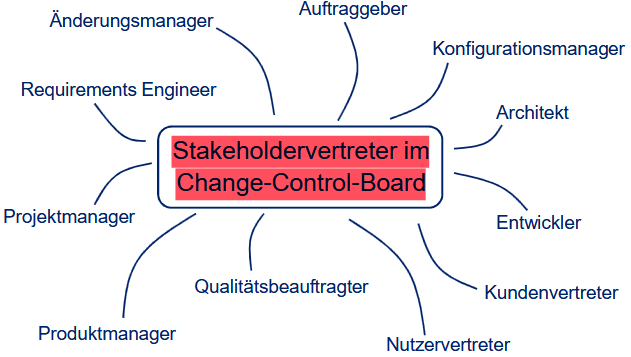

**Änderungsantrag**

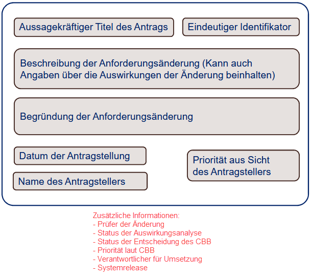

**Klassifikation eingehender Änderungsanträge**

|Korrektive Änderung|Adaptive Änderung|Ausnahmeänderung|
|---|---|---|
|Grundlage: Fehlverhalten des Systems im Betrieb.  Ursache ist auf Fehler in Anforderungen zurückzuführen.|Beantragte Önderung erfordert Anpassung des Systems.  Ursache bspw. Veränderung im Kontext (z.B. neue Technologie verfügbar oder veränderte Systemgrenzen).|Änderung ist unbedingt und unmittelbar umzusetzen (**Hotfix**).  Können sowohl korrektiv al sauch adaptiv sein.  |

**Vorgehen zur Bearbeitung**

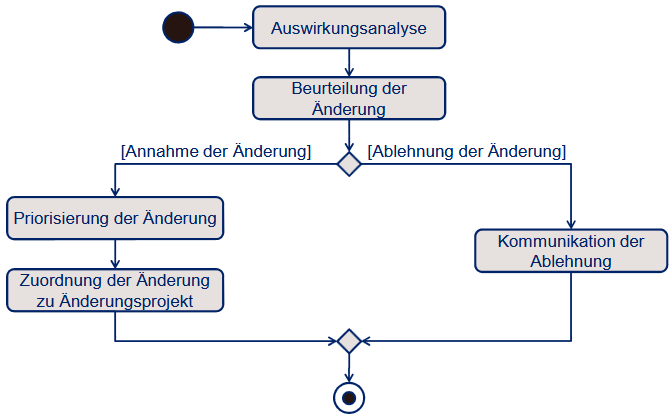

**Auswirkungsanalyse**
1. Alle betroffenen Anforderungen ermitteln (Verfolgbarkeitsinformationen nutzen)
2. Alle betroffenen nachgelagerten Artefakte ermitteln (Verfolgbarkeitsinformationen nutzen)
3. Umsetzungsaufwand für jedes Artefakt ermitteln
4. Gesamtaufwand ermitteln

**→ Kosten-Nutzen-Analyse durch CBB**

## Werkzeugunterstützung
**Strukturieren, visualisieren, simulieren**
- Auch für Anforderungsverwaltung:
  - Testverwaltungswerkzeuge
  - Fehlerverfolgungswerkzeuge
  - Konfigurationsmanagement-Werkzeuge
- Wiki-Technologien (z.B. für Glossare)
- Mind Maps
- Präsentationswerkzeuge
- Für Prototypen:
  - Testumgebungen
  - Entwicklungsumgebungen

**Kommunizieren, planen, koordinieren**
- Mailsysteme
- Chatsoftware
- Adressbücher
- Terminplaner
- Groupware-Plattformen
- Werkzeuge für das Projektmanagement (bzw. für die Projektplanung und Projekt-Controlling)

### Modellierungswerkzeuge
**Geforderte Eigenschaften**
- Mehrbenutzerzugriff
- Versionsverwaltung
- Integration und Verfolgbarkeit zwischen Modellen und Artefakten anderere Werkzeuge (z.B. Use Cases, Verhaltensmodelle und Testfälle)
- Unterstützung der Verfolgbarkeit zwischen verschiedenen Modellelementen
- Vergabe einer eindeutigen ID

### Traceability Problematik
- Zwischen den Werkzeugen muss eine Schnittstelle bestehene oder geschaffen werden können.
- Änderungen an Anforderungen müssen auch an den betroffenen Modellelementen vorgenommen werden. Umgekehrt genauso!

### Requirements-Management-Werkzeuge
**Grundlegende Eigenschaften**
- Verwalten verschiedener Informationen
- Verwalten von logischen Beziehungen zwischen verschiedenen Informationen
- Eindeutige Identifizierbarkeit
- Bearbeiten der verwalteten Informationen (Mehrbenutzerfähigkeit, Zugriffskontrolle, Konfigurations- und Versionsmanagement)
- Bilden von unterschiedlichen Sichten
- Organisieren der verwalteten Informationen
Verfolgbarkeit über Werkzeuggrenzen hinweg
- Erstellen von Reports oder Auswertungen
- Generieren von Ergebnisdokumenten unterschiedlicher Form

**Zwei Kategorien anhand der Abdeckung grundlegender Eigenschaften**
- Spezialisierte Werkzeuge
  - z.B. CaliberRM, DOORS, IRqA, RequisitePro
- Standard-Büroanwendungen
  - z.B. Testverarbeitung, Tabellenkalkulation

**Spezialisierte RM-Werkzeug: Platzhirsch**

|Stärken| Schwächen|
|---|---|
|Anforderungen und Attribute verwalten  Sichtenbildung  Hierarchieebenen  Versionsmanagement  Traceability  Baselining  Benutzerverwaltung  Änderungsmanagement|Anschaffungskosten  Schulungsaufwand  Einbindung grafischer Modelle teilweise schwierige           |

> Sehr hohe Abdeckung grundlegender Eigenschaften

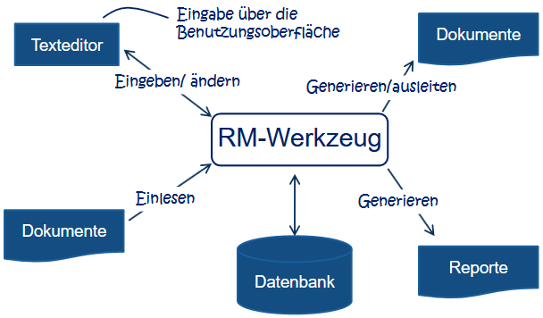

**Spezialisierte RM-Werkzeug: Stubenfliegen**

|Stärken| Schwächen|
|---|---|
|Meist kein Anschaffugspreis  Meist kein Schulungsaufwand  Meist hohe Nutzerakzeptanz     |Kaum Änderungsmanagement möglich  Traceability kaum möglich (nur durch Hyperlink)  Benutzerverwaltung nur durch Anpassungen  Kein Baselining  Keine Versionsverwaltung auf Anforderungsebene|

> Sehr niedrige Abdeckung grundlegender Eigenschaften

### Werkzeugeinführung
**Die richtige Reihenfolge**
Das Werkzeug verfolgt der Methode

Verantwortliche
↓
Vorgehendsweisen & Techniken
↓
Werkzeug

**Fallstricke**
- Benötigte Ressourcen planen
- Pilotprojekt (minimiert Risiken)
- Evaluierung
- Kosten (auch Schulungs- und Supportkosten)
- Benutzer schulen

**Beurteilung von Werkzeugen**
> - Werkzeuge aus allen Perspektiven betrachten

- Systematische Analyse verschiedener Werkzeuge
  - Sichten erlauben Objektivitäten
- Möglichkeit, individuelle Priorisierung der Perspektiven vorzunehmen
  - Wertigkeiten für Priorisierung festlegen (Punkte 1-5 für Mittelwert)
  - Das für ihre Ansprüche am besten geeignete Werkzeug finden
- Festlegen individueller Kriterien für die Werkzeugauswahl
  - Man muss die Entscheidung verstehen können

**Sichten zur Beurteilung**
> - Man kann eine Sicht priorisieren, nicht alle müssen beachtet werden.

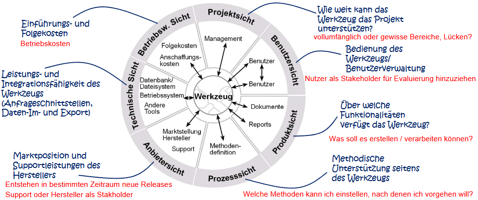

## Akzeptanzkriterien für Anforderungen
### Übersicht
> - Anforderungen beschreiben, was ein System leisten soll.
> - Akzeptanzkriterien beschreiben, woran erkennbar ist, dass eine Anforderung erfüllt ist.

- Akzeptanzkriterien helfen dabei...
  - vage Aussagen zu präzisieren
  - ein gemeinsames Verständnis herzustellen
  - Entwicklung und Test zu orientieren
  - fachliche Akzeptanz nachvollziehbar zu machen

> **Akzeptanz != Prübarkeit**
> - Akzeptanz bedeutet, eine Anforderung oder Lösung wird fachlich als erfüllt angenommen.
> - Prübarkeit bedeutet, es kann objektiv festgestellt werden, ob eine Bedingung erfüllt ist. 

### Akzeptanzkriterium
> - Ein Akzeptanzkriterium legt fest, unter welchen Bedingungen eine Anforderung als erfüllt gilt.
> - Akzeptanzkriterien...
>   - konkretisieren fachliche Erwartungen.
>   - reduzieren Interpretationsspielräume.
>   - verbinden Anforderungen mit Tests.
>   - unterstützen Entwicklung, Review und Abnahme.
>
> Eine gute Anforderung sollte so formuliert sein, dass ihre Erfüllung nachvollziehbar geprüft werden kann.

- Gute Akzeptanzkriterien sind...
  - eindeutig
  - beobachtbar oder messbar (für Nutzergruppe, konkrete Informationen aggregieren)
  - realistisch
  - fachlich relevant
  - testbar

> **Ein Akzeptanzkriterium ersetzt die Anforderung nicht, sondern macht sie überprüfbar.**

### Validierung & Verifikation
> Akzeptanzkriterien unterstützen 2 unterschiedliche Prükriterien:
> - **Validierung**: Ist die richtige Lösung beschrieben?
> - **Verifikation**: Ist die beschriebene Lösung korrek realisiert?
>
> **Akzeptanzkriterien verbindlichen fachliche Erwartungen und spätere Prüfung.**

### Bedeutung von Akzeptanzkriterien
- Ohne Akzeptanzkriterium bleiben Anforderungen oft interpretationsanfällig.
- Beispiel: *"Das System soll benutzerfreundlich sein"*
- Problem:
  - Was soll benutzerfreundlich bedeuten?
  - Für welche Bentuzergruppe?
  - In welcher Situation?
  - Woran wird Erfolg erkannt?

### Von der Anforderung zum Kriterium
- Beispiel: *"Das System soll es dem Kunden erleichtern, gewünschte Musik zu finden."*
- Grund: Kunden brechen die Suche ab, wenn die zu langer dauert oder zu umständlich ist.
- Akzeptanzkriterium: *"90% der Testpersonen aus der Zielgruppe finden einen bekannten Musiktitel innerhalb von 6 Sekunden und mit höchstens 3 Aktionen"*

> **Akzeptanzkriterien und nicht-funktionale Anforderungen sind nicht weit voneinander entfernt**

### Rolle der Begründung
- Die Begrüdung erklärt, warum eine Anforderung existiert.
- Sie hilft...
  - die eigentliche Absicht zu verstehen
  - passende Messgrößen zu finden
  - versteckte Mehrfachanforderungen zu erkennen
  - unnötige oder falsche Anforderungen zu hinterfragen

> Woran würde der Fachbereich erkennen, dass diese Anforderung nicht erfüllt ist?

### Gute Formulierungen
- Akzeptanzkriterien sollten möglichst konkret formuliert werden
- Gute Formulierungn enthalten mehr Details

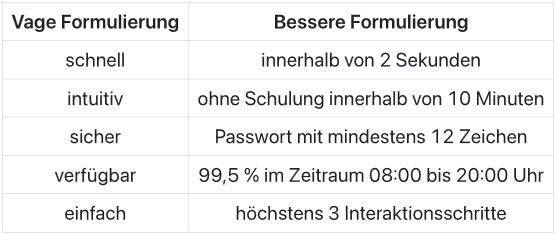

### Zielwerte und Grenzwerte
- Akzeptanzkriterien können Ziel- oder Grenzwerte enthalten
- Beispiel: *Die Trefferliste wird bei 95% aller Suchanfragen innerhalb von 2 Sekunden angezeigt. Keine Suchanfrage darf länger als 5 Sekunden dauern*
- Nutzen:
  - Zielwert beschreibt die erwrtet Qualität
  - Grenzwert beschreibt die noch akzeptable Grenze
  - Ausnahme und Toleranzen werden sichtbar
  - wichtig für Tests und Überprüfbarkeit 

### Funktionale Anforderungen
- Bei funktionalen Anforderungen zählt, ob das fachliche Ergebnis korrekt ist.
- Beispiel: *"Das System speichert Messwerte von Wetterstationen"*
- Akzeptanzkriterium: *"Nach erfolgreiche Übertragung stimmen die im System gespeicherten Messwerte mit den von der Wetterstation gesendeten Messwerten überein."*

### Qualitätsanforderungen (NFA)
- Qualitätsanforderungen müssen so konkretisiert werden, dass ihre Erfüllung nachweisbar geprüft werden kann.
-  Beispiel: *"Das System soll gut bedienbar sein."*
- Akzeptanzkriterium: *"Neue Benutzer können innerhalb von 30 Minuten einen Datensatz anlegen, ändern und löschen, ohne externe Hilfe zu verwenden."*

### Randbedingungen (NFA)
- Randbedingungen schränken die zulässige Lösung ein.
- Beispiel: *"Der Softwareanteil des Sytems muss unter Linuxs laufen"*
- Akzeotanzkriterium: *"Alle freigegebenen Funktionen laufen korrekt unter der festgelegten Linux-Distribution und Version"*

### Akzeptanzkriterium vs Testfall
- Ein Akzeptanzkriterium ist noch kein Testfall.

|Akzeptanzkriterium|Testfall|
|---|---|
|Beschreibt die Bedingung für Akzeptanz  Fachlich formuliert  Relativ stabil  Input für Tests|Beschreibt konkrete Prüfschritte  Operativ formuliert  Kann je Testumgebung variieren  Konkrete Durchführung der Prüfung|

> **Akzeptanzkriterien sagen, was gelten muss.**
> **Testfälle beschreiben, wie es geprüft wird.**

- Akzeptanzkriterium:
  - *95% aller Suchanfragen liefern von 2 Sekunden eine Ergebnisliste*
- Möglicher Testfall
  - Testdatenbestand mit 100.000 Artikeln bereitsstellen.
  - 1.000 zufällige Suchanfragen ausführen.
  - Antwortzeiten protokollieren.
  - Anteil der Antworten unter 2 Sekunden berechnen.
  - Ergebnis mit dem Akzeptanzkriterium vergleichen.

### Formulierungsmuster für Akzeptanzkriterien
**Messwertorientiert**
- *[Anteil] der [Fälle] erreicht [Ergebnis] innerhalb von [Grenzwert]*
**Regelorientiert**
- *Wenn [Bedingung], dann [erwartetes Ergebnis]*
**Szenarioorientiert**
- *Gegeben [Ausgangslage], wenn [Aktion], dann [Ergebnis]*

## Abnahmekriterium
> - Ist kein Test, sondern ein eindeutiges Ziel, das das Produkt erreichen muss.
> - Maßstab einer Anforderung
> - Quantifizierung fördert Eindeutigkeit und gleiches Verständnis

- Aufgaben:
  - Anleitung für Tests
  - Anleitung für die Entwickler

- **Begründung hilft erkennen, wenn mehrere Anforderungen als eine "getarnt" sind**
- Beispiel: *Stakeholder will ein 'gut nutzbares' Produkt.*
  - Begründung 1: Nutzer sollen sich schnell an das neue Produkt gewöhnen
  - Begründung 2: Produkt soll so einfach zu nutzen sein, dass weniger Fehler gemacht werden
  - "gleiche" Anforderung → verschiedene Begründungen → verschiedene Abnahmekriterien
- **Begründung und Beschreibung führen zum passenden Abnahmekriterium**
- Beispiel:
  - Beschreibung: *Das Produkt soll es einem Kunden keicht machen, seine gewünschte Musik zu finden.*
  - Begründung: *Musikkäufer sind Verbraucherfreundlichkeit gewöhnt und werden keine langsamen oder ungeschickten Suchen nach ihren Titeln tolerieren.*
  - Abnahmekriterium: *Der durchschnittliche Musikkäufer soll jedes Musikstück innerhalb von sechs Sekunden und mit nicht mehr als drei Aktionen finden können.*
- Anpassungen ergeben sich aus Einschränkungen (z.B. Real World, Budget, etc.)
  - Abnahmekriterium: *90% der Musikkäufer sollen jedes Musikstück innerhalb von sechs Sekunden und mit nicht mehr als drei Aktionen finden können.*

### Nicht-funktionale Anforderungen
- Wenn ein Anforderung nicht messbar ist, ist sie entweder
  - mehrere Anforderungen in einer
  - unvollständig
  - schlecht durchdacht
  - keine Anforderung
- Nützliche Fragen: "Was würde Sie als Fehlschlag beim Erfüllen der Anforderung betrachten?"

### Funktionale Anforderungen
- Keine Maßeinheiten für FA, entweder wurde die Aktion ausgeführt oder nicht
- Autorität (Datenquelle oer Nachbarsystem, das die Aktion initiiert hat) muss bestätigen, dass die Produkt-Aktion korrektur ausgeführt wurde
- Beispiel:
  - Beschreibung: *Das Produkt soll die Messungen der Wetterstationen abspeichern können.*
  - Begründung: *Die Messungen sind für die Vorbereitungen des Enteisungsplans notwendig.*
  - Abnahmekriterium: *Die gepsiecherten Messdaten der Wetterstation müssen mit den in der sendenden Wetterstation gepsiecherten Daten übereinstimmen*
- Abnahmekriterium zeigt nicht wie die Erfüllung getestet werden kann, dies muss früh in der Entiwcklung durch Testfälle abgedeckt werden (**Test-Driven Development**)
- Tester sollten bei der Formulierung der Abnahmekriterien beteiligt sein

> Das Abnahmekriterium ist die Anforderung!